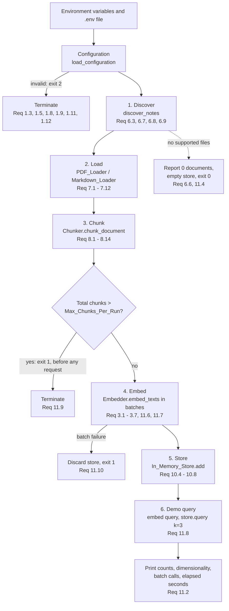
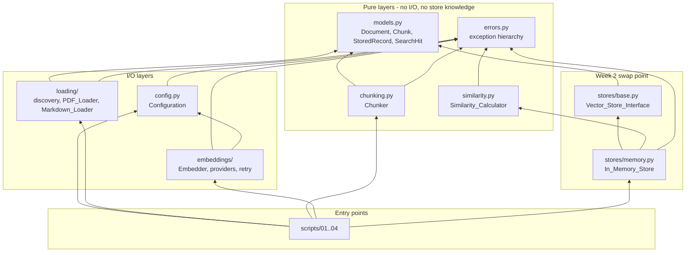
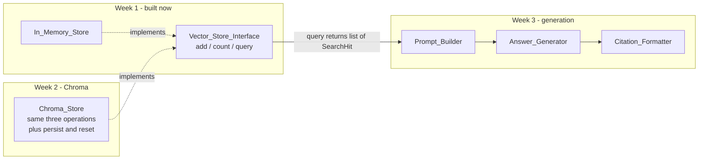

# Design Document

## Overview

Week 1 of Ask My Docs builds four hand-written layers — configuration, embedding, document loading, chunking — plus a deliberately simple in-memory store, and wires them together in four runnable scripts. Nothing in this design uses a RAG orchestration framework. The only third-party code is `openai` (raw embeddings endpoint), `sentence-transformers` (local model inference), `pypdf` (page text extraction), `numpy` (float64 vector arithmetic), `python-dotenv` (env file loading), and `pytest` + `hypothesis` (tests). Every pipeline step — discovery, decoding, newline normalization, chunk boundary arithmetic, batching, retry, cosine similarity, top-K ranking — is code the learner writes and tests.

### Design goals

1. **Mechanics are visible.** Chunking is explicit index arithmetic over a Python `str`, not a delegated call. Cosine similarity is a dot product over two norms. The learner can read the whole boundary calculation in one screen.
2. **The store is the only thing Week 2 replaces.** `Vector_Store_Interface` is the single seam. The chunker and embedder modules never import it (Requirement 10.3), so swapping `In_Memory_Store` for a Chroma-backed implementation in Week 2 touches exactly one module plus one factory line.
3. **Every FOR ALL criterion becomes an executable property.** Requirements 4, 8, and 10 state universally quantified behaviour. Each such criterion maps to one Hypothesis property test running at least 100 examples (Requirement 13.7).
4. **Determinism where the requirements demand it.** Discovery order (6.8), document text (7.9), chunk boundaries (8.7), and query result order (10.9, 10.15) are all fully determined by inputs and configuration. Nothing depends on filesystem iteration order, dict ordering, or wall-clock time.
5. **No network in the test suite.** A substitute embedder, injected everywhere the real one is used, makes the suite runnable with zero API key and zero sockets (Requirements 13.5, 13.6) inside the 120-second budget (13.8).

### Key design decisions

| Decision | Rationale |
|---|---|
| `src/askmydocs/` layout rather than a flat `askmydocs/` package | The `src/` layout makes imports resolve only through the installed (editable) package, so `pytest` cannot accidentally import the working-directory copy. That matters here because Requirement 10.3 is verified by a static import-graph test — if tests could import a shadow copy of the tree, that test would be checking the wrong files. Cost is one extra setup command, `pip install -e .`, stated in the README (13.3). |
| `BaseEmbedder` implements validation and batching once; concrete providers implement only `_embed_batch` | Requirement 3.3 (batch result at position *i* equals the single-text result) becomes true by construction: `embed_text(t)` is defined as `embed_texts([t])[0]`. It cannot drift. |
| `Configuration` is loaded from an injected `Mapping[str, str]`, defaulting to `os.environ` | Requirement 1 has 12 criteria about parsing, defaulting, and rejecting env values. Injecting the mapping makes all 12 testable as pure functions, with no `monkeypatch` of process state and no risk of a stray real API key leaking into a test run. |
| Library code raises typed exceptions; only script `main()` functions call `sys.exit` | Requirements 1.3, 1.5, 1.8, 1.9, 1.11, 1.12, 6.5, 11.9, 11.10 say "terminate with a non-zero exit status". Keeping `sys.exit` at the script boundary keeps the library importable and testable while preserving the observable exit-status behaviour. |
| Vectors are `list[float]` at every public boundary; `numpy` is used only inside similarity and ranking | Keeps the interfaces plain-Python and JSON-shaped, which is what Chroma will want in Week 2, while still getting float64 arithmetic where numerical tolerance matters (Requirements 4.2–4.5). |
| Newline normalization happens in the loader, never in the chunker | Requirement 7.10 requires chunk offsets to index the returned `Document.text` directly. If the chunker also transformed text, offsets would refer to a string nobody holds. One normalization point, one source of truth. |

### Research notes informing the design

- **Embedding model defaults.** For the OpenAI provider the default model is `text-embedding-3-small` (1536 dimensions, single-vector output, accepts a list of inputs per request). For the local provider the default is `sentence-transformers/all-MiniLM-L6-v2` (384 dimensions). Both are recorded in the README (Requirement 1.2 defers the model default to the README) and in the Learning_Notes (12.3). The design never hard-codes a dimensionality: `Embedder.dimensionality` is discovered from the provider on first use and then asserted constant (Requirement 2.4).
- **Transient vs terminal provider failures.** The OpenAI Python client raises distinguishable exception types: `RateLimitError` and `APITimeoutError`/`APIConnectionError` are transient, `AuthenticationError`/`PermissionDeniedError`/`BadRequestError` are terminal. Requirement 2.9 wants retries only for the first group and 2.10 wants zero retries for the second. The design isolates that judgement in one function, `classify_failure`, so the retry engine stays provider-agnostic and the classification is unit-testable with synthetic exceptions.
- **PDF text extraction.** `pypdf` exposes `PdfReader.pages` in document order and `page.extract_text()` per page, and sets `PdfReader.is_encrypted` for password-protected files (Requirement 7.11). Extraction quality varies by producer; a scanned PDF legitimately yields no text, which is why Requirement 7.8 treats "no non-whitespace characters" as a warning-and-skip rather than an error.
- **Retry backoff bounds.** Requirement 2.9 constrains each wait to at least 1 and at most 30 seconds. Exponential backoff `2**attempt` clamped into `[1, 30]` gives 1, 2, 4, 8, 16, 30, 30… which satisfies the bound for the full permitted retry range of 0 to 10 attempts.

### Out of scope for Week 1

Persistent storage, approximate nearest-neighbour indexing, metadata filtering, re-ranking, prompt construction, LLM generation, citations, and any UI. The demonstration query in the Pipeline_Script (Requirement 11.8) is a direct top-3 scan, not a retrieval subsystem.

## Architecture

### Week 1 pipeline



Stage boundaries are exactly the module boundaries. Each stage consumes the previous stage's data model and produces the next one: `Path` → `DiscoveredFile` → `Document` → `Chunk` → `Chunk` + `Embedding_Vector` → `StoredRecord` → `SearchHit`.

### Module dependencies



Read the arrows as "depends on". Two absences are load-bearing, and both are enforced by an automated import-graph test rather than by convention:

- **`chunking.py` has no edge to `stores/`** — the chunker's signatures mention only `str`, `Document`, and `Chunk` (Requirement 10.3).
- **`embeddings/` has no edge to `stores/`** — the embedder returns `list[list[float]]` and never sees a store type (Requirement 10.3).

Only `stores/memory.py` and the scripts know a store exists. `stores/memory.py` depends on `similarity.py` because top-K ranking needs cosine similarity (Requirement 10.1); the dependency runs store → similarity, never the reverse.

### Week 2 and Week 3 seams



**Week 2 seam (storage).** `Vector_Store_Interface` declares exactly the three operations Requirement 10.1 names: batch add, count, top-K query. A Chroma-backed implementation satisfies the same contract, so the swap is: add `stores/chroma_store.py`, add one branch to `build_store(configuration)`, change nothing in `loading/`, `chunking.py`, or `embeddings/`. Three affordances are built in Week 1 specifically to make that swap painless:

- `Chunk.chunk_id` yields a stable string id (`"{source_path}#{index}"`), unique because Requirement 7.3 makes `source_path` unique per document and 8.12 makes `index` unique per document. Chroma requires caller-supplied ids; Week 1 already has them.
- `Chunk.to_metadata()` returns a flat `dict[str, str | int]` of exactly the fields Requirement 8.10 mandates — the shape Chroma's metadata column accepts.
- `query` returns `SearchHit` objects carrying `chunk`, `score`, and `insertion_index` rather than raw tuples, so Week 2 can populate `score` from a Chroma distance without changing any caller. The interface docstring states the contract as "descending similarity, ties broken by ascending insertion index" so a Chroma implementation inherits the same observable ordering rule.

**Week 3 seam (generation).** Week 3 consumes `list[SearchHit]` and nothing else from the storage layer. `SearchHit.chunk.source_path` plus `start_offset`/`end_offset` is already enough to render a citation that points at a character range in a named file, so Week 3 adds modules (`prompting.py`, `generation.py`) without modifying any Week 1 data model. Week 1 deliberately does not add an `answer` or `prompt` concept anywhere.

### Repository layout

```
RAG/
├── pyproject.toml              # pinned exact versions, requires-python >=3.10,<3.13  (Req 13.1, 13.2)
├── README.md                   # setup, env vars, one command per script, test command  (Req 13.3)
├── .env.example                # placeholder values, no secrets                         (Req 1.6)
├── .gitignore                  # .env, sample-notes/* except README.md                  (Req 1.6, 6.2)
├── sample-notes/
│   └── README.md               # expected 5-10 files, supported extensions, self-excluded (Req 6.1)
├── learning-notes/
│   ├── why-split-documents.md  # Req 12.1
│   └── semantic-search.md      # Req 12.2, 12.3, 12.4, 12.5
├── reports/
│   └── chunking-experiment.md  # regenerated wholesale each run                          (Req 9.4)
├── scripts/
│   ├── 01_embed_one.py         # Req 2.2, 2.3
│   ├── 02_compare_sentences.py # Comparison_Script, Req 5
│   ├── 03_chunking_experiment.py # Req 9
│   └── 04_pipeline.py          # Pipeline_Script, Req 11
├── src/askmydocs/
│   ├── __init__.py
│   ├── errors.py               # exception hierarchy
│   ├── models.py               # Document, Chunk, StoredRecord, SearchHit
│   ├── config.py               # Configuration, load_configuration, redact
│   ├── reporting.py            # Reporter: warnings, errors, progress, redaction at the edge
│   ├── similarity.py           # Similarity_Calculator
│   ├── chunking.py             # Chunker
│   ├── loading/
│   │   ├── __init__.py
│   │   ├── discovery.py        # discover_notes, DiscoveredFile, SkippedEntry
│   │   ├── base.py             # Document_Loader protocol, decode helpers, newline normalization
│   │   ├── pdf_loader.py       # PDF_Loader
│   │   ├── markdown_loader.py  # Markdown_Loader
│   │   └── pipeline.py         # load_documents: per-file error isolation
│   ├── embeddings/
│   │   ├── __init__.py
│   │   ├── base.py             # Embedder protocol, BaseEmbedder: validation + batching
│   │   ├── retry.py            # RetryPolicy, classify_failure, FailureKind
│   │   ├── openai_provider.py  # OpenAI_Embedder
│   │   ├── local_provider.py   # Sentence_Transformers_Embedder
│   │   └── factory.py          # build_embedder(configuration)
│   └── stores/
│       ├── __init__.py
│       ├── base.py             # Vector_Store_Interface          <-- Week 2 swap point
│       ├── memory.py           # In_Memory_Store
│       └── factory.py          # build_store(configuration)      <-- Week 2 adds one branch
└── tests/
    ├── conftest.py             # fixtures: substitute embedder, temp notes folder, env maps
    ├── fakes.py                # Fake_Embedder, Scripted_Provider, Fake_Clock
    ├── test_config.py                    # Req 1
    ├── test_embedder.py                  # Req 2, 3
    ├── test_similarity_examples.py       # Req 4.1, 4.6 - 4.9
    ├── test_similarity_properties.py     # Req 4.2 - 4.5
    ├── test_discovery.py                 # Req 6
    ├── test_loading.py                   # Req 7
    ├── test_chunking_examples.py         # Req 8.8 - 8.10, 8.13, 8.14 worked cases
    ├── test_chunking_properties.py       # Req 8.2 - 8.7, 8.11, 8.12, 8.14
    ├── test_store_examples.py            # Req 10.1, 10.7, 10.8, 10.11, 10.13, 10.14
    ├── test_store_properties.py          # Req 10.4 - 10.6, 10.9, 10.10, 10.12, 10.15
    ├── test_layering.py                  # Req 10.3 static import-graph check
    └── test_scripts.py                   # Req 5, 9, 11 script-level behaviour
```

## Components and Interfaces

### Configuration (`config.py`)

```python
SUPPORTED_PROVIDERS: Final = ("openai", "sentence-transformers")
REDACTION_MARKER: Final = "***REDACTED***"

@dataclass(frozen=True)
class Configuration:
    provider: str                    # one of SUPPORTED_PROVIDERS, normalized
    model_name: str
    api_key: str | None              # None whenever provider == "sentence-transformers"
    notes_folder: Path
    chunk_size: int
    chunk_overlap: int
    request_timeout_seconds: int
    max_retry_attempts: int
    max_input_length: int
    max_batch_size: int
    max_chunks_per_run: int

    @property
    def stride(self) -> int:
        """Chunk_Size - Chunk_Overlap. Always >= 1 given validated bounds."""

def load_configuration(env: Mapping[str, str] | None = None) -> Configuration:
    """Read, default, normalize, and validate every setting.

    env defaults to os.environ merged over values loaded from .env by python-dotenv.
    Raises ConfigurationError on any violation of Requirements 1.3, 1.5, 1.8, 1.9,
    1.11, or 1.12. Performs all validation before any provider object is constructed,
    so no request can be issued by an invalid configuration (Req 1.3).
    """

def redact(text: str, api_key: str | None) -> str:
    """Replace every occurrence of api_key, and of any substring of api_key at least
    8 characters long, with REDACTION_MARKER (Req 1.7). Returns text unchanged when
    api_key is None or shorter than 8 characters.
    """
```

`load_configuration` runs in a fixed order so error messages are predictable: (1) resolve provider identifier, (2) resolve model default for that provider, (3) parse every numeric field, (4) range-check every numeric field, (5) cross-check `chunk_overlap < chunk_size`, (6) require the API key when and only when the provider is OpenAI. Step 6 comes last so a learner with a broken `ASKMYDOCS_CHUNK_SIZE` and no key gets the chunk-size message rather than being sent hunting for a key.

### Reporter (`reporting.py`)

```python
class Reporter:
    """Single console output channel. Every string passes through redact() before
    reaching stdout or stderr (Req 1.7), so no call site has to remember."""

    def __init__(self, api_key: str | None, stream: TextIO = sys.stdout,
                 error_stream: TextIO = sys.stderr) -> None: ...
    def info(self, message: str) -> None: ...
    def warning(self, message: str) -> None: ...      # Req 6.4, 7.5, 7.8, 7.12
    def error(self, message: str) -> None: ...        # Req 7.7, 7.11
    def progress(self, done: int, total: int) -> None: ...  # Req 11.7
```

Centralizing redaction in one class is the whole reason `Reporter` exists. Requirement 1.7 applies to "any error message, log record, or console output"; a single choke point is verifiable, scattered `str.replace` calls are not.

### Similarity_Calculator (`similarity.py`)

```python
ZERO_NORM_THRESHOLD: Final = 1e-12

def euclidean_norm(vector: Sequence[float]) -> float:
    """float64 norm via numpy."""

def cosine_similarity(left: Sequence[float], right: Sequence[float]) -> float:
    """Cosine_Similarity of two equal-length, finite, non-degenerate vectors.

    Validation order is fixed and tested (Req 4.6 requires the length check first):
      1. len(left) != len(right)                  -> DimensionMismatchError  (Req 4.6)
      2. len(left) == 0                           -> EmptyVectorError        (Req 4.8)
      3. any element non-finite                   -> NonFiniteValueError     (Req 4.9)
      4. norm(left) or norm(right) <= 1e-12       -> ZeroNormError           (Req 4.7)
    Returns dot(left, right) / (norm(left) * norm(right)), clamped into [-1.0, 1.0]
    to absorb float64 rounding at the extremes (Req 4.2).
    """
```

Steps 1 and 2 are ordered to match the requirements exactly: two empty vectors have *equal* length, so they fall through the length check into the emptiness check (4.8); one empty and one not is a length mismatch (4.6). The finiteness check precedes the norm check because a `NaN` element would otherwise produce a `NaN` norm and a misleading error.

### Embedder (`embeddings/base.py`, `embeddings/retry.py`, providers)

```python
class Embedder(Protocol):
    @property
    def dimensionality(self) -> int:
        """Embedding_Dimensionality of the active provider (Req 2.4)."""
    def embed_text(self, text: str) -> list[float]: ...
    def embed_texts(self, texts: Sequence[str]) -> list[list[float]]: ...


class BaseEmbedder(ABC):
    """Provider-independent validation, batching, retry, and dimensionality checks."""

    def __init__(self, configuration: Configuration,
                 retry_policy: RetryPolicy | None = None) -> None: ...

    @property
    def dimensionality(self) -> int:
        """Discovered from the first successful provider response, then asserted
        constant on every later response (Req 2.4, 3.1)."""

    def embed_text(self, text: str) -> list[float]:
        """Defined as embed_texts([text])[0]. This makes Req 3.3 structural rather
        than a behaviour that has to be maintained by hand."""
        return self.embed_texts([text])[0]

    def embed_texts(self, texts: Sequence[str]) -> list[list[float]]:
        """1. Return [] for an empty sequence, issuing no request (Req 3.4).
           2. Validate every element before any request: empty/whitespace-only or
              longer than max_input_length raises with the first offending
              zero-based position and reason (Req 2.6, 2.8, 3.6).
           3. Split into consecutive segments of at most max_batch_size (Req 3.5).
           4. Call _embed_batch per segment through the RetryPolicy.
           5. Concatenate results in input order (Req 3.2); on any segment failure
              raise EmbeddingFailedError naming the provider, the segment's
              zero-based input positions, and the reason, returning nothing
              partial (Req 3.7, 2.7).
        """

    @abstractmethod
    def _embed_batch(self, texts: list[str]) -> list[list[float]]:
        """Issue exactly one provider request for this segment."""

    @property
    def batch_call_count(self) -> int:
        """Number of _embed_batch invocations, for Req 11.2 and 11.6 reporting."""


class FailureKind(Enum):
    TRANSIENT = auto()   # timeout, connection reset, rate limit  -> retry (Req 2.9)
    TERMINAL = auto()    # bad credentials, rejected input        -> no retry (Req 2.10)

def classify_failure(error: Exception) -> FailureKind: ...

class RetryPolicy:
    def __init__(self, max_retry_attempts: int,
                 sleep: Callable[[float], None] = time.sleep) -> None: ...
    def delay_for_attempt(self, attempt: int) -> float:
        """min(30.0, max(1.0, 2.0 ** attempt)) -> 1, 2, 4, 8, 16, 30, 30 ...
        Satisfies the 1-to-30-second bound of Req 2.9 for attempts 0 through 10."""
    def run(self, operation: Callable[[], T], description: str) -> T:
        """Invoke operation; on TRANSIENT failure retry up to max_retry_attempts,
        sleeping delay_for_attempt(n) before each retry; on TERMINAL failure
        re-raise immediately with no retry (Req 2.10). After exhaustion raise
        EmbeddingFailedError naming provider, attempts made, and reason (Req 2.7)."""


class OpenAIEmbedder(BaseEmbedder):
    """_embed_batch posts one request to the embeddings endpoint with
    timeout=configuration.request_timeout_seconds, then returns the vectors sorted
    by the response index field so ordering never depends on response order."""

class SentenceTransformersEmbedder(BaseEmbedder):
    """Loads the model once, lazily. Never reads the API key environment variable
    and opens no socket to the OpenAI API (Req 1.4)."""

def build_embedder(configuration: Configuration,
                   retry_policy: RetryPolicy | None = None) -> Embedder:
    """Select the provider implementation from configuration.provider."""
```

Injecting `sleep` into `RetryPolicy` is what keeps retry behaviour testable: a test passes a recorder that appends the requested delay and returns instantly, so exercising 10 retries costs microseconds rather than 90 seconds (Requirement 13.8).

### Document loading (`loading/`)

```python
SUPPORTED_EXTENSIONS: Final = ("pdf", "md", "markdown")
MAX_FILE_BYTES: Final = 25 * 1024 * 1024        # Req 7.12

@dataclass(frozen=True)
class DiscoveredFile:
    absolute_path: Path
    relative_path: str       # forward-slash separated, relative to notes folder (Req 7.3)
    extension: str           # lower-cased, no leading period

@dataclass(frozen=True)
class SkippedEntry:
    relative_path: str
    reason: str              # unsupported extension | symbolic link | readme | hidden

@dataclass(frozen=True)
class DiscoveryResult:
    files: tuple[DiscoveredFile, ...]        # sorted per Req 6.8
    skipped: tuple[SkippedEntry, ...]
    counts_by_extension: Mapping[str, int]   # Req 6.3

def discover_notes(notes_folder: Path) -> DiscoveryResult:
    """Walk notes_folder and all subdirectories (Req 6.7). Exclude the folder's own
    README, every entry whose name starts with '.', and every symbolic link, each
    recorded in skipped with its reason (Req 6.7, 6.9). Match extensions
    case-insensitively. Sort files by ascending code-point comparison of
    relative_path so the order is identical on every OS (Req 6.8).
    Raises NotesFolderError when the path is missing or is not a directory,
    naming the resolved absolute path and which condition applied (Req 6.5).
    """

def normalize_newlines(text: str) -> str:
    """Convert CRLF and lone CR to a single LF. The only transformation applied to
    document text; no trimming, collapsing, or Unicode normalization (Req 7.10)."""

def decode_utf8(data: bytes) -> tuple[str, int]:
    """Decode as UTF-8, stripping a leading BOM (Req 7.4). On invalid bytes, decode
    with errors='replace' and return the replacement count (Req 7.5)."""

class DocumentLoader(Protocol):
    def load(self, discovered: DiscoveredFile, reporter: Reporter) -> Document: ...

class MarkdownLoader:
    """Full file text, all markup, indentation, and blank lines preserved (Req 7.2)."""

class PdfLoader:
    """Join per-page extracted text in ascending page order with exactly one LF
    between consecutive pages and nothing else inserted (Req 7.1). Raises
    EncryptedPdfError when the reader reports encryption (Req 7.11)."""

def load_documents(discovery: DiscoveryResult, notes_folder: Path,
                   reporter: Reporter) -> list[Document]:
    """Load each discovered file in discovery order. Per-file failures are isolated:
    oversize (7.12), encrypted (7.11), unopenable or unparsable (7.7), and
    whitespace-only text (7.8) each produce a warning or error and are excluded,
    and loading continues with the remaining files. Returns only the documents that
    are safe to chunk."""
```

### Chunker (`chunking.py`)

```python
@dataclass(frozen=True)
class Chunker:
    chunk_size: int
    chunk_overlap: int

    def __post_init__(self) -> None:
        """Reject chunk_size < 1 and chunk_overlap outside [0, chunk_size - 1],
        mirroring the Configuration checks of Req 1.8 and 1.9 so a Chunker built
        directly in a test or the experiment script cannot hold invalid settings."""

    @property
    def stride(self) -> int:
        """chunk_size - chunk_overlap. Always >= 1 (Req 8.4)."""

    def expected_chunk_count(self, text_length: int) -> int:
        """Closed-form chunk count: 0 when text_length == 0, 1 when
        0 < text_length <= chunk_size, else 1 + ceil((text_length - chunk_size) / stride).
        Used as the reference model in a model-based property test."""

    def chunk_text(self, text: str, source_path: str) -> list[Chunk]: ...

    def chunk_document(self, document: Document) -> list[Chunk]:
        return self.chunk_text(document.text, document.source_path)
```

Note the signatures: `str`, `Document`, `Chunk`, `list`. No store type appears, and `chunking.py` imports only `models` and `errors` (Requirement 10.3).

### Vector_Store_Interface and In_Memory_Store (`stores/`)

```python
class VectorStoreInterface(ABC):
    """The Week 2 swap point. Exactly the three operations of Req 10.1."""

    @abstractmethod
    def add(self, chunks: Sequence[Chunk],
            embeddings: Sequence[Sequence[float]]) -> None:
        """Add a batch, preserving each chunk-to-vector association (Req 10.4).
        An empty batch is a no-op and must not raise (Req 10.6). Implementations
        must be atomic: on any validation failure, stored items and count are
        unchanged (Req 10.7, 10.8)."""

    @abstractmethod
    def count(self) -> int:
        """Stored item count (Req 10.1, 10.5)."""

    @abstractmethod
    def query(self, embedding: Sequence[float], k: int) -> list[SearchHit]:
        """Up to k stored chunks in descending Cosine_Similarity order, ties broken
        by ascending insertion index (Req 10.9, 10.15). Fewer than k stored items
        returns all of them (Req 10.10); an empty store returns [] (Req 10.11).
        Raises on non-integer or k < 1 (Req 10.13) and on a query vector of the
        wrong length or degenerate norm (Req 10.14)."""

    @property
    @abstractmethod
    def dimensionality(self) -> int | None:
        """Vector length fixed by the first completed non-empty add, else None."""


class InMemoryStore(VectorStoreInterface):
    def __init__(self) -> None:
        self._records: list[StoredRecord] = []
        self._dimensionality: int | None = None
```

`InMemoryStore.add` validates in this order, all before mutating anything: (1) `len(chunks) == len(embeddings)` else report both counts (10.7); (2) return early for an empty batch (10.6); (3) all incoming vectors share one length; (4) that length matches `self._dimensionality` when already set, else report both lengths (10.8); (5) build the full `StoredRecord` list; (6) `self._records.extend(...)` and set `_dimensionality`. Steps 5 and 6 cannot fail, which is what makes the atomicity guarantee of 10.7 and 10.8 real rather than aspirational.

`InMemoryStore.query` computes similarity against every record — a linear scan, which is exactly the point for Week 1 — then sorts by `(-score, insertion_index)` and slices to `k`. Sorting on that composite key gives the tie-break of 10.15 and the determinism of 10.9 in one step, with no reliance on sort stability.

```python
def build_store(configuration: Configuration) -> VectorStoreInterface:
    """Week 1 always returns InMemoryStore. Week 2 adds the Chroma branch here."""
```

### Scripts

| Script | Requirements | Responsibility |
|---|---|---|
| `01_embed_one.py` | 2.2, 2.3 | Embed one sentence, print dimensionality and first 5 elements. |
| `02_compare_sentences.py` | 5.1–5.7 | Comparison_Script. One batch call for all 6 sentences (5.6), 3 within-group lines, 9 cross-group lines, both means, verdict line. |
| `03_chunking_experiment.py` | 9.1–9.6 | Chunk the loaded documents under all 6 size/overlap combinations, print stats and samples, rewrite `reports/chunking-experiment.md` wholesale. Issues no embedder call at all. |
| `04_pipeline.py` | 11.1–11.10 | Pipeline_Script: discover, load, chunk, guard on `Max_Chunks_Per_Run`, embed in batches with progress, populate the store, run the demonstration query, print the summary. |

Each script is a thin `main(argv) -> int` that builds the `Configuration` and `Reporter`, calls library functions, catches the typed exceptions, and returns an exit code. All logic under test lives in the library.

## Data Models

```python
@dataclass(frozen=True)
class Document:
    """One loaded source file (Req 7.3)."""
    text: str          # newline-normalized; chunk offsets index this string (Req 7.10)
    source_path: str   # forward-slash relative path, unique among loaded documents
    file_type: str     # "pdf" | "md" | "markdown", lower-cased, no leading period


@dataclass(frozen=True)
class Chunk:
    """A contiguous substring of one Document's text (Req 8.10, 8.11)."""
    text: str
    source_path: str    # copied from the source Document
    index: int          # zero-based ordinal within the source document (Req 8.12)
    start_offset: int   # inclusive, in Unicode code points (Req 8.11, 8.14)
    end_offset: int     # exclusive, in Unicode code points

    @property
    def length(self) -> int:
        return self.end_offset - self.start_offset   # == len(self.text) (Req 8.11)

    @property
    def chunk_id(self) -> str:
        return f"{self.source_path}#{self.index}"    # Week 2 / Chroma id seam

    def to_metadata(self) -> dict[str, str | int]:
        return {"source_path": self.source_path, "index": self.index,
                "start_offset": self.start_offset, "end_offset": self.end_offset}


@dataclass(frozen=True)
class StoredRecord:
    """One stored item inside In_Memory_Store (Req 10.2, 10.4)."""
    chunk: Chunk
    embedding: tuple[float, ...]   # immutable so a caller cannot mutate stored state
    insertion_index: int           # monotonic from 0; drives tie-breaking (Req 10.15)


@dataclass(frozen=True)
class SearchHit:
    """One query result (Req 10.9, 11.8). Week 3 renders citations from this."""
    chunk: Chunk
    score: float                   # Cosine_Similarity to the query vector
    insertion_index: int
```

Every model is a frozen dataclass. Immutability matters for two requirements: `StoredRecord.embedding` is a `tuple`, so a caller cannot mutate a stored vector after the fact and break the association guarantee of 10.4; and frozen `Chunk` objects make the repeated-query determinism of 10.9 and the repeated-chunking determinism of 8.7 easy to assert by plain equality.

`Document.text` is the single canonical string. `Chunk.start_offset` and `Chunk.end_offset` are offsets *into that exact string*, which is only sound because Requirement 7.10 forbids the chunker from transforming text. `Chunk` carries `source_path` rather than a reference to its `Document` so chunks can be batched, embedded, and stored without keeping whole document texts alive.

**Invariants maintained across models:**

| Invariant | Requirement |
|---|---|
| `document.text[chunk.start_offset:chunk.end_offset] == chunk.text` | 8.11 |
| `chunk.end_offset - chunk.start_offset == len(chunk.text)` | 8.11 |
| Chunk indices of one document are `0, 1, ..., n-1` | 8.12 |
| `source_path` is unique across loaded documents, so `chunk_id` is globally unique | 7.3, 8.12 |
| All stored embeddings have equal length | 10.8 |
| `insertion_index` values are `0, 1, ..., count()-1` in add order | 10.5, 10.15 |

## Chunking Algorithm

All lengths and offsets below are Unicode code-point counts. Python's `len()` on a `str` and `str` slicing are both code-point based on CPython, so the requirement of 8.14 is satisfied by using plain `str` operations and never encoding to bytes, never calling `unicodedata.normalize`, and never grouping grapheme clusters.

### Pseudocode

```
FUNCTION chunk_text(text, source_path, chunk_size, chunk_overlap):

    # Preconditions, enforced by Chunker.__post_init__ (mirrors Req 1.8, 1.9)
    ASSERT chunk_size >= 1
    ASSERT 0 <= chunk_overlap < chunk_size

    n      = code_point_length(text)
    stride = chunk_size - chunk_overlap          # >= 1 by the precondition (Req 8.4)

    IF n == 0:
        RETURN []                                # Req 8.9

    IF n <= chunk_size:
        RETURN [ Chunk(text       = text,
                       source_path= source_path,
                       index      = 0,
                       start      = 0,
                       end        = n) ]         # Req 8.8 - one chunk even if n <= chunk_overlap

    chunks = []
    start  = 0
    index  = 0

    LOOP FOREVER:
        end = MIN(start + chunk_size, n)

        chunks.APPEND( Chunk(text        = text[start:end],
                             source_path = source_path,
                             index       = index,
                             start       = start,
                             end         = end) )

        IF end == n:
            BREAK                                # Req 8.13 - stop at text end, emit nothing further

        start = start + stride                   # Req 8.4 - constant advance
        index = index + 1

    RETURN chunks
```

The whole algorithm is four decisions: the empty case, the fits-in-one-chunk case, a constant stride, and a stop condition keyed on reaching the end of the text. There is no "drop the small remainder" rule and no "pad the last chunk" rule, because neither is needed — the stop condition already guarantees the last chunk is longer than the overlap, as proved below.

### Why the last chunk is always longer than Chunk_Overlap

Requirement 8.3 demands that, when more than one chunk is produced, the final chunk's length is strictly greater than `Chunk_Overlap`. The algorithm never checks this explicitly; it falls out of the stop condition.

Suppose the final chunk is chunk *k* (with *k ≥ 1*, so more than one chunk exists). Chunk *k* was reached, which means chunk *k−1* did not trigger the break, so:

```
end(k-1) < n
(k-1) * stride + chunk_size < n
```

Chunk *k* starts at `k * stride` and ends at `n`, so its length is:

```
length(k) = n - k * stride
          > ((k-1) * stride + chunk_size) - k * stride
          = chunk_size - stride
          = chunk_overlap
```

So `length(k) > chunk_overlap`, always, with no special-casing. This is also why the reconstruction property of 8.5 is well-defined for the final chunk: removing its leading `chunk_overlap` characters always leaves a non-empty remainder.

### Chunk count, in closed form

```
expected_chunk_count(n) = 0                                   if n == 0
                        = 1                                   if 0 < n <= chunk_size
                        = 1 + ceil((n - chunk_size) / stride)  otherwise
```

This is used as the reference model in a model-based property test (Property 12), which is a stronger check than asserting bounds on the count.

### Worked example A — general multi-chunk case

`text = "abcdefghijkl"` (n = 12), `chunk_size = 5`, `chunk_overlap = 2`, so `stride = 3`.

| index | start | end = min(start+5, 12) | text | length | break? |
|---|---|---|---|---|---|
| 0 | 0 | 5 | `abcde` | 5 | no, 5 ≠ 12 |
| 1 | 3 | 8 | `defgh` | 5 | no, 8 ≠ 12 |
| 2 | 6 | 11 | `ghijk` | 5 | no, 11 ≠ 12 |
| 3 | 9 | 12 | `jkl` | 3 | yes, 12 == 12 |

Criteria check:

- **8.1** n = 12 > chunk_size = 5, and 4 ≥ 2 chunks were returned, with strictly ascending starts 0 < 3 < 6 < 9. ✔
- **8.2** Lengths 5, 5, 5, 3 are all ≤ 5. ✔
- **8.3** Chunks 0–2 are exactly 5. Chunk 3 has length 3, and 2 < 3 ≤ 5. ✔
- **8.4** Start deltas are 3, 3, 3 — each exactly `5 − 2 = 3`. ✔
- **8.5** `"abcde"` + `"fgh"` (chunk 1 minus leading 2 = `de`) + `"ijk"` + `"l"` = `"abcdefghijkl"`. ✔
- **8.6** Trailing 2 of chunk 0 = `de` = leading 2 of chunk 1. Trailing 2 of chunk 1 = `gh` = leading 2 of chunk 2. Trailing 2 of chunk 2 = `jk` = leading 2 of chunk 3. ✔
- **8.7** Every value above is a function of `(text, 5, 2)` only — no randomness, no iteration-order dependence. ✔
- **8.8** Not applicable (n > chunk_size).
- **8.11** `text[9:12] == "jkl"`, and `12 − 9 == 3 == len("jkl")`. Same for the others. ✔
- **8.13** Chunk 3 ends at 12 == n, so the loop breaks and emits nothing further. ✔
- Closed form: `1 + ceil((12 − 5)/3) = 1 + ceil(2.33) = 1 + 3 = 4`. ✔

### Worked example B — remainder shorter than the overlap

This is the case that trips up naive implementations. `n = 13`, `chunk_size = 10`, `chunk_overlap = 4`, `stride = 6`. Use `text = "0123456789abc"`.

| index | start | end = min(start+10, 13) | text | length | break? |
|---|---|---|---|---|---|
| 0 | 0 | 10 | `0123456789` | 10 | no, 10 ≠ 13 |
| 1 | 6 | 13 | `6789abc` | 7 | yes, 13 == 13 |

After chunk 0, only 3 characters of *new* text remain (positions 10, 11, 12), and 3 < `chunk_overlap` = 4. A naive implementation that advanced `start` to `end` and emitted the leftover would produce a final chunk `"abc"` of length 3 — violating 8.3 (must exceed the overlap of 4), 8.4 (advance would be 10, not 6), and 8.6 (no overlap with chunk 0). The stride-based algorithm instead starts the final chunk at `6`, producing a 7-character chunk that re-covers `6789` and then the 3 new characters.

Criteria check:

- **8.1** 13 > 10 and 2 ≥ 2 chunks, starts 0 < 6 strictly ascending. ✔
- **8.2** 10 ≤ 10 and 7 ≤ 10. ✔
- **8.3** Chunk 0 is exactly 10. Chunk 1 has length 7, and 4 < 7 ≤ 10. ✔ (Compare the proof above: `n − k·stride = 13 − 6 = 7 > 4`.)
- **8.4** Start delta is `6 − 0 = 6 = 10 − 4`. ✔
- **8.5** `"0123456789"` + chunk 1 minus its leading 4 (`6789`) = `"abc"` → `"0123456789abc"`. ✔ The remainder after removing the overlap is exactly the 3 new characters.
- **8.6** Trailing 4 of chunk 0 = `6789` = leading 4 of chunk 1. ✔
- **8.11** `text[6:13] == "6789abc"`, `13 − 6 == 7`. ✔
- **8.13** Chunk 1 ends at 13 == n → break. ✔
- Closed form: `1 + ceil((13 − 10)/6) = 1 + ceil(0.5) = 1 + 1 = 2`. ✔

### Worked example C — why the 8.13 stop condition is load-bearing

`n = 8`, `chunk_size = 5`, `chunk_overlap = 2`, `stride = 3`, `text = "abcdefgh"`.

| index | start | end = min(start+5, 8) | text | length | break? |
|---|---|---|---|---|---|
| 0 | 0 | 5 | `abcde` | 5 | no, 5 ≠ 8 |
| 1 | 3 | 8 | `defgh` | 5 | yes, 8 == 8 |

Without the `end == n` break, the loop would advance to `start = 6` and emit `text[6:8] == "gh"` — a third chunk of length 2, which is ≤ `chunk_overlap`, violating 8.3, and which adds no new text at all, since positions 6 and 7 are already covered by chunk 1. It would also break 8.5, because removing the leading 2 characters of `"gh"` leaves the empty string while the reconstruction has already consumed all of `text`. Requirement 8.13 exists precisely to forbid that chunk.

- **8.3** Chunk 0 is exactly 5; chunk 1 has length 5, and 2 < 5 ≤ 5. ✔
- **8.5** `"abcde"` + `"fgh"` = `"abcdefgh"`. ✔
- **8.6** Trailing 2 of chunk 0 = `de` = leading 2 of chunk 1. ✔
- Closed form: `1 + ceil((8 − 5)/3) = 1 + 1 = 2`. ✔

### Worked example D — single chunk shorter than the overlap

`n = 20`, `chunk_size = 500`, `chunk_overlap = 50` (the configured defaults). Since `0 < 20 ≤ 500`, the early return fires: exactly one chunk, `start = 0`, `end = 20`, text equal to the whole document.

Note the chunk length of 20 is *less than* `chunk_overlap` of 50. Requirement 8.8 explicitly permits this, and it does not contradict 8.3 because 8.3 is conditioned on more than one chunk being produced. This is the only situation in which a returned chunk may be shorter than or equal to `Chunk_Overlap`.

- **8.2** 20 ≤ 500. ✔
- **8.5** Concatenation of a single chunk with no subsequent chunks = the document text. ✔
- **8.8** Exactly one chunk with the full text, including when `n ≤ chunk_overlap`. ✔
- **8.11** `text[0:20]` is the chunk text, `20 − 0 == 20`. ✔
- **8.12** Indices are `[0]`. ✔

### Worked example E — code-point counting (8.14)

`text = "a😀b😀c"`. In Python this string has `len() == 5`: `a`, `U+1F600`, `b`, `U+1F600`, `c`. Its UTF-8 encoding is 11 bytes and its UTF-16 encoding uses 7 code units. With `chunk_size = 3`, `chunk_overlap = 1`, `stride = 2`:

| index | start | end | text | length |
|---|---|---|---|---|
| 0 | 0 | 3 | `a😀b` | 3 |
| 1 | 2 | 5 | `b😀c` | 3 |

Chunk 0 has length 3 by code points, not 6 by UTF-8 bytes and not 4 by UTF-16 units. A byte-based implementation would also risk splitting the emoji in half; slicing a Python `str` cannot. Offsets 0/3 and 2/5 index `text` directly, satisfying 8.11 and 8.14 together.

## Correctness Properties

*A property is a characteristic or behavior that should hold true across all valid executions of a system — essentially, a formal statement about what the system should do. Properties serve as the bridge between human-readable specifications and machine-verifiable correctness guarantees.*

Week 1's core is three pure, in-memory components — cosine similarity, chunk boundary arithmetic, and a linear-scan store — which is exactly the profile property-based testing was built for. Requirements 4, 8, and 10 state 14 criteria in explicit FOR ALL form, and Requirement 13.7 mandates that each be verified with at least 100 generated inputs. The 31 properties below are the result of the prework analysis and its redundancy reflection: every FOR ALL criterion in Requirements 4, 8, and 10 maps to at least one property, and no two properties run the same generator to make the same assertion.

Properties 1–19 cover Requirements 4, 8, and 10 (mandated by 13.7): 4 for similarity, 9 for chunking, 6 for the store. The reflection consolidated 14 candidate chunking properties down to 9 and 10 candidate store properties down to 6 by folding subsumed criteria into the properties that already imply them. Properties 20–31 are supplementary, covering universally quantified behaviour elsewhere in the spec where generated input finds bugs that examples miss.

### Shared Hypothesis strategies

These live in `tests/strategies.py` and are referenced by name in each property below.

```python
from datetime import timedelta
import hypothesis.strategies as st
from hypothesis import HealthCheck, settings

# Bounded so that scaling by k up to 1e6 (Property 4) cannot overflow float64:
# max element 1e3 -> scaled 1e9 -> squared 1e18 -> summed over 64 dims ~ 6.4e19.
finite_element = st.floats(min_value=-1e3, max_value=1e3,
                          allow_nan=False, allow_infinity=False, width=64)

@st.composite
def vector(draw, dimension=None, min_dimension=1, max_dimension=64,
           min_norm=1e-6):
    """A non-degenerate Embedding_Vector. Degenerate draws are REPAIRED rather than
    filtered (v[0] = 1.0) so Hypothesis never burns its example budget on rejections."""
    dim = dimension if dimension is not None else draw(
        st.integers(min_dimension, max_dimension))
    values = draw(st.lists(finite_element, min_size=dim, max_size=dim))
    if euclidean_norm(values) <= min_norm:
        values[0] = 1.0
    return values

@st.composite
def vector_pair(draw, max_dimension=64):
    """Two vectors of identical length — the precondition of Requirement 4.1."""
    dim = draw(st.integers(1, max_dimension))
    return draw(vector(dimension=dim)), draw(vector(dimension=dim))

# k drawn log-uniformly across the full range named in Requirement 4.5.
scale_factor = st.floats(min_value=-6.0, max_value=6.0,
                         allow_nan=False, allow_infinity=False).map(lambda e: 10.0 ** e)

@st.composite
def chunk_config(draw, min_size=1, max_size=200):
    """A valid (Chunk_Size, Chunk_Overlap) pair. Overlap is drawn from the size so
    the pair is valid by construction and 0 <= overlap < size always holds."""
    size = draw(st.integers(min_size, max_size))
    return size, draw(st.integers(0, size - 1))

# Deliberately narrower than the configured maxima (Chunk_Size up to 10000) so texts
# stay small and 200 examples stay fast. The 1 and 10000 boundaries are covered by
# @example decorators and by the example-based tests, not by the generator.
document_text = st.text(min_size=0, max_size=2000)

# Alphabet chosen so code points, UTF-8 bytes, and grapheme clusters all disagree:
# "\U0001F600" is 1 code point / 4 bytes; "e\u0301" is 2 code points / 1 grapheme.
MIXED_ALPHABET = ["a", " ", "\n", "\t", "\u00e9", "e\u0301", "\u4e2d",
                  "\U0001F600", "\u00a0"]
unicode_text = st.lists(st.sampled_from(MIXED_ALPHABET),
                        min_size=0, max_size=400).map("".join)

@st.composite
def multi_chunk_case(draw, max_size=200):
    """Text guaranteed longer than Chunk_Size, so more than one chunk is produced.
    Deriving the length from the chosen size is what makes the multi-chunk branch
    reachable on essentially every example instead of by luck."""
    size = draw(st.integers(2, max_size))
    overlap = draw(st.integers(0, size - 1))
    extra = draw(st.integers(1, 3 * size + 5))
    length = size + extra
    return draw(st.text(min_size=length, max_size=length)), size, overlap

@st.composite
def add_batches(draw, dimension=8, max_batches=10, max_batch=20):
    """A sequence of add operations, explicitly allowing zero-sized batches so the
    empty-batch clause of Requirement 10.6 is exercised."""
    sizes = draw(st.lists(st.integers(0, max_batch), min_size=0, max_size=max_batches))
    return [([make_chunk(i) for i in range(n)],
             [draw(vector(dimension=dimension)) for _ in range(n)]) for n in sizes]

# Requirement 13.7: at least 100 generated inputs per property.
settings.register_profile("pure", max_examples=200,
                          deadline=timedelta(milliseconds=500))
settings.register_profile("filesystem", max_examples=100,
                          deadline=timedelta(seconds=3),
                          suppress_health_check=[HealthCheck.too_slow])
```

Two choices in the strategies above are worth calling out. First, degenerate vectors are **repaired, not filtered** — `assume()` on a norm threshold would silently shrink the effective example count below the 100 that Requirement 13.7 demands. Second, `multi_chunk_case` derives the text length from the drawn `Chunk_Size` rather than drawing them independently; independent draws would make the multi-chunk branch rare, and Requirements 8.3 and 8.6 only have content when more than one chunk exists.

---

### Property 1: Cosine similarity is bounded

*For all* pairs of Embedding_Vectors of equal length at least 1, with all elements finite and both Euclidean norms exceeding 1e-12, the value returned by the Similarity_Calculator lies in the closed interval [-1, 1] within a tolerance of 1e-9.

- Strategy: `vector_pair()`; dimension 1–64, elements in [-1e3, 1e3], norm floor 1e-6.
- Assertion: `-1.0 - 1e-9 <= cosine_similarity(a, b) <= 1.0 + 1e-9`.
- Examples: 200 (`pure` profile). Seeded with `@example` cases for unit vectors, opposite vectors, and a 1-dimensional pair.

**Validates: Requirements 4.2**

### Property 2: Cosine similarity is symmetric

*For all* pairs of Embedding_Vectors A and B of equal length and non-zero norm, the value returned for (A, B) equals the value returned for (B, A) within 1e-9.

- Strategy: `vector_pair()`.
- Assertion: `abs(cosine_similarity(a, b) - cosine_similarity(b, a)) <= 1e-9`.
- Examples: 200 (`pure`).

**Validates: Requirements 4.3**

### Property 3: Self-similarity is one

*For all* Embedding_Vectors A of non-zero norm, the value returned for (A, A) equals 1.0 within 1e-9.

- Strategy: `vector()`.
- Assertion: `abs(cosine_similarity(a, a) - 1.0) <= 1e-9`.
- Examples: 200 (`pure`).
- Note: mathematically the k = 1 instance of Property 4, retained because Requirement 13.4 requires a test per criterion and because it is the cheapest possible detector of a sign or normalization error.

**Validates: Requirements 4.4**

### Property 4: Positive scaling does not change similarity

*For all* Embedding_Vectors A whose Euclidean norm exceeds 1e-12, and *for all* scalars k in the closed interval [1e-6, 1e6], the value returned for (A, k·A) equals 1.0 within 1e-9.

- Strategy: `vector()` paired with `scale_factor` (log-uniform over 12 orders of magnitude).
- Assertion: `abs(cosine_similarity(a, [k * x for x in a]) - 1.0) <= 1e-9`.
- Examples: 200 (`pure`). Seeded with `@example` at k = 1e-6, k = 1.0, k = 1e6.
- Note: this is the property that fails loudly if the implementation forgets to divide by either norm. Element magnitudes are capped at 1e3 specifically so `k·A` cannot overflow float64.

**Validates: Requirements 4.5**

### Property 5: Chunk length bounds

*For all* Documents and *for all* valid Chunk_Size and Chunk_Overlap configurations, every returned Chunk has a length of at most Chunk_Size; and whenever more than one Chunk is produced, every Chunk except the last has a length of exactly Chunk_Size and the last Chunk has a length strictly greater than Chunk_Overlap and at most Chunk_Size.

- Strategy: `document_text` × `chunk_config()` for the universal bound; `multi_chunk_case()` for the multi-chunk clause.
- Assertions: `all(len(c.text) <= size for c in chunks)`; when `len(chunks) > 1`, `all(len(c.text) == size for c in chunks[:-1])` and `overlap < len(chunks[-1].text) <= size`.
- Examples: 200 (`pure`).
- Note: consolidates criteria 8.2 and 8.3 into one property per the prework reflection — 8.3 subsumes 8.2 in the multi-chunk case, while 8.2 also governs the single-chunk and empty cases. This is the property that a naive "emit the leftover remainder" implementation fails, as shown in worked example B.

**Validates: Requirements 8.2, 8.3**

### Property 6: Consecutive Chunks advance by exactly the stride

*For all* Documents and *for all* valid configurations, the start offset of each Chunk after the first exceeds the start offset of its predecessor by exactly Chunk_Size minus Chunk_Overlap.

- Strategy: `document_text` × `chunk_config()`.
- Assertion: `all(chunks[i+1].start_offset - chunks[i].start_offset == size - overlap for i in range(len(chunks) - 1))`.
- Examples: 200 (`pure`).
- Note: also establishes the strictly-ascending start ordering of Requirement 8.1, since the stride is always at least 1.

**Validates: Requirements 8.4, 8.1**

### Property 7: Chunks reconstruct the Document text exactly

*For all* Documents and *for all* valid configurations, the concatenation of the first Chunk's text with the text of every subsequent Chunk after removing that Chunk's leading Chunk_Overlap characters equals the Document text exactly.

- Strategy: `document_text` × `chunk_config()`, seeded with `@example` at text lengths of exactly `size`, `size + 1`, `size + stride`, `size + stride - 1`, and `size + stride + 1` — the boundary lengths where an off-by-one in the stop condition shows up.
- Assertion: `chunks[0].text + "".join(c.text[overlap:] for c in chunks[1:]) == text`, and `[] == chunks` when `text == ""`.
- Examples: 200 (`pure`).
- Note: the strongest single statement about chunking. It simultaneously proves total coverage, absence of data loss, and absence of duplication beyond the overlap. It is well-defined for the final chunk only because the last chunk is always longer than the overlap (proved in the Chunking Algorithm section).

**Validates: Requirements 8.5**

### Property 8: Overlap invariant between consecutive Chunks

*For all* Documents and *for all* valid configurations producing more than one Chunk, the trailing Chunk_Overlap characters of every Chunk except the last equal the leading Chunk_Overlap characters of the following Chunk.

- Strategy: `multi_chunk_case()`.
- Assertion: for `overlap > 0`, `all(chunks[i].text[-overlap:] == chunks[i+1].text[:overlap] for i in range(len(chunks) - 1))`; vacuously true and skipped when `overlap == 0`.
- Examples: 200 (`pure`).
- Note: not implied by Property 7. Reconstruction slices chunk *text* by the overlap; this compares the tail of one chunk against the head of the next. An implementation whose `text` disagreed with its own offsets could pass one and fail the other.

**Validates: Requirements 8.6**

### Property 9: Chunk boundaries are deterministic

*For all* Documents, the Chunker produces the same number of Chunks with the same text and the same start and end offsets on every invocation with the same Document text and the same Configuration.

- Strategy: `document_text` × `chunk_config()`.
- Assertion: two separately constructed `Chunker` instances with identical settings produce equal `list[Chunk]` values (frozen-dataclass equality compares text, path, index, and both offsets).
- Examples: 200 (`pure`).

**Validates: Requirements 8.7**

### Property 10: Offsets index the Document text

*For all* Documents and *for all* valid configurations, each Chunk's start offset is inclusive and its end offset exclusive, the substring of the Document text from the start offset to the end offset equals that Chunk's text, the end offset minus the start offset equals the Chunk's character length, and each Chunk carries the source file path of its Document.

- Strategy: `document_text` × `chunk_config()` × a source-path string strategy.
- Assertions: `text[c.start_offset:c.end_offset] == c.text`; `c.end_offset - c.start_offset == len(c.text)`; `c.source_path == source_path`; `0 <= c.start_offset <= c.end_offset <= len(text)`.
- Examples: 200 (`pure`).
- Note: absorbs the metadata-presence criterion 8.10 per the prework reflection. This is the property Week 3 citations depend on — without it, offsets could be plausible but point at the wrong characters.

**Validates: Requirements 8.11, 8.10**

### Property 11: Ordinal indices are consecutive from zero

*For all* Documents and *for all* valid configurations, the ordinal indices of the Chunks of one Document form the consecutive integer sequence starting at 0.

- Strategy: `document_text` × `chunk_config()`.
- Assertion: `[c.index for c in chunks] == list(range(len(chunks)))`.
- Examples: 200 (`pure`).

**Validates: Requirements 8.12**

### Property 12: Chunk count matches the closed-form model

*For all* Documents and *for all* valid configurations, the number of Chunks returned equals 0 when the text length is 0, equals 1 with the Chunk containing the full Document text when the text length is greater than 0 and at most Chunk_Size, and otherwise equals 1 plus the ceiling of (text length minus Chunk_Size) divided by the stride; and no Chunk other than the last has an end offset equal to the text length, while the last Chunk of a non-empty Document always does.

- Strategy: `document_text` × `chunk_config()`, seeded with `@example` cases where text length is 0, exactly 1, exactly `size`, and strictly less than `overlap`.
- Assertions: `len(chunks) == chunker.expected_chunk_count(len(text))`; when `0 < len(text) <= size`, `len(chunks) == 1 and chunks[0].text == text and chunks[0].start_offset == 0`; `all(c.end_offset != len(text) for c in chunks[:-1])`; `chunks[-1].end_offset == len(text)` for non-empty text.
- Examples: 200 (`pure`).
- Note: a model-based property (optimized implementation vs. simple reference model). Consolidates criteria 8.1, 8.8, 8.9, and 8.13 per the prework reflection, since all four are statements about where Chunk emission starts and stops. The "no earlier Chunk ends at the text length" assertion is what makes 8.13 explicit rather than merely inferred from the count — it directly rejects the spurious trailing Chunk demonstrated in worked example C.

**Validates: Requirements 8.13, 8.8, 8.9, 8.1**

### Property 13: All counting is in Unicode code points

*For all* Documents whose text is drawn from an alphabet containing astral-plane characters and combining sequences, and *for all* valid configurations, Chunk lengths and offsets measured in Unicode code points satisfy the length bound, the reconstruction property, and the offset-indexing property.

- Strategy: `unicode_text` (alphabet includes `"\U0001F600"` — 1 code point, 4 UTF-8 bytes — and `"e\u0301"` — 2 code points, 1 grapheme cluster) × `chunk_config(max_size=40)`.
- Assertions: `all(len(c.text) <= size)`; reconstruction as in Property 7; `text[c.start:c.end] == c.text`. Plus a meaningfulness guard: the test asserts `len(text.encode("utf-8")) != len(text)` on any sample containing a non-ASCII character, so a regression to byte counting cannot pass silently.
- Examples: 200 (`pure`).
- Note: the assertions duplicate Properties 5, 7, and 10 deliberately; the entire value of this property is the generator alphabet, which is what distinguishes code-point counting from byte counting and grapheme counting.

**Validates: Requirements 8.14**

### Property 14: Stored item count is additive over add operations

*For all* sequences of add operations, including sequences containing empty batches, the In_Memory_Store's reported item count equals the sum of the Chunk counts of those operations, and an add operation supplying an empty batch neither changes the count nor raises an error.

- Strategy: `add_batches()` — 0 to 10 batches, each of size 0 to 20, zero sizes explicitly allowed.
- Assertion: after each add, `store.count() == sum(sizes[:i+1])`; empty batches raise nothing.
- Examples: 200 (`pure`).
- Note: consolidates criterion 10.5, which is the single-operation instance of this property (the generator produces length-1 sequences).

**Validates: Requirements 10.6, 10.5**

### Property 15: Chunk-to-vector association is preserved

*For all* sequences of add operations over distinct Chunks and distinct Embedding_Vectors, each stored record pairs a Chunk with the Embedding_Vector supplied alongside it at the same position in the same add operation.

- Strategy: `add_batches()` with chunk texts and vectors made distinct per index.
- Assertion: the flattened list of `(record.chunk, list(record.embedding))` equals the flattened list of `(chunk, vector)` input pairs, in order; `record.insertion_index == position` for every record.
- Examples: 200 (`pure`).
- Note: kept distinct from Property 18 because association must also hold for near-duplicate vectors, where similarity ranking cannot distinguish the records and self-retrieval would pass despite a mispairing.

**Validates: Requirements 10.4, 10.2**

### Property 16: Add validation is atomic

*For all* prior store states and *for all* invalid add batches — whether the number of Embedding_Vectors differs from the number of Chunks, the vectors within the batch are not all of the same length, or the batch's vector length differs from the length established by the first completed non-empty add — the In_Memory_Store raises an error reporting both relevant counts or lengths and leaves the stored items and the stored item count exactly as they were.

- Strategy: `add_batches()` for the prior valid state, then a drawn invalid batch of one of the three kinds (count mismatch, ragged lengths, dimensionality mismatch).
- Assertions: the expected error type is raised; the error message contains both numbers; `store.count()` and the full stored-record list are equal to a snapshot taken before the failing call.
- Examples: 200 (`pure`).
- Note: consolidates 10.7 and 10.8, which differ in the triggering condition but share the atomicity consequence. The implementation makes this true by validating everything before mutating anything.

**Validates: Requirements 10.7, 10.8**

### Property 17: Query returns the top-K prefix in descending similarity order, deterministically

*For all* store contents, *for all* valid query Embedding_Vectors, and *for all* integers K of at least 1, the In_Memory_Store returns exactly min(K, stored item count) Chunks whose scores are non-increasing, equal to the first min(K, count) elements of the stored records sorted by descending Cosine_Similarity with ties broken by ascending insertion index, and a repeated identical query over unchanged contents returns an equal result.

- Strategy: 0 to 40 `(chunk, vector)` pairs of a fixed dimension, a `vector(dimension=d)` query, and `K` drawn from `[1, count + 20]` so both the `K <= count` and `K > count` regimes are generated.
- Assertions: `len(hits) == min(k, store.count())`; `scores` non-increasing; `hits` equals the independently computed reference ranking `sorted(records, key=lambda r: (-cosine(q, r.embedding), r.insertion_index))[:k]`; a second call returns an equal list.
- Examples: 200 (`pure`).
- Note: consolidates 10.10, which is the `K > count` regime of this property, and overlaps 10.11 deliberately since the generator may produce 0 items. This is a model-based property: the reference ranking is the obvious slow computation, the store's implementation is the one under test.

**Validates: Requirements 10.9, 10.10**

### Property 18: A stored vector retrieves its own Chunk, ties by insertion index

*For all* store contents built from pairwise-distinct Embedding_Vectors and *for all* choices of a stored record, querying with that record's Embedding_Vector and K equal to 1 returns that record's Chunk; and *for all* store contents in which one Embedding_Vector is stored at two or more insertion positions, querying with that vector returns the tied Chunks ordered by ascending insertion index, with the lowest insertion index first.

- Strategy: two regimes. (a) 1 to 20 pairwise-distinct vectors (distinctness enforced by construction, not filtering) plus a drawn probe index. (b) 2 to 20 vectors in which a chosen vector is duplicated at 2 to 5 random insertion positions.
- Assertions: (a) `store.query(vectors[i], 1)[0].chunk == chunks[i]`. (b) the `insertion_index` values of the maximal-score hits are strictly ascending and begin with the smallest insertion index among the duplicates.
- Examples: 200 (`pure`).
- Note: consolidates 10.12 and 10.15, since 10.12's "unless another stored Chunk has an identical similarity" clause *is* 10.15. Regime (b) is generated rather than left to chance because exact ties essentially never occur between random float vectors.

**Validates: Requirements 10.12, 10.15**

### Property 19: An empty store returns no results without raising

*For all* query Embedding_Vectors whose Euclidean norm exceeds 1e-12 and *for all* integers K of at least 1, a store to which nothing has been added returns an empty result and raises no error.

- Strategy: `vector()` × `st.integers(1, 100)` against a freshly constructed store.
- Assertion: `store.query(q, k) == []`, no exception.
- Examples: 200 (`pure`).
- Note: retained separately from Property 17 because it is the only property that exercises the "no dimensionality established yet" branch — the length check of 10.14 must not reject a query merely because no add has fixed a dimensionality.

**Validates: Requirements 10.11**

---

The remaining properties are supplementary: they are not required by Requirement 13.7, but each states a genuinely universal rule where generated input finds bugs that a handful of examples would not.

### Property 20: The API key never survives redaction

*For all* API key strings of at least 8 characters and *for all* messages containing either the whole key or any contiguous substring of the key of at least 8 characters, the redacted message contains neither the key nor that substring, and contains the redaction marker.

- Strategy: a key from `st.text(alphabet=ascii_letters + digits + "-_", min_size=8, max_size=64)`, a carrier message from `st.text()`, a substring window drawn from the key, and an insertion position.
- Assertions: `key not in redacted`; `window not in redacted`; `REDACTION_MARKER in redacted`.
- Examples: 200 (`pure`).
- Note: Requirement 1.7 says "in whole and in part", which is precisely a universally quantified statement over substrings. Examples alone would miss the partial-match case, which is the one that actually leaks keys in log output.

**Validates: Requirements 1.7**

### Property 21: Invalid chunk configurations are always rejected, valid ones always accepted

*For all* Chunk_Size values in 1 to 10000 and *for all* Chunk_Overlap values that are negative or greater than or equal to that Chunk_Size, loading the Configuration raises an error naming both environment variables and both configured values; and *for all* Chunk_Size values in that range with Chunk_Overlap in 0 to Chunk_Size minus 1, loading succeeds with both values preserved.

- Strategy: `st.integers(1, 10000)` for the size, then either `st.integers(-10000, -1) | st.integers(size, 20000)` for the invalid region or `st.integers(0, size - 1)` for the valid region.
- Assertions: invalid → `ConfigurationError` whose message contains both variable names and both values; valid → `configuration.chunk_size == size and configuration.chunk_overlap == overlap`.
- Examples: 200 (`pure`).
- Note: the invalid region is two-dimensional, which is why a property beats a boundary table here; the exact boundaries (`overlap == size - 1` valid, `overlap == size` invalid) are additionally pinned by example tests.

**Validates: Requirements 1.9, 1.8**

### Property 22: Provider identifiers resolve case-insensitively after trimming

*For all* supported provider identifiers, *for all* case variations of that identifier, and *for all* surrounding whitespace, the Configuration resolves to the canonical identifier.

- Strategy: `st.sampled_from(SUPPORTED_PROVIDERS)` combined with a per-character random case map and whitespace padding drawn from `st.text(alphabet=" \t\n\r", max_size=5)`.
- Assertion: `load_configuration(env).provider == canonical`.
- Examples: 200 (`pure`).

**Validates: Requirements 1.10**

### Property 23: Embedder output shape is constant and well-formed

*For all* non-empty, non-whitespace text inputs of at most the configured maximum input length, the Embedder returns an Embedding_Vector whose element count equals the Embedder's reported dimensionality, whose elements are all finite, and whose Euclidean norm exceeds 0; and *for all* lists of such inputs, every returned vector has that same element count.

- Strategy: `st.text(min_size=1, max_size=200).filter(lambda s: s.strip())` and lists thereof of size 1 to 20, against the substitute Embedder.
- Assertions: `len(v) == embedder.dimensionality`; `all(math.isfinite(x) for x in v)`; `euclidean_norm(v) > 0`; `len({len(v) for v in vectors}) == 1`.
- Examples: 200 (`pure`). No network — substitute Embedder only.

**Validates: Requirements 2.1, 2.4**

### Property 24: Embedding is deterministic for identical text

*For all* valid text inputs, embedding the same text twice returns vectors whose corresponding elements differ by no more than 1e-6, and the substitute Embedder used throughout the suite returns byte-identical vectors across separate instances and separate processes.

- Strategy: `st.text(min_size=1, max_size=200).filter(lambda s: s.strip())`.
- Assertions: `max(abs(a - b) for a, b in zip(v1, v2)) <= 1e-6`; two independently constructed substitute Embedders return equal vectors.
- Examples: 200 (`pure`).
- Note: the cross-instance clause is why the substitute Embedder seeds from SHA-256 rather than Python's built-in `hash()`, which is salted per process and would make this property fail non-reproducibly between runs.

**Validates: Requirements 2.5, 13.5**

### Property 25: Batch embedding agrees with single embedding and preserves order

*For all* lists of valid texts and *for all* maximum batch sizes, the vector returned at position i of a batch call differs from the vector returned by a single-text call on the text at position i by no more than 1e-6 per element, for every position i.

- Strategy: lists of 1 to 40 valid texts × `st.integers(1, 8)` for the maximum batch size, so multi-segment splits occur on most examples.
- Assertions: `len(batch) == len(texts)`; elementwise agreement within 1e-6 at every position; a shuffled input produces a correspondingly shuffled output.
- Examples: 200 (`pure`).
- Note: true by construction in this design, since `embed_text` delegates to `embed_texts`. The property exists to guarantee the construction is not broken by a later change, and to catch segment-concatenation bugs, which this design's provider-side sort by response index is specifically meant to prevent.

**Validates: Requirements 3.3, 3.1, 3.2**

### Property 26: Batch segmentation arithmetic

*For all* input list lengths N and *for all* maximum batch sizes B, the Embedder issues exactly the ceiling of N divided by B provider requests (zero requests when N is 0), every request carries at most B texts, and the concatenation of the segments equals the input list.

- Strategy: `st.integers(0, 200)` for N × `st.integers(1, 32)` for B, against a recording substitute provider.
- Assertions: `provider.call_count == ceil(n / b)` with 0 for `n == 0`; `all(len(seg) <= b for seg in provider.segments)`; `[t for seg in provider.segments for t in seg] == texts`.
- Examples: 200 (`pure`).

**Validates: Requirements 3.5, 3.4**

### Property 27: Invalid batch elements are reported by first position, with no request issued

*For all* lists containing at least one element that is empty, whitespace-only, or longer than the configured maximum input length, the Embedder raises an error naming the smallest zero-based position of an offending element and the reason, and issues no provider request.

- Strategy: a list of 1 to 30 valid texts, then 1 to 3 invalid elements injected at drawn positions; invalid elements drawn from a whitespace alphabet including `U+00A0`, `U+2003`, and `U+3000`, or from over-length text.
- Assertions: the error names `min(injected_positions)`; `provider.call_count == 0`.
- Examples: 200 (`pure`).
- Note: "empty" means more than the empty string. Generating whitespace from a broad Unicode alphabet catches implementations that test `text == ""` or rely on an ASCII-only strip.

**Validates: Requirements 3.6, 2.6, 2.8**

### Property 28: Retry delays stay within the mandated bounds

*For all* attempt numbers within the permitted retry range of 0 to 10, the delay the Embedder waits before that retry is at least 1 second and at most 30 seconds, and the delay sequence is non-decreasing.

- Strategy: `st.integers(0, 10)`.
- Assertions: `1.0 <= policy.delay_for_attempt(n) <= 30.0`; `delay_for_attempt(n) <= delay_for_attempt(n + 1)`.
- Examples: 200 (`pure`). Pure arithmetic — no sleeping, no network.

**Validates: Requirements 2.9**

### Property 29: Discovery is complete, filtered, and deterministically ordered

*For all* folder trees, the discovered supported files are exactly the non-hidden, non-symlink, non-README entries whose lower-cased extension is `pdf`, `md`, or `markdown` at any depth; their relative paths use forward slashes, are unique, and are ordered by ascending code-point comparison; the reported counts by lower-cased extension equal the actual extension multiset; and every excluded entry appears in the skipped list with a reason.

- Strategy: a tree of 0 to 12 entries over nested directories 0 to 3 deep, with names drawn to separate code-point order from case-insensitive and locale order (including `"Z.md"`, `"a.md"`, `"_x.md"`, `"B/A.md"`), extensions in randomized case (`.MD`, `.Pdf`, `.MARKDOWN`), unsupported extensions, dot-prefixed files and directories, and a `README.md` at the root.
- Assertions: the returned relative-path list equals the independently computed expected set sorted by plain code-point comparison; `"\\" not in path`; paths are unique; `counts_by_extension == Counter(extensions)`; the skipped set equals the expected exclusions.
- Examples: 100 (`filesystem` profile, 3-second deadline).
- Note: consolidates 6.3, 6.7, 6.8, and 7.3 into one property because folder-tree generation is the most expensive generator in the suite; running it once per assertion group would jeopardize the 120-second budget. The adversarial name set is what makes the ordering assertion meaningful — a locale-collating or case-folding sort passes on ordinary names and fails here.

**Validates: Requirements 6.3, 6.7, 6.8, 7.3**

### Property 30: Decoding and newline normalization is a faithful round trip

*For all* text values, writing that text as UTF-8 with or without a leading byte-order mark and loading it back yields text equal to the original with every carriage-return-line-feed sequence and every lone carriage return replaced by a single line feed, with the byte-order mark removed, and with no other trimming, collapsing, or Unicode normalization applied.

- Strategy: text assembled from an alphabet including `"\r\n"`, `"\r"`, `"\n"`, `"\t"`, `"  "`, `"\u00a0"`, `"e\u0301"`, `"\u00e9"`, `"# "`, `"    - "`, and `"\U0001F600"`, size 0 to 400, × `st.booleans()` for the byte-order mark.
- Assertions: `loaded == text.replace("\r\n", "\n").replace("\r", "\n")`; `"\r" not in loaded`; `not loaded.startswith("\ufeff")`; and a non-normalization check that `"e\u0301"` in the source is still `"e\u0301"` and has not become `"\u00e9"`.
- Examples: 100 (`filesystem`).
- Note: consolidates 7.2, 7.4, and 7.10 — three statements about one decode-and-normalize function. The non-normalization assertion is the one that matters for Requirement 8.11: any Unicode normalization would change the string length and silently invalidate every Chunk offset.

**Validates: Requirements 7.2, 7.4, 7.10**

### Property 31: A failing file never prevents the other files from loading

*For all* folder contents containing a mixture of loadable files and unloadable ones — unparsable, encrypted, oversize, or containing no non-whitespace text — at any positions, every loadable file appears in the returned Documents in discovery order, every unloadable file is excluded and reported with its path and reason, and no exception escapes the loader.

- Strategy: 1 to 8 valid markdown files plus 1 to 3 bad files of a drawn kind at drawn positions, with the size probe and PDF reader stubbed so oversize and encrypted cases cost nothing.
- Assertions: returned `source_path` list equals the expected valid subset in discovery order; one report per bad file naming its path; no exception propagates.
- Examples: 100 (`filesystem`).
- Note: consolidates 7.7 and 7.8. Varying the *position* of the bad file is the point — an implementation that aborts the loop on first failure passes when the bad file is last.

**Validates: Requirements 7.7, 7.8, 7.11, 7.12**

### Criteria covered by example, edge-case, integration, and smoke tests instead

The prework classified the following as unsuitable for property-based testing, with the reason and the substitute approach recorded in the Testing Strategy section below: Requirements 1.1, 1.2, 1.3, 1.4, 1.5, 1.6, 1.11, 1.12 (configuration parsing and boundary tables); 2.2, 2.3, 2.7, 2.10 (script output and provider failure classification); 3.7 (segment failure reporting); 4.1, 4.6, 4.7, 4.8, 4.9 (hand-computed similarity values and validation ordering — a property cannot catch a wrong-but-self-consistent formula, so known values are essential); 5.1–5.7 (fixed sentence data and script output); 6.1, 6.2, 6.4, 6.5, 6.6, 6.9 (repository content, boundary warnings, symlinks); 7.1, 7.5, 7.6 (page joining, replacement counts, skip listing); 8.9 (empty text, parameterized over configurations); 9.1–9.6 (fixed experiment matrix and file output); 10.1, 10.3, 10.13, 10.14 (interface shape, the static import-graph check, invalid K and query-vector validation); 11.1–11.10 (whole-run integration scenarios); 12.1–12.6 (written artifacts); 13.1–13.4, 13.6–13.8 (repository and suite-level checks).

Three of those deserve a note. **Requirement 4.1** is deliberately example-based: Properties 1–4 would all pass for a subtly wrong formula that happened to be symmetric, bounded, and scale-invariant, so hand-computed values (orthogonal → 0, opposite → −1, 45° → 0.7071) are what actually pin the arithmetic. **Requirement 10.3** is a static architectural rule, verified by AST-parsing `chunking.py` and `embeddings/*.py` for any import naming `askmydocs.stores` and by inspecting resolved type hints for store types — there is no input to generate. **Requirements 11.3, 11.5, and 11.6** restate Properties 14, 9, and 26 at the pipeline level over real filesystem inputs at roughly fifty times the cost per example; they are demoted to example-based integration tests over two or three fixture folders because the underlying arithmetic is already property-tested at the unit level.

## Error Handling

### Exception hierarchy

All library errors derive from one root so scripts can catch broadly at the boundary while tests assert narrowly.

```
AskMyDocsError(Exception)
├── ConfigurationError              # Req 1.3, 1.5, 1.8, 1.9, 1.11, 1.12
├── NotesFolderError                # Req 6.5
├── DocumentLoadError               # Req 7.7  (per-file, isolated)
│   ├── EncryptedPdfError           # Req 7.11
│   ├── FileTooLargeError           # Req 7.12
│   └── EmptyDocumentError          # Req 7.8  (warning-level, isolated)
├── ChunkerConfigError              # Chunker.__post_init__ precondition
├── SimilarityError                 # Req 4.6 - 4.9
│   ├── DimensionMismatchError      # Req 4.6  (checked first)
│   ├── EmptyVectorError            # Req 4.8
│   ├── NonFiniteValueError         # Req 4.9
│   └── ZeroNormError               # Req 4.7
├── EmbeddingError
│   ├── EmptyInputError             # Req 2.6, 3.6
│   ├── InputTooLongError           # Req 2.8, 3.6
│   └── EmbeddingFailedError        # Req 2.7, 2.10, 3.7
├── StoreError
│   ├── BatchLengthMismatchError    # Req 10.7
│   ├── VectorLengthError           # Req 10.8, 10.14
│   ├── DegenerateVectorError       # Req 10.14
│   └── InvalidKError               # Req 10.13
└── GuardrailError                  # Req 11.9  (Max_Chunks_Per_Run exceeded)
```

Library code never calls `sys.exit`. Each script's `main()` catches these types and maps them to an exit status, which keeps the whole library importable and testable while still producing the non-zero exit statuses Requirements 1.3, 1.5, 1.8, 1.9, 1.11, 1.12, 6.5, 11.9, and 11.10 demand.

| Exit status | Meaning | Requirements |
|---|---|---|
| 0 | Success, including the legitimately empty cases | 6.6, 9.6, 11.4 |
| 1 | Unexpected error (bug); traceback printed after redaction | — |
| 2 | `ConfigurationError` | 1.3, 1.5, 1.8, 1.9, 1.11, 1.12 |
| 3 | `NotesFolderError` | 6.5 |
| 4 | `GuardrailError` — `Max_Chunks_Per_Run` exceeded | 11.9 |
| 5 | `EmbeddingError` — provider failure or invalid input | 2.7, 3.7, 5.7, 11.10 |

### Configuration validation table

Every row is validated by `load_configuration` before any provider object is constructed and before any request is issued, so an invalid configuration cannot reach the network (Requirement 1.3). Validation order is: provider identifier → model default → numeric parsing → numeric range checks → the `Chunk_Overlap` cross-check → the API key requirement.

| Environment variable | Type | Default | Permitted range | Failure behaviour |
|---|---|---|---|---|
| `ASKMYDOCS_PROVIDER` | string, trimmed and lower-cased | `sentence-transformers` | exactly `openai` or `sentence-transformers` | `ConfigurationError`, exit 2. Message lists both supported identifiers and shows the rejected value. Matching is case-insensitive after trimming. (1.5, 1.10) |
| `ASKMYDOCS_MODEL` | string | `text-embedding-3-small` for `openai`; `sentence-transformers/all-MiniLM-L6-v2` for the local provider — both stated in the README | non-empty | Empty or absent applies the provider-specific default. A non-existent model name surfaces later as an `EmbeddingFailedError` from the provider, not as a configuration error. (1.2) |
| `OPENAI_API_KEY` | string, secret | none — **no default** | non-empty and not whitespace-only, **required only when the provider is `openai`** | With the OpenAI provider: `ConfigurationError`, exit 2, message naming `OPENAI_API_KEY`, raised before any request. With the local provider: never read at all. (1.3, 1.4) |
| `ASKMYDOCS_NOTES_FOLDER` | filesystem path | `sample-notes` | must exist and resolve to a directory | `NotesFolderError`, exit 3. Message contains the resolved absolute path and states which condition applied — missing, or present but not a directory. Checked at scan time, not load time, since the path may be created between the two. (1.2, 6.5) |
| `ASKMYDOCS_CHUNK_SIZE` | integer | `500` | 1 to 10000 inclusive | `ConfigurationError`, exit 2. Message names the variable and states the permitted range of 1 to 10000 characters. (1.8) |
| `ASKMYDOCS_CHUNK_OVERLAP` | integer | `50` | 0 to `Chunk_Size` − 1 inclusive | `ConfigurationError`, exit 2. Message names **both** variables, **both** configured values, and the permitted range. Checked after both values parse and after `Chunk_Size` passes its own range check, so the message can quote a meaningful upper bound. (1.9) |
| `ASKMYDOCS_REQUEST_TIMEOUT` | integer, seconds | `30` | 1 to 300 inclusive | `ConfigurationError`, exit 2, naming the variable and its permitted range. (1.12) |
| `ASKMYDOCS_MAX_RETRY_ATTEMPTS` | integer | `3` | 0 to 10 inclusive | `ConfigurationError`, exit 2, naming the variable and its range. 0 means no retries at all. (1.12) |
| `ASKMYDOCS_MAX_INPUT_LENGTH` | integer, code points | `8000` | 1 to 100000 inclusive | `ConfigurationError`, exit 2, naming the variable and its range. (1.12) |
| `ASKMYDOCS_MAX_BATCH_SIZE` | integer, texts per request | `64` | 1 to 2048 inclusive | `ConfigurationError`, exit 2, naming the variable and its range. (1.12) |
| `ASKMYDOCS_MAX_CHUNKS_PER_RUN` | integer | `2000` | 1 to 1000000 inclusive | `ConfigurationError`, exit 2, naming the variable and its range. Exceeding it at run time is a separate `GuardrailError`, exit 4. (11.9) |

Any of the nine integer variables holding a value that does not parse as a number produces a `ConfigurationError` naming that variable, showing its rejected value, and stating the expected type (Requirement 1.11). Parsing is strict: `"500 "` is accepted after trimming, `"500.0"`, `"5e2"`, `"1_000"`, and `"abc"` are all rejected, because accepting float-shaped strings for a character count invites silent truncation.

An absent variable and a variable set to the empty string are treated identically for every setting except the API key (Requirement 1.2). The API key is the one exception: absent and empty are both failures when the provider is OpenAI, because there is no safe default.

### API key handling

**Never committed.** `.gitignore` lists `.env`, and `.env.example` is committed with placeholder values only (`OPENAI_API_KEY=sk-your-key-here`). The key is read from the process environment, optionally populated from `.env` by `python-dotenv` at script start. No key value is ever written to a file by this code — not to the chunking statistics file, not to the learning notes, not to any log (Requirement 1.6). A repository test asserts that `.env` is ignored and that `.env.example` contains no string matching a plausible key shape.

**Never printed.** All console and error output flows through `Reporter`, which applies `redact()` to every string before it reaches a stream (Requirement 1.7). `redact` replaces the full key and every contiguous substring of the key at least 8 characters long with `***REDACTED***`. The partial-substring rule matters because provider error payloads frequently echo a truncated key such as `sk-abc...xyz`; replacing only exact full-key matches would leak that prefix. Property 20 verifies the whole-and-part rule over generated keys and messages.

**Never in a traceback.** The script `main()` functions catch `BaseException` at the outermost level and print `redact(traceback.format_exc(), api_key)` rather than letting Python's default handler write an unredacted traceback to stderr. This matters because the OpenAI client can carry request headers in exception context.

**Never read when not needed.** With the Sentence Transformers provider the key variable is not accessed at all and `Configuration.api_key` is `None` (Requirement 1.4). A test runs the full local-provider path with the variable absent and with `socket.socket` patched to raise, asserting both that it succeeds and that no socket was opened.

### Per-file error isolation

Document loading is the one place where the design deliberately continues past a failure. Requirements 7.7, 7.8, 7.11, and 7.12 all say "continue loading the remaining files", so `load_documents` wraps each file in its own `try` and never lets one bad file abort the run.

| Condition | Level | Action | Requirement |
|---|---|---|---|
| Size over 25 MB | warning | Exclude the file; report path, size, and the 25 MB limit; continue. Checked before opening, so a huge file is never read into memory. | 7.12 |
| Encrypted or password-protected PDF | error | Exclude; report path and that the file is encrypted; continue. | 7.11 |
| Cannot open or cannot parse | error | Exclude; report path and failure reason; continue. | 7.7 |
| Invalid UTF-8 bytes | warning | **Include** the file with invalid sequences replaced by U+FFFD; report path and replacement count; continue. Partial text is more useful to a learner than no text. | 7.5 |
| No non-whitespace characters after extraction | warning | Exclude from chunking; report path and that no extractable text was found; continue. Typical of scanned PDFs. | 7.8 |
| Unsupported extension | info | Never loaded; listed among skipped entries with its extension. | 7.6 |
| Symbolic link | info | Never loaded; listed among skipped entries with the reason. | 6.9 |
| Supported file count outside 5–10 | warning | Report the discovered count and the recommended range; process every discovered file anyway. | 6.4 |

The ordering matters: size is checked first because it is the cheapest check and the only one that protects against reading a huge file; encryption is checked next because it is a specific, recognizable failure worth its own message rather than being folded into the generic parse error.

### Fail-fast versus continue

| Situation | Decision | Rationale |
|---|---|---|
| Invalid configuration value | **Fail fast**, exit 2 | A wrong `Chunk_Size` would silently produce a differently chunked corpus. Cheap to fix, expensive to discover later. (1.8, 1.9, 1.11, 1.12) |
| Missing API key with the OpenAI provider | **Fail fast**, exit 2, before any request | Requirement 1.3 is explicit. Continuing would produce a 401 per batch and burn rate-limit budget. |
| Notes folder missing or not a directory | **Fail fast**, exit 3 | Nothing downstream can proceed. (6.5) |
| Notes folder present but empty of supported files | **Succeed**, exit 0, empty store | Requirements 6.6 and 11.4 are explicit: this is a valid state for a learner who has not copied notes in yet, not an error. |
| Supported file count outside 5–10 | **Continue** with a warning | Requirement 6.4. A recommendation, not a constraint. |
| One file fails to load | **Continue**, isolated | Requirements 7.7, 7.8, 7.11, 7.12. One corrupt PDF should not cost the learner the other nine files. |
| Any invalid element in an embedding batch | **Fail fast**, before any request | Requirements 2.6, 2.8, 3.6. Validating up front means a rejected batch costs zero tokens and zero rate-limit budget. Partial results would also violate 3.7. |
| Transient provider failure | **Retry**, then fail | Requirement 2.9. Rate limits and timeouts are expected and recoverable. |
| Rejected credentials or rejected input | **Fail immediately**, no retry | Requirement 2.10. Retrying a 401 or a 400 cannot succeed and only delays the error the learner needs to see. |
| Total chunk count over `Max_Chunks_Per_Run` | **Fail fast**, exit 4, before any request | Requirement 11.9. This is the cost guardrail; failing after spending the money defeats its purpose. |
| Embedder failure mid-pipeline | **Fail**, exit 5, discard the store | Requirement 11.10. A half-populated store is worse than none: the learner would run a demonstration query against a silently incomplete corpus. |
| Store add validation failure | **Raise**, store unchanged | Requirements 10.7, 10.8. Atomic by construction — validate everything, then mutate. |

The through-line: configuration and cost problems fail immediately and loudly, per-file data problems are isolated and reported, and provider problems are retried only when retrying can plausibly succeed.

### Cost and rate-limit guardrails

Week 1 is the first time the learner points a loop at a paid API, so three guardrails sit between the loop and the provider.

1. **`Max_Chunks_Per_Run`, default 2000.** After chunking and *before the first request*, the Pipeline_Script compares the total chunk count against this maximum and terminates with exit 4 if it is exceeded, naming both numbers (Requirement 11.9). This is the blast-radius limit: at the default `Chunk_Size` of 500 characters, 2000 chunks is roughly one million characters, a plausible ceiling for 5–10 personal notes, and it catches the two realistic accidents — pointing the folder at a huge directory, or setting `Chunk_Size` to 1.

2. **`Max_Batch_Size`, default 64.** Chunks are embedded in consecutive segments of at most 64 texts, one request per segment (Requirements 3.5, 11.6). This bounds request count to `ceil(total / 64)` rather than one request per chunk — a 2000-chunk run costs 32 requests instead of 2000, which keeps the run inside typical per-minute request limits. The Pipeline_Script prints the batch call count in its summary (11.2) so the learner can see the arithmetic.

3. **`Max_Input_Length`, default 8000 code points.** Rejected before any request (Requirements 2.8, 3.6), so an over-long text costs nothing. With `Chunk_Size` capped at 10000 this can in principle reject a legitimately configured chunk; that is intentional and surfaces as an explicit error naming both numbers rather than as a provider-side rejection.

Two further cost properties fall out of the design rather than being separate features. **The whole test suite issues zero requests** (Requirement 13.6), so iterating on tests is free. **The chunking experiment script embeds nothing at all** (Requirement 9) — it runs the six size and overlap combinations against the chunker only, so the experiment the learner will re-run many times costs nothing. Only scripts 01, 02, and 04 ever call a provider, and script 02 issues exactly one request for all six sentences (5.6).

The default provider is `sentence-transformers`, not `openai`. A learner who clones the repository and runs the pipeline without setting anything gets local inference, zero cost, and no API key requirement. Choosing the paid path is an explicit act.

## Testing Strategy

One command, stated in the README (Requirement 13.4):

```
pytest
```

`pyproject.toml` configures `testpaths = ["tests"]`, `--strict-markers`, and the Hypothesis `pure` profile as the default.

### Substitute Embedder

Every test that needs vectors uses `tests/fakes.py::FakeEmbedder` (Requirement 13.5). It subclasses `BaseEmbedder`, so it inherits the real validation, batching, and retry logic and only replaces the provider call — which means tests of Requirements 2, 3, 5, and 11 exercise the actual production code path, not a parallel implementation.

```python
class FakeEmbedder(BaseEmbedder):
    """Hash-seeded deterministic Embedder. Fixed dimensionality, no network."""

    def __init__(self, configuration: Configuration, dimensionality: int = 8) -> None:
        super().__init__(configuration)
        self._dim = dimensionality
        self.segments: list[list[str]] = []   # recorded for Req 3.5, 11.6 assertions

    @property
    def dimensionality(self) -> int:
        return self._dim

    def _embed_batch(self, texts: list[str]) -> list[list[float]]:
        self.segments.append(list(texts))
        return [self._vector_for(t) for t in texts]

    def _vector_for(self, text: str) -> list[float]:
        seed = int.from_bytes(hashlib.sha256(text.encode("utf-8")).digest()[:8], "big")
        rng = random.Random(seed)
        values = [rng.uniform(-1.0, 1.0) for _ in range(self._dim)]
        if euclidean_norm(values) <= 1e-12:      # guarantee non-zero norm (Req 2.1)
            values[0] = 1.0
        return values
```

Four design points:

- **SHA-256, not `hash()`.** Python's built-in `hash()` on `str` is salted per process by `PYTHONHASHSEED`, so a `hash()`-seeded substitute would return different vectors between runs, making the determinism assertions of Requirements 2.5 and 13.5 fail non-reproducibly. SHA-256 is stable across processes, machines, and Python versions.
- **Dimensionality 8 by default**, configurable per test. Small enough that a failing assertion prints a readable vector; parameterized to 3 and 8 for the "fewer than 5 elements" branch of Requirement 2.3.
- **Records its segments**, which is what makes the batching arithmetic of Requirements 3.5 and 11.6 and the "no request issued" assertions of 1.3, 2.6, 2.8, 3.6, 11.4, and 11.9 directly observable.
- **Guaranteed non-zero norm**, so it satisfies Requirement 2.1 and can be fed to the Similarity_Calculator and the store without tripping their degeneracy checks.

`FakeEmbedder` is injected by passing it where `build_embedder(configuration)` would otherwise be called: every script's `main()` accepts an optional `embedder` parameter defaulting to `None`, and constructs the real one only when it is `None`. No monkeypatching of module globals.

Two variants cover the failure paths. `ScriptedProvider` is a `BaseEmbedder` subclass whose `_embed_batch` raises a caller-supplied sequence of exceptions before succeeding, used for Requirements 2.7, 2.9, 2.10, 3.7, 5.7, and 11.10. `SpyEmbedder` records calls and fails the test if invoked at all, used for the "issues no request" assertions.

### No network in tests

Requirement 13.6 requires the suite to pass with no API key present and to issue no request. This is **enforced, not merely asserted**, by a session-scoped autouse fixture in `conftest.py`:

```python
@pytest.fixture(autouse=True, scope="session")
def _no_network_no_key(session_mocker):
    """Req 13.6: remove every key variable and make socket creation raise."""
    for name in ("OPENAI_API_KEY", "OPENAI_ORG_ID", "OPENAI_BASE_URL"):
        os.environ.pop(name, None)

    def _blocked(*args, **kwargs):
        raise RuntimeError("Test suite attempted a network connection")

    session_mocker.patch("socket.socket", _blocked)
    session_mocker.patch("socket.create_connection", _blocked)
```

Patching `socket` rather than the OpenAI client catches an accidental request through any path — a stray `requests` call, a Sentence Transformers model download from the Hugging Face hub, a telemetry ping. The local provider is never instantiated for real in the suite either; `SentenceTransformersEmbedder` is tested with its model loader stubbed, so no model weights are downloaded and the suite runs offline from a cold checkout. One test asserts the guard is active by attempting a connection and expecting the `RuntimeError`, so a future refactor that removes the fixture fails visibly instead of silently re-enabling network access.

`load_configuration` is always called with an explicit `env` mapping in tests, never with the ambient environment. That keeps configuration tests hermetic and removes any chance of a developer's real key influencing a result.

### Testing retry and timeout logic without a provider

Requirements 2.7, 2.9, and 2.10 describe retry behaviour with waits of 1 to 30 seconds and up to 10 attempts. Executed literally, one test could sleep for 90 seconds — three quarters of the entire 120-second budget (Requirement 13.8). Two injection points remove all of that cost.

**`RetryPolicy(sleep=...)`.** Tests pass a recorder instead of `time.sleep`:

```python
class SleepRecorder:
    def __init__(self) -> None:
        self.delays: list[float] = []
    def __call__(self, seconds: float) -> None:
        self.delays.append(seconds)    # returns immediately
```

The recorded list is then asserted directly. This turns timing behaviour into a data assertion, which is both faster and far more precise than measuring elapsed time:

| What is verified | How | Requirement |
|---|---|---|
| Transient failures are retried up to the maximum | `ScriptedProvider` always raises `RateLimitError`; assert `provider.call_count == max_retry_attempts + 1` for max in {0, 1, 3, 10} | 2.9 |
| Every wait is between 1 and 30 seconds | assert `all(1.0 <= d <= 30.0 for d in recorder.delays)` | 2.9 |
| The delay schedule is correct and non-decreasing | Property 28 over attempts 0–10 against `delay_for_attempt` | 2.9 |
| Retry then success returns the vectors | `ScriptedProvider` raises twice then succeeds; assert the result and `len(recorder.delays) == 2` | 2.9 |
| Exhaustion names provider, attempt count, and reason | assert the `EmbeddingFailedError` message contents | 2.7 |
| Terminal failures are not retried | `ScriptedProvider` raises `AuthenticationError`; assert `call_count == 1` and `recorder.delays == []` | 2.10 |
| A timeout is treated as transient | `ScriptedProvider` raises `APITimeoutError`; assert it was retried | 2.9 |
| The configured timeout reaches the provider | assert the recorded request kwargs contain `timeout == request_timeout_seconds` | 1.1, 2.9 |
| Failure classification | `classify_failure` called directly with each synthetic exception type | 2.9, 2.10 |

**No real timeout is ever awaited.** Requirement 2.9's timeout branch is tested by having the scripted provider *raise* the client's timeout exception, which is exactly what the real client does when its own `timeout` argument elapses. The design therefore tests the code it owns — the classification and retry decision — and does not re-test the HTTP client's timer, which is the provider library's responsibility.

### Test layout and coverage

| File | Kind | Covers |
|---|---|---|
| `test_config.py` | examples, boundaries, Properties 20–22 | Requirement 1 (all 12 criteria) |
| `test_embedder.py` | examples, Properties 23–28 | Requirements 2, 3 |
| `test_similarity_examples.py` | hand-computed values, validation ordering | Requirements 4.1, 4.6–4.9 |
| `test_similarity_properties.py` | Properties 1–4 | Requirements 4.2–4.5 |
| `test_discovery.py` | Property 29, boundary examples | Requirement 6 |
| `test_loading.py` | Properties 30–31, examples | Requirement 7 |
| `test_chunking_examples.py` | worked examples A–E verbatim from this design, plus boundaries | Requirements 8.8–8.10, 8.13, 8.14 |
| `test_chunking_properties.py` | Properties 5–13 | Requirements 8.1–8.14 |
| `test_store_examples.py` | interface shape, invalid K, invalid query vectors | Requirements 10.1, 10.2, 10.13, 10.14 |
| `test_store_properties.py` | Properties 14–19 | Requirements 10.4–10.12, 10.15 |
| `test_layering.py` | static AST import scan and type-hint inspection | Requirement 10.3 |
| `test_scripts.py` | integration over fixture folders | Requirements 5, 9, 11 |
| `test_repository.py` | file and manifest content checks | Requirements 1.6, 6.1, 6.2, 12, 13.1–13.4 |

**Unit and property tests are complementary, and the division is deliberate.** Property tests carry the universal statements — the invariants, round trips, and model comparisons of Requirements 4, 8, and 10 — where generated input across a large space is what finds bugs. Unit tests carry the concrete anchors: hand-computed cosine values (a property cannot detect a wrong-but-self-consistent formula), the exact boundary values of every configuration range, validation *ordering*, error message contents, and script output formats. The four worked examples from the Chunking Algorithm section are transcribed into `test_chunking_examples.py` verbatim, so the documentation and the test suite cannot drift apart.

Unit test count is kept deliberately low. There are no unit tests enumerating chunking cases that Properties 5–13 already cover across the whole input space; the example-based chunking tests exist only to pin the documented worked examples and the named boundaries. Integration tests use two or three fixture folders, not generated trees — the generated-tree work happens once, in Property 29.

**Property test tagging.** Every property test carries a comment in the mandated form, immediately above the test function, so a failure traces straight back to this document:

```python
# Feature: embeddings-chunking, Property 7: For all Documents and all valid
# configurations, the concatenation of the first Chunk's text with the text of every
# subsequent Chunk after removing that Chunk's leading Chunk_Overlap characters
# equals the Document text exactly.
# Validates: Requirements 8.5
@settings(max_examples=200)
@given(case=multi_chunk_case())
def test_chunks_reconstruct_document_text(case): ...
```

Each correctness property is implemented by exactly **one** property-based test. Hypothesis is the property-based testing library; nothing about generation, shrinking, or example replay is written from scratch. Every property test runs at least 100 examples (Requirement 13.7) — 200 for the pure properties, 100 for the three filesystem-backed ones. The Hypothesis example database is committed-ignored but enabled locally, so a shrunk counterexample replays first on the next run.

### Suite time budget

Requirement 13.8 caps the suite at 120 seconds. Allocation:

| Group | Tests | Budget | Notes |
|---|---|---|---|
| Similarity properties (1–4) | 4 × 200 examples | ~3 s | Pure float64 arithmetic over vectors of at most 64 elements. |
| Chunking properties (5–13) | 9 × 200 examples | ~15 s | Pure string slicing; texts capped at 2000 characters, `Chunk_Size` at 200. |
| Store properties (14–19) | 6 × 200 examples | ~20 s | Query is O(count × dim) per example; count capped at 40, dimension at 8. |
| Embedder properties (23–28) | 6 × 200 examples | ~12 s | SHA-256 per text; no sleeping, no network. |
| Config properties (20–22) | 3 × 200 examples | ~4 s | Pure parsing and string work. |
| Filesystem properties (29–31) | 3 × 100 examples | ~35 s | The dominant cost. Trees capped at 12 entries and depth 3; `tmp_path` reused per example where possible; 3-second per-example deadline. |
| Example, edge-case, and boundary tests | ~130 tests | ~15 s | Includes the transcribed worked examples. |
| Script integration tests | ~14 tests | ~8 s | Substitute Embedder; fixture folders of 3 small files. |
| **Total** | | **~112 s** | ~8 s of headroom. |

Three levers hold the budget if it slips: the `filesystem` profile's `max_examples` can drop to the mandated floor of 100 (already there) while tree sizes shrink further; `pytest-xdist` can parallelize, since every test is hermetic and uses `tmp_path`; and the pure-property `max_examples` can drop from 200 to 100, still satisfying Requirement 13.7. CI asserts the wall-clock duration and `--durations=15` is enabled locally so a newly slow test is visible immediately.

Filesystem properties carry an explicit Hypothesis `deadline` of 3 seconds per example rather than relying on the default; without it, a slow Windows filesystem can trigger spurious `DeadlineExceeded` failures that look like correctness bugs. The `pure` profile keeps a 500 ms deadline, which is generous for the work involved and still catches accidental quadratic behaviour in the chunker.

### What is not tested automatically

Honest limits, so nothing is over-claimed:

- **Real provider behaviour.** No test calls OpenAI or downloads a Sentence Transformers model. That real embeddings have the semantic property Requirement 5 expects — similar sentences scoring higher than unrelated ones — is verified by the learner running `02_compare_sentences.py` once against a real provider and recording the two means in the Learning_Notes (Requirement 12.4). It cannot be asserted in an offline suite, and a substitute embedder's hash-derived vectors carry no semantic meaning at all.
- **Real PDF extraction quality.** Requirement 7.1's page-joining rule is property-tested against a stubbed page reader and example-tested against one small committed PDF fixture. Extraction fidelity across arbitrary PDF producers is `pypdf`'s responsibility, and Requirement 7.8 exists precisely because some PDFs legitimately yield no text.
- **Learning artifact quality.** Requirements 12.1 and 12.2 are checked structurally — word count, sentence count, heading presence, absence of mathematical symbols. Whether the explanation is *good* is not machine-checkable.
- **Symbolic link handling on Windows.** Requirement 6.9's test creates a symlink and calls `pytest.skip` when the platform denies the privilege, so on an unprivileged Windows session that criterion is verified only on CI.
- **Cross-OS discovery ordering.** Requirement 6.8 promises identical ordering on every operating system. Property 29 verifies the ordering *rule* on whichever OS the suite runs on; the cross-platform claim is established by running CI on both Windows and Linux.
