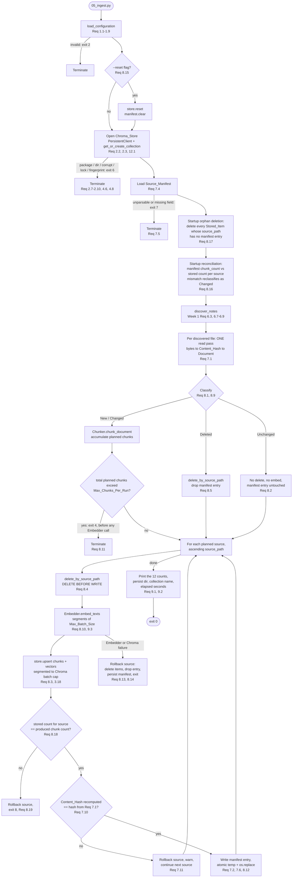
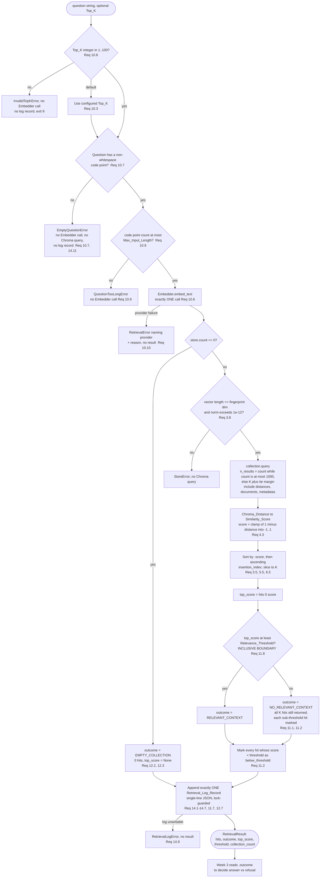
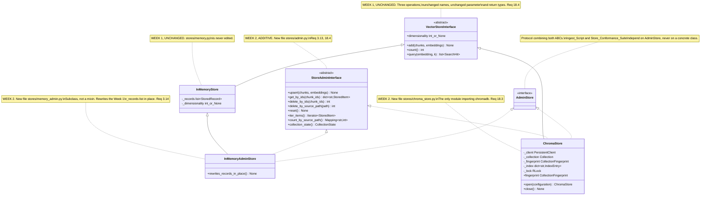
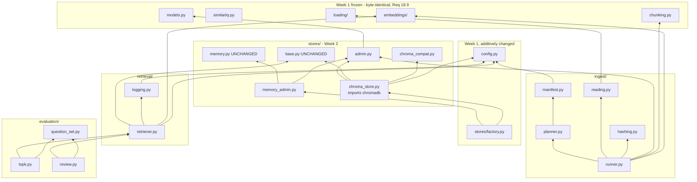

# Design Document

## Overview

Week 2 turns the Week 1 in-process list into a persistent local vector database and builds a retrieval layer on top of it. The shape of the work is deliberately narrow: **one new implementation of an interface that already exists**, plus the machinery that a persistent store makes possible — incremental ingest driven by content hashes, a retriever with a relevance threshold, a machine-readable retrieval log, and two measurement scripts.

Nothing here is a framework. The only new third-party dependency is `chromadb`, pinned to an exact version (Requirement 2.1, 19.1). Chroma is used as a *storage and index primitive only*: it is never asked to embed text, never asked to rank by anything other than the vector we hand it, and never asked to construct a prompt. Distance-to-similarity conversion, insertion ordering, tie-breaking, incremental planning, threshold logic, and precision@K are all code the learner writes and property-tests.

### Design goals

1. **The Week 1 seam holds.** `Vector_Store_Interface` was designed in Week 1 as the swap point (Week 1 Requirement 10.3). Week 2 proves it: the frozen Week 1 modules — Chunker, Embedder, Document_Loader, PDF_Loader, Markdown_Loader, Similarity_Calculator — are byte-identical at the end of Week 2, verified by an automated content check (Requirement 18.9). Exactly two Week 1 modules change, both additively and both because a requirement explicitly demands it (§ "What changes in Week 1, and what does not").
2. **Chroma's numbers mean what Week 1's numbers mean.** A `Similarity_Score` from `Chroma_Store` and a `Cosine_Similarity` from `Similarity_Calculator` are the same number to 1e-5, and that equality is a property test, not a claim (Requirements 4.4, 6.4). Everything downstream — the `Relevance_Threshold`, the Top-K report, precision@K — is denominated in that one unit.
3. **Re-running ingest is cheap and safe.** A second run over unchanged notes issues zero Embedder calls, leaves the collection byte-for-byte equivalent, and leaves the manifest byte-identical (Requirement 8.6). A crashed run leaves no half-ingested file claimed as ingested (Requirements 8.12, 8.17).
4. **Retrieval reports absence, not noise.** The three outcomes — relevant context, no relevant context, empty collection — are a closed enum on the result object, so Week 3 cannot accidentally treat a low-scoring hit as usable context (Requirements 11.1, 12.3).
5. **Exactness where it is promised, measurement where it is not.** At or below `Exact_Search_Limit` (1000 stored items) the store returns the true top-K in the true order. Above it, HNSW is approximate and the design measures recall instead of asserting exactness (Requirements 3.5, 3.20, 6.9). The boundary is a named constant, not a footnote.
6. **Offline, per-test-isolated, fast.** Every Chroma test uses its own `Persist_Directory`, every embedding comes from the Week 1 `FakeEmbedder`, and the whole suite — Week 1 plus Week 2 — stays under 300 seconds with no network (Requirements 6.8, 19.5–19.8).

### Key design decisions

| Decision | Rationale |
|---|---|
| `embedding_function=None` on the collection, vectors always supplied by us | This is not a style choice, it is the offline guarantee. Chroma's *default* embedding function is an ONNX build of `all-MiniLM-L6-v2` whose model files are **downloaded on first use** ([Chroma embeddings docs](https://github.com/chroma-core/docs/blob/main/docs/embeddings.md)). Accepting the default would mean a network fetch inside `Chroma_Store`, a second embedding path competing with the Week 1 Embedder, and a silent dimensionality of 384 regardless of the configured provider. Passing `None` makes Chroma raise if we ever forget a vector, which converts a possible silent-wrong-embedding bug into a loud error (Requirements 1.12, 2.2, 3.3, 19.7). |
| Query fetches `n_results = count` while `count <= Exact_Search_Limit`, then sorts locally | Two guarantees for the price of one. hnswlib raises its search beam to at least `k`, so asking for every item forces an exhaustive layer-0 scan — that is *why* the top-K is exact below the limit (Requirement 3.5). And having every candidate in hand is the only way to apply Week 1's tie-break rule (ascending `insertion_index`) correctly at the K boundary (Requirements 3.5, 5.5, 6.5). Cost is bounded at 1000 rows per query. |
| `Store_Admin_Interface` is a separate ABC, and `In_Memory_Store` gains it by **subclass**, not by edit | Requirement 18.4 requires the admin contract to be additive and `Vector_Store_Interface` to keep exactly its three Week 1 operations. `stores/memory_admin.py::InMemoryAdminStore(InMemoryStore, StoreAdminInterface)` adds the five admin operations without touching `stores/memory.py`, and `isinstance(store, InMemoryStore)` still holds so Requirements 18.6 and 18.10 are satisfied by construction. § "Extending In_Memory_Store without editing it" compares this against a mixin. |
| One cached id→(insertion_index, source_path) map inside `Chroma_Store` | Six separate requirements need the same lookup: duplicate-id rejection (3.11, 3.12), next insertion index (3.4), insertion-index retention on upsert (3.15), delete-by-source-path (3.16), per-source stored counts for reconciliation (8.16), and orphan detection (8.17). Deriving each independently would mean six Chroma round trips per ingest run. One map built on first use serves all six. |
| Ingest is two passes: load+hash+chunk everything, then embed+commit per file | Requirement 8.11 requires the `Max_Chunks_Per_Run` guardrail to fire *before any Embedder call*, which is impossible without knowing the total chunk count first. Peak memory is `Max_Chunks_Per_Run × Chunk_Size` ≈ 1 MB at the defaults, which is cheaper than the alternative of paying for embeddings and then discovering the run was too big. |
| The manifest is rewritten after **each** committed file, atomically | Requirement 8.12 says a file's entry appears only after all its chunks are stored, and 8.13 says entries for already-committed files survive a mid-run failure. Both hold only if the commit point is per file. `os.replace` over a temp file in the same directory makes each of those rewrites atomic (Requirement 7.6). N small writes per run is a real cost and an acceptable one at this corpus size. |
| `RetrievalOutcome` is an enum on a result wrapper, not a boolean | Requirements 11.1, 11.8, and 12.3 describe three mutually exclusive states, one of which (empty collection) explicitly must *not* be reported as no-relevant-context. A boolean cannot represent that, and Week 3's refusal logic keys off the distinction. |
| Concurrency means **threads in one process**, and the log append is lock-guarded | Requirements 14.12 and 19.11 want 8–16 concurrent retrievals; Requirement 2.10 says one `Persist_Directory` serves one process. The only consistent reading is threads sharing one `Chroma_Store` and one log writer. § "Concurrency model" works this through, including why `O_APPEND` alone is not sufficient for records larger than `PIPE_BUF`. |
| Embedding dimensionality is resolved **without** a provider call | The `Collection_Fingerprint` needs the dimensionality at collection-creation time (Requirement 4.2), but Requirement 8.6 forbids any Embedder call on a no-change run. A probe embed would break 8.6 and 9.5. § "Resolving the dimensionality offline" gives the four-step resolution and the pinned model table. |

### Research notes informing the design

- **Chroma's cosine space is a distance, not a similarity.** The collection-level setting is `hnsw:space`, default `l2`; the permitted values are `l2`, `cosine`, and `ip`, and the `cosine` value returns cosine *distance* — values near 0 mean more similar ([Chroma Cookbook, collections](https://cookbook.chromadb.dev/core/collections/)). Underneath, hnswlib's cosine space normalizes each vector on insert and on query and then computes `1 − â·b̂`, which is what makes the conversion in § "Distance to Similarity_Score" exact and norm-independent. *Content was rephrased for compliance with licensing restrictions.*
- **The distance function is immutable after creation.** Attempting to change it later, including by calling `collection.modify()` with an `hnsw:space` key, is rejected outright ([chroma-core/chroma error reference](https://errors.standardbeagle.com/chroma-core/chroma/changing-the-distance-function-of-a-collection-onc/)). This is why the design never mutates collection metadata after creation, and why a fingerprint mismatch is a terminate-and-reset condition (Requirement 4.6) rather than something the store repairs in place.
- **Newer Chroma moves index settings from `metadata` to `configuration`.** The classic form is `metadata={"hnsw:space": "cosine"}`; recent versions accept `configuration={"hnsw": {"space": "cosine"}}` and treat `metadata` as user key-value pairs only ([Chroma Cookbook, configuration](https://cookbook.chromadb.dev/core/configuration/)). The design isolates this in one shim function so the pinned version is the only thing that decides, and adds a runtime-metric probe test so a version whose behaviour changed fails loudly instead of silently indexing with `l2` (see [issue #1335](https://github.com/chroma-core/chroma/issues/1335), where a cosine metadata setting did not take effect).
- **Write batches are capped by SQLite, not by Chroma.** The cap is derived from SQLite's compiled `MAX_VARIABLE_NUMBER` divided by the number of bound variables per record; in practice this surfaces as a maximum of 5461 records per `add`/`upsert`, and the same cap applies to `delete(ids=...)` ([BatchSizeExceededError reference](https://errors.standardbeagle.com/chroma-core/chroma/batchsizeexceedederror/), [issue #2181](https://github.com/chroma-core/chroma/issues/2181)). Requirement 3.18 therefore needs real segmentation logic on writes *and* deletes, not just on writes. *Content was rephrased for compliance with licensing restrictions.*
- **The default embedding function is a privacy and network hazard.** Beyond the download cost, a collection left with a default embedding function will embed query text through that function, which has been reported as leaking document content to external services in some configurations ([issue #5848](https://github.com/chroma-core/chroma/issues/5848)). `embedding_function=None` removes the whole class of problem.
- **Chroma stores embeddings as 32-bit floats.** Round-trip tolerance and conversion tolerance are both set from that fact rather than guessed; the arithmetic is in § "Why the tolerance is 1e-5".

### Out of scope for Week 2

Prompt construction, LLM answer generation, citations inside generated answers, re-ranking, hybrid or keyword search, metadata filtering at query time, multi-collection routing, and any UI. Week 3 consumes `RetrievalResult` — specifically its `outcome` and its `SearchHit` sequence — and adds nothing to the storage or retrieval layer.

---

## Architecture

### What changes in Week 1, and what does not

The frozen set is the six modules named in Requirement 18.1: `chunking.py`, `embeddings/` (Embedder), `loading/base.py`, `loading/pdf_loader.py`, `loading/markdown_loader.py`, and `similarity.py`. At the end of Week 2 every one of them is **byte-identical** to its content at the Week 1 completion revision, checked by `tests/test_foundation_unmodified.py` (Requirement 18.9). `models.py` is also unchanged: no field is added to `Chunk` (Requirement 18.8), and every new data model lives in a new module.

Exactly two pre-existing modules change, and each change is required by name:

| Module | Change | Required by | Why it cannot be avoided |
|---|---|---|---|
| `stores/factory.py` | one import swap plus one branch | Requirement 18.5 | 18.5 states the factory must return a `Chroma_Store` for selection `chroma` and an `In_Memory_Store` for `memory`. The branch *is* the requirement. |
| `config.py` | two new nested settings dataclasses, appended as two defaulted fields on `Configuration`, plus their parsers in `load_configuration` | Requirements 1.1–1.9 | 1.1 says "THE Configuration SHALL read … in addition to every setting named in Week 1 Requirement 1". A second, parallel configuration object would contradict that sentence and would split validation ordering across two modules. |

Neither module is in the 18.1/18.9 frozen set. Both changes are strictly additive: no existing field, parameter, or return type changes, so every Week 1 construction site and every Week 1 test compiles and passes unmodified (Requirement 18.10).

Everything else in Week 2 is a **new file**.

#### The single factory change, in full

```python
# src/askmydocs/stores/factory.py
from askmydocs.config import Configuration
from askmydocs.stores.base import VectorStoreInterface
from askmydocs.stores.memory_admin import InMemoryAdminStore   # was: memory.InMemoryStore


def build_store(configuration: Configuration) -> VectorStoreInterface:
    """Week 2: two branches. Requirement 18.5."""
    if configuration.store.selection == "chroma":
        # Imported inside the branch so that (a) selecting `memory` works with no
        # chromadb installed at all, and (b) ModuleNotFoundError is raised at the
        # one point that can turn it into the Requirement 2.7 message.
        from askmydocs.stores.chroma_store import ChromaStore
        return ChromaStore.open(configuration)
    return InMemoryAdminStore()
```

Three details carry weight. The import of `chroma_store` is **local to the branch**, which keeps `chromadb` off the import path of anyone who selected `memory` and gives `ChromaUnavailableError` a single natural raise site (Requirement 2.7). The `memory` branch now returns `InMemoryAdminStore`, which *is* an `InMemoryStore` by subclassing, so Requirement 18.5's "SHALL return an In_Memory_Store" holds and Requirement 3.14's "In_Memory_Store SHALL implement every Store_Admin_Interface operation" holds at the same time. And `factory.py` still does not import `chromadb` itself, so Requirement 18.3 — `chroma_store.py` is the *only* module importing the Chroma client package — remains true and is checked by the import-graph test (Requirement 18.7).

One consequence to state plainly, because Requirement 18.6 depends on it: the default vector store selection is `chroma` (Requirement 1.2), so **the Week 1 Pipeline_Script must not obtain its store from `build_store`**. `scripts/04_pipeline.py` constructs `InMemoryStore()` directly, which is what the Week 1 module dependency graph already shows (`scripts → memstore`). If the Week 1 implementation instead routed through the factory, that one script line changes to a direct construction — scripts are not in the frozen set, and the change preserves Week 1 Requirement 11's output exactly (Requirement 18.6).

### Extending `In_Memory_Store` without editing it

`Store_Admin_Interface` is additive (Requirement 18.4) but **both** stores must implement it (Requirement 3.14), and `stores/memory.py` may not be rewritten. Three options were considered:

| Option | Verdict |
|---|---|
| Edit `stores/memory.py` to implement the admin operations | Rejected. It is the largest behavioural change of the three and gains nothing: the Week 1 `add`/`count`/`query` code would sit in the same file as five operations Week 1 never needed, and every future "did Week 1 change?" question gets harder to answer. |
| A mixin: `class InMemoryAdminMixin(StoreAdminInterface)` composed as `class InMemoryAdminStore(InMemoryAdminMixin, InMemoryStore)` | Rejected. The mixin still has to reach into `InMemoryStore`'s `_records` and `_dimensionality`, so the coupling is identical, but it is now split across two classes and the MRO has to be reasoned about. A mixin earns its keep when it is composed into more than one base; there is exactly one base here. |
| **Chosen:** a subclass, `stores/memory_admin.py::InMemoryAdminStore(InMemoryStore, StoreAdminInterface)` | One new file, no edit to Week 1, one concrete type for the factory and the conformance suite to instantiate, and `isinstance(store, InMemoryStore)` still true so Requirements 18.5, 18.6, and 18.10 are unaffected. |

The subclass reads and rewrites `self._records` and `self._dimensionality`, which are Week 1 private attributes. That coupling is the accepted cost, and it is bounded: the subclass reimplements none of `add`, `count`, `query`, or the Week 1 validation order, and `tests/test_foundation_unmodified.py` fails loudly if `memory.py` ever changes shape underneath it. Adding a protected accessor to `memory.py` would be cleaner in the abstract and is rejected only because it would modify a Week 1 module during the very week whose point is that Week 1 does not need modifying.

### Repository layout — Week 2 delta

Unchanged Week 1 files are elided; every line below is new unless marked.

```
RAG/
├── pyproject.toml                    # CHANGED: + chromadb==<exact pin>, + "chroma" hypothesis profile
├── README.md                         # CHANGED: Req 1.10, 2.5, 2.6, 14.10, 17.8, 19.9
├── .env.example                      # CHANGED: Req 1.10 — every Week 2 variable + default + range
├── .gitignore                        # CHANGED: .chroma/, logs/, reports/relevance-review*.csv  (Req 1.11)
├── question-sets/
│   └── retrieval-questions.txt           # Question_Set, 5-10 lines                        (Req 15 glossary)
├── learning-notes/
│   └── vector-db-comparison.md       # Comparison_Note                                 (Req 17)
├── reports/
│   ├── topk-experiment.md            # Top_K_Report, generated                         (Req 15)
│   ├── relevance-review.csv          # Relevance_Review_File, git-ignored               (Req 16)
│   └── precision-at-k.md             # Precision_Report, generated                     (Req 16)
├── scripts/
│   ├── 05_ingest.py                  # Ingest_Script                                   (Req 8, 9)
│   ├── 06_query.py                   # Query_Script                                    (Req 13)
│   ├── 07_topk_experiment.py         # Top_K_Experiment_Script                         (Req 15)
│   └── 08_relevance_review.py        # Relevance_Review_Script, generate + score modes  (Req 16)
├── src/askmydocs/
│   ├── config.py                     # CHANGED (additive): VectorStoreSettings, RetrievalSettings
│   ├── errors_week2.py               # Week 2 exception subtree, imported into errors' root
│   ├── stores/
│   │   ├── base.py                   # UNCHANGED  Vector_Store_Interface
│   │   ├── memory.py                 # UNCHANGED  In_Memory_Store
│   │   ├── admin.py                  # Store_Admin_Interface, StoredItem, CollectionState
│   │   ├── memory_admin.py           # InMemoryAdminStore(InMemoryStore, StoreAdminInterface)
│   │   ├── chroma_store.py           # ChromaStore — the ONLY module importing chromadb  (Req 18.3)
│   │   ├── chroma_compat.py          # version shim: collection kwargs, max batch size
│   │   └── factory.py                # CHANGED: one import + one branch                 (Req 18.5)
│   ├── retrieval/
│   │   ├── retriever.py              # Retriever, RetrievalResult, RetrievalOutcome, ScoredHit
│   │   └── logging.py                # RetrievalLogWriter, RetrievalLogRecord
│   ├── ingest/
│   │   ├── hashing.py                # Content_Hash over a single read pass            (Req 7.1, 7.8, 7.9)
│   │   ├── reading.py                # bytes -> Document adapter over Week 1 loaders    (Req 7.1)
│   │   ├── manifest.py               # SourceManifest, ManifestEntry, atomic write      (Req 7.2-7.6)
│   │   ├── planner.py                # PURE classification: New/Changed/Unchanged/Deleted (Req 8.1, 8.9, 8.16)
│   │   └── runner.py                 # orchestration, commit, rollback, reporting       (Req 8, 9)
│   └── evaluation/
│       ├── question_set.py           # load + de-duplicate + Question_Identifier        (Req 15.8, 15.9, 15.11)
│       ├── topk.py                   # experiment statistics + report rendering         (Req 15)
│       └── review.py                 # CSV generate, label carry-over, precision@K      (Req 16)
└── tests/
    ├── strategies_week2.py           # Hypothesis strategies + "chroma" profile
    ├── conftest.py                   # CHANGED: + chroma_store fixture, telemetry off
    ├── test_config_week2.py          # Req 1
    ├── test_chroma_store.py          # Req 2, 3 (Chroma-specific), 4.1, 4.2, 4.6, 4.8, 12.1, 12.2
    ├── test_store_conformance.py     # Store_Conformance_Suite, both stores             (Req 6)
    ├── test_store_properties_week2.py# Properties 1-12, 24-26
    ├── test_manifest.py              # Req 7
    ├── test_ingest_examples.py       # worked scenarios A-F from this document          (Req 8, 9)
    ├── test_ingest_properties.py     # Properties 13-18
    ├── test_retriever.py             # Req 10, 11, 12
    ├── test_retrieval_log.py         # Req 14, Properties 19-20
    ├── test_topk_experiment.py       # Req 15, Property 21
    ├── test_relevance_review.py      # Req 16, Properties 22, 27
    ├── test_layering_week2.py        # Req 18.2, 18.3, 18.7 import-graph scan
    ├── test_foundation_unmodified.py      # Req 18.9 content check of the frozen six
    └── test_scripts_week2.py         # Req 9, 13, 15, 16 script-level behaviour
```

Two naming notes. `retrieval/logging.py` shadows the stdlib `logging` name *within its own package only*; because the project uses absolute imports throughout (`src/` layout, Week 1 decision), `import logging` elsewhere still resolves to the standard library. The alternative name `retrieval/retrieval_log.py` was considered and rejected as stuttering, but the shadowing risk is real enough to note here and to cover with one import test. `evaluation/` groups the two measurement scripts' logic, which the brief listed as bare script files; the logic lives in the package so it is unit-testable without running a script, matching the Week 1 rule that scripts are thin `main(argv) -> int` shells.

### Week 2 ingest flow



The two startup steps before discovery are the crash-recovery mechanism, and their order matters: orphan deletion removes only items whose `source_path` has *no* manifest entry, so it cannot perturb the per-source counts that reconciliation then compares. Running reconciliation first would work too, but describing it in this order makes the invariant easier to state: **after startup, every Stored_Item belongs to a source that has a manifest entry** (Requirement 8.17), and **every manifest entry whose stored count disagrees with its recorded count has been demoted to Changed** (Requirement 8.16).

### Retrieval flow



Two things this diagram fixes deliberately. The **log append is the last step before returning**, so Requirement 14.11 — an error before a result produces no record — is true by control flow rather than by remembering to guard each raise site. And the **empty-collection branch skips the threshold check entirely**, which is what keeps Requirement 12.3's "SHALL report no No_Relevant_Context outcome" from colliding with Requirement 11.3's biconditional; 11.3 is explicitly conditioned on the collection holding at least one Stored_Item.

### Store class hierarchy



`AdminStore` is a `typing.Protocol` rather than a fourth ABC, so neither concrete class has to inherit from it and the intersection type stays purely structural. `ingest/runner.py` and the conformance suite are typed against `AdminStore`; `retrieval/retriever.py` is typed against `VectorStoreInterface` alone, because retrieval never writes.

### Module dependencies added in Week 2



Four absences are load-bearing and all four are enforced by `tests/test_layering_week2.py` (Requirement 18.7), not by convention:

- **No arrow from `chunking.py`, `similarity.py`, `loading/`, or `embeddings/` into `stores/`, `retrieval/`, or `ingest/`.** The Week 1 layers do not learn that a database exists (Requirement 18.2).
- **Only `chroma_store.py` imports `chromadb`.** `chroma_compat.py` is a pure-Python shim that receives the module object as a parameter rather than importing it, which is what keeps Requirement 18.3 literally true for a single module.
- **`retriever.py` does not import `chroma_store.py`.** It depends on `VectorStoreInterface`, so the conformance suite can drive the Retriever against `InMemoryAdminStore` with no Chroma involved.
- **`planner.py` performs no I/O.** Classification takes a discovered-file list, a hash map, a manifest, and a per-source stored-count map, and returns an `IngestPlan`. That is what makes Requirements 8.1, 8.9, and 8.16 testable as pure functions over generated inputs instead of through a filesystem and a database.

### Concurrency model

Requirements 14.12 and 19.11 demand 8–16 concurrent Retriever invocations against one `Retrieval_Log`. Requirement 2.10 says one `Persist_Directory` supports one Ask My Docs process at a time. Those are only consistent under one reading, and the design states it explicitly:

> **Concurrency in Week 2 means threads inside a single process, sharing one `Chroma_Store` instance (therefore one `PersistentClient`) and one `RetrievalLogWriter`. Multi-process concurrency against the same `Persist_Directory` is out of scope and is reported as `CollectionLockedError` (Requirement 2.10).**

That reading drives three mechanisms:

1. **One client, one lock.** `ChromaStore` holds a `threading.RLock` and takes it around every call into the Chroma client — queries included. Chroma's persistent backend is SQLite-backed and its thread-safety guarantees vary by version, so the store does not rely on them. Serializing queries costs throughput and buys determinism and freedom from SQLite `database is locked` errors originating from our own threads; the requirement to satisfy is line integrity in the log, not queries per second.
2. **The log append is lock-guarded, and the lock is the primary mechanism.** `RetrievalLogWriter` holds a `threading.Lock` and performs the whole open-write-close (or write-flush on a held descriptor) inside it. With the lock held, N thread invocations produce exactly N lines — that is Requirements 14.12 and 19.11 discharged.
3. **`O_APPEND` plus one `os.write` is the secondary mechanism, and its limit is stated rather than assumed.** The descriptor is opened with `os.O_WRONLY | os.O_CREAT | os.O_APPEND | os.O_BINARY`, and the fully-encoded record is written with a single `os.write`. `O_APPEND` makes the seek-to-end and the write atomic with respect to the file offset, so no record can ever land *on top of* another. It does **not** make a large write indivisible: POSIX guarantees atomicity only for writes up to `PIPE_BUF` (4096 bytes on Linux), and a record carrying five hits with 500 characters of text each is comfortably larger than that. A concurrent writer in *another process* could therefore interleave bytes mid-record. Since Requirement 2.10 confines us to one process, the in-process lock closes the gap completely; the `O_APPEND` and single-`os.write` choices exist so that the failure mode, if someone ignores 2.10, is an interleaved line rather than a truncated file.

`os.O_BINARY` is included via `getattr(os, "O_BINARY", 0)` because on Windows `os.open` defaults to text mode and would translate the record-terminating `\n` into `\r\n`, breaking the "one JSON object per line terminated by one line-feed" rule of Requirement 14.4 on exactly one platform. Python's buffered text writer is avoided for the same reason and for a second one: a buffered writer is free to split one `write()` into several `write(2)` syscalls, which would discard the `O_APPEND` benefit.

Requirement 14.5's "single append-mode write" is satisfied literally: one `os.write` of `redact(json.dumps(record)) + "\n"` encoded as UTF-8, with no read, seek, or truncate anywhere in the code path, so every existing byte is preserved by construction.

---

## Components and Interfaces

### Configuration extension (`config.py`, additive)

```python
SUPPORTED_STORE_SELECTIONS: Final = ("memory", "chroma")
SUPPORTED_DISTANCE_METRICS: Final = ("cosine",)          # Req 1.5 - Week 2 supports one
COLLECTION_NAME_PATTERN: Final = re.compile(r"^[A-Za-z0-9][A-Za-z0-9_-]{1,61}[A-Za-z0-9]$")


@dataclass(frozen=True)
class VectorStoreSettings:
    selection: str = "chroma"                              # Req 1.2, 1.3, 1.4
    persist_directory: Path = Path(".chroma")              # Req 1.2, 1.9
    collection_name: str = "ask_my_docs"                   # Req 1.2, 1.8
    distance_metric: str = "cosine"                        # Req 1.2, 1.3, 1.5
    manifest_path: Path = Path(".chroma/ingest-manifest.json")   # Req 1.2, 1.9
    embedding_dimensionality: int | None = None            # design addition, see below


@dataclass(frozen=True)
class RetrievalSettings:
    top_k: int = 5                                         # Req 1.2, 1.6
    relevance_threshold: float = 0.30                      # Req 1.2, 1.7
    retrieval_log_path: Path = Path("logs/retrievals.jsonl")     # Req 1.2, 1.9
    question_set_path: Path = Path("question-sets/retrieval-questions.txt")  # Req 1.2, 1.9


@dataclass(frozen=True)
class Configuration:
    # ... every Week 1 field, unchanged, in its original order ...
    store: VectorStoreSettings = field(default_factory=VectorStoreSettings)
    retrieval: RetrievalSettings = field(default_factory=RetrievalSettings)
```

Both new fields carry defaults and are appended last, so every Week 1 construction site — including every Week 1 test — still builds a valid `Configuration` with no change (Requirement 18.10).

`load_configuration` gains a Week 2 phase that runs **after** the Week 1 phases, in this order: store selection → distance metric → collection name → `Top_K` → `Relevance_Threshold` → path resolution. Selection and metric come first because they decide whether the rest of the store settings matter at all; `Collection_Name` precedes the numerics because its rule is the most intricate and the message most worth reading first. Every path is resolved against the repository root when not absolute (Requirement 1.9), using `Path(__file__).resolve().parents[2]` as the root anchor so the resolution does not depend on the process working directory.

Two notes on validation. `Top_K` parsing is strict in the Week 1 sense: `"5 "` is accepted after trimming, `"5.0"`, `"5e0"`, and `"1_0"` are rejected (Requirement 1.6). `Relevance_Threshold` parsing accepts any Python float literal including `-0.5`, `0`, `1`, and `3e-1`, because it is a decimal number by Requirement 1.7's own wording; `nan` and `inf` are rejected as outside `[-1.0, 1.0]`.

`Collection_Name` validation is one regex plus a length check rather than four separate checks, but the *message* enumerates all three rules — permitted character set, first-and-last-character rule, and the 3-to-63 length range — because Requirement 1.8 demands all three regardless of which one the value violated. The regex encodes the length range too (`1..61` interior characters plus the two anchors), and the explicit length check exists only so a 2-character or 64-character value gets the length wording first.

#### Resolving the dimensionality offline

`Collection_Fingerprint` must record the `Embedding_Dimensionality` at collection-creation time (Requirement 4.2), and the distance function and the fingerprint cannot be amended afterwards — Chroma rejects metadata modification that touches `hnsw:space`, and the design consequently never mutates collection metadata at all. So the dimensionality has to be known *before* the first vector exists. At the same time, Requirement 8.6 says a no-change ingest run issues **zero** Embedder calls and Requirement 9.5 says it reports a batch-call count of 0, which rules out a probe embedding.

`ingest/dimensionality.py::resolve_dimensionality(configuration, embedder) -> int` resolves it in four steps, stopping at the first that succeeds:

1. `configuration.store.embedding_dimensionality`, from `ASKMYDOCS_EMBEDDING_DIM`, when set.
2. `embedder.dimensionality`, guarded by `try/except Exception`. This succeeds for the Sentence Transformers provider (the value comes from the loaded model's configuration, no network) and for `FakeEmbedder`; for the OpenAI provider it raises before the first response, and the exception is treated as "unknown" rather than propagated.
3. `KNOWN_MODEL_DIMENSIONALITY[configuration.model_name]`, a pinned table: `text-embedding-3-small → 1536`, `text-embedding-3-large → 3072`, `text-embedding-ada-002 → 1536`, `sentence-transformers/all-MiniLM-L6-v2 → 384`.
4. Otherwise `ConfigurationError`, exit 2, naming `ASKMYDOCS_EMBEDDING_DIM`, the configured model, and the fact that the value is needed to create the collection fingerprint.

`ASKMYDOCS_EMBEDDING_DIM` is an addition beyond Requirement 1.1's enumerated list. That is permitted — 1.1 fixes a minimum, not a maximum — and it is justified by the collision between 4.2 and 8.6 above. It is documented in the README and `.env.example` alongside the listed variables (Requirement 1.10), with the note that a learner on a default model never needs to set it.

A wrong value cannot corrupt data: the first `add` compares every supplied vector length against the fingerprint and raises with both numbers (Requirement 3.9), and every query does the same (Requirement 3.8). So the failure mode of a stale table entry is an immediate, explicit error naming both values, not a silently mis-indexed collection.

### `Store_Admin_Interface` (`stores/admin.py`)

```python
MetadataValue = str | int | float | bool
PERMITTED_METADATA_TYPES: Final = (str, int, float, bool)
INSERTION_INDEX_KEY: Final = "insertion_index"


@dataclass(frozen=True)
class StoredItem:
    """One Stored_Item: chunk id + text + metadata + vector (Req 3.13 glossary)."""
    chunk_id: str
    text: str
    metadata: Mapping[str, MetadataValue]     # includes INSERTION_INDEX_KEY
    embedding: tuple[float, ...]

    @property
    def insertion_index(self) -> int: ...
    @property
    def source_path(self) -> str: ...

    def state_key(self, float_places: int = 5) -> tuple:
        """Collection_State identity: chunk id, text, metadata WITHOUT the insertion
        index, and the vector rounded to `float_places` decimals. Rounding is what
        makes cross-store Collection_State comparison well defined despite Chroma's
        float32 storage (Req 5.4, 6.3, 8.7)."""


class CollectionState(frozenset):
    """A set of state_key tuples. Two stores have equal Collection_State when these
    sets are equal (glossary; Requirements 2.4, 6.3, 8.7)."""


class StoreAdminInterface(ABC):
    """Additive Week 2 contract. Deliberately NOT merged into Vector_Store_Interface,
    which keeps exactly its three Week 1 operations (Req 18.4)."""

    # --- the five operations Requirement 3.13 names -------------------------
    @abstractmethod
    def upsert(self, chunks: Sequence[Chunk],
               embeddings: Sequence[Sequence[float]]) -> None:
        """Insert or replace by chunk id. A replaced id keeps its existing
        insertion_index and leaves the stored item count unchanged (Req 3.15).
        Validation is identical to add's and happens before any mutation, so a
        rejected upsert leaves Collection_State untouched (Req 3.9, 3.19)."""

    @abstractmethod
    def delete_by_ids(self, chunk_ids: Sequence[str]) -> int:
        """Returns the number removed. Unknown ids are silently ignored (Req 3.17)."""

    @abstractmethod
    def delete_by_source_path(self, source_path: str) -> int:
        """Removes every Stored_Item whose stored source_path metadata equals the
        argument; returns the count removed; no match is not an error (Req 3.16, 3.17)."""

    @abstractmethod
    def reset(self) -> None:
        """Stored item count becomes 0 and no previously stored chunk id is
        fetchable (Req 3.13, 5.6). Does NOT delete the Persist_Directory."""

    @abstractmethod
    def iter_items(self) -> Iterator[StoredItem]:
        """The single abstract read primitive. Order is unspecified."""

    # --- derived, concrete on the ABC --------------------------------------
    def get_by_ids(self, chunk_ids: Sequence[str]) -> dict[str, StoredItem]:
        """Default: filter iter_items. ChromaStore overrides with collection.get."""

    def count_by_source_path(self) -> Mapping[str, int]:
        """Stored item count grouped by source_path metadata. Needed by the startup
        reconciliation and orphan sweep (Req 8.16, 8.17)."""

    def collection_state(self) -> CollectionState:
        """Test and comparison oracle for Requirements 2.4, 6.3, and 8.7."""
```

Requirement 3.13 names five operations; the interface declares eight. `iter_items` exists so that `get_by_ids`, `count_by_source_path`, and `collection_state` can be concrete on the ABC — an implementation supplies one read primitive and inherits three derived views, which is why `InMemoryAdminStore` is about forty lines. `count_by_source_path` is not optional in practice: Requirements 8.16 and 8.17 compare per-source stored counts against the manifest, and there is no way to express that through the five named operations without already knowing every chunk id. `collection_state` is the oracle three FOR ALL criteria are written in terms of, so it belongs on the interface rather than in test code, where the two stores would inevitably grow two subtly different definitions.

`state_key` rounds vector elements to 5 decimals. That number is not arbitrary: it is the same 1e-5 tolerance Requirements 5.4 and 6.3 use, derived in § "Why the tolerance is 1e-5". Without rounding, `Collection_State` equality between a float64 in-memory store and a float32 Chroma collection would be false for essentially every vector, and Requirement 8.7's incremental-equals-rebuild property would be unprovable.

### `InMemoryAdminStore` (`stores/memory_admin.py`)

```python
class InMemoryAdminStore(InMemoryStore, StoreAdminInterface):
    """In_Memory_Store plus the Week 2 admin contract. stores/memory.py is not edited."""

    def iter_items(self) -> Iterator[StoredItem]:
        for record in self._records:
            yield StoredItem(
                chunk_id=record.chunk.chunk_id,
                text=record.chunk.text,
                metadata={**record.chunk.to_metadata(),
                          INSERTION_INDEX_KEY: record.insertion_index},
                embedding=record.embedding,
            )

    def upsert(self, chunks, embeddings) -> None:
        validate_batch(chunks, embeddings, self.dimensionality)   # shared with ChromaStore
        by_id = {r.chunk.chunk_id: position
                 for position, r in enumerate(self._records)}
        next_index = len(self._records)
        replacements: dict[int, StoredRecord] = {}
        additions: list[StoredRecord] = []
        for chunk, vector in zip(chunks, embeddings):
            if chunk.chunk_id in by_id:
                position = by_id[chunk.chunk_id]
                kept = self._records[position].insertion_index    # Req 3.15
                replacements[position] = StoredRecord(chunk, tuple(vector), kept)
            else:
                additions.append(StoredRecord(chunk, tuple(vector), next_index))
                next_index += 1
        for position, record in replacements.items():             # cannot fail
            self._records[position] = record
        self._records.extend(additions)
        self._dimensionality = self._dimensionality or len(embeddings[0])
```

The build-then-apply shape is copied deliberately from Week 1's `add`: everything that can fail happens before anything mutates, so the "Collection_State unchanged on rejection" clauses of Requirements 3.9, 3.12, and 3.19 are structural rather than remembered. `validate_batch` is shared with `ChromaStore` and lives in `stores/admin.py`, which is what makes the two stores agree on *which* input is invalid — a prerequisite for the conformance suite (Requirement 6.1) being able to assert identical error behaviour from identical test code.

Note that `insertion_index` for a *new* id is `len(self._records)` computed before the loop and incremented locally. Because replacements never change the list length, the sequence of insertion indices stays `0, 1, …, count-1` across any mix of upserts (Week 1 Requirement 10.5's invariant, preserved).

### `ChromaStore` (`stores/chroma_store.py`)

The only module in the repository that imports `chromadb` (Requirement 18.3).

```python
EXACT_SEARCH_LIMIT: Final = 1000        # Exact_Search_Limit (glossary, Req 3.5, 3.20)
RECALL_FLOOR: Final = 0.95              # Recall_Floor (glossary, Req 3.20)
HNSW_SEARCH_EF: Final = EXACT_SEARCH_LIMIT
TIE_MARGIN: Final = 64                  # over-fetch above the exact limit
ZERO_NORM_THRESHOLD: Final = 1e-12      # Req 3.8, matches Week 1's similarity.py
FINGERPRINT_VERSION: Final = 1
DEFAULT_MAX_WRITE_BATCH: Final = 4096   # below the observed SQLite-derived 5461 cap


@dataclass(frozen=True)
class CollectionFingerprint:
    """Written into Chroma_Collection metadata at creation (Req 4.2). Never mutated."""
    fingerprint_version: int
    distance_metric: str
    provider: str
    model_name: str
    dimensionality: int

    def to_metadata(self) -> dict[str, MetadataValue]:
        return {"askmydocs:fingerprint_version": self.fingerprint_version,
                "askmydocs:distance_metric": self.distance_metric,
                "askmydocs:provider": self.provider,
                "askmydocs:model_name": self.model_name,
                "askmydocs:dimensionality": self.dimensionality}

    @classmethod
    def from_metadata(cls, metadata: Mapping | None) -> "CollectionFingerprint":
        """Raises FingerprintMissingError naming every absent or unreadable field
        (Req 4.8)."""

    def differences(self, other: "CollectionFingerprint") -> list[tuple[str, object, object]]:
        """(field, stored, configured) for every differing field (Req 4.6)."""


@dataclass(frozen=True)
class IndexEntry:
    insertion_index: int
    source_path: str


class ChromaStore(VectorStoreInterface, StoreAdminInterface):

    @classmethod
    def open(cls, configuration: Configuration,
             dimensionality: int | None = None) -> "ChromaStore":
        """1. Verify the resolved Persist_Directory: exists-and-is-a-directory, or
              creatable with parents; writable, probed by creating and removing a
              temp file. Failure -> PersistDirectoryError before any client
              construction and therefore before any add, upsert, or query
              (Req 2.3, 2.8).
           2. Import chromadb. ModuleNotFoundError -> ChromaUnavailableError naming
              the package and the pinned install command (Req 2.7).
           3. Construct PersistentClient(path=..., settings=Settings(
              anonymized_telemetry=False, allow_reset=True)). An unopenable or
              version-incompatible database -> CollectionOpenError naming the path,
              the reason, and the reset command, with the directory content left
              untouched (Req 2.9, 12.6). A SQLite lock -> CollectionLockedError
              (Req 2.10).
           4. get_or_create_collection(name, embedding_function=None,
              **collection_kwargs(...)).
           5. Read back collection.metadata. Absent collection -> we just created it
              with the fingerprint and report count 0 (Req 12.1). Existing
              collection -> CollectionFingerprint.from_metadata, then .differences
              against the configured fingerprint; any difference ->
              FingerprintMismatchError before any add, upsert, or query (Req 4.6, 4.8).
        """

    def close(self) -> None:
        """Release the client so a later ChromaStore can open the same directory
        (Req 2.4, 19.10) and so a test's temp directory can be removed on Windows."""

    def __enter__(self) -> "ChromaStore": ...
    def __exit__(self, *exc) -> None: ...        # calls close()

    # --- Vector_Store_Interface, Week 1 signatures unchanged ---------------
    def add(self, chunks, embeddings) -> None:
        """Rejects duplicate ids already stored (Req 3.11) and repeated within the
        batch (Req 3.12) before any write. Otherwise delegates to the same
        write path as upsert."""

    def count(self) -> int:
        """collection.count()."""

    def query(self, embedding, k) -> list[SearchHit]: ...

    @property
    def dimensionality(self) -> int | None:
        return self._fingerprint.dimensionality or None
```

#### `PersistentClient` and collection creation

```python
# stores/chroma_compat.py — pure, receives the module rather than importing it
def collection_kwargs(chromadb_module, distance_metric: str,
                      fingerprint: CollectionFingerprint) -> dict:
    """Return the create/get_or_create keyword arguments for the pinned version.

    Pinned 0.5-series form (the form this design targets):
        metadata = {"hnsw:space": distance_metric,          # Req 4.1 - explicit, never default
                    "hnsw:search_ef": HNSW_SEARCH_EF,
                    **fingerprint.to_metadata()}            # Req 4.2
    A >=1.0 pin moves the two hnsw keys into
        configuration = {"hnsw": {"space": distance_metric, "ef_search": HNSW_SEARCH_EF}}
    and leaves the fingerprint keys in metadata.
    """

def max_write_batch(client) -> int:
    """min(client.get_max_batch_size() or client.max_batch_size or
    DEFAULT_MAX_WRITE_BATCH, DEFAULT_MAX_WRITE_BATCH). Requirement 3.18."""
```

`hnsw:space` is set **explicitly to the configured value**, never left to Chroma's default, which is `l2`. Requirement 4.1 says so, and the reason it says so is that an `l2` collection silently returns squared-Euclidean distances that our `1 - d` conversion would turn into meaningless scores in `[1 - 4·max_norm², 1]`. The mistake is easy to make and hard to notice, because low distances still rank similar items first — the ordering looks plausible while every number is wrong. A single `metadata` key is the difference between the threshold meaning something and meaning nothing.

`embedding_function=None` is passed explicitly on both `create` and `get_or_create` (Requirement 3.3). Chroma's default is not "no embedding function" but an ONNX `all-MiniLM-L6-v2` that downloads model files on first use. Passing `None` therefore buys three things at once: no network request from inside the store (Requirements 1.12, 2.2, 19.7), one embedding path rather than two competing ones, and a loud `ValueError` from Chroma if our code ever calls `add` or `query` without supplying vectors — a bug that would otherwise silently embed text with the wrong model at the wrong dimensionality.

`Settings(anonymized_telemetry=False)` is passed as well. Chroma's telemetry is an outbound request; the Week 1 test-suite socket guard would turn it into a hard failure, and in production it would violate Requirement 1.12's "no network request" for the local-provider path.

The `Collection_Fingerprint` is written **once, at creation**. Two facts make this the only workable choice: `get_or_create_collection` ignores the `metadata` argument when the collection already exists, so re-passing the fingerprint on every open would be a no-op that quietly hides drift; and `collection.modify()` rejects any metadata payload containing `hnsw:space`, so there is no safe way to amend metadata later without risking the loss of the space setting. Hence the requirement-mandated shape: validate on open, and on any mismatch terminate and tell the learner to reset (Requirements 4.6, 4.8). A collection created by some other tool has no `askmydocs:` keys and therefore fails `from_metadata` with the field list — which is precisely Requirement 4.8.

#### Metadata written per Stored_Item

```python
def stored_metadata(chunk: Chunk, insertion_index: int) -> dict[str, MetadataValue]:
    """Week 1's flat mapping plus the store-owned insertion index. No field is added
    to the Chunk model (Req 18.8); insertion_index is owned by the store, exactly as
    it is in Week 1's StoredRecord."""
    return {**chunk.to_metadata(), INSERTION_INDEX_KEY: insertion_index}
```

So each Chroma record carries `source_path: str`, `index: int`, `start_offset: int`, `end_offset: int`, `insertion_index: int`. All five are of a permitted type.

**Metadata value type limits.** Chroma's metadata column accepts `str`, `int`, `float`, and `bool` only. `None`, lists, dicts, tuples, sets, `Decimal`, `datetime`, and numpy scalars are all rejected, and an empty metadata mapping is rejected by some versions. `validate_metadata` checks every value before any write and raises `MetadataValueError` naming **every** offending key together with the permitted type list (Requirement 3.19), leaving the collection untouched. Two subtleties are handled explicitly: `bool` is a subclass of `int` in Python, so the check uses `type(value) in PERMITTED_METADATA_TYPES` rather than `isinstance`, which keeps the error message honest about what was actually supplied; and `float('nan')` / `float('inf')` are rejected even though they are of type `float`, because they do not survive a JSON round trip inside Chroma's storage layer and would come back as `null` or raise on read. Week 1's `Chunk.to_metadata()` can only produce `str` and `int`, so in practice this validator fires only for hand-constructed chunks in tests — which is exactly where a type bug should surface.

**Insertion index assignment.** Requirement 3.4 requires every added item's insertion index to exceed every index already stored. `ChromaStore` maintains `self._index: dict[str, IndexEntry]`, built lazily on first use by paging `collection.get(include=["metadatas"])` and recording `(chunk_id → insertion_index, source_path)`. `self._next_insertion_index` is `1 + max(existing)` — or `0` when the collection is empty. The map is then kept current in memory by every add, upsert, and delete, so the O(N) scan happens once per process. One map, six requirements: duplicate-id rejection (3.11, 3.12), next index (3.4), upsert index retention (3.15), delete-by-source-path without a `where` query (3.16), per-source counts for reconciliation (8.16), and the orphan sweep (8.17).

Using `1 + max` rather than `count()` matters after deletions: a collection that held indices `0..9` and lost `3..5` has count 7 but max 9, and `count()` would hand out `7`, colliding with the surviving item at index 7 and breaking the tie-break ordering of Requirement 3.5.

#### Batch size limits and segmentation

Chroma caps the number of records in a single `add`, `upsert`, or `delete(ids=...)` call. The cap is not a Chroma policy number but a consequence of SQLite's compiled `MAX_VARIABLE_NUMBER` divided by the bound variables per record, which surfaces in practice as 5461. `max_write_batch(client)` asks the client for its own limit and clamps to `DEFAULT_MAX_WRITE_BATCH = 4096`, comfortably under the observed floor, so a version whose cap is lower than 4096 is still respected via the client's own value.

Segmentation preserves ordering as Requirement 3.18 demands, and the order of operations is what makes that true:

```
FUNCTION write(items, mode):                     # mode in {add, upsert}
    ASSIGN every new item its insertion_index FIRST, over the whole batch
    FOR segment IN consecutive_slices(items, max_write_batch):
        collection.upsert(ids=..., documents=..., metadatas=..., embeddings=...)
```

Indices are assigned across the *whole* batch before any segment is written, so the sequence is `n, n+1, …, n+m-1` in input order regardless of where the segment boundaries fall. Segments are written in ascending order, so a crash between segments leaves a prefix — which the per-file count check (Requirement 8.18) detects and the rollback removes.

Deletes are segmented identically, because the same cap applies to `delete(ids=...)`. `delete_by_source_path` therefore resolves the id list from `self._index` and then deletes in slices of `max_write_batch`, rather than issuing a single `where={"source_path": path}` delete. Resolving ids locally is also what lets the method return an exact removed-count (Requirement 3.16) without a follow-up read.

#### float32 storage precision

Chroma stores embeddings as 32-bit floats. Week 1 computes in float64 and hands over `list[float]`, so a vector written and read back is not bit-identical: each element is rounded to the nearest float32, a relative error of at most 2⁻²⁴ ≈ 5.96e-8. This is why Requirement 5.4 states its round-trip rule as a tolerance rather than equality, and why it uses an absolute tolerance of 1e-5 for elements of magnitude at most 1.0 and a relative tolerance of 1e-5 above that — a float32 with magnitude 1e3 has an absolute quantum of about 6e-5, which no absolute tolerance of 1e-5 could ever satisfy. The two-regime rule is not a hedge; it is the only formulation that is simultaneously satisfiable and meaningful across the permitted element range of `[-1e3, 1e3]`.

`StoredItem.embedding` is therefore a `tuple[float, ...]` of float64 values that happen to be exactly representable in float32. Comparisons between stores always go through the tolerance-aware helpers or `state_key`'s rounding; no code path compares embeddings with `==`.

#### Query path

```python
def query(self, embedding: Sequence[float], k: int) -> list[SearchHit]:
    if not isinstance(k, int) or isinstance(k, bool) or k < 1:
        raise InvalidKError(...)                        # Req 3.7 - no Chroma query issued
    stored = self.count()
    if stored == 0:
        return []                                      # Req 12.2
    expected = self._fingerprint.dimensionality
    if len(embedding) != expected:
        raise VectorLengthError(len(embedding), expected)   # Req 3.8 - both lengths
    if euclidean_norm(embedding) <= ZERO_NORM_THRESHOLD:
        raise DegenerateVectorError(...)               # Req 3.8 - no Chroma query issued
    if stored <= EXACT_SEARCH_LIMIT:
        n_results = stored                             # exhaustive, exact (Req 3.5)
    else:
        n_results = min(stored, k + TIE_MARGIN)        # approximate (Req 3.20)
    raw = self._collection.query(
        query_embeddings=[list(embedding)], n_results=n_results,
        include=["documents", "metadatas", "distances"])
    hits = [SearchHit(chunk=chunk_from(document, metadata),
                      score=score_from_distance(distance),
                      insertion_index=metadata[INSERTION_INDEX_KEY])
            for document, metadata, distance in zip_rows(raw)]
    hits.sort(key=lambda hit: (-hit.score, hit.insertion_index))   # Req 3.5, 5.5, 6.5
    return hits[:k]
```

Validation precedes the Chroma call so that Requirement 3.8's "SHALL issue no Chroma query" is structural. `isinstance(k, bool)` is excluded explicitly because `True` is an `int` of value 1 in Python and would otherwise pass as a valid K, which is exactly the kind of silent acceptance Requirement 3.7 is written to prevent.

Reconstructing a `Chunk` from the returned document and metadata is a straight field mapping — `text` from the document, `source_path`/`index`/`start_offset`/`end_offset` from the metadata — and it is the operation Requirements 5.2 and 5.3 assert round-trip fidelity for. `Chunk` is frozen and its `chunk_id` is derived, so the reconstructed chunk compares equal to the original by plain `==` when text and all four metadata fields survived.

The local re-sort is not redundant with Chroma's ordering. Chroma returns ascending distance, which is descending score, but it has no notion of our tie-break rule. Sorting on the composite key `(-score, insertion_index)` gives both the descending-score order and the ascending-insertion-index tie-break in one step with no reliance on sort stability — the same technique Week 1's `InMemoryStore.query` uses, which is what makes the two stores agree at Requirement 6.3's granularity.

### `Retriever` (`retrieval/retriever.py`)

```python
class RetrievalOutcome(Enum):
    """Week 3 branches on this. Three states, mutually exclusive, closed set."""
    RELEVANT_CONTEXT = "relevant_context"        # top_score >= threshold   (Req 11.8)
    NO_RELEVANT_CONTEXT = "no_relevant_context"  # count > 0, top < threshold (Req 11.1)
    EMPTY_COLLECTION = "empty_collection"        # count == 0                (Req 12.3)


@dataclass(frozen=True)
class ScoredHit:
    """A Week 1 SearchHit plus the Requirement 11.2 mark. SearchHit is not modified."""
    hit: SearchHit
    below_threshold: bool

    @property
    def chunk(self) -> Chunk: return self.hit.chunk
    @property
    def score(self) -> float: return self.hit.score


@dataclass(frozen=True)
class RetrievalResult:
    question: str
    top_k: int
    hits: tuple[ScoredHit, ...]          # the Retrieval_Result of the glossary
    outcome: RetrievalOutcome
    top_score: float | None              # None only when hits is empty (Req 12.3)
    relevance_threshold: float
    collection_count: int
    provider: str
    model_name: str
    dimensionality: int

    @property
    def search_hits(self) -> tuple[SearchHit, ...]:
        """The plain Week 1 shape, for callers that want no Week 2 wrapper."""

    @property
    def has_relevant_context(self) -> bool:
        return self.outcome is RetrievalOutcome.RELEVANT_CONTEXT


class Retriever:
    def __init__(self, store: VectorStoreInterface, embedder: Embedder,
                 configuration: Configuration,
                 log_writer: RetrievalLogWriter | None = None,
                 clock: Callable[[], datetime] = _utc_now) -> None: ...

    def retrieve(self, question: str, top_k: int | None = None) -> RetrievalResult:
        """Validate, embed once (Req 10.6), delegate to retrieve_with_embedding."""

    def retrieve_with_embedding(self, question: str, embedding: Sequence[float],
                                top_k: int | None = None) -> RetrievalResult:
        """Query, convert, mark, decide the outcome, append exactly one log record.
        Exists so the Top_K_Experiment_Script can reuse one question embedding across
        K in (3, 5, 10) and still satisfy Requirements 15.1 and 15.12 while every
        invocation writes its own log record (Req 14.1)."""
```

`RetrievalResult` wraps the glossary's `Retrieval_Result` (`.hits`) rather than being it, because Requirements 10.11, 11.1, and 12.3 all require the Retriever to *report* things that are not properties of a hit sequence: the highest score, whether it clears the threshold, and whether the collection was empty. Adding those to Week 1's `SearchHit` would violate Requirements 18.1 and 18.8; putting them on a wrapper costs one level of indirection and keeps Week 1 frozen. `search_hits` exists so Week 3 and the conformance suite can take the Week 1 shape when they do not need the marks.

**The threshold boundary is inclusive, and only in one direction.** Requirement 11.8 is explicit that a top score *equal* to the threshold is relevant context. So the outcome test is `top_score >= threshold`, and the per-hit mark is `hit.score < threshold`. Those two are consistent: a hit whose score exactly equals the threshold is not marked below threshold, and if it is the top hit the outcome is `RELEVANT_CONTEXT`. Written the other way round — `top_score > threshold` for the outcome, or `<=` for the mark — the boundary case would report no relevant context while simultaneously not marking the hit as sub-threshold. Property 12 pins the boundary with `@example(top_score == threshold)` seeded explicitly, because a generator over floats will essentially never produce exact equality.

**Sub-threshold hits are still returned.** Requirement 11.2 is unambiguous: on the `NO_RELEVANT_CONTEXT` outcome the result holds `min(Top_K, count)` hits, no hit is omitted because of its score, and every sub-threshold hit is marked. The reason to keep them is practical — the learner tuning the threshold needs to see what *almost* matched, and the Query_Script prints them under an explicit "below the threshold" heading (Requirements 11.5, 13.7). The reason it is safe is that Week 3 branches on `outcome`, not on the presence of hits, so returning them cannot cause an answer to be generated from noise.

**The empty collection is a distinct outcome, not a special case of no-relevant-context.** Requirement 12.3 requires zero hits, *no* reported highest score, and *no* `No_Relevant_Context` report. Collapsing the two states into one boolean would make it impossible for the Query_Script to print the three distinct outcome lines Requirement 13.7 requires, and would leave Week 3 unable to distinguish "your notes do not cover this" from "you have not ingested anything yet" — two situations with completely different remedies.

**Week 3's contract with this type.** Week 3 reads `outcome` to decide whether to answer at all, then `hits` (or `search_hits`) for the context, then `chunk.source_path` plus `start_offset`/`end_offset` for citations. It adds nothing to `RetrievalResult` and does not re-derive relevance from scores; the threshold decision is made once, here, where the configured value lives.

### `RetrievalLogWriter` (`retrieval/logging.py`)

```python
LOG_SCHEMA_VERSION: Final = 1            # Log_Schema_Version (Req 14.2, 14.10)
LOG_TEXT_LIMIT: Final = 500              # Req 14.3
TRUNCATION_MARKER: Final = "…"


class RetrievalLogWriter:
    def __init__(self, path: Path, api_key: str | None) -> None:
        self._path = path
        self._api_key = api_key
        self._lock = threading.Lock()

    def append(self, result: RetrievalResult, timestamp: datetime) -> None:
        """Serialize, redact, and append exactly one line. Raises RetrievalLogError
        naming the resolved absolute path and the reason (Req 14.9)."""
        payload = build_record(result, timestamp)
        line = redact(json.dumps(payload, ensure_ascii=False,
                                 separators=(",", ":")), self._api_key) + "\n"
        data = line.encode("utf-8")
        with self._lock:                                   # Req 14.12, 19.11
            self._path.parent.mkdir(parents=True, exist_ok=True)   # Req 14.6
            flags = (os.O_WRONLY | os.O_CREAT | os.O_APPEND
                     | getattr(os, "O_BINARY", 0))
            fd = os.open(self._path, flags, 0o600)
            try:
                os.write(fd, data)                          # ONE write  (Req 14.4, 14.5)
            finally:
                os.close(fd)
```

#### Retrieval_Log_Record schema

One JSON object per line, UTF-8, terminated by a single line feed (Requirement 14.4). Every field below is required; `null` appears only where the schema says it may.

| Field | Type | Meaning | Requirement |
|---|---|---|---|
| `log_schema_version` | int, always `1` | `Log_Schema_Version`; tells a reader which field set to expect | 14.2, 14.10 |
| `timestamp` | string | ISO 8601 UTC, milliseconds, `Z` suffix: `2025-09-24T09:15:02.481Z` | 14.2 |
| `question` | string | the question string as supplied, after redaction | 14.2 |
| `top_k` | int | the value of `Top_K` actually used | 14.2 |
| `provider` | string | `Embedding_Provider` identifier | 14.2 |
| `model_name` | string | model name | 14.2 |
| `dimensionality` | int | `Embedding_Dimensionality` | 14.2 |
| `distance_metric` | string | `cosine` | 14.2 |
| `relevance_threshold` | float | configured `Relevance_Threshold` | 14.2 |
| `collection_count` | int | stored item count at query time | 14.2 |
| `returned_count` | int | number of `SearchHit` values returned; `0` on an empty collection | 14.2, 12.7 |
| `top_score` | float or `null` | highest `Similarity_Score`; `null` exactly when `returned_count == 0` | 14.2, 12.3 |
| `no_relevant_context` | bool | whether the `No_Relevant_Context` outcome was reported | 14.2, 11.7 |
| `outcome` | string | `relevant_context` \| `no_relevant_context` \| `empty_collection` | design addition |
| `hits` | array | one object per returned `SearchHit`, in `Retrieval_Result` order | 14.3 |
| `hits[].rank` | int | one-based | 14.3 |
| `hits[].chunk_id` | string | | 14.3 |
| `hits[].source_path` | string | | 14.3 |
| `hits[].chunk_index` | int | `Chunk` ordinal index | 14.3 |
| `hits[].start_offset` | int | inclusive | 14.3 |
| `hits[].end_offset` | int | exclusive | 14.3 |
| `hits[].score` | float | `Similarity_Score`, unrounded | 14.3 |
| `hits[].text_length` | int | **full** character length of the chunk text | 14.3 |
| `hits[].text` | string | first 500 characters, `…` appended when longer | 14.3 |
| `hits[].text_truncated` | bool | whether the marker was appended | design addition |
| `hits[].below_threshold` | bool | the Requirement 11.2 mark | 11.2 |

`outcome` is carried *in addition to* `no_relevant_context` rather than instead of it. Requirement 14.2 names the boolean, so the boolean is present verbatim; the string exists because the boolean cannot express the empty-collection case, and a log reader in Week 3 should not have to infer it from `returned_count == 0`. `text_truncated` exists for the same reason in miniature: with `text_length` and `text` both present a reader *could* derive it, but making it explicit means a 500-character chunk whose text happens to end in `…` is not ambiguous.

**Truncation.** `text` holds the first 500 characters of the chunk text, counted in Unicode code points exactly as Week 1 counts them, with `…` appended only when the full text is longer. `text_length` always reports the *untruncated* length, so the log records both what the chunk was and what was stored. The 500-character limit is a privacy and size decision as much as a formatting one: the log holds verbatim text from the learner's own notes, which is why Requirement 14.7 excludes it from version control and why the README must say so (Requirement 14.10).

**Single-line guarantee.** `json.dumps` without `indent` emits no newline, and any newline inside a string value is escaped to `\n` by the JSON encoder, so no chunk text — however full of line breaks — can split a record across lines. This is a property of the encoder, not of the chunk text, which is why no pre-sanitization of the text is needed here (unlike the CSV path, where a real newline in a field would break the one-row-per-line rule and is therefore replaced).

**Redaction.** `redact()` is applied to the whole serialized line, not to individual fields, so no field can be forgotten (Requirement 14.7). Applying it after serialization is safe because the redaction marker contains no JSON metacharacter; applying it before would require touching every string field and would miss keys.

**Failure before a result writes nothing.** The writer is called once, at the end of a successful query path, so Requirement 14.11's "leave the log byte-identical" holds because no code path opens the file before a `RetrievalResult` exists. A failure *inside* `append` raises `RetrievalLogError` and the Retriever returns no result (Requirement 14.9); at that point the line either was written whole or was not written at all, because `O_APPEND` plus one `os.write` has no partial-then-fail state short of a filesystem-level short write, which `os.write`'s return value is checked against.

### Ingest components

```python
# ingest/hashing.py
def read_and_hash(path: Path) -> tuple[bytes, str]:
    """ONE sequential read pass. Returns the bytes and the lower-case hex SHA-256 of
    exactly those bytes, so the hash and the loaded document cannot disagree
    (Req 7.1, 7.8, 7.9)."""

def hash_bytes(data: bytes) -> str: ...


# ingest/reading.py
def document_from_bytes(discovered: DiscoveredFile, data: bytes,
                        reporter: Reporter) -> Document:
    """Build a Week 1 Document from bytes already in memory."""


# ingest/manifest.py
MANIFEST_SCHEMA_VERSION: Final = 1

@dataclass(frozen=True)
class ManifestEntry:
    source_path: str      # relative to Sample_Notes_Folder, forward slashes
    content_hash: str
    chunk_count: int
    chunk_size: int
    chunk_overlap: int
    provider: str
    model_name: str       # every field required by Req 7.2

@dataclass(frozen=True)
class SourceManifest:
    schema_version: int
    entries: Mapping[str, ManifestEntry]

    def to_json_bytes(self) -> bytes:
        """UTF-8, sort_keys=True (ascending code-point order), ensure_ascii=False,
        indent=2, single trailing newline. Byte-identical for identical input
        (Req 7.3)."""

def load_manifest(path: Path) -> SourceManifest:
    """Absent file -> empty manifest, every source treated as New (Req 7.4).
    Unparsable JSON or an entry missing a Requirement 7.2 field -> ManifestError
    naming the path, the offending key when one applies, and the reset command
    (Req 7.5)."""

def save_manifest(manifest: SourceManifest, path: Path) -> None:
    """Write to a temp file in the same directory, fsync, close, os.replace
    (Req 7.6)."""


# ingest/planner.py  -- PURE, no I/O
class SourceClass(Enum):
    NEW = "new"; CHANGED = "changed"; UNCHANGED = "unchanged"; DELETED = "deleted"

@dataclass(frozen=True)
class IngestPlan:
    classes: Mapping[str, SourceClass]
    reconciled: frozenset[str]     # demoted from Unchanged by Req 8.16
    orphans: frozenset[str]        # stored source paths with no manifest entry, Req 8.17

def classify(discovered: Sequence[str], hashes: Mapping[str, str],
             manifest: SourceManifest, stored_counts: Mapping[str, int],
             configuration: Configuration) -> IngestPlan:
    """Requirements 8.1, 8.9, 8.16, 8.17 as a pure function."""
```

`document_from_bytes` deserves its own note, because it is the one place Week 2 does not simply call a Week 1 function. Requirement 7.1 requires the bytes hashed and the bytes loaded to come from a single read pass, but Week 1's loaders take a `DiscoveredFile` and open the path themselves, and Requirement 18.9 forbids adding a `load_bytes` entry point to them. So `document_from_bytes` reconstructs the Document from bytes using Week 1's **public** helpers wherever they suffice — `decode_utf8` and `normalize_newlines` from `loading/base.py` are exactly what `MarkdownLoader` itself uses, so the markdown path is a composition, not a reimplementation. The PDF path constructs `PdfReader(io.BytesIO(data))` and joins per-page text with a single line feed, which does duplicate about ten lines of `PdfLoader`'s logic.

That duplication is the accepted cost, and it is fenced: `tests/test_ingest_examples.py` asserts, for every committed fixture file, that `document_from_bytes(d, path.read_bytes(), r) == foundation_loader.load(d, r)`. A differential test against the original is a stronger guard than a comment, and it turns any future divergence into a failing test rather than a silent difference between what the pipeline script sees and what the ingest script sees. The cleaner fix — Week 1's loaders exposing `load_bytes` and defining `load` in terms of it — is noted here as the right change to make at the start of Week 3, when the frozen-content check for Week 1 has served its purpose.

### Scripts

| Script | Requirements | Responsibility |
|---|---|---|
| `05_ingest.py` | 8, 9, 7 | `Ingest_Script`. Flags: `--reset` (8.15), `--notes-folder`, `--dry-run` (plan only, no embed, no write — not required, added because it makes the classification visible without cost). Prints the twelve counts, the resolved persist directory, and the collection name (9.1, 9.2), with per-batch progress (9.3). |
| `06_query.py` | 13, 11.4, 11.5, 12.4, 12.5 | `Query_Script`. Positional question, `--top-k`. Prints rank, source path, chunk id, score to 4 decimals, and chunk text truncated at 200 characters (13.3), plus the header block (13.4) and exactly one outcome line whose wording differs across the three cases (13.7). |
| `07_topk_experiment.py` | 15 | `Top_K_Experiment_Script`. One embedding per distinct question, three store queries per question, per-combination and aggregate statistics, atomic report replace. |
| `08_relevance_review.py` | 16 | `Relevance_Review_Script`. `generate` and `score` subcommands. |

Every script stays a thin `main(argv) -> int` that builds `Configuration` and `Reporter`, calls into the package, catches the typed exceptions, and returns an exit status — the Week 1 rule, unchanged. `Reporter` is reused as-is, which is what gives every Week 2 script the API-key redaction of Requirements 9.6 and 13.8 for free: `Reporter` already applies `redact()` to every string on its way to a stream, so no Week 2 call site has to remember.

The Query_Script's three outcome lines are worth spelling out, since Requirement 13.7 requires them to differ:

- empty collection → `no chunks in collection 'ask_my_docs' at <abs path>; run: python scripts/05_ingest.py` (Requirement 12.4), exit 0
- no relevant context → `no relevant context found: best score 0.1842 < threshold 0.3000` followed by the below-threshold hits under their own heading (Requirements 11.4, 11.5), exit 0
- relevant context → `5 chunks retrieved, best score 0.7421 >= threshold 0.3000`, exit 0

And `--persist-directory` missing entirely is handled before any store construction: print the resolved absolute path and the ingest command, exit 0 (Requirement 12.5). That check is a plain `Path.exists()`, deliberately placed before `ChromaStore.open` so that a learner who has never ingested gets guidance rather than a `PersistDirectoryError`.

---

## Data Models

Every model below is new and lives in a new module. `models.py` is untouched: `Document`, `Chunk`, `StoredRecord`, and `SearchHit` keep their Week 1 definitions, and no field is added to `Chunk` (Requirement 18.8).

```python
# stores/admin.py
StoredItem              # chunk_id, text, metadata, embedding        (Req 3.13 glossary)
CollectionState         # frozenset of StoredItem.state_key tuples   (glossary, 2.4, 6.3, 8.7)

# stores/chroma_store.py
CollectionFingerprint   # fingerprint_version, distance_metric, provider,
                        # model_name, dimensionality                 (Req 4.2)
IndexEntry              # insertion_index, source_path               (internal cache)

# retrieval/retriever.py
RetrievalOutcome        # RELEVANT_CONTEXT | NO_RELEVANT_CONTEXT | EMPTY_COLLECTION
ScoredHit               # SearchHit + below_threshold                (Req 11.2)
RetrievalResult         # hits, outcome, top_score, threshold, count, provenance

# ingest/manifest.py
ManifestEntry           # source_path, content_hash, chunk_count, chunk_size,
                        # chunk_overlap, provider, model_name        (Req 7.2)
SourceManifest          # schema_version + entries keyed by source_path

# ingest/planner.py
SourceClass             # NEW | CHANGED | UNCHANGED | DELETED        (Req 8.1)
IngestPlan              # classes, reconciled, orphans               (Req 8.1, 8.16, 8.17)

# ingest/runner.py
IngestReport            # the twelve counts of Req 9.1 + elapsed seconds

# evaluation/question_set.py
Question                # identifier (1-based over distinct non-empty lines), text, line_number

# evaluation/topk.py
TopKObservation         # question_id, top_k, returned, max, min, mean,
                        # below_threshold_count, distinct_sources    (Req 15.2, 15.4)

# evaluation/review.py
ReviewRow               # question_id, question, top_k, rank, chunk_id, source_path,
                        # score, text, label                        (Req 16.2)
PrecisionResult         # question_id, precision | None, labelled_rows, total_rows (Req 16.5, 16.13)
```

All are frozen dataclasses, for the same reason Week 1 gave: determinism assertions become plain equality checks, and no caller can mutate a stored or returned value after the fact.

### Invariants maintained across models

| Invariant | Requirement |
|---|---|
| `StoredItem.metadata[INSERTION_INDEX_KEY]` is an `int`, unique within a store | 3.4 |
| Insertion indices of a store are strictly increasing in add order; `next = 1 + max(existing)` | 3.4, 3.15 |
| `store.count() == len({item.chunk_id for item in store.iter_items()})` | 5.7 |
| `sum(entry.chunk_count for entry in manifest.entries.values()) == store.count()` after a completed run | 7.7 |
| Every `Stored_Item`'s `source_path` has a manifest entry after startup reconciliation | 8.17 |
| `CollectionFingerprint` is written once and never mutated | 4.2, 4.6 |
| `RetrievalResult.top_score is None` exactly when `RetrievalResult.hits == ()` | 12.3 |
| `RetrievalResult.outcome is EMPTY_COLLECTION` exactly when `collection_count == 0` | 12.3 |
| `len(RetrievalResult.hits) == min(top_k, collection_count)` | 10.4, 11.2 |
| `ScoredHit.below_threshold == (score < relevance_threshold)` for every hit | 11.2 |
| Scores in `RetrievalResult.hits` are monotonically non-increasing | 10.5, 6.5 |
| Every score lies in `[-1.0, 1.0]` | 4.7 |
| `Question.identifier` values are `1..n` over **distinct** non-empty lines in file order | glossary, 15.11 |

---

## Distance to Similarity_Score

### The derivation

Chroma exposes a `Chroma_Distance` per query result, and the collection's distance function is set explicitly to `cosine` (Requirement 4.1). Underneath, Chroma's HNSW index is hnswlib, and hnswlib's cosine space is implemented as an inner-product space over **L2-normalized** vectors: each vector is normalized when it enters the index and each query vector is normalized before the search, and the reported distance is

```
d(a, b) = 1 − â · b̂        where  â = a / ‖a‖₂  and  b̂ = b / ‖b‖₂
```

The dot product of two unit vectors *is* their cosine similarity:

```
â · b̂  =  (a · b) / (‖a‖₂ ‖b‖₂)  =  cos(a, b)
```

Substituting:

```
d(a, b) = 1 − cos(a, b)
```

Since `cos(a, b) ∈ [−1, 1]`, the distance lies in `[0, 2]` — which is exactly the range Requirement 4.3 states. Inverting gives the conversion:

```python
def score_from_distance(distance: float) -> float:
    """Similarity_Score from Chroma_Distance under the cosine space (Req 4.3)."""
    return max(-1.0, min(1.0, 1.0 - distance))
```

```
Similarity_Score = clamp(1 − Chroma_Distance, −1, 1) = cos(query, stored)
```

### Why the score is norm-independent

This is the part worth being explicit about, because it is the reason a score from Chroma can be compared against a score from Week 1's `Similarity_Calculator` at all.

Requirement 4.3 says the `Similarity_Score` must be computed "independently of the Euclidean norms of the two Embedding_Vectors". It is, and not because our code normalizes anything — our code never touches the norms. It is norm-independent because the normalization happens *inside* the distance function, before the dot product. For any positive scalars `s` and `t`:

```
d(s·a, t·b) = 1 − (s·a)/‖s·a‖ · (t·b)/‖t·b‖
            = 1 − (s·a)/(s‖a‖) · (t·b)/(t‖b‖)        (s, t > 0)
            = 1 − â · b̂
            = d(a, b)
```

So scaling either vector by any positive factor leaves the distance, and therefore the score, unchanged. Week 1's `cosine_similarity` has the identical invariance — it divides by both norms explicitly, and Week 1's Property 4 tests exactly that over scale factors spanning twelve orders of magnitude. Two functions with the same scale invariance and the same value on unit vectors agree everywhere on the non-degenerate domain, which is why Requirement 4.4 can demand equality over vectors whose norms range across `[1e-3, 1e4]` rather than only over unit vectors.

The practical consequence: the store does not need to normalize before writing, the Embedder does not need to return unit vectors, and a provider that changes its output scale between model versions cannot shift the threshold. The `Relevance_Threshold` of 0.30 means the same thing regardless.

### Why the tolerance is 1e-5

Requirements 4.4, 5.4, 6.3, and 6.4 all use 1e-5. That number is derived from float32, not chosen for comfort.

Chroma stores each embedding element as a 32-bit float, whose relative precision is `2⁻²⁴ ≈ 5.96e-8`. Three error sources accumulate between Week 1's float64 cosine and Chroma's reported distance:

1. **Storage quantization.** Each stored element is rounded to the nearest float32: relative error up to `6e-8` per element. Over a `D`-dimensional vector this perturbs the normalized vector `â` by roughly `√D · 6e-8` in the worst case.
2. **Normalization in float32.** hnswlib computes the norm and divides in single precision, adding another `≈ √D · 6e-8`.
3. **Dot-product accumulation in float32.** A SIMD accumulation over `D` terms carries error on the order of `√D · 6e-8` relative to the magnitude of the sum.

For the largest dimensionality in play (`text-embedding-3-large`, `D = 3072`), `√D ≈ 55`, giving roughly `55 · 6e-8 ≈ 3.3e-6` per source and about `1e-5` if all three align adversarially. For the default `text-embedding-3-small` (`D = 1536`, `√D ≈ 39`) the figure is closer to `7e-6`, and for the local 384-dimensional model closer to `3.5e-6`. The worst case is also where cosine is near zero — near-orthogonal vectors suffer cancellation in the dot product, so the *absolute* error on a small cosine is at its largest relative to the value.

So 1e-5 is the smallest round tolerance that the arithmetic actually supports at the largest supported dimensionality. It is tight enough to catch every error that matters: a forgotten normalization shows up as an error of order 1 when norms differ, a wrong metric (`l2` instead of `cosine`) shows up as an error of order `‖a‖²`, a sign error shows up as an error of 2, and an off-by-one in the id-to-distance zip shows up as a completely unrelated number. None of those hide under 1e-5.

Requirement 5.4's split — absolute 1e-5 below magnitude 1.0, relative 1e-5 above — follows from the same arithmetic applied to a single element rather than to a dot product. A float32 near 1.0 has an absolute quantum of about `1.2e-7`, comfortably inside 1e-5; a float32 near 1e3 has an absolute quantum of about `6e-5`, which no absolute tolerance of 1e-5 could ever satisfy, so the rule switches to relative. A single-regime rule would be either unsatisfiable or vacuous.

### Verification against the Week 1 Similarity_Calculator

Requirement 4.4 is verified by Property 1, and the verification is structured so it cannot pass for the wrong reason:

```
FOR each generated (A, B) with ‖A‖, ‖B‖ ∈ [1e-3, 1e4], |elements| ≤ 1e3:
    store.reset()
    store.add([chunk_a], [A])                       # A is stored
    hits     = store.query(B, k=1)                  # B is the query
    observed = hits[0].score                        # 1 − Chroma_Distance, clamped
    expected = cosine_similarity(A, B)              # Week 1, float64, untouched
    ASSERT abs(observed − expected) <= 1e-5
```

Four choices make this a real check rather than a tautology. The expected value comes from the **unmodified Week 1 module**, so the test is a cross-implementation comparison, not a self-comparison. The generator draws norms across seven orders of magnitude, so a missing normalization cannot pass. Seeded `@example` cases cover the cases where the conversion is most likely to be wrong at the edges: identical vectors (score 1), negated vectors (score −1), orthogonal vectors (score 0), and a pair whose cosine is exactly `0.5`. And the assertion is on the *score*, not on the distance, so an error anywhere in the chain — metric configuration, distance extraction, conversion, clamping — surfaces in one place.

A second, cheaper check guards the thing a property test cannot see: that the collection is actually indexing with cosine and not silently with `l2`. The **metric probe** stores one vector `v`, queries with `2·v`, and asserts the returned distance is within 1e-5 of 0. Under `cosine` the answer is 0 because the scaling divides out; under `l2` the answer is `‖v‖²`, which for any non-degenerate `v` is nowhere near 0. This is exactly the failure reported in [chroma-core/chroma#1335](https://github.com/chroma-core/chroma/issues/1335), where a `hnsw:space` metadata setting did not take effect, and it is the reason the design pins an exact Chroma version and probes rather than trusting the setting.

---

## Exact and approximate search

### How HNSW answers a query

HNSW — Hierarchical Navigable Small World — is a multi-layer proximity graph. Every stored vector is a node in layer 0. Each node is additionally promoted to higher layers with exponentially decreasing probability, so layer 0 holds everything, layer 1 holds a fraction, and the top layer holds a handful. Within a layer, each node keeps up to `M` edges to near neighbours.

A query walks the structure from the top down. At each layer above 0 it greedily hops to the neighbour closest to the query vector until no neighbour improves, then drops to the next layer using that node as the entry point. At layer 0 it runs a best-first beam search with a candidate queue of size `ef`: pop the nearest unvisited candidate, push its unvisited neighbours, and keep the best `ef` seen so far, stopping when the queue's nearest candidate is worse than the current `k`-th best result. The result is the top `k` of that beam.

Two properties fall out. Queries are **sub-linear** — the greedy descent skips most of the dataset, which is the entire point. And queries are **approximate** — the greedy walk can get trapped in a region of the graph that does not contain a true nearest neighbour, so a true top-K member can be missed. Recall is governed by `ef`: a larger beam visits more of the graph and misses less, at proportionally higher latency. That is the latency-versus-recall tradeoff Requirement 17.5 requires the `Comparison_Note` to explain.

### Why exactness holds up to Exact_Search_Limit

hnswlib's layer-0 search raises its effective beam to at least `k`: the search is run with `max(ef, k)`. So a query that asks for `k = N` results from an `N`-item collection runs with a beam of at least `N`, which means the beam never evicts a candidate and the best-first search cannot terminate until every reachable node has been visited. With every node visited, the returned set is the true top-`N` and its ordering is the true distance ordering.

`ChromaStore.query` uses exactly that. While `count() <= EXACT_SEARCH_LIMIT` it requests `n_results = count()` — every item — then converts, sorts on `(-score, insertion_index)`, and slices to `k`. Three requirements are discharged by that one choice:

- **Requirement 3.5, exact top-K.** The candidate set is the whole collection, so the top-K is the true top-K by construction, not by the graph happening to cooperate.
- **Requirement 3.5 and 5.5, tie-breaking.** The tie-break rule is "ascending insertion index among equal scores". Applying it correctly requires holding *every* member of a tie group, including members that would fall outside a `k`-sized fetch. Fetching everything is the only fetch size that guarantees this.
- **Requirement 3.5, repeat determinism.** With the whole collection in the candidate set, the result does not depend on the graph's entry point or on insertion order, so repeated queries against an unchanged `Collection_State` return byte-identical results.

`hnsw:search_ef` is additionally pinned to 1000 at collection creation. That is belt and braces: the `n_results = count` mechanism already forces the beam wide below the limit, so the setting only affects queries above the limit, where it raises recall. Pinning it also means the design does not depend on hnswlib's `max(ef, k)` behaviour being preserved across versions — if a future version stopped raising `ef` to `k`, the explicit `ef = 1000` would still make the search exhaustive at `N ≤ 1000`.

The cost is honest and bounded: a query at the limit transfers 1000 documents, 1000 metadata mappings, and 1000 distances, which at the default `Chunk_Size` of 500 is roughly 500 KB and a few milliseconds of Python. Embeddings are deliberately **not** in the `include` list, which is where the bulk would be. For a personal notes corpus — 5 to 10 files, tens to low hundreds of chunks — this is invisible. The point at which it would need revisiting is stated in the `Comparison_Note`: past a few thousand chunks, the right change is to fetch `k + margin` and accept approximate tie ordering, or to move the exactness guarantee to a re-rank over a larger fetch.

### Above the limit

Once `count() > EXACT_SEARCH_LIMIT`, the store requests `n_results = min(count, k + TIE_MARGIN)` with `TIE_MARGIN = 64`, and Requirement 3.20's `Recall_Floor` replaces the exactness guarantee. The over-fetch of 64 is not an exactness claim; it makes the tie-break rule correct for tie groups of up to 64 members straddling the K boundary, which covers every case that arises in practice (exact score ties come from duplicate chunk text, not from distinct embeddings) while keeping the transfer small.

Ordering is still guaranteed above the limit, because ordering is done by us: whatever set HNSW returns is sorted on `(-score, insertion_index)` before slicing. Requirement 3.20 asks for descending score with ascending-insertion-index tie-breaks *among the returned hits*, and that holds regardless of which hits HNSW chose.

### How the Recall_Floor is measured

`Recall_Floor` is 95 percent, rounded down, of the returned hits being among the true top-K (glossary, Requirement 3.20). "True" means computed by exhaustive comparison, and the design already owns an exhaustive implementation: `InMemoryStore`. So the measurement is a differential one, and Requirement 6.9 spells out the shape.

```
GIVEN N = 1200 chunks (N > EXACT_SEARCH_LIMIT), K = 10
  Populate an InMemoryAdminStore and a ChromaStore with the same chunks and
  the same FakeEmbedder vectors, in the same order.
  FOR each of several query vectors:
      truth    = {hit.chunk_id for hit in memory_store.query(q, K)}   # exhaustive
      returned = [hit.chunk_id for hit in chroma_store.query(q, K)]
      overlap  = len([cid for cid in returned if cid in truth])
      REPORT   overlap, K, overlap / K                                 # Req 6.9
      ASSERT   overlap >= floor(RECALL_FLOOR * K)                      # = 9 at K = 10
```

Three things about this measurement. It **reports the measured overlap count** whether or not the assertion passes, as Requirement 6.9 requires — a run that scores 10/10 every time is information, and so is a run that scores exactly 9. It asserts `floor(0.95 · K)` rather than a percentage, so at `K = 10` the bar is 9 hits and there is no rounding ambiguity. And it replaces the chunk-id sequence equality of Requirement 6.3 rather than adding to it, because above the limit sequence equality is not a property the store has.

In practice HNSW at `ef = 1000` over 1200 items returns the exact top-10 nearly always; the floor exists so that the suite does not become flaky when it occasionally does not, and so that the *shape* of the guarantee above the limit is written down and tested rather than assumed.

### Why the differential test stays meaningful below the limit

Requirement 6.3's differential equivalence — the two stores return the same chunk-id sequence — is the strongest test in the suite, and there is a fair objection to it: if `ChromaStore` fetches everything and sorts in Python, and `InMemoryStore` scans everything and sorts in Python, is the test comparing two implementations or one?

It is comparing two, and the shared part is small. Everything that could go wrong between them is on the Chroma side and is not shared: the collection's distance metric, the storage and retrieval of the vector at float32, the normalization inside hnswlib, the distance-to-score conversion, the id-to-document-to-metadata alignment in the response, the insertion-index metadata round trip, and the batch segmentation that decided which record landed where. `InMemoryStore` shares none of that; it holds float64 tuples and calls Week 1's `cosine_similarity`. The only genuinely shared code is the final `sort(key=lambda hit: (-hit.score, hit.insertion_index))` expression and the `SearchHit` dataclass.

That sharing is also deliberate rather than accidental. Requirement 6.1 requires *the same test code* to drive both stores, and Requirement 6.5's monotonic-ordering property is asserted against both. If the sort rule were written twice it would eventually be written differently, and the conformance suite would be testing that two divergent orderings agree. One ordering rule, asserted for both stores, tested against an independently-derived score, is the arrangement that makes Requirement 6.3 a real constraint.

The tolerance clause in 6.3 is what keeps it from being flaky: a position where the two stores return different chunk ids is permitted when the two items' scores differ by at most 1e-5. That is not a loophole, it is the float32 boundary from § "Why the tolerance is 1e-5" showing up in the ordering. Two items whose true scores differ by 1e-9 can legitimately swap under float32 quantization, and no amount of care in either store can prevent it. Below that tolerance the two stores must agree exactly.

---

## Incremental ingest algorithm

### Pseudocode

```
FUNCTION run_ingest(configuration, reporter, embedder, reset_requested):

    start_time = monotonic_now()
    report     = IngestReport.zero()

    # ---- 1. Open the store. Fails before any read of the notes folder. ----
    store = ChromaStore.open(configuration)          # Req 2.2, 2.3, 2.7-2.10, 4.6, 4.8, 12.1

    # ---- 2. Reset path (Req 8.15) ----
    IF reset_requested:
        store.reset()                                # count -> 0
        manifest = SourceManifest.empty()
        save_manifest(manifest, configuration.store.manifest_path)
    ELSE:
        manifest = load_manifest(configuration.store.manifest_path)   # Req 7.4, 7.5

    # ---- 3. Startup orphan deletion (Req 8.17) ----
    # Every Stored_Item whose source_path has no manifest entry is debris from an
    # interrupted run: its chunks were written but its entry never committed.
    stored_counts = store.count_by_source_path()
    FOR source_path IN sorted(stored_counts.keys()):
        IF source_path NOT IN manifest.entries:
            report.orphans_deleted += store.delete_by_source_path(source_path)
    stored_counts = store.count_by_source_path()      # refresh after deletion

    # ---- 4. Discover and hash. ONE read pass per file (Req 7.1) ----
    discovery = discover_notes(configuration.notes_folder)   # Week 1, unchanged
    hashes    = {}
    documents = {}
    FOR discovered IN discovery.files:                 # ascending relative_path (Week 1 Req 6.8)
        TRY:
            data, content_hash   = read_and_hash(discovered.absolute_path)
            document             = document_from_bytes(discovered, data, reporter)
        EXCEPT DocumentLoadError AS error:             # Req 9.7 - per-file isolation
            reporter.error(...)                        # oversize, encrypted, unparsable
            CONTINUE                                   # excluded from store and manifest
        IF document.text has no non-whitespace character:
            reporter.warning(...)                      # Req 9.7, Week 1 Req 7.8
            CONTINUE                                   # excluded (Req 8.8)
        hashes[discovered.relative_path]    = content_hash
        documents[discovered.relative_path] = document

    # ---- 5. Classify. PURE function (Req 8.1, 8.9, 8.16) ----
    plan = classify(discovered   = sorted(documents.keys()),
                    hashes       = hashes,
                    manifest     = manifest,
                    stored_counts= stored_counts,
                    configuration= configuration)

    # ---- 6. Deleted sources (Req 8.5) ----
    FOR source_path IN sorted(plan.deleted()):
        report.items_deleted += store.delete_by_source_path(source_path)
        manifest = manifest.without(source_path)
        save_manifest(manifest, path)                  # atomic, Req 7.6

    # ---- 7. Chunk every New and Changed source, THEN check the guardrail ----
    planned = {}                                       # source_path -> list[Chunk]
    FOR source_path IN sorted(plan.new() + plan.changed()):
        planned[source_path] = chunker.chunk_document(documents[source_path])
    total_chunks = sum(len(chunks) FOR chunks IN planned.values())
    IF total_chunks > configuration.max_chunks_per_run:
        RAISE GuardrailError(total_chunks, configuration.max_chunks_per_run)   # Req 8.11
        # exit 4, before any Embedder call

    # ---- 8. Per-source commit loop ----
    embedded_so_far = 0
    FOR source_path IN sorted(planned.keys()):
        chunks = planned[source_path]
        TRY:
            # 8a. DELETE BEFORE WRITE (Req 8.4). Unconditional: a New source has
            #     nothing to delete and the call is a documented no-op (Req 3.17).
            report.items_deleted += store.delete_by_source_path(source_path)

            # 8b. Embed in segments of Max_Batch_Size (Req 8.10)
            vectors = []
            FOR segment IN consecutive_slices(chunks, configuration.max_batch_size):
                vectors.EXTEND(embedder.embed_texts([c.text FOR c IN segment]))
                report.embedder_batch_calls += 1
                embedded_so_far += len(segment)
                reporter.progress(source_path, embedded_so_far, total_chunks)   # Req 9.3

            # 8c. Upsert (Req 8.3). Segmented to the Chroma write cap (Req 3.18).
            store.upsert(chunks, vectors)
            report.chunks_upserted += len(chunks)

            # 8d. Verify the store agrees on the count (Req 8.18)
            stored_now = store.count_by_source_path().get(source_path, 0)
            IF stored_now != len(chunks):
                rollback(store, manifest, source_path)
                RAISE StoredCountMismatchError(source_path, len(chunks), stored_now)
                # Req 8.19, exit 8

            # 8e. Re-hash from a further read pass (Req 7.10)
            recomputed = hash_file(source_path)
            IF recomputed != hashes[source_path]:
                rollback(store, manifest, source_path)                  # Req 7.11
                reporter.warning(f"{source_path}: bytes changed during the run")
                CONTINUE                                                # keep going

            # 8f. COMMIT. Manifest entry written only now (Req 8.12)
            manifest = manifest.with_entry(ManifestEntry(
                source_path  = source_path,
                content_hash = hashes[source_path],
                chunk_count  = len(chunks),
                chunk_size   = configuration.chunk_size,
                chunk_overlap= configuration.chunk_overlap,
                provider     = configuration.provider,
                model_name   = configuration.model_name))               # Req 7.2
            save_manifest(manifest, path)                               # atomic, Req 7.6
            report.committed += 1

        EXCEPT (EmbeddingError, StoreError) AS error:                   # Req 8.13, 8.14
            rollback(store, manifest, source_path)
            RAISE IngestCommitError(source_path, error, report.committed)
            # message names the source path, the reason, and the committed count

    # ---- 9. Report (Req 9.1, 9.2) ----
    report.stored_item_count = store.count()
    report.elapsed_seconds   = round(monotonic_now() - start_time, 1)
    reporter.info(report.render(configuration))
    RETURN 0


FUNCTION rollback(store, manifest, source_path):
    """Requirements 7.11, 8.14, 8.19. Leaves the source path in the state a NEW
    source would be in, so the next run re-ingests it from scratch."""
    store.delete_by_source_path(source_path)          # remove partial or stale items
    manifest = manifest.without(source_path)          # no entry claims it is ingested
    save_manifest(manifest, path)                     # persist, atomically
```

### Classification, in full

```
FUNCTION classify(discovered, hashes, manifest, stored_counts, configuration):

    classes    = {}
    reconciled = set()

    FOR source_path IN discovered:
        entry = manifest.entries.get(source_path)

        IF entry IS None:
            classes[source_path] = NEW                              # Req 8.1, 7.4
            CONTINUE

        fingerprint_matches = (
            entry.content_hash  == hashes[source_path]      AND
            entry.chunk_size    == configuration.chunk_size  AND
            entry.chunk_overlap == configuration.chunk_overlap AND
            entry.provider      == configuration.provider    AND
            entry.model_name    == configuration.model_name)         # Req 8.9

        IF NOT fingerprint_matches:
            classes[source_path] = CHANGED                           # Req 8.1
        ELSE IF stored_counts.get(source_path, 0) != entry.chunk_count:
            classes[source_path] = CHANGED                           # Req 8.16
            reconciled.add(source_path)
        ELSE:
            classes[source_path] = UNCHANGED                         # Req 8.1

    FOR source_path IN manifest.entries:
        IF source_path NOT IN discovered:
            classes[source_path] = DELETED                           # Req 8.1

    RETURN IngestPlan(classes, frozenset(reconciled), ...)
```

Requirement 8.9 folds the chunker and embedder settings into the change decision, which is the difference between an incremental cache and a *correct* incremental cache. A learner who changes `ASKMYDOCS_CHUNK_SIZE` from 500 to 800 has invalidated every chunk in the collection; a hash-only comparison would report "0 changed" and leave a collection whose chunks no longer match the configuration. The same applies to switching provider or model: the vectors are in a different embedding space and comparing them to a new query vector is meaningless. Recording all five fields per entry and comparing all five is what makes "unchanged" mean "safe to skip".

Requirement 8.16's reconciliation is the second half of the crash-recovery story. The orphan sweep handles chunks with no entry; reconciliation handles the opposite case — an entry claiming 9 chunks when the store holds 4 — which arises when a write was segmented and the process died between segments, or when a `Persist_Directory` was restored from a backup older than the manifest. Comparing the recorded count against the actual count is cheap (one `count_by_source_path()` call already needed for the sweep) and it converts a silently under-populated source into a `Changed_Source` that gets re-ingested.

### Delete-before-write, and why it is unconditional

Step 8a deletes by source path for **every** planned source, including `New_Source`s where there is nothing to delete. Two reasons. The no-match case is explicitly not an error (Requirement 3.17), so the unconditional call costs one dictionary lookup in `self._index` and no Chroma round trip. And making it conditional would mean trusting the classification to be right about whether stored items exist — precisely the thing reconciliation exists because we cannot always trust.

The requirement this implements is 8.4, and its teeth are in the trailing clause: when a changed file produces *fewer* chunks than before, no item of the previous chunk sequence may remain. Upsert alone cannot achieve that. Upsert is keyed on `chunk_id`, which is `"{source_path}#{index}"`, so re-ingesting a file that shrank from 12 chunks to 7 would overwrite `#0`–`#6` and leave `#7`–`#11` untouched — five stale chunks, each holding text that no longer exists in the file, each still returnable by a query, each still carrying offsets that point into a document that is now shorter. Worked scenario C walks through exactly that.

### Crash consistency and rollback semantics

Chroma offers no multi-statement transaction we can drive, so the design does not claim atomicity across a file's chunks. It maintains a weaker invariant that is sufficient, and it maintains it with two mechanisms rather than one:

> **Invariant.** A source path either has a manifest entry *and* a complete set of Stored_Items, or has no manifest entry.

The commit ordering establishes the forward direction: items are written, the count is verified (Requirement 8.18), the hash is re-verified (Requirement 7.10), and only then is the entry written (Requirement 8.12). A crash at any point before the entry write leaves items with no entry — the invariant's second case.

`rollback` establishes it after a failure we observe: delete the items, drop the entry, persist the manifest. Note the ordering inside `rollback` — items first, then the entry — so that a crash *during rollback* still leaves the "items with no entry" state rather than the forbidden "entry with incomplete items" state.

And the startup orphan sweep (Requirement 8.17) restores the invariant's first case on the next run, by deleting the entry-less items. This is the part that makes the design robust against a hard kill, where no rollback runs at all: **the invariant is restored either by `rollback` or, failing that, by the next run's sweep.** A rollback that itself fails — disk full, database locked — exits non-zero with the reason, and the next run's sweep cleans up. There is no state the system can reach from which a subsequent run does not converge.

Requirement 8.13's "leave the Source_Manifest entries of the already committed source files in place" is why the manifest is written per file rather than once at the end. A single end-of-run write would mean a failure on file 7 of 10 discards the six files already embedded and paid for, and the next run would re-embed all six.

The manifest write itself is atomic by Requirement 7.6's mechanism: serialize to bytes, write to a temporary file in the manifest's own directory, `flush`, `os.fsync`, close, then `os.replace(temp, manifest_path)`. The temp file must be in the same directory so that the replace is a same-filesystem rename; `os.replace` is atomic on POSIX and maps to `MoveFileEx` with `REPLACE_EXISTING` on Windows, which is atomic with respect to readers though not, strictly, crash-atomic on every Windows filesystem. The `fsync` before the replace is what closes most of that gap. An interrupted write therefore leaves the *previous* manifest intact and parsable, never a half-written one.

### Worked scenarios

A running corpus, at the default `Chunk_Size` 500 and `Chunk_Overlap` 50, so `stride = 450`. Week 1's closed-form chunk count is `1 + ceil((n − 500) / 450)` for `n > 500`.

| Source file | Text length `n` | Chunks | Chunk ids |
|---|---|---|---|
| `algorithms.md` | 2400 | `1 + ceil(1900/450) = 1 + 5 = 6` | `algorithms.md#0` … `#5` |
| `notes/db.md` | 1000 | `1 + ceil(500/450) = 1 + 2 = 3` | `notes/db.md#0` … `#2` |
| `paper.pdf` | 5000 | `1 + ceil(4500/450) = 1 + 10 = 11` | `paper.pdf#0` … `#10` |

Total 20 chunks. At the default `Max_Batch_Size` of 64 each file needs one Embedder batch call.

#### Scenario A — first run

Manifest absent, collection empty.

| Step | Observed |
|---|---|
| Manifest load | absent → empty manifest; every discovered file is a `New_Source` (Requirement 7.4) |
| Orphan sweep | `count_by_source_path()` is empty → 0 items deleted |
| Reconciliation | no entries → 0 reclassified |
| Classification | `algorithms.md` NEW, `notes/db.md` NEW, `paper.pdf` NEW; 0 CHANGED, 0 UNCHANGED, 0 DELETED |
| Guardrail | 20 ≤ 2000 → proceed |
| Commits | 3 files, insertion indices assigned `0..5` (algorithms), `6..8` (db), `9..19` (paper) in ascending source-path order |
| Embedder batch calls | 3 |
| Final count | 20, and `sum(entry.chunk_count) = 6 + 3 + 11 = 20` (Requirement 7.7) ✔ |
| Report | new 3, changed 0, unchanged 0, deleted 0, reconciled 0, orphans deleted 0, upserted 20, items deleted 0, batch calls 3, stored 20 |

Insertion indices follow ascending source-path order because step 7 and step 8 both iterate `sorted(...)`. That is what makes the tie-break rule of Requirement 3.5 reproducible across a rebuild — otherwise a rebuild could assign different indices and reorder tied hits.

#### Scenario B — no-change re-run

Nothing on disk changed, nothing in the configuration changed.

| Step | Observed |
|---|---|
| Orphan sweep | every stored `source_path` has an entry → 0 deleted |
| Reconciliation | stored counts `{algorithms.md: 6, notes/db.md: 3, paper.pdf: 11}` equal the recorded counts → 0 reclassified |
| Classification | all three UNCHANGED: hash, chunk size, overlap, provider, and model all match (Requirement 8.9) |
| Chunking | `planned` is empty — the loop in step 7 does not execute |
| Guardrail | `total_chunks = 0`, trivially within the limit |
| **Embedder batch calls** | **0** (Requirements 8.6, 9.5) |
| Store writes | none: no delete, no upsert |
| Manifest | not rewritten at all, so byte-identical (Requirement 8.6) |
| Report | new 0, changed 0, unchanged 3, deleted 0, reconciled 0, orphans 0, upserted 0, items deleted 0, batch calls 0, stored 20 (Requirement 9.5) |

Note the manifest is not merely *equal* but *untouched*: the only writes are inside the per-source commit and the deleted-source loop, and neither runs. Byte-identity is therefore free rather than dependent on deterministic serialization — although Requirement 7.3's byte-identical serialization is still required, and Property 18 tests it, because Scenario C's run does rewrite the file.

#### Scenario C — one file edited down to fewer chunks

The learner trims `algorithms.md` from 2400 to 900 characters. New chunk count: `1 + ceil(400/450) = 1 + 1 = 2`.

| Step | Observed |
|---|---|
| Hash | differs from the recorded `content_hash` → CHANGED (Requirement 8.1) |
| Other two files | UNCHANGED, untouched, 0 Embedder calls for them (Requirement 8.2) |
| Chunking | `planned = {algorithms.md: [#0, #1]}`; `total_chunks = 2` |
| **8a delete-before-write** | `delete_by_source_path("algorithms.md")` removes **6** items: `#0`–`#5` |
| 8b embed | 1 batch call, 2 texts |
| 8c upsert | writes `#0`, `#1`. Both are new ids at this point, so they receive **fresh** insertion indices `20` and `21` (`1 + max(existing) = 1 + 19`) |
| 8d count check | stored for `algorithms.md` is 2 = produced 2 ✔ |
| 8e re-hash | matches ✔ |
| 8f commit | entry updated to `chunk_count = 2`, new hash; manifest rewritten atomically |
| Final count | `20 − 6 + 2 = 16`, and `2 + 3 + 11 = 16` ✔ (Requirement 7.7) |
| Report | new 0, changed 1, unchanged 2, deleted 0, upserted 2, items deleted 6, batch calls 1, stored 16 |

**This is the scenario Requirement 8.4 exists for.** Without step 8a, upsert would have replaced `#0` and `#1` and left `#2`–`#5` in the collection: four chunks of text the learner deleted, still returnable by a query, still carrying `start_offset`/`end_offset` values that index past the end of the current 900-character document. A citation rendered from one of them in Week 3 would point at a character range that does not exist. The stored count would also be 20, contradicting the manifest's `2 + 3 + 11 = 16` and breaking Requirement 7.7.

The fresh insertion indices (20, 21) rather than reused ones (0, 1) are a consequence of delete-then-insert, and they are correct: Requirement 3.15's index retention applies to an upsert over an id that is *currently stored*, and after step 8a it is not. The observable effect is that re-ingested chunks sort later among score ties, which is a stable and documented outcome, not an ordering bug.

#### Scenario D — one file deleted

The learner removes `notes/db.md` from the notes folder. Continuing from Scenario C's state (16 items).

| Step | Observed |
|---|---|
| Discovery | `notes/db.md` is not among the discovered files |
| Classification | `notes/db.md` has an entry and is not discovered → DELETED (Requirement 8.1) |
| Step 6 | `delete_by_source_path("notes/db.md")` removes 3 items; entry removed; manifest rewritten (Requirement 8.5) |
| Steps 7–8 | `planned` is empty → 0 Embedder calls |
| Final count | `16 − 3 = 13`, and `2 + 11 = 13` ✔ |
| Report | new 0, changed 0, unchanged 2, deleted 1, upserted 0, items deleted 3, batch calls 0, stored 13 |
| Requirement 8.8 | the set of `source_path` values in stored metadata is `{algorithms.md, paper.pdf}`, exactly the discovered files with non-empty loaded text ✔ |

Deleted sources are handled in step 6, **before** the guardrail and before any embedding. That ordering matters for a specific case: a run that both deletes files and adds a large number of new chunks should not abort on the guardrail *after* having already reduced the collection. Processing deletions first means the collection is never left in a state that reflects only half of a rejected run — though as the invariant above notes, deletions are themselves individually committed and durable, which is the intended behaviour for a file the learner really did delete.

#### Scenario E — interrupted run, three variants

All three start from Scenario A's state and are interrupted while re-ingesting a changed `paper.pdf` that now produces 9 chunks.

**E1 — killed after the upsert, before the manifest write.** The collection holds `paper.pdf#0`–`#8` (9 items) and the manifest still records `chunk_count = 11` with the *old* hash.

Next run: the orphan sweep finds `paper.pdf` **does** have an entry, so it deletes nothing. Reconciliation compares the recorded 11 against the stored 9, they differ, and `paper.pdf` is reclassified CHANGED (Requirement 8.16) with `reconciled = {paper.pdf}`. Step 8a deletes all 9, step 8b–8c writes the 9 new ones, step 8f commits `chunk_count = 9`. The report shows `reconciled = 1`, which is exactly why Requirement 9.1 asks for that count separately — it is the learner's signal that a previous run did not finish cleanly.

Note that the hash comparison would *also* have caught this one, since the file changed. Reconciliation is what catches the case where it would not: see E3.

**E2 — killed mid-upsert, between write segments.** The collection holds `paper.pdf#0`–`#3` (4 items, a prefix, because segments are written in ascending order) and no manifest change was made.

Next run: identical path to E1. Reconciliation sees recorded 11 versus stored 4, reclassifies CHANGED, step 8a deletes the 4, and the file is re-ingested whole. No partial chunk sequence survives, and Requirement 8.12's promise — a source with an incomplete item set has no entry *claiming it is ingested with that count* — is what makes the detection possible.

**E3 — killed after a rollback deleted the items but before the manifest was rewritten.** Or equivalently: a `Persist_Directory` restored from a backup taken before the manifest's last write. The collection holds 0 items for `paper.pdf`; the manifest records 11; the file's bytes are *unchanged* since the manifest was written, so the hash matches.

This is the case a hash-only design gets wrong. Hash matches, chunk size matches, overlap matches, provider matches, model matches — `fingerprint_matches` is true, and Requirement 8.1's classification would say UNCHANGED, leaving 11 chunks of `paper.pdf` permanently missing from a collection that claims to hold them. Requirement 8.16 catches it: stored count 0 ≠ recorded 11 → CHANGED, reconciled, re-ingested.

**E4 — killed during the manifest write itself.** `save_manifest` writes to `ingest-manifest.json.tmp<random>` and calls `os.replace`. A kill before the replace leaves the temp file and the untouched previous manifest; a kill after it leaves the new manifest complete. There is no in-between, so the next `load_manifest` always parses (Requirement 7.6). Leftover temp files are harmless and are cleaned up opportunistically at the next `save_manifest` by removing `*.tmp*` siblings older than the current run.

**E5 — a Stored_Item set with no entry at all.** The run was killed after step 8c for a *brand new* file `appendix.md` whose entry was never written. The collection holds `appendix.md#0`–`#4`; the manifest has no `appendix.md` key.

Next run: the orphan sweep deletes all 5 (Requirement 8.17), `appendix.md` is then classified NEW, and it is ingested cleanly. Without the sweep those 5 items would be permanent debris: no entry means no reconciliation check would ever look at them, `sum(chunk_count)` would disagree with `count()` forever (breaking Requirement 7.7), and they would keep appearing in query results.

#### Scenario F — file bytes change during the run

The learner saves `algorithms.md` in an editor while the ingest run is embedding it.

Step 8e recomputes the hash from a fresh read pass and finds it differs from the hash captured in step 4 (Requirement 7.10). The run then, per Requirement 7.11: deletes every item for `algorithms.md`, removes any entry for it, writes no new entry, emits a warning naming the file and stating that its bytes changed mid-run, and **continues with the remaining files**. The next run sees no entry for `algorithms.md`, classifies it NEW, and ingests whatever the file now contains.

Continuing rather than aborting is the right call because the other files' work is valid and paid for, and because the condition is transient by nature. The cost is one wasted set of embedding calls for the file that moved, which is the unavoidable price of not having a filesystem snapshot.

---

## Top-K experiment, relevance review, and precision@K

### Top-K experiment (`evaluation/topk.py`, `scripts/07_topk_experiment.py`)

`Question_Set` loading is shared with the review script and handles three conditions before any embedding: file absent, unopenable, undecodable, or holding no non-empty line → terminate, exit 10, naming the resolved absolute path, the reason, and the one-question-per-line format, leaving any existing report untouched (Requirement 15.8); fewer than 5 or more than 10 non-empty lines → warn with the discovered count and the recommended range, then process every question (Requirement 15.9); duplicate text after trimming → warn naming the text and the one-based line numbers of every occurrence, process only the first (Requirement 15.11). `Question_Identifier` is the 1-based position **over the distinct non-empty lines**, so de-duplication happens before numbering and the identifiers in the report, the review file, and the precision report all agree.

Empty collection is handled before any embedding: print the no-chunks line and the ingest command, leave the report unchanged, exit 0 (Requirement 15.10).

The measurement loop:

```
FOR question IN distinct_questions:                     # Req 15.11, 15.12
    embedding = embedder.embed_text(question.text)      # exactly ONE call per question
    FOR k IN (3, 5, 10):                                # Req 15.1, ordered
        result = retriever.retrieve_with_embedding(question.text, embedding, k)
        record TopKObservation(
            question_id        = question.identifier,
            top_k              = k,
            returned           = len(result.hits),
            highest            = max score,
            lowest             = min score,
            mean               = mean score rounded to 4 decimals,
            below_threshold    = count of hits with score < threshold,   # Req 15.2
            distinct_sources   = len({hit.chunk.source_path for hit in result.hits}))  # Req 15.4
```

Two decisions here. **One embedding, three store queries.** Reusing the embedding satisfies Requirements 15.1 and 15.12 (the count of texts submitted to the Embedder equals the count of distinct questions processed), and it is what `retrieve_with_embedding` exists for. Querying the store three times rather than querying once at `K = 10` and slicing is deliberate: Requirement 15.7 asserts that the `K = 3` result equals the first 3 of the `K = 10` result, and slicing would make that assertion vacuously true. Three real queries make it a real check of the store's prefix consistency.

**Every query still writes a log record.** Each `retrieve_with_embedding` call is a Retriever invocation, so Requirement 14.1 applies and the experiment run appends `3 × |questions|` records. That is intended: the log is the artifact the learner reviews afterwards without re-running (Requirement 14, user story), and the experiment is the run most worth reviewing.

Aggregates per `K` (Requirement 15.3) are the mean across the question set of the highest score, the mean of the per-question mean score, and the mean of the below-threshold count. The report is rendered whole and written atomically — temp file in the report's directory, then `os.replace` (Requirement 15.5) — the same mechanism as the manifest, for the same reason: an interrupted run must not leave a truncated report where a complete previous one was.

The tradeoff section (Requirement 15.6, at least 100 words, naming the selected `K` for Week 3 and the reason) is hand-written by the learner into a template section that the script preserves across regenerations by re-reading the existing report and carrying the section forward when present. The script emits a placeholder with a word-count reminder when the section is absent, and `tests/test_topk_experiment.py` checks the structural requirements — section present, word count ≥ 100, a `K` named — not the prose quality.

### Relevance review, generate mode

One Retriever invocation per question at the configured default `Top_K` (Requirement 16.1), one row per returned hit (Requirement 16.2). Rows are ordered by ascending question identifier then ascending rank (Requirement 16.3).

**CSV quoting rules** (Requirement 16.3), and the reason each exists:

| Rule | Mechanism | Why |
|---|---|---|
| UTF-8, first line holds column names | `open(path, "w", encoding="utf-8", newline="")` + header row | The learner opens this in a spreadsheet; a BOM-less UTF-8 file with a header is what every spreadsheet expects. |
| Every field enclosed in double quotes | `csv.writer(f, quoting=csv.QUOTE_ALL)` | Unconditional quoting means no field can be misread because it happens to contain a comma, and it makes the file's shape identical for every row, which makes a hand-edited file easy to diff. |
| Every inner double quote doubled | `csv.writer` does this automatically under `QUOTE_ALL` | RFC 4180 escaping. Chunk text from real notes contains quotation marks constantly. |
| Every row occupies exactly one line | two mechanisms, deliberately | See below. |
| `\n` line terminator | `lineterminator="\n"` plus `newline=""` on the file | Without `newline=""` Python's text layer would translate `\n` to `\r\n` on Windows, producing `\r\r\n` after `csv`'s own terminator. |

The one-row-one-line rule gets two mechanisms because either alone is insufficient for the learner's workflow. First, **the chunk text is sanitized before it reaches the writer**: every line feed and carriage return is replaced by a single space, and *then* the result is truncated to 300 characters with `…` appended when longer (Requirement 16.2 — note the order, replacement first, truncation second, so the character budget is spent on text rather than on invisible whitespace). Second, `QUOTE_ALL` would let a genuine newline survive inside quotes as valid CSV — but a quoted embedded newline is exactly what breaks hand-editing, because a spreadsheet round-trip or a careless text-editor save can turn it into a broken row. Sanitizing first means the file is line-oriented in the plain-text sense, so `wc -l`, `grep`, and a git diff all behave.

Label carry-over (Requirement 16.4) is the part most likely to be got wrong, so the rule is strict: **generate mode never modifies an existing `Relevance_Review_File`.** When the file exists, the newly generated rows go to a sibling path — `reports/relevance-review.<UTC timestamp>.csv` — and for each new row the label of the existing row with the **same question identifier and the same chunk id** is copied in. Matching on `(question_id, chunk_id)` rather than on `(question_id, rank)` is what makes the carry-over meaningful: after re-ingesting, ranks shift as scores change, but a chunk the learner judged irrelevant to a question is still irrelevant to that question. The script prints both resolved absolute paths and the count of labels carried over, so the learner can see how much hand work was preserved before deciding to swap files.

Rows whose chunk id has no counterpart in the old file get an empty label, which score mode will then refuse (Requirement 16.7) — the correct outcome, since a new chunk genuinely has not been judged.

### Relevance review, score mode, and precision@K

Validation runs to completion over the whole file before any computation, so the learner gets every problem at once rather than one per run. Order is fixed and tested:

1. File absent → exit 11 naming the resolved absolute path and the generate-mode command (Requirement 16.12).
2. Any label not in `{y, n, ""}` → exit 11 naming the question identifier, the rank, the rejected value, and the two permitted values, for **every** offending row (Requirement 16.8).
3. Any empty label → exit 11 naming the question identifier and rank of **every** unlabelled row, and stating explicitly that an unlabelled row is not counted as not relevant. No `Precision_At_K` is computed and any existing `Precision_Report` is left unchanged (Requirement 16.7).

Invalid values are reported before missing ones because an invalid value is usually a typo in a row the learner *did* judge (`Y`, `yes`, `1`), and fixing typos first shortens the list of genuinely unlabelled rows. The refusal to treat empty as `n` is the substantive rule: silently counting unlabelled rows as not relevant would understate precision and would let a half-finished review produce a plausible-looking number.

```
FOR question_id IN sorted(question_ids present in the file):
    rows       = rows for that question_id
    top_k_used = the single Top_K value recorded in those rows
    relevant   = count of rows whose label == "y"
    precision  = relevant / len(rows)                       # Req 16.5
```

The denominator is the **row count**, not `Top_K`. Requirement 16.5 says "the total count of rows present for that question identifier at the value of Top_K recorded in those rows", so a question that returned 4 hits at `Top_K = 5` — because the collection held 4 items — has a denominator of 4. Using `Top_K` would cap precision at 0.8 for reasons that have nothing to do with retrieval quality.

Two consequences fall out and are asserted directly (Requirement 16.10): all `y` gives exactly 1.0, all `n` gives exactly 0.0. And Requirement 16.9's bound is structural — `relevant` is a count of a subset of `rows`, so `0 ≤ relevant ≤ len(rows)` and the quotient is in `[0, 1]`; the mean of values in `[0, 1]` is in `[0, 1]`.

A question identifier present in the `Question_Set` but holding no row in the file reports its precision as **not defined**, is excluded from the mean, and the count of such exclusions is printed (Requirement 16.13). Excluding rather than scoring 0.0 is the honest choice: no rows means no judgement was made, which is different from a judgement of "nothing relevant".

One gap the requirements leave open, filled here: if the rows for a single question identifier record **differing** `Top_K` values — which can only happen if the file was assembled by hand from two generate runs — Requirement 16.5's "the value of Top_K recorded in those rows" has no referent. Score mode terminates with exit 11, naming the question identifier and every distinct `Top_K` value found. Picking one silently would produce a number whose denominator the learner cannot reconstruct.

The `Precision_Report` holds the per-question `Precision_At_K` to 4 decimals, the `Top_K` used, the labelled row count per question, the mean across all defined question identifiers to 4 decimals, and the excluded count (Requirements 16.6, 16.13).

---

## Correctness Properties

*A property is a characteristic or behavior that should hold true across all valid executions of a system — essentially, a formal statement about what the system should do. Properties serve as the bridge between human-readable specifications and machine-verifiable correctness guarantees.*

Week 2 is an unusually good fit for property-based testing, and for a specific reason: **it ships two implementations of the same contract.** `InMemoryStore` is an exhaustive, float64, linear-scan store whose correctness Week 1 already established with 31 properties. `ChromaStore` is an on-disk, float32, HNSW-indexed store. Requirement 6.1 requires one set of tests to drive both, which means the exhaustive implementation is available as a free oracle for the indexed one — a differential test with a trustworthy reference, which is the strongest shape a property test can take.

The ingest layer adds a second oracle of the same kind: "reset and rebuild from scratch" is a trivially correct model of "incrementally update", so Requirement 8.7 is a model-based property rather than a hand-written assertion about what the algorithm should have done.

The 27 properties below are the output of the prework analysis and its redundancy reflection, which consolidated 41 candidates down to 27. Every FOR ALL criterion in Requirements 4, 5, 6, 7, 8, 10, 11, 12, 14, 15, and 16 maps to at least one property, all eleven property tests Requirement 19.4 names by title are present, and no two properties run the same generator to make the same assertion. Three criteria that read like properties were deliberately demoted to integration tests, and § "What is demoted, and why" says which and why.

Every property test runs **at least 100 examples** (Requirement 19.3). Pure properties run 200 under the Week 1 `pure` profile; properties that touch a Chroma collection run exactly 100 under a new `chroma` profile, because a single example includes a collection reset and a batch write. Every failing run reports the Hypothesis seed and the shrunk input so it can be replayed (Requirement 19.3), which is Hypothesis's default behaviour with the example database enabled.

### Shared Hypothesis strategies

New strategies live in `tests/strategies_week2.py` and reuse Week 1's `finite_element`, `vector`, `vector_pair`, `MIXED_ALPHABET`, and `unicode_text` unchanged.

```python
from datetime import timedelta
import hypothesis.strategies as st
from hypothesis import HealthCheck, settings
from tests.strategies import finite_element, vector, unicode_text, MIXED_ALPHABET

CONFORMANCE_DIM: Final = 8      # small: query cost is O(count x dim) per example
MAX_CHUNKS: Final = 50          # the bound Requirement 6.3 states
MAX_K: Final = 50               # the bound Requirement 6.3 states

# Requirement 6.3's exact bounds: norm in [1e-3, 1e4], every element |x| <= 1e3.
# Norms are hit by REPAIR, never by filtering, so no example budget is wasted:
# a draw is rescaled to a drawn target norm rather than rejected for missing it.
target_norm = st.floats(min_value=-3.0, max_value=4.0,
                        allow_nan=False, allow_infinity=False).map(lambda e: 10.0 ** e)

@st.composite
def bounded_vector(draw, dimension=CONFORMANCE_DIM):
    """A vector whose norm lies in [1e-3, 1e4] and whose elements are within
    [-1e3, 1e3] -- exactly Requirement 6.3's and 4.4's stated bounds."""
    values = draw(st.lists(finite_element, min_size=dimension, max_size=dimension))
    if euclidean_norm(values) <= 1e-9:
        values[0] = 1.0
    scale = draw(target_norm) / euclidean_norm(values)
    scaled = [v * scale for v in values]
    if max(abs(v) for v in scaled) > 1e3:          # respect the element bound
        scaled = [v * (1e3 / max(abs(x) for x in scaled)) for v in scaled]
    return scaled

# Chunk text: the Week 1 mixed alphabet, so code points, UTF-8 bytes, and grapheme
# clusters all disagree. Capped at 600 characters so the 500-char log truncation
# boundary (Req 14.3) and the 300-char CSV boundary (Req 16.2) are both straddled.
chunk_text = st.lists(st.sampled_from(MIXED_ALPHABET),
                      min_size=0, max_size=600).map("".join)

# Source paths that exercise code-point key ordering (Req 7.3) and forward slashes.
source_path = st.lists(st.sampled_from(["a", "b", "z", "A", "Z", "0", "_", "-",
                                        "\u00e9", "\u4e2d", "notes/"]),
                       min_size=1, max_size=6).map("".join).map(
                           lambda s: s.strip("/") or "a") .map(lambda s: s + ".md")

@st.composite
def chunk_batch(draw, min_size=1, max_size=MAX_CHUNKS, dimension=CONFORMANCE_DIM):
    """1..50 chunks with distinct chunk ids and bounded vectors. Ids are distinct by
    construction (one source path, ascending index) so the duplicate-id clauses of
    Requirements 3.11 and 3.12 are exercised by their own generator, not by luck."""
    size = draw(st.integers(min_size, max_size))
    path = draw(source_path)
    chunks, vectors = [], []
    for index in range(size):
        text = draw(chunk_text)
        chunks.append(Chunk(text=text, source_path=path, index=index,
                            start_offset=index * 10,
                            end_offset=index * 10 + len(text)))
        vectors.append(draw(bounded_vector(dimension)))
    return chunks, vectors

@st.composite
def multi_source_batch(draw, max_sources=5, dimension=CONFORMANCE_DIM):
    """Chunks spanning several distinct source paths -- the precondition for
    delete-by-source-path and for Requirement 8.8's source-path set equality."""

@st.composite
def invalid_batch(draw):
    """A batch violating exactly one write rule, tagged with which one:
    COUNT_MISMATCH (Req 3.9) | RAGGED_LENGTHS (3.9) | WRONG_DIM (3.9)
    | DUPLICATE_STORED (3.11) | DUPLICATE_IN_BATCH (3.12) | BAD_METADATA (3.19).
    One rule at a time, so the assertion can be specific about which error is
    expected as well as about the state being unchanged."""

@st.composite
def admin_operations(draw, max_ops=12):
    """A sequence of upsert / delete_by_ids / delete_by_source_path / reset
    operations over a shared id space, deliberately including deletes of absent
    ids (Req 3.17) and upserts over existing ids (Req 3.15). Drives Properties
    5, 24, 25, 26 against both stores with identical scripts."""

@st.composite
def corpus(draw, max_files=4, max_length=1500):
    """A Sample_Notes_Folder: a mapping of relative path -> file bytes. Includes
    empty and whitespace-only files so Requirement 8.8's non-empty clause and
    Requirement 9.7's isolation behaviour are exercised."""

@st.composite
def corpus_mutation(draw, existing):
    """One edit to a corpus: add a file, delete a file, rewrite a file to LONGER
    text, rewrite a file to SHORTER text, touch a file without changing bytes, or
    change Chunk_Size / Chunk_Overlap / provider / model in the configuration.
    The shorter-text case is drawn with elevated weight because it is the only one
    that exposes a missing delete-before-write (Req 8.4, worked scenario C)."""

@st.composite
def label_matrix(draw, max_questions=6, max_rows=10):
    """Per-question lists of Relevance_Labels drawn from {"y", "n", ""}, plus a
    flag for questions with zero rows (Req 16.13). Seeded examples cover all-y,
    all-n, and at-least-one-empty."""

# Requirement 19.3: at least 100 generated inputs per property.
settings.register_profile("chroma", max_examples=100, deadline=None,
                          suppress_health_check=[HealthCheck.too_slow,
                                                 HealthCheck.data_too_large,
                                                 HealthCheck.function_scoped_fixture])
```

Four choices in the strategies deserve calling out.

**Norms are reached by rescaling, not by filtering.** Requirement 6.3 bounds the norm to `[1e-3, 1e4]`, a seven-order-of-magnitude window that a naive `st.lists(floats)` draw almost never lands in. Filtering with `assume()` would silently push the effective example count below the 100 that Requirement 19.3 mandates; rescaling to a log-uniformly drawn target norm hits the whole window on every example. The element bound is then re-applied by a second rescale, so a draw can never satisfy one bound by violating the other.

**Dimensionality is 8, not 384 or 1536.** Query cost is `O(count × dim)` per example and the conformance generator already draws up to 50 chunks and 50 values of K. Eight keeps a failing assertion's printed vectors readable and the suite inside budget. The real dimensionalities appear as seeded `@example` cases on Properties 1 and 3 — the two properties where dimensionality actually interacts with the assertion, because § "Why the tolerance is 1e-5" makes the error budget a function of `√D`.

**Chunk text is capped at 600 characters.** That is deliberately just above both truncation boundaries the design has — 500 for the log (Requirement 14.3) and 300 for the CSV (Requirement 16.2) — so a random draw straddles them regularly rather than by luck. The exact boundaries (299/300/301, 499/500/501) are seeded as `@example` cases rather than left to the generator.

**`corpus_mutation` weights the shrink case.** Rewriting a file to *shorter* text is the single mutation that exposes a missing delete-before-write, and an unweighted generator over six mutation kinds would produce it in about a sixth of examples. Weighting it up is the generated-input equivalent of Week 1's `multi_chunk_case`, which derived text length from the drawn chunk size so the multi-chunk branch was reachable on essentially every example.

---

### Property 1: Chroma's Similarity_Score equals the Week 1 Cosine_Similarity

*For all* pairs of Embedding_Vectors A and B whose lengths equal the Embedding_Dimensionality, whose Euclidean norms lie in `[1e-3, 1e4]`, and whose every element has absolute value at most `1e3`, where A is stored in the Chroma_Collection and B is supplied as the query Embedding_Vector, the Similarity_Score the Chroma_Store returns for A equals the value the Week 1 Similarity_Calculator returns for `(A, B)` within an absolute tolerance of `1e-5`; and the same equality holds after either vector is multiplied by any positive scalar in `[1e-3, 1e3]`.

- Strategy: two independent `bounded_vector()` draws plus a positive `scale_factor`; the oracle is the **unmodified** Week 1 `cosine_similarity`, so this is a cross-implementation comparison, not a self-comparison.
- Assertions: `abs(hit.score - cosine_similarity(a, b)) <= 1e-5`; and `abs(score(s*a, t*b) - score(a, b)) <= 1e-5` for the scaling clause of Requirement 4.3.
- Examples: 100 (`chroma`). Seeded with `@example` at `B == A` (score 1), `B == -A` (score −1), an orthogonal pair (score 0), a pair whose cosine is exactly 0.5, and at dimensionalities 384 and 1536 so the `√D` error budget of § "Why the tolerance is 1e-5" is exercised at the largest supported width.
- Note: this is the property a wrong `hnsw:space`, a missing normalization, a sign error, or an off-by-one in the response zip all fail. The companion **metric probe** example test (store `v`, query `2v`, assert distance ≈ 0) covers the one failure this property cannot see — a collection silently indexed with `l2` whose *ordering* still looks plausible.

**Validates: Requirements 4.3, 4.4**

### Property 2: Every Similarity_Score is within [-1, 1]

*For all* Retrieval_Results and all store queries, every Similarity_Score returned lies in the closed interval `[-1.0, 1.0]`.

- Strategy: `chunk_batch()` × `bounded_vector()` × `st.integers(1, MAX_K)`; asserted for both stores.
- Assertion: `all(-1.0 <= hit.score <= 1.0 for hit in hits)` — exact, not tolerance-bounded, because the conversion clamps.
- Examples: 100 (`chroma`).
- Note: the clamp in `score_from_distance` is what makes this exact rather than approximate. Without it, a float32 distance of `-1e-7` for a self-match would produce a score of `1.0000001`, and Requirement 4.7 would be violated by a rounding artifact.

**Validates: Requirements 4.7**

### Property 3: Round-trip fidelity of text, metadata, and vector, across a process boundary

*For all* batches of 1 to 50 Chunks with bounded Embedding_Vectors stored in a Chroma_Collection: the Chunk text fetched by chunk id equals the stored text character for character; the source file path, ordinal index, start offset, and end offset fetched by chunk id equal the stored Chunk's values; every element of the fetched Embedding_Vector equals the stored element within `1e-5` absolute where the element's magnitude is at most 1.0 and within `1e-5` relative otherwise; and all three equalities still hold after the Chroma_Store is closed and a new Chroma_Store is opened against the same Persist_Directory, with the reported stored item count and Collection_State unchanged.

- Strategy: `chunk_batch()` with `chunk_text` drawn from the Week 1 mixed alphabet, so emoji, combining marks, CJK, and non-breaking spaces all appear.
- Assertions: `fetched.text == chunk.text`; all four metadata fields equal; element-wise two-regime tolerance; then `store.close()`, reopen, and assert `count()` and `collection_state()` equality with a `SpyEmbedder` that fails the test if called.
- Examples: 100 (`chroma`). Seeded with `@example` cases for text containing `"` and `\n` and `\\`, for an empty-text chunk, and at dimensionality 1536.
- Note: consolidates five criteria into one generator per the prework reflection — 5.2, 5.3, and 5.4 assert different fields of the same round trip, 3.2 is the same statement from the write side, and the reopen clause discharges 2.4 and 5.1 at no extra generation cost. Asserting them separately would run the same write path five times per example.

**Validates: Requirements 2.4, 3.2, 5.1, 5.2, 5.3, 5.4**

### Property 4: A stored Chunk's own vector retrieves that Chunk

*For all* non-empty sets of at most 1000 Chunks stored in a Chroma_Collection, querying with the Embedding_Vector of a stored Chunk at `K = 1` returns that Chunk — unless another Stored_Item's Similarity_Score is within `1e-9` of it, in which case the returned item is whichever tied item has the lowest insertion index.

- Strategy: `chunk_batch()`, then `st.sampled_from` over the stored chunks to pick the probe.
- Assertion: compute every score exhaustively via the in-memory store, take the tie group within `1e-9` of the maximum, and assert the returned chunk id is the tie group's minimum-insertion-index member.
- Examples: 100 (`chroma`). Seeded with `@example` cases containing two chunks with identical text (hence identical vectors from `FakeEmbedder`, hence a guaranteed tie) so the tie branch is reached deliberately rather than by chance.
- Note: the tie clause is the whole content. Without it, any corpus containing two duplicate chunks — which real notes folders contain constantly, in the form of repeated headings — would make this property flaky. Modelling the tie group explicitly rather than asserting "the expected chunk" is what makes it deterministic.

**Validates: Requirements 5.5**

### Property 5: Stored item count equals the number of distinct fetchable chunk ids

*For all* sequences of at most 12 upsert, delete-by-id, delete-by-source-path, and reset operations applied to a store, the reported stored item count equals the number of distinct chunk ids fetchable from that store, and every Stored_Item not targeted by a delete is byte-identical before and after that delete.

- Strategy: `admin_operations()`, run against `InMemoryAdminStore` and `ChromaStore` with identical scripts (Requirement 6.1).
- Assertions: `store.count() == len({item.chunk_id for item in store.iter_items()})` after every operation; and for each delete, the untargeted items' `state_key()` set is unchanged.
- Examples: 100 (`chroma`).
- Note: this is the property that catches drift in `ChromaStore._index`, the cached id map. A cache that forgets to remove a deleted id, or double-counts an upserted one, diverges from `collection.count()` immediately. Including `reset` in the operation alphabet also discharges the "fetches no previously stored id" clause of Requirement 5.6 without a separate property. Deletes of absent ids and paths are drawn deliberately, which covers Requirement 3.17's no-op clause.

**Validates: Requirements 3.16, 3.17, 5.6, 5.7**

### Property 6: Chroma_Store and In_Memory_Store agree on top-K ids and scores

*For all* sequences of 1 to 50 Chunks with Embedding_Vectors of equal length, Euclidean norm in `[1e-3, 1e4]`, and every element of absolute value at most `1e3`, added in the same order to an empty In_Memory_Store and an empty Chroma_Store, and *for all* query Embedding_Vectors satisfying those same bounds and all integer values of K from 1 to 50: the sequence of chunk ids the Chroma_Store returns equals the sequence the In_Memory_Store returns, except at a position where the two returned items' Similarity_Scores differ by at most `1e-5`; and the Similarity_Score the Chroma_Store returns at each position equals the In_Memory_Store's score at that position within `1e-5`.

- Strategy: `chunk_batch(min_size=1, max_size=50)` × `bounded_vector()` × `st.integers(1, 50)`.
- Assertions: positional id comparison with the score-tolerance escape clause; positional score comparison within `1e-5`.
- Examples: 100 (`chroma`).
- Note: the strongest test in the suite, and the one Requirement 19.4 names first. § "Why the differential test stays meaningful" sets out what is and is not shared between the two implementations: everything Chroma-specific — metric configuration, float32 storage, hnswlib normalization, distance conversion, response row alignment, insertion-index metadata, batch segmentation — is unshared, and only the final composite sort expression and the `SearchHit` dataclass are common. The tolerance escape clause is not a loophole but the float32 boundary from § "Why the tolerance is 1e-5": two items whose true scores differ by `1e-9` can legitimately swap under quantization, and no implementation care can prevent it. Merged from criteria 6.3 and 6.4, which are two assertions over one invocation.

**Validates: Requirements 3.5, 6.3, 6.4**

### Property 7: Scores are monotonically non-increasing

*For all* store queries and all Retrieval_Results, from either store, the sequence of Similarity_Scores is monotonically non-increasing from the first position to the last.

- Strategy: `chunk_batch()` × `bounded_vector()` × `st.integers(1, MAX_K)`, asserted at both the store level and the Retriever level in one body.
- Assertion: `all(hits[i].score >= hits[i+1].score for i in range(len(hits) - 1))` — exact, no tolerance, because both stores sort on the score they themselves computed.
- Examples: 100 (`chroma`).
- Note: criteria 6.5 and 10.5 are the same statement at two levels, and the Retriever's ordering *is* the store's ordering, so one property asserting both is strictly better than two that generate the same data. Exactness is deliberate: a tolerance here would hide a genuinely mis-sorted result whose adjacent scores happened to be close.

**Validates: Requirements 6.5, 10.5**

### Property 8: Results are prefix-consistent across values of Top_K

*For all* sequences of 1 to 50 Chunks and all pairs of integers `K1 < K2` in `1..50`, the sequence of chunk ids a store returns for `K1` equals the first `K1` chunk ids of the sequence that same store returns for `K2`, except at a position where the two compared items' Similarity_Scores differ by at most `1e-5`.

- Strategy: `chunk_batch()` × `bounded_vector()` × a composite draw of `K1 < K2`; run against both stores.
- Assertion: positional id comparison of `query(v, K1)` against `query(v, K2)[:K1]`, with the score-tolerance escape clause.
- Examples: 100 (`chroma`). Seeded with `@example(K1=3, K2=10)`, which is Requirement 15.7's exact instance.
- Note: catches a store whose ranking depends on the requested K — which is a real hazard here, because `ChromaStore` requests `n_results = count` below the exact limit but `k + TIE_MARGIN` above it, and a bug in that branch would show up as a K-dependent ordering. Requirement 15.7 is the `(3, 10)` instance over the real question set; the prework reflection folded it in as a seeded example plus one experiment-level example test rather than a second property.

**Validates: Requirements 6.6, 15.7**

### Property 9: The two stores report equal stored item counts

*For all* sequences of 1 to 50 Chunks added in the same order to an empty In_Memory_Store and an empty Chroma_Store, the stored item count the Chroma_Store reports equals the count the In_Memory_Store reports.

- Strategy: `chunk_batch()`, shared body with Property 6.
- Assertion: `chroma.count() == memory.count() == len(chunks)`.
- Examples: 100 (`chroma`).
- Note: nearly implied by Property 6 — equal id sequences at `K = 50` over at most 50 items force equal counts — and retained anyway, for two reasons. Requirement 19.4 wants a test per named criterion, and when a divergence *is* in the count rather than the ranking, a one-line count assertion gives a far more readable failure than a fifty-element sequence diff. It costs one extra assertion in a body that already exists.

**Validates: Requirements 6.7**

### Property 10: K clamping

*For all* question strings containing at least one non-whitespace character, all integer values of Top_K from 1 to 100, and all stored item counts from 0 upward, the number of SearchHit values returned equals the smaller of Top_K and the stored item count.

- Strategy: `chunk_batch(min_size=0)` — note the zero, so the empty-collection branch is drawn rather than special-cased — × `st.integers(1, 100)`; asserted at both the store level and the Retriever level.
- Assertion: `len(hits) == min(k, store.count())`.
- Examples: 100 (`chroma`). Seeded with `@example` cases at `count = 0`, `k = count`, `k = count + 1`, and `k = 100`.
- Note: consolidates four criteria that are all `min(K, count)` with `count = 0` as a special case — 3.6, 10.4, 11.2's count clause, and 12.2's empty-store clause. Drawing `count = 0` from the generator rather than writing a separate empty-store property is what makes the consolidation honest: the empty case is checked by the same assertion, not by a different one.

**Validates: Requirements 3.6, 10.4, 11.2, 12.2**

### Property 11: Repeated identical queries are deterministic

*For all* question strings containing at least one non-whitespace character and all integer values of Top_K from 1 to 100, two invocations supplying the identical question string and the identical Top_K while the Collection_State is unchanged return the same sequence of chunk ids in the same order, and their Similarity_Scores are equal at every position within `1e-9`.

- Strategy: `chunk_batch()` × `unicode_text` filtered to hold a non-whitespace character × `st.integers(1, 100)`.
- Assertions: identical id sequences; positional score equality within `1e-9`.
- Examples: 100 (`chroma`).
- Note: the tolerance is `1e-9`, not `1e-5`, because this is the *same* store answering the *same* query — the only permissible variation is float64 arithmetic reassociation, not float32 storage error. A `1e-5` tolerance here would hide a genuinely non-deterministic index. Determinism is not free in an approximate index: it holds below the exact limit because § "Why exactness holds" makes the candidate set the whole collection, so the result cannot depend on the graph entry point.

**Validates: Requirements 3.5, 10.12**

### Property 12: The relevance outcome is exactly determined by the top score and the threshold

*For all* question strings containing at least one non-whitespace character and all Relevance_Threshold values in the closed interval `[-1.0, 1.0]`: the No_Relevant_Context outcome is reported exactly when the collection holds at least one Stored_Item and the highest Similarity_Score is strictly less than the Relevance_Threshold; a highest Similarity_Score exactly equal to the threshold yields the RELEVANT_CONTEXT outcome; every returned SearchHit is marked below threshold exactly when its own Similarity_Score is strictly less than the threshold, and no SearchHit is omitted on the ground of its score; and when the collection holds no Stored_Item the outcome is EMPTY_COLLECTION with zero hits, no reported highest score, and no No_Relevant_Context report.

- Strategy: `chunk_batch(min_size=0)` × `unicode_text` filtered non-whitespace × `st.floats(-1.0, 1.0)`.
- Assertions: `(outcome is NO_RELEVANT_CONTEXT) == (count > 0 and top_score < threshold)`; `hit.below_threshold == (hit.score < threshold)` for every hit; `len(hits) == min(k, count)` regardless of outcome; and on `count == 0`, `outcome is EMPTY_COLLECTION and hits == () and top_score is None`.
- Examples: 100 (`chroma`). **Seeded with `@example` cases that set the threshold to exactly the observed top score** — a float generator will essentially never produce that equality, and Requirement 11.8 is entirely about it. Also seeded at thresholds `-1.0`, `0.0`, and `1.0`.
- Note: consolidates six criteria that are all statements about one decision function over one `(hit list, threshold)` pair — 10.11, 11.1, 11.2's marking clause, 11.3, 11.8, and 12.3. Six separate properties would be six generators computing the same thing. The biconditional form matters: asserting only the forward direction would pass for an implementation that reported no-relevant-context for *every* query.

**Validates: Requirements 10.11, 11.1, 11.2, 11.3, 11.8, 12.3**

### Property 13: Ingest is idempotent

*For all* Sample_Notes_Folder contents and all valid Configurations, running the Ingest_Script a second time with unchanged source file bytes and unchanged Configuration leaves the Collection_State unchanged, leaves the stored item count unchanged, leaves the Source_Manifest content byte-identical, and issues zero Embedder calls; and *for all* changes to Chunk_Size, Chunk_Overlap, Embedding_Provider identifier, or model name, the affected source is classified as a Changed_Source rather than an Unchanged_Source; and *for all* discrepancies between an entry's recorded chunk count and the store's actual count for that source path, that source path is reclassified as a Changed_Source; and every Embedder batch call in every run carries at most Max_Batch_Size texts.

- Strategy: `corpus()` × a configuration draw × a `corpus_mutation()` restricted to the no-op and configuration-change kinds. `FakeEmbedder` records every segment, so call counts and segment sizes are directly observable.
- Assertions: after run 2, `collection_state()` equality, `count()` equality, manifest bytes equality, and `embedder.segments == []`; for a configuration mutation, `plan.classes[path] is CHANGED`; for a perturbed `stored_counts`, `path in plan.reconciled`; and `all(len(s) <= max_batch_size for s in embedder.segments)`.
- Examples: 100 (`chroma`).
- Note: named by Requirement 19.4. Consolidates 8.2, 8.6, 8.9, 8.10, 8.16, and 9.5's counts, all of which are one property over one generator of corpora plus mutations. The zero-Embedder-call assertion is the one with teeth: an implementation that re-embeds and then discovers the vectors are identical would satisfy every state assertion and fail this one, which is exactly the bug the whole incremental design exists to prevent. Note that classification assertions run against the **pure** `classify()` function, so most examples cost no filesystem and no database at all.

**Validates: Requirements 8.2, 8.6, 8.9, 8.10, 8.16**

### Property 14: Incremental ingest equals a full rebuild

*For all* Sample_Notes_Folder contents and all valid Configurations, the Collection_State produced by any sequence of Ingest_Script runs ending with the current contents equals the Collection_State produced by resetting the Chroma_Store and running the Ingest_Script once over those same contents.

- Strategy: `corpus()` followed by a drawn list of 1 to 4 `corpus_mutation()` steps, each applied and each followed by an incremental run. The model is `--reset` plus one run over the final corpus, in a second Persist_Directory.
- Assertion: `incremental.collection_state() == rebuilt.collection_state()`, and the same for `count()` and for the manifest bytes.
- Examples: 100 (`chroma`).
- Note: named by Requirement 19.4, and the strongest single statement about the ingest algorithm — a model-based property whose model ("throw it away and start over") is trivially correct by inspection. It subsumes a long list of things one would otherwise have to assert individually: that a shrunk file leaves no stale chunks, that a deleted file leaves nothing behind, that a re-added file comes back complete, that configuration drift invalidates correctly. Because `state_key()` excludes the insertion index, the comparison is not defeated by the fresh indices that re-ingestion assigns (worked scenario C), which is exactly why `Collection_State` is defined to exclude it.

**Validates: Requirements 8.7, 8.15**

### Property 15: The manifest chunk counts sum to the stored item count

*For all* Source_Manifests written by a completed Ingest_Script run — including runs that rolled a source back, runs that deleted orphans at startup, and runs that skipped files under per-file isolation — the sum of the stored chunk counts of all Source_Manifest entries equals the stored item count reported by the Chroma_Store.

- Strategy: `corpus()` × `corpus_mutation()` × a drawn *fault injection*: none, an Embedder failure on a drawn file, a store write that silently drops a record, or a mid-run byte change on a drawn file.
- Assertion: `sum(e.chunk_count for e in manifest.entries.values()) == store.count()`, evaluated after the run completes **and** after the next run's startup sweep.
- Examples: 100 (`chroma`).
- Note: named by Requirement 19.4, and deliberately kept separate from Property 13 rather than folded in, because its most interesting inputs are the runs that *fail*. A happy-path generator would never produce the orphan and rollback states where this invariant is actually at risk. Asserting it again after the next run's startup is what verifies the convergence claim in § "Crash consistency": a run that ends violating the invariant must have it restored by the following run's sweep.

**Validates: Requirements 7.7, 8.14, 8.17, 8.19**

### Property 16: The stored id and source-path sets exactly match the current corpus

*For all* Sample_Notes_Folder contents, after a completed Ingest_Script run: the set of source file paths appearing in Stored_Item metadata equals the set of source file paths of the discovered supported files whose loaded Document text length is greater than 0; the set of stored chunk ids for each such source path equals exactly the ids of the Chunks currently produced from that source path, so no Stored_Item of a previous Chunk sequence remains; every source path present in the Source_Manifest before the run and absent from the corpus has no remaining Stored_Item; and no Stored_Item survives whose source path has no Source_Manifest entry.

- Strategy: `corpus()` × `corpus_mutation()` with the shrink case weighted up × a drawn set of *pre-seeded orphans* written directly into the store before the run.
- Assertions: four set equalities, one per clause.
- Examples: 100 (`chroma`).
- Note: consolidates 8.4, 8.5, 8.8, and 8.17, all of which are statements about the *set* of stored ids and source paths after a run. Four separate properties would each run their own ingest — the most expensive operation in the suite — so consolidation cuts the cost roughly fourfold for the same coverage. The second clause is the one that fails when delete-before-write is missing (worked scenario C); the fourth is the one that fails when the startup orphan sweep is missing (worked scenario E5). Pre-seeding orphans directly rather than hoping a generated crash produces them makes the fourth clause reachable on every example.

**Validates: Requirements 8.4, 8.5, 8.8, 8.17**

### Property 17: Content_Hash is deterministic and content-sensitive

*For all* byte strings, hashing the same bytes twice produces identical Content_Hash values; and *for all* pairs of distinct byte strings, the two Content_Hash values differ.

- Strategy: `st.binary(max_size=4096)` for the first clause; a composite drawing two byte strings and repairing equality for the second.
- Assertions: `hash_bytes(b) == hash_bytes(b)`; `hash_bytes(x) != hash_bytes(y)` for `x != y`; every digest matches `^[0-9a-f]{64}$`.
- Examples: 200 (`pure` — no store, no filesystem).
- Note: not a collision test, and not pretending to be one. It asserts that the function is neither constant, nor truncating, nor accidentally hashing a path or a length instead of the content — the three ways a hand-rolled hash helper actually breaks. The lower-case-hex assertion matters because the manifest comparison is a string equality, so a mixed-case digest would silently reclassify every file as Changed on a platform whose formatting differed.

**Validates: Requirements 7.8, 7.9**

### Property 18: Manifest serialization is deterministic and code-point ordered

*For all* Source_Manifests, serializing the same manifest twice produces byte-identical output; the serialized top-level keys appear in ascending code-point order; and loading a serialized manifest and re-serializing it reproduces the original bytes exactly.

- Strategy: a composite drawing 0 to 8 `ManifestEntry` values with `source_path` drawn from the Unicode-bearing `source_path` strategy.
- Assertions: `to_json_bytes() == to_json_bytes()`; the key sequence in the output equals `sorted(keys)`; `load(save(m)) → m` and re-serialization is byte-identical.
- Examples: 200 (`pure`).
- Note: Requirement 8.6 requires a no-change re-run to leave the manifest byte-identical, and Scenario B gets that for free by not writing at all — but Scenario C *does* rewrite it, and any run that rewrites it must produce the same bytes for the same content or a git diff becomes noise. Drawing non-ASCII source paths is the point: `sort_keys=True` sorts by Python string comparison, which is code-point order, but `ensure_ascii=True` would escape those characters and change the byte output, so the property pins both decisions together.

**Validates: Requirements 7.3**

### Property 19: N completed retrievals append exactly N complete, parsable log lines

*For all* sequences of N completed Retriever invocations, where N is between 1 and 20, the Retrieval_Log holds exactly N more lines after the sequence than before it; every added line parses as one JSON object holding every field named in Requirements 14.2 and 14.3; the file's previous bytes are a prefix of its new bytes; each per-hit text field holds the first 500 characters of its Chunk text with the truncation marker appended exactly when the full text is longer, while the recorded text length is the full untruncated length; and no field holds the API key value in whole or in part.

- Strategy: `chunk_batch(min_size=0)` × a list of 1 to 20 non-whitespace question strings × pre-existing log content drawn from `st.binary()` × a synthetic API key.
- Assertions: line-count delta equals N; every line `json.loads` to a dict whose key set is a superset of the required schema; `new_bytes.startswith(old_bytes)`; `record["hits"][i]["text_length"] == len(full_text)` and the truncation rule; the key string does not appear anywhere in the file and the redaction marker does where it would have.
- Examples: 100 (`chroma`). Seeded with `@example` cases at chunk text lengths 499, 500, and 501, and with chunk text containing a literal line feed, a double quote, and an astral-plane character.
- Note: consolidates seven criteria — 14.1, 14.2, 14.3, 14.4, 14.5, 14.7, 14.8 — which are one statement over one generator: append records, get parsable lines with the full schema, prior bytes preserved, no key leaked. The pre-existing-content draw is what makes the prefix assertion meaningful; starting from an empty file every time would let an implementation that truncates on open pass. The newline-bearing text example is the one that verifies the single-line guarantee is real: JSON escaping, not chunk sanitization, is what keeps the record on one line.

**Validates: Requirements 11.7, 12.7, 14.1, 14.2, 14.3, 14.4, 14.5, 14.7, 14.8**

### Property 20: Log line count is exactly the completed-invocation count under repetition

*For all* counts N between 1 and 20 and all orderings of successful and failing invocations within a run of N attempts, the Retrieval_Log gains exactly one line per **completed** invocation and no line per failing invocation.

- Strategy: a drawn list of invocation descriptors, each either valid or invalid (whitespace question, out-of-range K, over-length question, or an Embedder that raises).
- Assertion: the line-count delta equals the number of descriptors that were valid; every line parses.
- Examples: 100 (`chroma`).
- Note: separated from Property 19 because it has a different generator — a *mix* of successes and failures — and because the assertion it makes is the conjunction of 14.1 and 14.11 rather than either alone. This is the property that fails if the log append is placed before the store query instead of after, a mistake that Property 19 alone would not catch because all its invocations succeed.

**Validates: Requirements 14.1, 14.11**

### Property 21: Embedder calls equal the distinct question count

*For all* Question_Sets, the count of question texts the Top_K_Experiment_Script submits to the Embedder in one run equals the count of distinct non-empty question lines processed in that run, regardless of how many values of Top_K are evaluated; the processed questions are the first occurrence of each distinct trimmed non-empty line in file order; and Question_Identifier values are `1..n` over exactly those distinct lines.

- Strategy: a drawn list of 1 to 14 question lines including deliberate duplicates, whitespace-only lines, and lines differing only by leading or trailing whitespace.
- Assertions: `len(embedder.segments_flattened) == len(distinct_non_empty)`; the processed text sequence equals first-occurrence order; identifiers are `list(range(1, n+1))`; and `len(embedder.calls) == n`, not `3n`, even though three values of K are evaluated.
- Examples: 200 (`pure` — the Retriever is driven against `InMemoryAdminStore`, so no Chroma collection is needed).
- Note: consolidates 15.1, 15.11, 15.12, and 10.6. The `n` rather than `3n` assertion is the substance: it is the only thing that verifies `retrieve_with_embedding` is actually being used to reuse the embedding, and it would fail for an implementation that called `retrieve()` three times per question — which is the obvious way to write the loop and the wrong one. Drawing lines that differ only in surrounding whitespace is what pins the trim-then-compare rule of Requirement 15.11.

**Validates: Requirements 10.6, 15.1, 15.11, 15.12**

### Property 22: Precision_At_K is a well-defined proportion

*For all* labelled Relevance_Review_Files, every computed Precision_At_K value and the mean Precision_At_K lie in the closed interval `[0.0, 1.0]`; a question identifier whose every row holds `y` reports exactly 1.0 and one whose every row holds `n` reports exactly 0.0; a question identifier present in the Question_Set but holding no row reports a precision that is not defined, is excluded from the mean, and is counted among the exclusions; and any file holding at least one empty Relevance_Label produces no Precision_At_K at all and leaves any existing Precision_Report unchanged.

- Strategy: `label_matrix()`, drawing per-question label lists over `{"y", "n", ""}` plus zero-row questions.
- Assertions: `0.0 <= p <= 1.0` for every defined `p` and for the mean; the all-`y` and all-`n` identities; the undefined/excluded/counted triple; and on any empty label, the score-mode call raises `UnlabelledRowError` naming every unlabelled `(question_id, rank)` and the report file's bytes are unchanged.
- Examples: 200 (`pure`).
- Note: consolidates 16.5, 16.7, 16.9, 16.10, and 16.13, which are all statements about one computation over one generated label matrix. Seeded `@example` cases cover the all-`y`, all-`n`, single-row, and all-questions-zero-rows cases, since a random matrix hits none of them reliably. The empty-label clause is asserted in the same property rather than as a separate error test because the interesting input is a matrix that is *mostly* labelled — one empty cell among thirty must still refuse, and a generator finds the placements a hand-written example would not.

**Validates: Requirements 16.5, 16.7, 16.9, 16.10, 16.13**

### Property 23: Invalid retrieval input raises before any side effect

*For all* question strings holding zero Unicode code points or holding only Unicode whitespace characters, and *for all* Top_K values that are not integers or lie outside `1..100`, and *for all* question strings longer than Max_Input_Length: the Retriever raises an error identifying the violated condition, issues no Embedder call, issues no Chroma query, and leaves the Retrieval_Log byte-identical to its content before the invocation.

- Strategy: `st.text(alphabet=UNICODE_WHITESPACE)` for the whitespace clause — drawn from the full set of Unicode whitespace code points, not just `" \t\n"`; `st.one_of` over non-integers, negatives, zero, and values above 100 for the K clause; and a length draw above `Max_Input_Length` for the third.
- Assertions: the expected exception type; `embedder.segments == []`; a `SpyStore` whose `query` fails the test if called; and log bytes unchanged.
- Examples: 200 (`pure` — driven against a spy store, so no Chroma collection is needed).
- Note: the Unicode whitespace alphabet is the point. `"\u00a0"` (non-breaking space), `"\u2028"` (line separator), and `"\u3000"` (ideographic space) are whitespace to `str.isspace()` and to `str.strip()`, but a hand-written check like `if not question.replace(" ", "")` misses all three. Requirement 10.7 says "only Unicode whitespace characters", so the generator uses the Unicode definition. Consolidates 10.7, 10.8, 10.9, and 14.11's no-record clause, which share the "raises before any side effect" assertion shape.

**Validates: Requirements 10.7, 10.8, 10.9, 14.11**

### Property 24: A rejected write leaves the store completely unchanged

*For all* write batches violating exactly one of the write rules — mismatched chunk and vector counts, ragged vector lengths, a vector length differing from the fingerprint dimensionality, a chunk id already stored, a chunk id repeated within the batch, or a metadata value of a disallowed type — the store raises the error corresponding to that rule, and the Collection_State and the stored item count are identical before and after the attempt.

- Strategy: `chunk_batch()` to establish a starting state, then `invalid_batch()` which violates one tagged rule; run against both stores.
- Assertions: the tagged exception type; `state_before == state_after`; `count_before == count_after`.
- Examples: 100 (`chroma`).
- Note: consolidates the identical "state unchanged" clauses of 3.9, 3.11, 3.12, and 3.19; their message requirements stay as four small example tests, since message text is not a universal. Tagging each generated batch with the rule it violates is what lets the assertion be specific about *which* error is expected rather than accepting any exception — which would let a store that rejects every batch for the wrong reason pass. Running it against both stores is what verifies Requirement 3.14's "the same behaviour for both implementations".

**Validates: Requirements 3.9, 3.11, 3.12, 3.14, 3.19**

### Property 25: Upsert replaces content and retains the insertion index

*For all* store states and all upsert batches over a mix of already-stored and new chunk ids, each already-stored id retains the insertion index it held before the upsert while its text, metadata, and vector are replaced by the supplied values, and the stored item count changes by exactly the number of previously absent ids.

- Strategy: `chunk_batch()` for the initial state, then a composite that draws a subset of existing ids to overwrite with fresh text and vectors plus a count of new ids; run against both stores.
- Assertions: for each overwritten id, `insertion_index` is unchanged and `text`/`metadata`/`embedding` equal the newly supplied values within tolerance; `count_after - count_before == len(new_ids)`.
- Examples: 100 (`chroma`).
- Note: index retention is what makes re-ingesting a file leave query ordering stable among score ties, and it is easy to get wrong in the direction of "delete then add", which would silently renumber. The mixed batch matters: an implementation that handles all-existing and all-new correctly can still mishandle the mix, typically by computing the next index from the batch size rather than from the count of genuinely new ids.

**Validates: Requirements 3.15**

### Property 26: Insertion indices are strictly increasing and survive segmentation

*For all* sequences of add, upsert, and delete operations, every insertion index assigned by an add is strictly greater than every insertion index already held in the store; and *for all* write batches larger than the client's maximum write batch size, the insertion index ordering of the batch's items in store order equals their input order.

- Strategy: `admin_operations()` including deletes that remove the highest-indexed items — the case that separates `1 + max` from `count` — and `chunk_batch(max_size=50)` with the write batch limit **injected as 7**, so nearly every example is segmented into 3 to 8 segments.
- Assertions: after each add, `min(new_indices) > max(pre_existing_indices)`; and the items of a segmented batch, sorted by insertion index, are in input order.
- Examples: 100 (`chroma`).
- Note: injecting a tiny batch limit is what makes Requirement 3.18 testable at all — the real limit is in the thousands, and the conformance generator draws at most 50 chunks, so segmentation would never occur with the production value. The delete-the-highest case is the specific input that fails an implementation using `count()` as the next index: a store that held indices `0..9`, lost `7..9`, and then adds would hand out `7`, colliding with nothing but breaking the strict-increase guarantee that tie-break determinism rests on.

**Validates: Requirements 3.4, 3.18**

### Property 27: Review rows survive a write-and-reparse cycle, and labels carry over by chunk id

*For all* generated Relevance_Review_File row sets: re-parsing the written file with a standard CSV reader yields exactly the rows that were written, field for field; no text field contains a line feed or carriage return; each text field holds at most 300 characters plus the truncation marker, with the marker present exactly when the newline-replaced text was longer than 300 characters; rows appear in ascending question identifier then ascending rank order; and when generate mode runs against an existing file, the existing file's bytes are unchanged, every new row whose `(question identifier, chunk id)` pair appears in the existing file carries that row's Relevance_Label, and every other new row carries an empty label.

- Strategy: a composite drawing 1 to 20 `ReviewRow` values with `chunk_text`-drawn text, plus an "existing file" drawn as a subset of those rows with drawn labels.
- Assertions: `list(csv.reader(written)) == [header] + expected_rows`; no `\r` or `\n` in any text field; the truncation rule; the sort order; the old file's bytes unchanged; the carry-over map.
- Examples: 200 (`pure`).
- Note: consolidates 16.2, 16.3, and 16.4, which are all statements about rows surviving a write-and-reparse cycle. The round trip through `csv.reader` is a far stronger assertion than checking for quote characters by hand — it is the only way to be sure the `QUOTE_ALL` plus doubled-quote encoding is actually correct for text containing quotes, commas, and quoted commas simultaneously, which generated text produces routinely. The carry-over clause is matched on `(question_id, chunk_id)` deliberately: a rank-based match would pass this property for an implementation that silently mislabels every row after a re-ingest shifts the ranks.

**Validates: Requirements 16.2, 16.3, 16.4**

---

### Requirement 19.4 coverage

| Property Requirement 19.4 names | Implemented by |
|---|---|
| Differential agreement on top-K chunk ids and scores | Property 6 |
| Monotonically non-increasing Similarity_Score ordering | Property 7 |
| Prefix consistency of results across values of Top_K | Property 8 |
| Ingest idempotence | Property 13 |
| Equality of incremental ingest and full rebuild Collection_State | Property 14 |
| Round-trip fidelity of Chunk text, metadata, and Embedding_Vector | Property 3 |
| Agreement of the distance-to-score conversion with the Similarity_Calculator | Property 1 |
| Retrieval of a stored Chunk's own Embedding_Vector returning that Chunk first | Property 4 |
| K clamping when Top_K exceeds the stored item count | Property 10 |
| Equality of the stored item count and the sum of the manifest chunk counts | Property 15 |
| No_Relevant_Context holding exactly when the top score is below the threshold | Property 12 |

### What is demoted, and why

Three groups of criteria read like properties and are deliberately not property-tested. Stating the reasoning matters more than the verdict, because "we could generate inputs for this" is not the same as "generated inputs would find bugs here".

**Recall_Floor (Requirements 3.20, 6.9) → one integration test.** A single example needs 1200 chunks inserted into Chroma and 1200 exhaustive comparisons in the oracle. A hundred examples would consume most of the 300-second suite budget (Requirement 19.8) to verify a guarantee that is statistical by construction — the requirement asks for 95 percent, not 100. One test at `N = 1200` and `K = 10`, over several query vectors, reporting the measured overlap and asserting `overlap >= floor(0.95 × K) = 9`, establishes the same thing. Marked slow so it can be deselected during iteration.

**Concurrent log appends (Requirements 14.12, 19.11) → three parameterized integration tests.** Hypothesis cannot generate a thread interleaving and cannot shrink one, so its example budget buys nothing for a race: a hundred examples at a hundred different thread counts is strictly worse than three thread counts repeated. The tests run at 2, 8, and 16 threads, each repeated, with records deliberately sized above `PIPE_BUF` (five hits at 500 characters each, roughly 3 KB of text plus the envelope) so the case § "Concurrency model" identifies as unprotected by `O_APPEND` alone is the case actually exercised. Property 20 carries the sequential form of the same statement.

**Whole-suite and whole-run assertions (Requirements 1.12, 18.10, 19.7, 19.8) → smoke tests.** "The suite passes with no API key and issues no network request" and "the suite completes within 300 seconds" have no input to vary. They are enforced by the session-scoped socket guard inherited from Week 1 and by a CI duration check.

And a short list of criteria that are not machine-checkable at all, stated so nothing is over-claimed: the content of the Learning_Notes (Requirements 4.5, 11.6, 16.11), the `Comparison_Note` (Requirement 17), and the Top-K tradeoff observation (Requirement 15.6). Structure is checkable — headings present, word counts met, `HNSW` named, a value of K named, the conversion formula present — and is checked. Whether the explanation is *correct and useful* is not, and a test that pretended otherwise would be checking word counts while claiming to check understanding.

---

## Error Handling

### Exception hierarchy

Week 2's exceptions extend Week 1's single root, so scripts keep catching broadly at the boundary while tests assert narrowly. Week 1's `errors.py` is not modified: the new types live in `errors_week2.py` and subclass the Week 1 bases, which is the same additive pattern used for `Store_Admin_Interface`.

```
AskMyDocsError (Week 1 root)
├── ConfigurationError (Week 1)
│   └── [Week 2 reuses it]                 Req 1.4, 1.5, 1.6, 1.7, 1.8, and the
│                                          dimensionality-unresolvable case
├── StoreError (Week 1)
│   ├── ChromaUnavailableError             Req 2.7   package absent
│   ├── PersistDirectoryError              Req 2.8   not a directory / not writable
│   ├── CollectionOpenError                Req 2.9, 12.6   corrupt or version mismatch
│   ├── CollectionLockedError              Req 2.10  another holder of the directory
│   ├── FingerprintMismatchError           Req 4.6
│   ├── FingerprintMissingError            Req 4.8
│   ├── DuplicateChunkIdError              Req 3.11, 3.12
│   ├── MetadataValueError                 Req 3.19
│   └── [Week 1's BatchLengthMismatchError, VectorLengthError,
│        DegenerateVectorError, InvalidKError are reused unchanged
│        for Req 3.7, 3.8, 3.9]
├── ManifestError                          Req 7.5
├── IngestError
│   ├── SourceChangedDuringRunError        Req 7.11  (warning-level, isolated)
│   ├── StoredCountMismatchError           Req 8.19
│   └── IngestCommitError                  Req 8.13, 8.14
├── RetrievalError
│   ├── EmptyQuestionError                 Req 10.7
│   ├── QuestionTooLongError               Req 10.9
│   ├── InvalidTopKError                   Req 10.8, 13.6
│   ├── EmbedQuestionError                 Req 10.10
│   └── RetrievalLogError                  Req 14.9
├── QuestionSetError                       Req 15.8
└── ReviewError
    ├── ReviewFileMissingError             Req 16.12
    ├── UnlabelledRowError                 Req 16.7
    ├── InvalidLabelError                  Req 16.8
    └── InconsistentTopKError              design addition, see § relevance review
└── GuardrailError (Week 1)                Req 8.11  reused for Max_Chunks_Per_Run
```

Reusing Week 1's `VectorLengthError`, `DegenerateVectorError`, and `InvalidKError` for Requirements 3.7, 3.8, and 3.9 is not laziness — it is what lets the conformance suite assert the *same* exception type from both stores with the same test code (Requirement 6.1). If `ChromaStore` raised its own `ChromaInvalidKError`, every conformance assertion would need a store-dependent expected type, and the suite would stop being one set of tests.

Library code never calls `sys.exit`. Each script's `main()` catches these types and maps them to a status, which is the Week 1 rule unchanged.

### Exit statuses, extended from Week 1

Week 1's statuses 0 through 5 keep their meanings exactly. Week 2 appends 6 through 11.

| Exit status | Meaning | Week | Requirements |
|---|---|---|---|
| 0 | Success, including every legitimately empty case | 1 | 6.6, 9.6, 11.4 (W1); 9.4, 11.4, 12.4, 12.5, 13.7, 15.10 (W2) |
| 1 | Unexpected error (a bug); redacted traceback printed | 1 | — |
| 2 | `ConfigurationError` | 1 | 1.3, 1.5, 1.8, 1.9, 1.11, 1.12 (W1); 1.4–1.8 (W2) |
| 3 | `NotesFolderError` | 1 | 6.5 (W1) |
| 4 | `GuardrailError` — `Max_Chunks_Per_Run` exceeded | 1 | 11.9 (W1); 8.11 (W2) |
| 5 | `EmbeddingError` — provider failure or invalid input | 1 | 2.7, 3.7, 5.7, 11.10 (W1); 10.10 (W2) |
| **6** | **`StoreError`** — Chroma unavailable, unusable directory, corrupt or version-mismatched database, lock held, fingerprint missing or mismatched | 2 | 2.7, 2.8, 2.9, 2.10, 4.6, 4.8, 12.6 |
| **7** | **`ManifestError`** — `Source_Manifest` unparsable or missing a field | 2 | 7.5 |
| **8** | **`IngestError`** — commit failure or stored-count mismatch, after rollback | 2 | 8.13, 8.14, 8.19 |
| **9** | **`RetrievalError`** — invalid question or Top_K, embed failure, log unwritable | 2 | 10.7, 10.8, 10.9, 10.10, 13.6, 13.9, 14.9 |
| **10** | **`QuestionSetError`** — `Question_Set` absent, unreadable, or empty | 2 | 15.8 |
| **11** | **`ReviewError`** — review file absent, unlabelled rows, invalid labels | 2 | 16.7, 16.8, 16.12 |

One status per error *family* rather than per error type, because a learner reads the message, not the number; the number exists so a shell script can branch on "configuration problem" versus "database problem" versus "you have not labelled your review file yet". All five `StoreError` subclasses share status 6 for that reason — they are all "the database is not in a state I can use", and they all print the same reset command.

### The Chroma failure table

Every row fails **before** any add, upsert, or query is issued, and every row leaves the `Persist_Directory` content and the `Collection_State` unmodified. That "before any operation" clause appears verbatim in Requirements 2.8, 2.9, 4.6, and 4.8, and it is satisfied structurally: `ChromaStore.open` performs all six checks in the order below and returns a usable store or raises, so there is no code path on which a half-validated store answers a query.

| Condition | Detection | Raised | Exit | Message contents | Requirement |
|---|---|---|---|---|---|
| Chroma package absent from the environment | `ModuleNotFoundError` from the branch-local `import chromadb` in `factory.py` / `chroma_store.py` | `ChromaUnavailableError` | 6 | the missing package name `chromadb` and the documented install command with the exact pin | 2.7 |
| `Persist_Directory` exists but is not a directory | `path.exists() and not path.is_dir()` | `PersistDirectoryError` | 6 | the resolved **absolute** path and which condition applied | 2.8 |
| `Persist_Directory` cannot be created | `OSError` from `mkdir(parents=True, exist_ok=True)` | `PersistDirectoryError` | 6 | the resolved absolute path and the OS error reason | 2.3, 2.8 |
| `Persist_Directory` not readable or not writable | a write probe: create and remove a uniquely-named temp file inside it | `PersistDirectoryError` | 6 | the resolved absolute path and the failure reason | 2.8 |
| Directory content is not a Chroma database | `sqlite3.DatabaseError`, or Chroma's own open error, during `PersistentClient(...)` | `CollectionOpenError` | 6 | the resolved absolute path, the underlying reason, and the documented reset command | 2.9, 12.6 |
| Database written by an unreadable Chroma version | Chroma's schema-migration error during client construction | `CollectionOpenError` | 6 | the same three, plus both version strings when Chroma reports them | 2.9 |
| Another holder of the directory | `sqlite3.OperationalError` whose message reports a locked database, during construction or any write | `CollectionLockedError` | 6 | the resolved absolute path and the statement that one `Persist_Directory` supports one process at a time | 2.10 |
| `Collection_Fingerprint` absent or unreadable | `CollectionFingerprint.from_metadata` finds a missing key or a non-integer dimensionality | `FingerprintMissingError` | 6 | the resolved absolute path, the `Collection_Name`, **every** missing or unreadable field, and the reset command | 4.8 |
| `Collection_Fingerprint` disagrees with the Configuration | `fingerprint.differences(configured)` is non-empty | `FingerprintMismatchError` | 6 | for **every** differing field, both the stored and the configured value, plus the reset command | 4.6 |

Three details about this table.

**The write probe is a real probe, not an `os.access` call.** `os.access` consults permission bits, which on Windows and on network filesystems routinely disagree with what a write actually does. Creating and deleting a temp file is the only check that answers the question Requirement 2.8 asks.

**"Leaves the directory content unmodified" is asserted, not assumed.** The corrupt-database test hashes every file under the `Persist_Directory` before and after the failed open and asserts equality (Requirement 2.9). A client that attempted a repair or a migration on open would fail that assertion, which is the point — Requirement 2.9 wants the learner's data left alone so they can inspect or back it up before resetting.

**Every message names the same reset command.** `DOCUMENTED_RESET_COMMAND` is a single module constant quoted by all five `StoreError` messages and by the README (Requirements 2.6, 2.9, 4.6, 4.8, 7.5, 12.6), so the string cannot drift between the code and the documentation. It names both levels of reset: `python scripts/05_ingest.py --reset` for a logical reset that keeps the directory, and "delete the `Persist_Directory` and re-run the ingest command" for a fingerprint or corruption problem that a logical reset cannot fix. The distinction matters: `--reset` empties the collection but does **not** change its immutable distance function or fingerprint, so it cannot resolve a metric or model mismatch. The README states that plainly (Requirement 2.6).

### Rollback semantics

Rollback applies to one source path and consists of exactly three steps, in this order:

```
1. store.delete_by_source_path(source_path)     # remove partial or stale Stored_Items
2. manifest = manifest.without(source_path)     # no entry claims it is ingested
3. save_manifest(manifest)                      # persist, atomically
```

The ordering is chosen so that a crash *during rollback* lands on the safe side. After step 1 and before step 3 the state is "items removed, entry still present", and the next run's reconciliation (Requirement 8.16) sees a recorded count against a stored count of zero and reclassifies the source as Changed — recovering correctly. Reversing steps 1 and 2 would create a window in which the entry is gone but the items remain, which the next run's orphan sweep (Requirement 8.17) also recovers from. Both orders are recoverable, which is the point; the chosen order is the one whose intermediate state is detected by the cheaper of the two mechanisms.

| Trigger | Rollback? | Then what | Requirement |
|---|---|---|---|
| Embedder call fails for a source | yes | terminate, exit 8, naming the source path, the reason, and the count of sources committed before the failure; committed entries stay | 8.13, 8.14 |
| Chroma write fails for a source | yes | as above | 8.13, 8.14 |
| Stored count for a source disagrees with the produced chunk count | yes | terminate, exit 8, naming the source path, the produced count, and the found count | 8.18, 8.19 |
| Source bytes changed during the run (re-hash mismatch) | yes | **warn and continue** with the remaining sources; exit status is unaffected | 7.10, 7.11 |
| Source fails to load (oversize, encrypted, unparsable, whitespace-only) | not needed | no items were written and no entry existed; warn or error per Week 1, exclude, continue | 9.7 |
| Rollback itself fails | — | terminate non-zero with the rollback failure reason; the next run's startup sweep restores the invariant | 8.17 |

The last row is the honest one. The design does not promise that rollback always succeeds — a full disk or a lock can defeat it. What it promises is convergence: **every reachable state is one that a subsequent run's startup orphan sweep and reconciliation return to consistency.** Property 15 asserts exactly that, by evaluating the manifest-sum invariant both immediately after a fault-injected run and again after the following run.

Rollback is deliberately **per source path, not per run.** Requirement 8.13 requires already-committed entries to survive, and a run-level rollback would discard embeddings the learner has already paid for. The unit of atomicity in this design is one source file, and that is stated rather than implied because it is the thing a reader is most likely to assume otherwise.

### Fail-fast versus continue

| Situation | Decision | Rationale |
|---|---|---|
| Invalid store selection, metric, collection name, `Top_K`, or threshold | **Fail fast**, exit 2 | A bad `Collection_Name` would create a second collection rather than failing, silently splitting the corpus. (Requirements 1.4–1.8) |
| Chroma package absent | **Fail fast**, exit 6, with the install command | Nothing downstream can work, and the fix is one command. (2.7) |
| `Persist_Directory` unusable | **Fail fast**, exit 6, before client construction | Continuing would produce a confusing Chroma-internal error instead of a path and a reason. (2.8) |
| Corrupt or version-mismatched database | **Fail fast**, exit 6, content untouched | A repair attempt could destroy data the learner may want to inspect. (2.9) |
| Fingerprint mismatch | **Fail fast**, exit 6, before any operation | This is the dangerous one. Continuing would compare vectors from two different embedding spaces and return confident nonsense; scores would look plausible and mean nothing. (4.6, 4.8) |
| Manifest unparsable | **Fail fast**, exit 7 | Guessing at a corrupt manifest risks skipping files that are not actually ingested. (7.5) |
| Total chunks over `Max_Chunks_Per_Run` | **Fail fast**, exit 4, before any Embedder call | The cost guardrail. Failing after spending the money defeats its purpose. (8.11) |
| One source file fails to load | **Continue**, isolated | Week 1's rule, preserved. One corrupt PDF should not cost the learner the other nine files. (9.7) |
| Source bytes change mid-run | **Continue** with a warning, that source rolled back | The other files' work is valid and paid for, and the condition is transient. (7.11) |
| Embedder or Chroma failure on one source | **Fail**, exit 8, that source rolled back, prior commits kept | A half-ingested file must not be claimed as ingested; files already committed must not be re-embedded. (8.13, 8.14) |
| Stored-count mismatch after upsert | **Fail**, exit 8, that source rolled back | A silent partial write is the worst outcome available: queries would return an incomplete document with no signal. (8.18, 8.19) |
| Empty or whitespace-only question | **Fail**, exit 9, no Embedder call, no log record | Embedding whitespace costs money and returns meaningless neighbours. (10.7) |
| Collection empty at query time | **Succeed**, exit 0, with the ingest command | Requirements 12.3–12.5 are explicit: this is a valid state for a learner who has not ingested yet, not an error. |
| Every score below the threshold | **Succeed**, exit 0, reporting the absence | Requirements 11.1 and 11.4. Reporting absence *is* the correct answer, and Week 3 depends on receiving it as one. |
| `Retrieval_Log` unwritable | **Fail**, exit 9, no result returned | Requirement 14.9. A retrieval that is not logged is not reviewable, and silently dropping the record would make the Top-K experiment's evidence incomplete without saying so. |
| Any unlabelled row in score mode | **Fail**, exit 11, naming every one | Requirement 16.7. Counting empty as `n` would understate precision and let a half-finished review produce a plausible number. |

The through-line, one sentence: **anything that could make a score mean something other than what the learner thinks it means fails immediately and loudly; anything that costs only one file's worth of work is isolated and reported; absence of a result is a result.**

---

## Testing Strategy

One command, unchanged from Week 1 and stated in the README (Requirement 19.9):

```
pytest
```

and the conformance suite alone, also stated in the README (Requirement 19.9):

```
pytest tests/test_store_conformance.py
```

`pyproject.toml` keeps Week 1's `testpaths`, `--strict-markers`, and default `pure` profile, and adds the `chroma` profile plus a `slow` marker for the recall test.

### Dual approach: what each kind of test carries

Unit and property tests divide the work the same way Week 1 divided it, and the division is deliberate.

**Property tests carry the universal statements** — the differential agreement between the two stores, the round trips, the ingest model comparison, the ordering and clamping invariants — where generated input across a large space is what finds bugs. Twenty-seven properties, each implemented by exactly **one** property-based test, each running at least 100 examples (Requirement 19.3).

**Unit tests carry the concrete anchors** that a property cannot supply: the exact wording and field lists of error messages, the boundaries of every configuration range, validation *ordering* (does a bad `Top_K` or a bad `Collection_Name` get reported first?), script output formats, the three distinct Query_Script outcome lines, and the six worked ingest scenarios from § "Worked scenarios", transcribed verbatim so the documentation and the suite cannot drift apart.

**Integration tests carry the three things generated input cannot reach**: the recall measurement above the exact search limit, the concurrent log appends, and the cross-process persistence check.

Unit test count is kept deliberately low. There are no unit tests enumerating store behaviours that Properties 5–12 already cover across the whole input space; the example-based store tests exist only to pin messages, validation order, and the documented boundaries.

### Property test tagging

Every property test carries the mandated comment immediately above the function, so a failure traces straight back to this document:

```python
# Feature: vector-db-retrieval, Property 6: For all sequences of 1 to 50 Chunks
# with bounded Embedding_Vectors added in the same order to an empty In_Memory_Store
# and an empty Chroma_Store, and for all bounded query vectors and all K from 1 to 50,
# the sequence of chunk ids the Chroma_Store returns equals the sequence the
# In_Memory_Store returns, except where the two items' scores differ by at most 1e-5.
# Validates: Requirements 3.5, 6.3, 6.4
@settings(max_examples=100, deadline=None)
@given(batch=chunk_batch(), query=bounded_vector(), k=st.integers(1, 50))
def test_stores_agree_on_topk(chroma_store_module, batch, query, k): ...
```

Hypothesis is the property-based testing library; nothing about generation, shrinking, seed reporting, or example replay is written from scratch. The example database is enabled locally and git-ignored, so a shrunk counterexample replays first on the next run (Requirement 19.3).

### Chroma tests: per-test Persist_Directory, and the cost problem

Requirements 6.8 and 19.6 both require a `Persist_Directory` created for the test and removed afterwards, exclusive to that test, leaving the repository's own directory untouched. The obvious implementation — a function-scoped `tmp_path` fixture constructing a fresh `ChromaStore` — is correct and would blow the time budget. Two costs make it so:

- **`import chromadb` is expensive**, on the order of one to two seconds, because it pulls in its ONNX, SQLite, and telemetry machinery. Paid once per session, which is fine.
- **`PersistentClient` construction is expensive**, roughly 50 to 150 milliseconds, because it opens and migrates a SQLite database and initializes the segment manager. At 100 examples per property across a dozen Chroma-backed properties, per-example construction alone would be 1200 constructions — two to three minutes, most of the 300-second budget (Requirement 19.8) — before a single assertion runs.

The resolution keys off a distinction the requirements themselves draw: Requirement 6.8 asks for one directory per **test case**, not per Hypothesis **example**.

```python
@pytest.fixture(scope="module")
def chroma_store_module(tmp_path_factory):
    """One Persist_Directory and one client per test module, satisfying Req 6.8's
    per-test-case isolation while paying client construction once instead of once
    per Hypothesis example."""
    directory = tmp_path_factory.mktemp("chroma")
    store = ChromaStore.open(test_configuration(persist_directory=directory))
    yield store
    store.close()                     # release the client before teardown (Windows)


@pytest.fixture
def clean_chroma(chroma_store_module):
    """Per-example isolation by reset() rather than by reconstruction."""
    chroma_store_module.reset()
    return chroma_store_module
```

`reset()` between examples gives the same isolation as a new directory for every property whose subject is the store's behaviour on a batch, at roughly a thousandth of the cost. The two places where reset is *not* equivalent get real per-test directories: the cross-process persistence test (Requirement 19.10), which must open a second store against the same path after the first is released, and the failure tests in the Chroma failure table, which need a directory in a specific broken state. Those are example-based tests, a handful of them, so per-test construction is affordable.

Module scope rather than function scope also sidesteps Hypothesis's `function_scoped_fixture` health check, which exists precisely because a function-scoped fixture is created once for the whole property rather than once per example — a trap that would otherwise make the isolation look right and behave wrong.

`store.close()` on teardown is not optional on Windows: an open SQLite handle prevents `tmp_path` removal, and the failure surfaces as a confusing `PermissionError` during teardown of an otherwise passing test. `close()` calls the client's system-cache clear and drops the references.

### Substitute Embedder, reused unchanged

Every test that needs vectors uses Week 1's `tests/fakes.py::FakeEmbedder` with no modification (Requirement 19.5). It already satisfies everything Week 2 needs: a fixed dimensionality, identical vectors for identical input text on every invocation (SHA-256-seeded, so stable across processes and machines rather than salted per process like `hash()`), a guaranteed non-zero norm, recorded segments for call-count assertions, and no network.

Three Week 1 variants are reused as-is for Week 2's failure paths: `ScriptedProvider` for the mid-run Embedder failures of Requirements 8.13 and 8.14, `SpyEmbedder` for every "issues no Embedder call" assertion (Requirements 8.6, 9.5, 10.7, 10.8, 10.9, and the no-Embedder-call clause of the persistence test), and Week 1's `SleepRecorder` wherever retry behaviour is incidentally exercised.

One Week 2 addition, `tests/fakes_week2.py::DroppingStore`, wraps a real store and silently discards the final record of a write. It exists for exactly one requirement — 8.19's stored-count mismatch — which is otherwise unreachable, since a correct store never produces the condition. Injecting the fault is the only way to test the detection.

Determinism of `FakeEmbedder` has a second-order benefit here that is worth naming: because identical text yields identical vectors, a corpus containing duplicate chunk text produces genuine score ties, which is what makes the tie-break clauses of Requirements 3.5, 5.5, and 6.3 reachable at all. A random embedder would make ties vanish and those clauses untested.

### No network, and Chroma's two network paths

Week 1's session-scoped autouse `_no_network_no_key` fixture — which removes every key variable and patches `socket.socket` and `socket.create_connection` to raise — is inherited unchanged and covers Week 2 (Requirements 1.12, 19.7). Chroma introduces two specific ways to reach the network, and both are closed deliberately rather than left to the socket guard:

1. **The default embedding function downloads ONNX model files on first use.** Closed by passing `embedding_function=None` on every collection create and get (Requirement 3.3). If this were left to the socket guard, the failure would be a `RuntimeError` from a patched socket deep inside a model download, several frames from anything recognizable.
2. **Telemetry.** Chroma's client posts anonymized usage events by default. Closed by `Settings(anonymized_telemetry=False)` at client construction, and additionally by setting `ANONYMIZED_TELEMETRY=False` in the test environment.

One test asserts the guard is still armed by attempting a connection and expecting the `RuntimeError`, so a future refactor that drops the fixture fails visibly rather than silently re-enabling network access. A second test asserts `collection._embedding_function is None`, so a version change to Chroma's default parameter handling cannot silently reintroduce path 1.

### The Store_Conformance_Suite

```python
STORE_FACTORIES = {
    "memory": lambda directory: InMemoryAdminStore(),
    "chroma": lambda directory: ChromaStore.open(test_configuration(directory)),
}

@pytest.fixture(params=sorted(STORE_FACTORIES), ids=sorted(STORE_FACTORIES))
def store(request, tmp_path):
    """Requirement 6.1: every test case runs once per store, same test code."""
    built = STORE_FACTORIES[request.param](tmp_path / "persist")
    yield built
    if hasattr(built, "close"):
        built.close()
```

Requirement 6.2 wants at least one case per criterion of Week 1 Requirement 10 and per behavioural criterion of Week 2 Requirement 3. That is bookkeeping, and bookkeeping drifts, so it is mechanized: each conformance test carries a `@pytest.mark.criteria("W1-10.4", "W2-3.15")` marker, and a meta-test asserts that the union of all markers covers the full declared criterion list, failing with the names of any uncovered criterion. The list of criteria lives in one module constant, so adding a criterion to the spec and forgetting the test produces a failure rather than a silent gap.

Requirement 6.8's "the only test case accessing that Persist_Directory for the duration of that test case" is satisfied by `tmp_path`, which pytest guarantees is unique per test. A meta-test asserts the conformance fixture's directory is under `tmp_path` and not under the repository, which is what Requirement 19.6 asks for.

### Verifying that Week 1 is unmodified

Requirement 18.9 requires comparing every frozen Week 1 module against its content at the recorded Week 1 completion revision and failing with the name of any module that differs. The implementation is a two-track check, because each track alone has a hole.

```python
FROZEN_MODULES = ("src/askmydocs/chunking.py", "src/askmydocs/similarity.py",
                  "src/askmydocs/loading/base.py",
                  "src/askmydocs/loading/pdf_loader.py",
                  "src/askmydocs/loading/markdown_loader.py",
                  "src/askmydocs/embeddings/base.py",
                  "src/askmydocs/embeddings/retry.py",
                  "src/askmydocs/embeddings/openai_provider.py",
                  "src/askmydocs/embeddings/local_provider.py",
                  "src/askmydocs/models.py")
FOUNDATION_REVISION = "foundation-complete"          # an annotated tag, created at Week 1 sign-off


def normalized_sha256(path: Path) -> str:
    """Hash with CRLF normalized to LF, so a core.autocrlf checkout on Windows does
    not produce a false difference. Line endings are not behaviour."""
    return hashlib.sha256(path.read_bytes().replace(b"\r\n", b"\n")).hexdigest()
```

**Track 1, the committed baseline.** `tests/foundation_baseline.json` holds `{path: normalized_sha256}` for every frozen module, generated once at the Week 1 tag. The test recomputes and compares, failing with the list of every differing path. This works in any checkout, including a source archive with no git history, and it is the track that actually runs in CI.

**Track 2, the git cross-check.** When a git repository is present, the test additionally reads each module's content at `FOUNDATION_REVISION` via `git show` and compares. This closes track 1's hole: a baseline file is itself editable, so someone modifying a frozen module and regenerating the baseline would pass track 1. Track 2 is skipped with a clear reason when git is unavailable rather than silently passing.

`models.py` is in the frozen list even though Requirement 18.1 does not name it, because Requirement 18.8 forbids adding any field to `Chunk` and byte-identity is the cheapest way to guarantee that. `config.py` and `stores/factory.py` are deliberately **absent** from the list, and the test module says so in a comment naming Requirements 1.1 and 18.5 — so a future reader does not "fix" the omission.

Requirement 18.10's "every Week 1 test passes unmodified" is the same two-track idea applied to `tests/test_*.py` for the Week 1 files, plus the simple fact that the whole suite runs in one `pytest` invocation: if a Week 1 test broke, the suite would be red.

### The import-graph check

Week 1 already AST-scans `chunking.py` and `embeddings/*.py` for imports naming `askmydocs.stores`. Week 2 extends the same module (`tests/test_layering_week2.py`) with three additional rules (Requirements 18.2, 18.3, 18.7):

1. No module under `chunking.py`, `similarity.py`, `loading/`, or `embeddings/` imports any name from `chromadb`, `askmydocs.stores`, `askmydocs.retrieval`, or `askmydocs.ingest`.
2. `chromadb` is imported by **exactly one** module: `src/askmydocs/stores/chroma_store.py`. The scan counts `import chromadb`, `from chromadb import ...`, and `from chromadb.x import ...`, and also flags `importlib.import_module("chromadb")` by looking for the string literal in a call to `import_module`.
3. `retrieval/retriever.py` does not import `chroma_store`, so retrieval is provably store-agnostic.

The failure message names every offending module and every offending imported symbol, as Requirement 18.7 requires — not just the first one, so a single run tells the whole story. The scan operates on the `src/` tree, which is the reason Week 1 chose the `src/` layout: with a flat layout the scan could parse a working-directory shadow copy while the tests imported the installed one, and the check would be examining the wrong files.

### Suite time budget

Requirement 19.8 caps the **whole** suite — Week 1 plus Week 2 — at 300 seconds. Week 1's measured allocation is roughly 112 seconds, leaving about 188 for Week 2. Allocation:

| Group | Tests | Budget | Notes |
|---|---|---|---|
| Session-level Chroma import | once | ~2 s | Unavoidable; paid once. |
| Pure properties (17, 18, 21, 22, 23, 27) | 6 × 200 examples | ~14 s | No store, no filesystem. Property 23 uses a spy store; 21 uses the in-memory store. |
| Store properties (1–12, 24–26) | 15 × 100 examples | ~85 s | The dominant cost. Dimension 8, at most 50 chunks, `reset()` between examples rather than reconstruction. |
| Ingest properties (13–16) | 4 × 100 examples | ~45 s | Each example runs one or two full ingests over a corpus of at most 4 small files against a real collection. The most expensive examples in the suite. |
| Log properties (19, 20) | 2 × 100 examples | ~10 s | Real file writes to `tmp_path`; the store is in-memory. |
| Recall integration test | 1, marked slow | ~8 s | 1200 inserts plus 1200-way exhaustive comparison per query vector. |
| Concurrency integration tests | 3 parameterizations × repeats | ~6 s | Threads are cheap; the records are large on purpose. |
| Chroma failure and fingerprint examples | ~25 tests | ~5 s | Each constructs its own client against a broken directory. |
| Conformance example tests | ~60 tests × 2 stores | ~12 s | The Chroma parameterization pays per-test client construction; this is the one place that is accepted rather than optimized, because Requirement 6.8 asks for per-test-case directories in the conformance suite specifically. |
| Script, manifest, review, and report tests | ~55 tests | ~10 s | `FakeEmbedder`, fixture corpora of 3 small files. |
| Layering, frozen-content, repository, and meta tests | ~20 tests | ~3 s | AST parsing and file hashing. |
| **Week 2 total** | | **~200 s** | |
| **Whole suite** | | **~312 s** | **over budget — see the levers below** |

The honest reading of that table is that the naive allocation does not fit, and the design says so rather than rounding the numbers down. Four levers, in the order they would be pulled:

1. **`pytest-xdist` with `-n auto`.** Every test is hermetic and uses `tmp_path` or a module-scoped temp directory, and the only shared mutable state — the repository `Persist_Directory` — is never touched by any test (Requirement 19.6). On any multi-core machine this alone takes the wall clock well under 300 seconds. This is the intended default and is what the README's test command uses.
2. **Deselect `slow`.** `-m "not slow"` drops the recall test's 8 seconds during iteration; CI runs the full set.
3. **Drop the four ingest properties from 100 examples to the mandated floor** and shrink `corpus()` from 4 files to 3 and from 1500 characters to 800. Requirement 19.3's floor is 100, so this lever is about corpus size rather than example count — roughly 15 seconds.
4. **Reduce `chunk_batch`'s maximum from 50 to 30** for the properties where Requirement 6.3's stated bound of 50 does not apply — Properties 2, 4, 5, 7, 24, 25, 26 — which cuts the store-property group by roughly a quarter. Properties 6, 8, and 9 keep 50 because 6.3 and 6.6 name it.

`--durations=15` is enabled locally so a newly slow test is visible immediately, and CI asserts the wall-clock duration so a regression fails rather than silently eating the margin.

Hypothesis deadlines: the `chroma` profile sets `deadline=None`, because a single example can include a collection reset, a segmented write, and a query, and a per-example deadline on that would produce `DeadlineExceeded` failures that look like correctness bugs on a slow or contended filesystem. The `pure` profile keeps Week 1's 500 ms deadline, which still catches accidental quadratic behaviour in the pure code.

### What is not tested automatically

Honest limits, so nothing is over-claimed:

- **Real embedding semantics.** No test calls OpenAI or loads a real Sentence Transformers model. That `Relevance_Threshold = 0.30` separates relevant from irrelevant context on *real* embeddings is not an assertion the suite can make — `FakeEmbedder`'s hash-derived vectors carry no semantic meaning, so every score in the suite is arbitrary. The threshold's validity is established by the learner running the Query_Script against a real provider and recording one question on each side of it in the Learning_Notes (Requirement 11.6), and by the precision@K measurement (Requirement 16.11). This is the single largest gap in the suite and the reason the manual relevance review exists at all.
- **Real Chroma behaviour at scale.** The recall test runs at 1200 items. HNSW recall degrades with corpus size and with dimensionality, and nothing in the suite characterizes a 100,000-item collection at 1536 dimensions. The `Comparison_Note` states this as the condition under which the learner would revisit the store choice (Requirement 17.6).
- **Genuine multi-process contention.** Requirement 2.10's lock path is tested by holding an exclusive SQLite lock from a second connection in the same process, not by running two real processes. The behaviour under real contention on every filesystem — particularly network filesystems, where SQLite locking is unreliable — is not characterized. The design's answer is the requirement itself: one `Persist_Directory`, one process.
- **`os.replace` crash atomicity on Windows.** The manifest write is tested by making `os.replace` raise and asserting the previous content survives. Whether a power loss mid-`MoveFileEx` can leave a partial file on every Windows filesystem is not something a test can establish; the `fsync` before the replace is the mitigation, and the residual risk is stated rather than claimed away.
- **Chroma version drift.** The exact pin plus the metric probe plus the `embedding_function is None` assertion catch the three specific behaviours the design depends on. A version bump that changed something else — response row ordering, metadata round-trip types, the batch cap — would be caught by the differential and round-trip properties, but only when the pin is actually bumped and the suite re-run. Nothing tests future versions.
- **Learning artifact quality.** The `Comparison_Note` (Requirement 17), the Top-K tradeoff observation (Requirement 15.6), and the Learning_Notes entries (Requirements 4.5, 11.6, 16.11) are checked structurally — headings, word counts, required terms such as `HNSW`, a named value of K, the conversion formula. Whether the explanations are correct is not machine-checkable, and a word-count assertion should not be mistaken for one that is.
