# Design Document

## Overview

Week 3 closes the loop. Weeks 1 and 2 built everything up to and including a ranked, thresholded
`RetrievalResult`; Week 3 turns that value into a cited answer or an honest refusal, and adds nothing
at all to the storage or retrieval layer. The new work is four small, pure-ish components in a new
`generation/` package, one append-only log writer, one evaluation module, and two thin scripts.

The shape of the week is deliberately narrow:

- **No new third-party dependency beyond the chat call.** `openai` is already pinned for the
  embeddings path (Week 1); Week 3 uses its chat completions endpoint and nothing else. No
  orchestration framework, no prompt library, no template engine — the prompt is string
  concatenation over a frozen literal (Requirement 16.3).
- **Everything except the HTTP call is a pure function.** `PromptBuilder`, `CitationValidator`, and
  the presenter take values and return values. That is what makes the eight correctness properties
  cheap to test at 100+ examples with no network.
- **The prompt is a contract, not a knob.** Requirement 2.6 demands byte-identical prompts for the
  same `RetrievalResult` and `Configuration`. So the `System_Prompt` is a module-level literal, the
  `Context_Block` layout is a fixed template, and `Prompt_Hash` is recorded in the `Answer_Log` so
  that determinism is observable after the fact rather than merely asserted.

### Design goals

1. **The retrieval seam holds in the other direction too.** Week 2 promised that Week 3 would read
   `RetrievalResult.outcome` and its `ScoredHit` sequence and nothing else. This design makes that
   checkable: no module under `generation/` imports `askmydocs.stores` or `chromadb`, enforced by an
   import-graph test (Requirement 2.8, 16.5).
2. **Refusal is a branch, not an exception.** The decision to answer is made once, on
   `RetrievalResult.outcome`, before any prompt exists. `NO_RELEVANT_CONTEXT` and `EMPTY_COLLECTION`
   short-circuit to a `Refusal` and provably send no chat request (Requirements 8.1, 8.2).
3. **An uncited answer is never presented as grounded.** Verification is a computed property of the
   answer text against the `Citation_Table`, and the two failure modes — a fabricated number and no
   number at all — collapse to the same `Unverified_Answer` label (Requirements 7.2, 7.3).
4. **The budget trims a prefix, never re-ranks.** Citation numbers are positions. Trimming from the
   low-scoring tail keeps every surviving number the number it already had (Requirement 3.3).
5. **One path, two callers.** The `Ask_Script` and the `Evaluation_Script` both call one library
   function, `answer_question`, so Requirement 11.1's "the same path the Ask_Script uses" is a fact
   about the call graph rather than a promise in prose.
6. **Offline and fast.** Every test injects a `FakeChatModel`; the suite adds no network call and no
   real sleep. Week 1 + Week 2 + Week 3 stays inside the existing 300-second budget.

### Key design decisions

| Decision | Rationale |
|---|---|
| A `generation/` **package**, not the two flat modules `prompting.py` / `generation.py` the Week 1 design sketched | Week 3 has six distinct concerns (prompt, chat transport, generation policy, citation validation, presentation, logging). Six modules in a package keep each one testable in isolation and match how Week 2 grouped `retrieval/` and `ingest/`. The Week 1 note is a forecast, not a frozen interface. |
| `generation/chat_client.py` holds the only `openai` chat import | Mirrors the Week 1 rule that `openai_provider.py` is the only module touching the embeddings client. It is what lets `AnswerGenerator` — which owns the retry decision, the malformed-output check, and the `Token_Usage` normalization — be tested end to end against a fake (Requirement 4.8). |
| `Chat_Provider` is a setting of its own, independent of `Embedding_Provider` | Requirement 1.7 permits every combination of the two, and Requirement 4.1 targets the `Chat_Provider`. So the default install — local `sentence-transformers` embeddings plus the `openai` `Chat_Provider` — is the expected configuration, not a misconfiguration. `build_chat_client` selects on the `Chat_Provider` alone and never inspects the `Embedding_Provider`. |
| `generation/pipeline.py::answer_question` is the single orchestration entry point | Requirement 11.1 requires the evaluation run to take the same path as the `Ask_Script`. One function, two call sites. |
| `evaluation/answer_eval.py`, not `evaluation/week3_eval.py` | Week 2 named its evaluation modules by function (`question_set.py`, `topk.py`, `review.py`). Week numbers in module names age badly and tell a future reader nothing about what the module does. Same content, better name; `week3_eval.py` was the requested name and is recorded here as the rejected alternative. |
| `errors_week3.py` at package root | Follows the `errors_week2.py` convention exactly: a new subtree, re-exported into the existing root, with `errors.py` itself untouched. |
| `CitationEntry` carries **no** chunk text | The `Citation_Table` needs only path, index, offsets, and score (Requirement 2.7), and `CitationEntry` values are written into the `Answer_Log`. Leaving text out makes "the log holds no verbatim note text beyond the answer itself" true by construction rather than by care. `AssembledPrompt.supplied_chunks` carries the `Chunk` values for anything that needs text. |
| `temperature=0.0` on the chat call | Requirement 2.6 constrains the *prompt* to be deterministic, not the answer — the endpoint offers no determinism guarantee. Temperature 0 is the closest available approximation and keeps two evaluation runs comparable. This design does not claim reproducible answers, and the `Prompt_Hash` exists precisely so a reader can tell "same prompt, different answer" from "different prompt". |
| `Token_Usage.total` is **recomputed**, never trusted | Requirement 4.7 makes `total == prompt + completion` an invariant of the type. Deriving it in `__post_init__` makes the invariant unbreakable instead of dependent on what a provider reported. |
| Malformed model output is **not** retried | An empty completion is the terminal outcome of a *successful* HTTP call, not a transport fault. `classify_failure` never sees it; `MalformedModelOutputError` is raised directly (Requirement 12.6). Retrying would spend tokens re-asking a question the model already answered with silence. |

### Research notes informing the design

- **The chat completions request shape.** One `create` call takes `model`, a `messages` list of
  `{"role", "content"}` objects, and returns `choices[i].message.content` plus an optional `usage`
  object holding `prompt_tokens`, `completion_tokens`, and `total_tokens`; `usage` is documented as
  optional in the response body, and `message.content` is nullable
  ([OpenAI chat completions reference](https://platform.openai.com/docs/api-reference/chat/create)).
  Both of those nullable fields are exactly what Requirements 4.6 and 12.6 legislate for, so the
  design treats "absent usage" and "null content" as normal shapes to handle rather than as
  surprises. *Content was rephrased for compliance with licensing restrictions.*
- **`timeout` is a per-request client argument**, the same one the Week 1 `OpenAI_Embedder` passes,
  which is why Requirement 4.2's "apply the Request_Timeout" needs no new machinery — it is one
  keyword on the `create` call and the client raises its own timeout exception when it elapses.
- **Python's `\d` is Unicode-aware.** `re.compile(r"\[(\d)\]")` matches `[Ù£]` (Arabic-Indic digit
  three) and `int()` then parses it to `3`. The `Citation_Marker` pattern therefore uses the explicit
  ASCII class `[0-9]`, so a non-ASCII digit run is not a marker at all. This is a real bug avoided,
  not a hypothetical.
- **Hypothesis `@settings(max_examples=...)`** is per-test and composes with the project's existing
  profile, so the 100-example floor Week 3's properties require is set per property test without
  touching the Week 2 profiles.

### Out of scope for Week 3

Streaming responses, multi-turn memory, re-ranking, query rewriting, answer caching, a web or
graphical interface, any change to chunking or to the vector store, and any automated judgement of
answer quality — `Quality_Rating` is hand-entered by the learner, by design (Requirement 11.2).

---

## Architecture

### What changes in pre-existing modules, and what does not

**Frozen, byte-identical** (Requirement 16.5, and the workspace's frozen-module rule): `chunking.py`,
`similarity.py`, `models.py`, `loading/base.py`, `loading/pdf_loader.py`,
`loading/markdown_loader.py`, and everything under `embeddings/`. Week 3 *imports* from
`embeddings/retry.py` — `RetryPolicy`, `classify_failure`, `FailureKind` — and adds nothing to it.
`tests/test_week1_unmodified.py` (Week 2, Requirement 18.9) already content-checks the frozen set and
is extended with the Week 2 retrieval and store modules for Week 3's run.

**Changed, additively, once each:**

| Module | Change | Why |
|---|---|---|
| `config.py` | one new frozen settings dataclass `GenerationSettings`, one new `Configuration` field with a default, one new validation phase appended after the Week 2 phase | Requirement 1.1 names six new settings; Requirement 1.2 requires every Week 1 and Week 2 name, value, and validation to be unchanged. A new field with a default leaves every existing construction site valid. |
| `stores/factory.py` | **no change** | Week 3 adds no store. The requirement text permits a change here; the design does not need one, and says so rather than making a gratuitous edit. |
| `.env.example`, `README.md`, `.gitignore`, `pyproject.toml` | documentation and pins | Requirements 1.8, 10.7, 13.x, 16.2, 16.3 |

Everything else in Week 3 is a new file.

### Configuration extension, in full

```python
# src/askmydocs/config.py  — appended, nothing above this is touched

CONTEXT_BUDGET_MIN: Final = 1000          # Req 1.4
CONTEXT_BUDGET_MAX: Final = 200000        # Req 1.4
SUPPORTED_CHAT_PROVIDERS: Final = ("openai",)   # Week 3 supports exactly one  (Req 1.3)


@dataclass(frozen=True)
class GenerationSettings:
    chat_provider: str = "openai"                                            # Req 1.1, 1.3, 1.7
    context_budget: int = 12000                                              # Req 1.1, 1.4
    chat_model: str = "gpt-4o-mini"                                          # Req 1.1, 1.5
    answer_log_path: Path = Path("logs/answers.jsonl")                       # Req 1.1, 1.6
    evaluation_question_set_path: Path = Path("question-sets/week3-questions.txt")  # Req 1.1, 1.6
    evaluation_report_path: Path = Path("reports/week3-evaluation.md")        # Req 1.1, 1.6

    @property
    def evaluation_run_path(self) -> Path:
        """Machine-owned generate-mode results, never hand-edited. Derived, not configured."""
        return self.evaluation_report_path.with_name(
            self.evaluation_report_path.stem + "-run.json")

    @property
    def evaluation_ratings_path(self) -> Path:
        """The only hand-edited evaluation artifact. Derived, not configured."""
        return self.evaluation_report_path.with_name(
            self.evaluation_report_path.stem + "-ratings.csv")


@dataclass(frozen=True)
class Configuration:
    # ... every Week 1 field, unchanged, in its original order ...
    # ... the Week 2 fields `store` and `retrieval`, unchanged ...
    generation: GenerationSettings = field(default_factory=GenerationSettings)
```

The environment variable names follow the Week 1 and Week 2 convention — `ASKMYDOCS_` plus the
screaming-snake setting name — and land in `.env.example` and the README (Requirement 1.8):

| Setting | Variable | Default | Validation |
|---|---|---|---|
| `Chat_Provider` | `ASKMYDOCS_CHAT_PROVIDER` | `openai` | trimmed and lower-cased, then required to equal `openai`; error names the setting, the rejected value, and the supported value `openai` (Req 1.3) |
| `Context_Budget` | `ASKMYDOCS_CONTEXT_BUDGET` | `12000` | strict integer, 1000–200000 inclusive; error names the setting, the rejected value, and the range (Req 1.4) |
| `Chat_Model` | `ASKMYDOCS_CHAT_MODEL` | `gpt-4o-mini` | non-empty after `strip()`; error names the setting (Req 1.5) |
| `Answer_Log` | `ASKMYDOCS_ANSWER_LOG` | `logs/answers.jsonl` | resolved against the repository root, returned absolute (Req 1.6) |
| `Evaluation_Question_Set` | `ASKMYDOCS_EVALUATION_QUESTION_SET` | `question-sets/week3-questions.txt` | as above (Req 1.6) |
| `Evaluation_Report` | `ASKMYDOCS_EVALUATION_REPORT` | `reports/week3-evaluation.md` | as above (Req 1.6) |

Four notes. `Chat_Provider` is validated independently of `ASKMYDOCS_PROVIDER`, the Week 1
`Embedding_Provider` setting: the two are separate settings and **every combination of them is
permitted** (Requirement 1.7), so the resolved `Chat_Provider` is normalized (`strip()`, then
`lower()`) and checked against `SUPPORTED_CHAT_PROVIDERS` without any reference to the embedding
provider. `Context_Budget` parsing is strict in the Week 1 sense: `"12000 "` is accepted after
trimming, `"12000.0"`, `"1.2e4"`, and `"12_000"` are rejected, and `True` is rejected explicitly
because `bool` is an `int` in Python. Path resolution reuses the Week 2 repository-root anchor
(`Path(__file__).resolve().parents[2]`) so nothing depends on the process working directory. The two
evaluation sidecar paths are **derived properties, not settings**, which keeps Requirement 1.1's list
of exactly six new settings exact — a reader of `.env.example` sees six new variables, not eight.

**The one new credential requirement Week 3 introduces.** The default configuration is now local
embeddings plus a remote chat model: `ASKMYDOCS_PROVIDER` defaults to `sentence-transformers`, which
runs offline and needs no credential, while `ASKMYDOCS_CHAT_PROVIDER` defaults to `openai`, which
does. So a default install that ran Week 1 and Week 2 with no `OPENAI_API_KEY` at all **needs
`OPENAI_API_KEY` set for Week 3**, and that is the only new credential this week adds. The absence is
not a configuration-parse error — the `Configuration` resolves fine without a key — it is caught at
wiring time by `build_chat_client` before any request is issued (Requirements 4.4, 12.4). The README
and `.env.example` both say this in as many words, because "it worked last week" is exactly the
expectation this change breaks.

### Repository layout — Week 3 delta

Unchanged Week 1 and Week 2 files are elided; every line below is new unless marked.

```
RAG/
├── pyproject.toml                     # CHANGED: openai pin already present; hypothesis profile "week3"
├── README.md                          # CHANGED: Req 1.8, 13.1-13.8 (incl. the exit-status table)
├── .env.example                       # CHANGED: Req 1.8 — six Week 3 variables + defaults + range
├── .gitignore                         # CHANGED: logs/answers.jsonl, reports/week3-evaluation*  (Req 10.7, 16.2)
├── question-sets/
│   └── week3-questions.txt            # Evaluation_Question_Set, >= 10 lines, >= 1 negative  (Req 5.3, 11.6)
├── learning-notes/
│   ├── rag-vs-fine-tuning.md          # RAG_Versus_Fine_Tuning_Note                    (Req 14.1)
│   ├── demo-script.md                 # Demo_Script                                    (Req 14.2, 14.3)
│   ├── submission-checklist.md        # Submission_Checklist                            (Req 15.1, 15.3)
│   └── self-check.md                  # Self_Check_Checklist                            (Req 15.2)
├── docs/
│   └── example-answer.png             # Example_Screenshot, committed                   (Req 13.6)
├── reports/
│   ├── week3-evaluation.md            # Evaluation_Report, score mode                   (Req 11.3)
│   ├── week3-evaluation-run.json      # machine-owned generate output, git-ignored      (Req 11.1)
│   └── week3-evaluation-ratings.csv   # hand-rated, git-ignored                         (Req 11.2)
├── scripts/
│   ├── 09_ask.py                      # Ask_Script                                     (Req 9)
│   └── 10_evaluate.py                 # Evaluation_Script, generate + score subcommands (Req 11)
├── src/askmydocs/
│   ├── config.py                      # CHANGED (additive): GenerationSettings          (Req 1)
│   ├── errors_week3.py                # Week 3 exception subtree under AskMyDocsError   (Req 12.8)
│   ├── generation/
│   │   ├── __init__.py
│   │   ├── prompting.py               # PromptBuilder, AssembledPrompt, CitationTable, CitationEntry,
│   │   │                              #   SYSTEM_PROMPT, the Context_Block template, budget trim (Req 2, 3)
│   │   ├── chat_client.py             # ChatClient protocol, ChatCompletion, OpenAIChatClient,
│   │   │                              #   build_chat_client — the ONLY chat `openai` import  (Req 4.1)
│   │   ├── generator.py               # AnswerGenerator, TokenUsage, GeneratedAnswer     (Req 4)
│   │   ├── citations.py               # CitationValidator, CitationReport, source-list build (Req 6, 7)
│   │   ├── presenter.py               # PresentedAnswer, Refusal, RefusalReason, line rendering (Req 6, 8)
│   │   ├── answer_log.py              # AnswerLogWriter, AnswerLogRecord                (Req 10)
│   │   └── pipeline.py                # answer_question, AnswerAttempt — the one shared path (Req 9.1, 11.1)
│   └── evaluation/
│       └── answer_eval.py             # generate mode, score mode, Configuration_Stamp,
│                                      #   rating validation, Mean_Quality_Rating         (Req 11)
└── tests/
    ├── fakes_week3.py                 # FakeChatModel, scripted answers, FailingChatModel
    ├── strategies_week3.py            # Hypothesis strategies: chunks, hits, results, answers
    ├── test_config_week3.py           # Req 1
    ├── test_prompting_examples.py     # System_Prompt pin, Context_Block layout, worked examples A-B (Req 2, 3)
    ├── test_prompting_properties.py   # Properties 2, 3, 4, 5, 9                        (Req 2, 3)
    ├── test_generator.py              # Req 4, 12.3, 12.6 — retry, timeout, malformed, usage
    ├── test_generator_properties.py   # Properties 8, 12                                (Req 4)
    ├── test_citations.py              # Req 6, 7 + Properties 1, 6, 7
    ├── test_presenter.py              # Req 6.1, 6.6, 8.4-8.6
    ├── test_answer_log.py             # Req 10 + Properties 10, 11
    ├── test_pipeline.py               # Req 8, 9 + Property 5 (refusal biconditional)
    ├── test_redaction_week3.py        # Property 13 — key absent from prompt, log, every message
    ├── test_answer_eval.py            # Req 11, Property 14
    ├── test_layering_week3.py         # Req 2.8, 16.5 — generation/ imports no store, no chromadb
    ├── test_frozen_modules_week3.py   # Req 4.8, 16.5 — content check of Week 1 + Week 2 frozen set
    ├── test_scripts_week3.py          # Req 9, 11, 12 script-level behaviour and exit statuses
    └── test_docs_week3.py             # Req 1.8, 12.9, 13.x — the Readme renders the exit-status table
```

Two layout notes. `answer_log.py` rather than `generation/logging.py`, so Week 3 does not repeat the
stdlib-shadowing caveat Week 2 had to write down for `retrieval/logging.py`. `docs/example-answer.png`
is a new top-level directory holding one committed image; putting a binary in `reports/` would
collide with the `.gitignore` glob that excludes the generated evaluation artifacts.

### Week 3 answer flow

```mermaid
flowchart TD
    Q["question string<br/>(Ask_Script argv or Evaluation_Question_Set line)"] --> V{"question empty<br/>after strip?"}
    V -- yes --> UE["EmptyQuestionError<br/>exit 12 (Req 9.4)"]
    V -- no --> R["Retriever.retrieve(question, top_k)<br/>Week 2, unchanged — writes its own Retrieval_Log (Req 9.5)"]
    R --> O{"RetrievalResult.outcome"}

    O -- "NO_RELEVANT_CONTEXT" --> RF1["Refusal(no-relevant-context)<br/>print top_score + Relevance_Threshold (Req 8.1, 8.4)"]
    O -- "EMPTY_COLLECTION" --> NF{"notes folder holds a<br/>supported source file?"}
    NF -- yes --> RF2["Refusal(empty-collection)<br/>print the ingest command (Req 8.2, 8.5)"]
    NF -- no --> RF3["Refusal(empty-collection)<br/>+ notes-folder error naming path<br/>and extensions (Req 12.1)"]
    O -- "RELEVANT_CONTEXT" --> PB["PromptBuilder.build(result, question, configuration)"]

    PB --> BT{"Prompt_Length > Context_Budget<br/>with all hits?"}
    BT -- no --> AP["AssembledPrompt<br/>dropped_chunk_count = 0 (Req 3.7)"]
    BT -- yes --> TR["drop the lowest-scoring hit<br/>re-measure (Req 3.2)"]
    TR --> ST{"one hit left and<br/>still over budget?"}
    ST -- yes --> CBE["ContextBudgetError<br/>names Context_Budget, Prompt_Length,<br/>Chunk_Size — exit 13 (Req 3.6, 12.5)"]
    ST -- no --> BT
    AP --> AG["AnswerGenerator.generate(prompt)<br/>RetryPolicy + Request_Timeout (Req 4.1, 4.2)"]

    AG --> MM{"message content present<br/>and non-blank?"}
    MM -- no --> MME["MalformedModelOutputError<br/>log record written, exit 16 (Req 12.6)"]
    MM -- yes --> GA["GeneratedAnswer<br/>+ normalized Token_Usage (Req 4.5-4.7)"]
    GA --> CV["CitationValidator.validate(answer, citation_table)"]
    CV --> VD{"markers non-empty<br/>and no dangling?"}
    VD -- yes --> PA["PresentedAnswer — Verified_Answer (Req 7.4)"]
    VD -- no --> PU["PresentedAnswer — Unverified_Answer<br/>+ warning (Req 7.2, 7.3)"]

    PA --> PR["presenter: answer text, then Source_List<br/>ascending Citation_Number (Req 6.1, 6.6)"]
    PU --> PR
    RF1 --> PRR["presenter: refusal lines, no Source_List (Req 8.6)"]
    RF2 --> PRR
    RF3 --> PRR

    PR --> AL["AnswerLogWriter.append — exactly one line (Req 10.1)"]
    PRR --> AL
    MME --> AL
    AL --> EX["exit status (Req 9.7, 12.2)"]
```



Three things this diagram fixes deliberately. The **outcome branch precedes prompt construction**, so
Requirements 8.1 and 8.2's "SHALL send no request to the chat completions endpoint" holds by control
flow — there is no code path on which a refusal reaches `AnswerGenerator`. The **budget loop sits
inside `PromptBuilder`**, not in the script, so both the `Ask_Script` and the `Evaluation_Script`
inherit Requirement 3.1 without repeating it. And the **log append is the last step on every branch,
including the malformed-output branch**, which is what makes Requirement 12.6's "SHALL write one
Answer_Log_Record recording the condition" true without a guard at each raise site.

### Module dependencies added in Week 3

```mermaid
flowchart LR
    subgraph frozen["Week 1 — frozen"]
        models["models.py<br/>Chunk, SearchHit"]
        retry["embeddings/retry.py<br/>RetryPolicy, classify_failure"]
        sim["similarity.py"]
        chunking["chunking.py"]
        loading["loading/*"]
    end

    subgraph shared["changed additively / shared"]
        config["config.py<br/>+ GenerationSettings"]
        reporting["reporting.py<br/>Reporter, redact"]
        errors["errors.py"]
        errors3["errors_week3.py"]
    end

    subgraph w2["Week 2 — unchanged"]
        retrieval["retrieval/retriever.py<br/>RetrievalResult, RetrievalOutcome, ScoredHit"]
        qset["evaluation/question_set.py"]
        stores["stores/*<br/>chroma_store.py -> chromadb"]
    end

    subgraph gen["Week 3 — generation/"]
        prompting["prompting.py"]
        chatclient["chat_client.py -> openai"]
        generator["generator.py"]
        citations["citations.py"]
        presenter["presenter.py"]
        answerlog["answer_log.py"]
        pipeline["pipeline.py"]
    end

    subgraph eval3["Week 3 — evaluation/"]
        anseval["answer_eval.py"]
    end

    scripts["scripts/09_ask.py<br/>scripts/10_evaluate.py"]

    prompting --> models
    prompting --> retrieval
    prompting --> config
    prompting --> errors3

    generator --> chatclient
    generator --> retry
    generator --> config
    generator --> errors3
    generator --> prompting

    citations --> prompting
    presenter --> citations
    presenter --> prompting
    answerlog --> citations
    answerlog --> retrieval
    answerlog --> reporting

    pipeline --> prompting
    pipeline --> generator
    pipeline --> citations
    pipeline --> presenter
    pipeline --> answerlog
    pipeline --> retrieval

    anseval --> pipeline
    anseval --> qset
    anseval --> config

    scripts --> pipeline
    scripts --> anseval
    scripts --> reporting
    scripts --> stores

    errors3 --> errors

    classDef forbidden stroke-dasharray: 5 5
    class stores forbidden
```



The dashed box is the point: **no arrow runs from `generation/` to `stores/`.** `generation/`
depends on `retrieval/` for three names (`RetrievalResult`, `RetrievalOutcome`, `ScoredHit`), on
`models` for `Chunk`, and on `config` and `reporting` — never on a store type and never on
`chromadb`. Only the scripts import a store, and only to hand one to the `Retriever`.
`tests/test_layering_week3.py` walks the AST of every module under `generation/` and fails on any
`import`/`from` naming `askmydocs.stores` or `chromadb` (Requirements 2.8, 16.5). The same test
asserts that `prompting.py`, `citations.py`, and `presenter.py` import nothing from
`generation/chat_client.py` — the three pure modules must stay runnable with no client at all.

---

## Components and Interfaces

### `PromptBuilder` (`generation/prompting.py`)

```python
SYSTEM_PROMPT: Final[str] = ...          # the full text is given below; 766 code points
CONTEXT_HEADER: Final = "Context:\n"                     # 9 code points
QUESTION_HEADER: Final = "\nQuestion: "                  # 11 code points
ENTRY_TEMPLATE: Final = "[{number}] {text}\n"            # 4 + digits(number) overhead per entry
PROMPT_TRAILER: Final = "\n"                             # 1 code point

CITATION_MARKER_PATTERN: Final = re.compile(r"\[([0-9]{1,9})\]")


class PromptBuilder:
    def __init__(self, configuration: Configuration) -> None: ...

    def build(self, result: RetrievalResult, question: str) -> AssembledPrompt:
        """Assemble one Assembled_Prompt from a RELEVANT_CONTEXT RetrievalResult.

        Raises ContextBudgetError when the single highest-scoring hit alone exceeds
        the Context_Budget (Req 3.6). Raises PromptStateError when the outcome is not
        RELEVANT_CONTEXT — callers branch before calling, so reaching here is a bug.
        """

    def render_context_block(self, hits: Sequence[ScoredHit]) -> str:
        """The numbered Context_Block for a prefix of hits. Pure; no Configuration read."""

    def render_user_prompt(self, hits: Sequence[ScoredHit], question: str) -> str:
        """CONTEXT_HEADER + context block + QUESTION_HEADER + question + PROMPT_TRAILER."""

    @staticmethod
    def prompt_length(system_prompt: str, user_prompt: str) -> int:
        """Prompt_Length: Unicode code points of both parts taken together (glossary)."""
        return len(system_prompt) + len(user_prompt)


def build_citation_table(hits: Sequence[ScoredHit]) -> CitationTable:
    """One CitationEntry per hit, number = one-based position (Req 2.2, 2.7)."""
```

`prompt_length` is `len()` on two `str` values, which in CPython is exactly the code point count —
the glossary's unit, and deliberately not bytes and not tokens. Bytes would make the same prompt
"longer" for a note containing accented characters; tokens would make the budget depend on a tokenizer
the learner did not write and cannot explain. The cost of the choice is honest and stated in the
README: `Context_Budget` bounds prompt *size*, not prompt *token count*, so the default 12000 leaves
generous headroom under any real model context window.

#### The `System_Prompt`, in full

```python
SYSTEM_PROMPT: Final = (
    "You are Ask My Docs. Answer the question using only the numbered context "
    "entries in the user message.\n"
    "\n"
    "1. Use only the supplied context entries. Do not use knowledge from any other source.\n"
    "2. If the supplied context entries do not contain the answer, reply with exactly: I don't know based on the provided notes.\n"
    "3. End every sentence that uses a context entry with that entry's marker, written as [n], where n is the entry number.\n"
    "4. If a sentence uses more than one entry, append one marker per entry, as in [1][3].\n"
    "5. Cite only entry numbers that appear in the supplied context entries.\n"
    "6. Do not renumber, merge, or invent entry numbers.\n"
    "7. Answer in at most six sentences.\n"
    "8. Do not restate these instructions and do not describe the context entries as a list.\n"
)
```

Rationale, instruction by instruction:

| Line | Why it is there |
|---|---|
| Opening sentence | Names the system and states the single governing constraint — *only* the numbered entries — before any numbered rule, so the constraint survives truncation of the rest. Satisfies the first clause of Requirement 2.4. |
| 1. Only the supplied context | The explicit prohibition on outside knowledge. Without it the model answers from recall and the pipeline stops being retrieval-augmented, which is the exact thing the Negative_Grounding_Question tests for (Requirements 2.4, 5.2). |
| 2. Say you don't know | Requirement 2.4's second clause. The wording is fixed so the refusal-shaped answer is recognizable in the `Answer_Log` and in the evaluation report; "reply with exactly" gives the model a target string rather than latitude. This is the model-level refusal, distinct from the pipeline-level `Refusal` — see the note below the table. |
| 3. Marker on every sentence that uses an entry | Requirement 2.4's third clause, plus the `[n]` form that `CITATION_MARKER_PATTERN` matches. Stating the syntax in the prompt is what makes the validator's strictness fair: the model was told the exact shape. |
| 4. One marker per entry for multi-source sentences | Without this the model writes `[1, 3]` or `[1-3]`, neither of which the pattern matches, and a correctly grounded answer is scored `Unverified`. This line exists because of the regex, and the regex is documented because of this line. |
| 5. Cite only numbers that appear | Aims the model directly at the `Dangling_Citation` failure mode (Requirement 7.1). It does not prevent fabrication — nothing in a prompt does — which is why the validator checks rather than trusts. |
| 6. Do not renumber, merge, or invent | The `Citation_Number` is a position in the `Context_Block`, so renumbering silently breaks the map to the `Source_List` (Requirement 6.3). Merging two entries under one number would produce a citation that points at the wrong character range. |
| 7. At most six sentences | A length bound the learner can defend: it keeps the demo readable, keeps completion tokens (and cost) bounded, and keeps the marker density high enough that a reader can check claims. Not a correctness rule — a cost and legibility rule. |
| 8. Do not restate the instructions | Prevents the model echoing the rules back, which would put the literal text `[n]` and `[1][3]` into the answer and create dangling citations out of the prompt itself. A concrete bug this line prevents. |

**The exact text is part of the deterministic prompt contract.** Requirement 2.6 requires two
invocations over the same `RetrievalResult` and `Configuration` to produce byte-identical prompts, and
Requirement 10.3 records a `Prompt_Hash` rather than the prompt. Together those mean that **editing
`SYSTEM_PROMPT` — even fixing a typo, even changing one space — is a behaviour change**: every
`Prompt_Hash` in the existing `Answer_Log` stops matching, and evaluation runs recorded before and
after the edit are no longer comparable. The test suite pins this deliberately:
`test_prompting_examples.py` asserts `len(SYSTEM_PROMPT) == 766` and asserts the SHA-256 of the
literal, so an accidental edit fails the suite and a deliberate edit forces the author to update the
pin and, with it, to notice that the evaluation report needs regenerating.

A note on the two refusals, because they are easy to conflate. The **pipeline `Refusal`** (Requirement
8) is ours: it happens before any chat call, based on `RetrievalResult.outcome`, and it is the one the
correctness properties reason about. The **model's "I don't know"** (line 2) is a fallback for the
case where retrieval *did* clear the threshold but the retrieved text still does not contain the
answer. It arrives as ordinary answer text, typically with no `Citation_Marker`, and therefore lands
as an `Unverified_Answer` (Requirement 7.3) — which is the right outcome: nothing was cited, so
nothing is verified.

#### The `Context_Block` layout

For hits `h1..hn` in `RetrievalResult` order (descending score, Week 2's tie-break already applied):

```
Context:
[1] <h1.chunk.text>
[2] <h2.chunk.text>
...
[n] <hn.chunk.text>

Question: <question>
```

The block holds the `Citation_Number` and the chunk text and nothing else (Requirement 2.3) — no
source path, no score, no offsets. Those live in the `Citation_Table` and are printed in the
`Source_List` *after* the answer. Keeping them out of the prompt is a deliberate grounding choice: a
model that can see the file name can pattern-match on it and answer from the name rather than the
text, which would quietly defeat the Positive_Grounding_Question (Requirement 5.1). It also keeps the
`Context_Block` exactly reconstructible from the `Supplied_Chunk` sequence, which is what Property 2
checks.

Fixed sizes, used by the budget arithmetic below: `SYSTEM_PROMPT` is 766 code points; the headers and
trailer add `9 + 11 + 1 = 21`; each entry adds `4 + digits(number)` code points of overhead on top of
its chunk text, so 5 for numbers 1–9. Total fixed overhead per prompt is therefore
`766 + 21 = 787`, plus `len(question)`, plus `sum(5 + len(text_i))` over the retained entries for any
`Top_K` below 10.

#### The context budget algorithm

```
build(result, question):
    require result.outcome is RELEVANT_CONTEXT          # callers branch first
    hits    <- result.hits                             # already ordered by descending score
    budget  <- configuration.generation.context_budget
    require len(hits) >= 1                             # RELEVANT_CONTEXT implies a top hit

    n <- len(hits)
    loop:
        user   <- render_user_prompt(hits[0:n], question)
        length <- len(SYSTEM_PROMPT) + len(user)        # Prompt_Length, code points
        if length <= budget:
            break                                       # largest fitting prefix found
        if n == 1:
            raise ContextBudgetError(
                context_budget = budget,
                prompt_length  = length,
                chunk_size     = configuration.chunk_size,
                remedy         = "raise Context_Budget or lower Chunk_Size")
        n <- n - 1                                      # drop the lowest-scoring retained hit

    supplied <- hits[0:n]
    return AssembledPrompt(
        system_prompt       = SYSTEM_PROMPT,
        user_prompt         = user,
        citation_table      = build_citation_table(supplied),
        supplied_chunks     = tuple(h.chunk for h in supplied),
        dropped_chunk_count = len(hits) - n,             # 0 when nothing was dropped
        context_budget      = budget)
```

Four properties of this loop are worth stating because the requirements depend on them.

**It terminates and it is monotone.** Every entry contributes at least `4 + digits(n)` code points, so
`Prompt_Length` strictly increases with `n`. The largest fitting prefix is therefore found by scanning
`n` downward, and no binary search or re-measure-from-scratch pass is needed. `n` is bounded by
`Top_K`, so the loop runs at most `Top_K` renders — five by default, which is why the straightforward
O(n) render loop is preferred over incremental length bookkeeping that would have to track the
entry-number digit count.

**It re-renders rather than subtracting.** Dropping an entry changes only that entry's contribution,
so subtraction would work — but it would be a second implementation of the layout, and the two could
drift. Re-rendering means `Prompt_Length` is always measured on the string that will actually be sent,
which is what makes Property 3 an assertion about the returned value rather than about a running
total.

**The error names the configuration, not the data.** Requirement 3.6 asks for the `Context_Budget`,
the `Prompt_Length`, and the `Chunk_Size` — and the reason is that a single chunk overflowing the
budget is never a data problem. `Chunk_Size` bounds chunk text, so the condition means the learner set
`Context_Budget` too low relative to `Chunk_Size`, and both numbers plus the remedy are exactly what
resolves it.

**The retained set is a prefix, and that is why numbering is stable.** `Citation_Number` is defined as
the one-based position in the `Context_Block` (glossary, Requirement 2.2). Dropping from the tail
leaves every retained hit at the position it already occupied, so entry `[2]` before the trim is entry
`[2]` after it. Any other reduction — dropping a middle entry, or re-ranking the survivors — would
renumber them, which has two consequences the design refuses to accept. First, the `Citation_Table`
built for the trimmed prompt would map number `k` to a different chunk than the untrimmed table did,
so a reader comparing two `Answer_Log` records for the same question could not interpret `[2]` without
also knowing the trim. Second, it would break the correspondence the properties rely on: Property 4
states the retained set is a prefix, and Property 1's "exactly one supplied chunk per marker" is only
checkable because position and number are the same thing. Prefix trimming also happens to be the
right retrieval decision — the dropped hits are the least similar ones — but stability of the
numbering is the reason it is a *rule* rather than a heuristic.

#### Worked example A — trimming one hit

Configuration: `Context_Budget = 12000` (default), `Top_K = 5`, question 42 code points. Retrieval
returns five hits whose chunk texts are 2450, 2500, 2480, 2510, and 2495 code points, in descending
score order.

| Retained `n` | Entry cost `sum(5 + len(text))` | `Prompt_Length = 787 + 42 + cost` | ≤ 12000? |
|---|---|---|---|
| 5 | 25 + 12435 = 12460 | 13289 | no |
| 4 | 20 + 9940 = 9960 | 10789 | **yes** |

The loop measures `n = 5` at 13289, exceeds the budget, drops hit 5 (the lowest-scoring), measures
`n = 4` at 10789, and stops. Result: `supplied_chunks` is hits 1–4, `Citation_Table` holds numbers 1
through 4 mapping to those same four chunks, `dropped_chunk_count = 1` (Requirement 3.4), and the
`Ask_Script` prints a notice naming the dropped count and the budget — *"1 retrieved chunk was dropped
to stay within the 12000 code point context budget"* (Requirement 3.5). Numbers `[1]`–`[4]` mean
exactly what they would have meant without the trim; only `[5]` ceased to exist.

#### Worked example B — the single hit that does not fit

Configuration: `Context_Budget = 1000` (the permitted minimum), `Chunk_Size = 500` (the default),
question 42 code points. Retrieval returns three hits; the top chunk holds 500 code points.

| Retained `n` | `Prompt_Length` | ≤ 1000? |
|---|---|---|
| 3 | 787 + 42 + (15 + ~1500) ≈ 2344 | no |
| 2 | 787 + 42 + (10 + ~1000) ≈ 1839 | no |
| 1 | 787 + 42 + 5 + 500 = **1334** | no — and `n == 1` |

At `n == 1` the loop raises `ContextBudgetError(context_budget=1000, prompt_length=1334,
chunk_size=500)`, the `Ask_Script` prints it and returns exit status 13 (Requirements 3.6, 12.5). This
is the case the error message is designed for: 787 of those 1334 code points are the fixed
`System_Prompt` and headers, so **no** chunk of any size fits inside a 1000 budget — the floor for a
single default-sized chunk is `787 + 5 + 500 + len(question)`, a little over 1300. The remedy is
arithmetic the learner can do from the message: raise `Context_Budget` above roughly
`800 + Chunk_Size + len(question)`, or lower `Chunk_Size`. The README states the implied minimum, and
one example test pins this exact scenario so the message stays accurate if `SYSTEM_PROMPT` ever
changes.

### `CitationValidator` and the `Source_List` (`generation/citations.py`)

```python
class CitationValidator:
    """Pure. Takes text and a table, returns a report. Reads no Configuration."""

    def validate(self, answer_text: str, table: CitationTable) -> CitationReport: ...

    @staticmethod
    def extract_markers(answer_text: str) -> tuple[int, ...]:
        """Every Citation_Marker in document order, duplicates kept (Req 7.1)."""
        return tuple(int(m.group(1))
                     for m in CITATION_MARKER_PATTERN.finditer(answer_text))


def build_source_list(report: CitationReport,
                      table: CitationTable) -> tuple[CitationEntry, ...]:
    """One entry per *cited and resolvable* Citation_Number, ascending (Req 6.2, 6.4-6.6)."""
    return tuple(table[n] for n in sorted(set(report.markers)) if table.has(n))
```

#### How `Citation_Numbers` are assigned

The number is the one-based position of the `Supplied_Chunk` in the `Context_Block`, assigned in
`RetrievalResult` order — which is descending `Similarity_Score` with Week 2's insertion-index
tie-break already applied (Requirements 2.2, 2.7). `build_citation_table` is the single assignment
site, it runs after the budget trim, and it enumerates the retained prefix. So `[1]` is always the
highest-scoring retained chunk and there is never a gap in the sequence `1..n`.

#### The marker pattern, and what it deliberately does not match

```python
CITATION_MARKER_PATTERN = re.compile(r"\[([0-9]{1,9})\]")
```

| Input | Matched? | Why this is the intended behaviour |
|---|---|---|
| `[1]`, `[12]` | yes | the documented form, the one the `System_Prompt` teaches |
| `[0]` | yes, then **dangling** | `Citation_Number` is one-based, so `0` resolves to nothing. Matching it and reporting it dangling is strictly better than not matching it: a model that writes `[0]` has fabricated a reference and the reader is told so. |
| `[7]` with four entries | yes, then **dangling** | the central case Requirement 7.1 exists for |
| `[ 1 ]`, `[1 ]` | no | internal whitespace. The prompt specifies the exact form; accepting variants would mean guessing at intent, and a near-miss marker leaves the answer `Unverified`, which is the safe direction. |
| `[1,2]`, `[1-3]`, `[1.5]`, `[1;2]` | no | non-digit content. Rule 4 of the `System_Prompt` exists precisely to steer the model to `[1][2]` instead. |
| `[]`, `[n]`, `[source]`, `[citation needed]` | no | prose in brackets is not a citation. Without this, any bracketed word would become a marker and every answer containing one would be `Unverified`. |
| `[١]`, `[三]` | no | the class is ASCII `[0-9]`, not `\d`. Python's `\d` matches Unicode decimal digits and `int()` parses them, so `\d` would turn a non-ASCII digit into a citation number — a silent bug, avoided on purpose. |
| `[1234567890]` (10+ digits) | no | bounded at 9 digits. A run that long is not a citation attempt, and the bound keeps `int()` away from pathological input. |
| `[[1]]` | yes, the inner `[1]` | accepted. Markdown emphasis around a marker should still cite. |
| `[1](https://example.com)` | yes, the `[1]` | accepted. A markdown link whose label is a bare number is indistinguishable from a marker, and treating it as one is harmless: it resolves against the table or it is reported dangling. |

#### Detecting `Dangling_Citations`

```python
markers  = extract_markers(answer_text)          # document order, duplicates kept
cited    = sorted(set(markers))
dangling = tuple(n for n in cited if not table.has(n))    # ascending  (Req 7.1)
verified = bool(markers) and not dangling                 # Req 7.2, 7.3, 7.4
```

De-duplication happens before the table lookup so a marker repeated ten times produces one
`Dangling_Citation`, not ten; the warning of Requirement 7.2 names each dangling number once, in
ascending order, so the message is deterministic and diff-friendly. `markers` keeps duplicates because
Requirement 7.1 speaks of extracting *every* `Citation_Marker`, and because the count is useful
evidence when reading a log record.

#### `Verified_Answer` versus `Unverified_Answer`, and how the reader sees it

`verified` is a single boolean derived from two conditions, and both failure modes produce the same
label with a different warning:

| Condition | Label | What the reader sees |
|---|---|---|
| at least one marker, no dangling | `Verified_Answer` (Req 7.4) | the answer, then `Sources:` and the `Source_List` |
| at least one dangling | `Unverified_Answer` (Req 7.2) | a `warning` line naming every dangling number and the valid range `1..n`, then the answer, then the `Source_List` holding only the numbers that resolved |
| no marker at all | `Unverified_Answer` (Req 7.3) | a `warning` line stating that the answer cites no source, then the answer, then an explicit `Sources: none cited` line |

The warning is printed **before** the answer text, not after. A reader who stops reading at the answer
must not have already missed the caveat, and a reader piping output to a file sees the caveat first in
the file. Both warnings go through `Reporter.warning`, so they reach stderr and are redacted like
everything else. The `Answer_Log_Record` records the label and every dangling number found, so the
distinction survives the console (Requirement 7.5).

**Why an answer with no markers at all is `Unverified`.** It is tempting to treat "no citations" as
neutral — the model simply did not cite. The design refuses that reading for a concrete reason: an
uncited sentence is indistinguishable from model recall. The entire claim of this project is that
answers come from the learner's notes, and the only evidence for that claim, in an individual answer,
is a marker resolving to a chunk that was actually supplied. With no markers there is no evidence, so
there is nothing to verify, so the answer is not verified. Note that this also covers the model's own
"I don't know based on the provided notes" fallback, which carries no marker: labelling it `Unverified`
is correct and harmless, because its `Source_List` is empty and no claim is being traced. The
alternative — a third `Uncited` state — was rejected because Requirement 7.3 names the label
explicitly and because two states keep the property statements binary and the `Answer_Log` field a
boolean.

#### `Source_List` construction

`build_source_list` filters to cited numbers, drops unresolvable ones, de-duplicates, and sorts
ascending. That single expression satisfies four criteria at once: one line per cited number
(Requirement 6.2), no entry absent from the table (Requirement 6.4), uncited numbers omitted
(Requirement 6.5), ascending order (Requirement 6.6). Sorting rather than preserving first-mention
order is deliberate — ascending numbers read as a reference list and make two runs over the same
question diffable, whereas mention order makes the list depend on prose the model happened to
generate.

Each line names the number, the source path, the ordinal index, the offset range, and the score
(Requirement 6.2):

```
Sources:
  [1] sample-notes/embeddings.md  chunk 3  chars 1350-1850  score 0.812
  [3] sample-notes/chunking.md    chunk 0  chars 0-500      score 0.644
```

### `ChatClient` and `AnswerGenerator` (`generation/chat_client.py`, `generation/generator.py`)

```python
# chat_client.py — the only module in Week 3 that imports openai

@dataclass(frozen=True)
class ChatCompletion:
    """The provider-agnostic shape AnswerGenerator reasons about."""
    content: str | None                  # None is a legal, expected value (Req 12.6)
    finish_reason: str | None
    prompt_tokens: int | None            # None when the response reported no usage (Req 4.6)
    completion_tokens: int | None
    total_tokens: int | None


class ChatClient(Protocol):
    def complete(self, *, model: str, system_prompt: str, user_prompt: str,
                 timeout: float) -> ChatCompletion: ...


class OpenAIChatClient:
    def __init__(self, api_key: str) -> None: ...

    def complete(self, *, model, system_prompt, user_prompt, timeout) -> ChatCompletion:
        response = self._client.chat.completions.create(
            model=model,
            messages=[{"role": "system", "content": system_prompt},
                      {"role": "user",   "content": user_prompt}],
            temperature=0.0,
            timeout=timeout,                       # Req 4.2 — same keyword Week 1 uses
        )
        return _adapt(response)                    # tolerant field reads, no validation


def build_chat_client(configuration: Configuration, api_key: str | None) -> ChatClient:
    """Selects on configuration.generation.chat_provider — the Chat_Provider, never the
    Embedding_Provider (Req 4.1, 1.7). `openai` -> OpenAIChatClient. Raises
    MissingApiKeyError when OPENAI_API_KEY is absent or blank, before any request is
    issued (Req 4.4, 12.4)."""
```

```python
# generator.py

class AnswerGenerator:
    def __init__(self, client: ChatClient, configuration: Configuration,
                 retry_policy: RetryPolicy | None = None) -> None:
        self._retry = retry_policy or RetryPolicy(configuration.max_retry_attempts)

    def generate(self, prompt: AssembledPrompt) -> GeneratedAnswer:
        """One chat call under the RetryPolicy. Raises ChatCompletionFailedError after
        attempt exhaustion (Req 12.3) and MalformedModelOutputError on empty or absent
        content (Req 12.6)."""
```

**The call shape.** Two messages, system then user, in that order; `model` from
`Configuration.generation.chat_model`; `temperature=0.0`; `timeout` from
`Configuration.request_timeout_seconds`. No `max_tokens` — the six-sentence bound lives in the
`System_Prompt`, where the learner can read it, rather than in a numeric cap whose effect is a
truncated sentence mid-word. No `seed`, no `response_format`, no tools: each would be a knob with no
requirement behind it.

**Reuse of the Week 1 retry machinery, unchanged.** `RetryPolicy.run(operation, description)` and
`classify_failure(error)` are imported from `embeddings/retry.py`, which stays byte-identical
(Requirement 4.8). `AnswerGenerator` wraps the single `client.complete(...)` call in
`self._retry.run(...)`, so `Max_Retry_Attempts`, the 1-to-30-second backoff schedule, and the
`TRANSIENT`/`TERMINAL` split all behave exactly as they do for embeddings (Requirement 4.2) — a
timeout, a connection reset, or a rate limit retries; bad credentials or a rejected request does not.
The one adaptation is the error raised after exhaustion: `RetryPolicy` raises
`EmbeddingFailedError`, whose wording names an embedding call, so `AnswerGenerator` catches it and
re-raises `ChatCompletionFailedError` naming the `Chat_Model`, the attempt count, and the final
failure category — the three things Requirement 12.3 asks the script to print. Nothing in
`retry.py` changes; the translation is one `except` clause in `generator.py`.

**Malformed output detection**, in order, on the returned `ChatCompletion`:

1. `content is None` — the response carried no message content;
2. `content.strip() == ""` — content present but blank after surrounding whitespace is removed.

Either raises `MalformedModelOutputError` naming the `Chat_Model` and which of the two conditions
applied (Requirement 12.6). The adapter in `chat_client.py` folds "no `choices`" and "no `message`"
into `content is None`, so `generator.py` has exactly two cases to reason about and the provider-shape
handling stays in the provider module. This check runs **outside** the retry wrapper: the HTTP call
succeeded, `classify_failure` is never consulted, and no second attempt is made — see the decision
table in the Overview.

**`Token_Usage` normalization.**

```python
def normalize_usage(completion: ChatCompletion) -> TokenUsage:
    if (completion.prompt_tokens is None and completion.completion_tokens is None
            and completion.total_tokens is None):
        return TokenUsage.zero()                       # Req 4.6 — the zero-fill case
    prompt     = _non_negative_int(completion.prompt_tokens)      # None / negative / non-int -> 0
    completion_ = _non_negative_int(completion.completion_tokens)
    return TokenUsage(prompt_tokens=prompt, completion_tokens=completion_)
    # total_tokens is derived in __post_init__, never read from the response
```

Three decisions here. The **zero-fill** triggers only when the response reported no counts at all, which
is Requirement 4.6's exact condition; a partial report (prompt present, completion absent) zero-fills
the missing field alone, because discarding a count we were given would lose information for no
benefit. **Negative or non-integer counts coerce to 0** rather than raising: Requirement 4.7 makes
non-negativity an invariant of `TokenUsage`, and a provider reporting `-1` tokens is reporting
something uninterpretable, not something worth aborting an otherwise good answer for. **`total` is
derived, never read**, so `total == prompt + completion` holds by construction (Requirement 4.7); if a
provider's reported total disagreed with the sum, ours is the one recorded, and the design states
plainly that the discrepancy is not surfaced because there is no interpretation to offer.

One honest limitation: a genuine `(0, 0, 0)` usage is indistinguishable in the log from an absent
usage. This has no behavioural consequence — nothing branches on the counts — and a successful
completion always reports non-zero prompt tokens in practice.

**The `Chat_Provider` is independent of the `Embedding_Provider`, and there are exactly two failure
modes.** Requirement 4.1 targets the chat completions endpoint of the **`Chat_Provider`**, and
Requirement 1.7 permits every combination of `Embedding_Provider` and `Chat_Provider`. So
`sentence-transformers` as the `Embedding_Provider` is not a blocker and never was: local embeddings
plus a remote chat model is the *expected* default configuration, and `build_chat_client` never looks
at `ASKMYDOCS_PROVIDER`. The two things that can go wrong are both about the `Chat_Provider` alone:

| Failure mode | Where it is caught | Behaviour |
|---|---|---|
| The resolved `Chat_Provider` is any value other than `openai` after trimming and lower-casing | `config.py`, during configuration validation | a **configuration error** naming the setting name `Chat_Provider`, the rejected value, and the supported value `openai` (Requirement 1.3). No client is built and no store is opened. |
| The `Chat_Provider` is `openai` and `OPENAI_API_KEY` is absent or empty | `build_chat_client`, during wiring | `MissingApiKeyError` naming the required environment variable and the setting name `Chat_Provider`, raised **before any chat completions request is issued** (Requirements 4.4, 12.4) |

Both checks run before retrieval, so the learner is told the run cannot answer without first waiting
on an embed and a query. Note that neither condition is reachable through the `Embedding_Provider`:
a run configured for local embeddings and the `openai` `Chat_Provider` is valid, and the only thing it
needs that Weeks 1 and 2 did not is `OPENAI_API_KEY`.

**Testing retry and timeout with no network.** Three doubles in `tests/fakes_week3.py`, all
implementing the `ChatClient` protocol:

- `FakeChatModel(scripted_replies)` returns queued `ChatCompletion` values and records every call's
  `model`, `system_prompt`, `user_prompt`, and `timeout`, which is how the "the `Request_Timeout` was
  applied" assertion is made without a clock.
- `FailingChatModel(errors, then=reply)` raises a queued sequence of exceptions before succeeding. For
  the timeout branch it raises the client's own timeout exception type — the exact exception the real
  client raises when its `timeout` argument elapses — which is the technique Week 1 already uses and
  documents. The design therefore tests the code it owns (the classification and the retry decision)
  and does not re-test the HTTP client's timer.
- `RetryPolicy` is constructed with `sleep=lambda _: None` in every test, so the 1-2-4-8-second backoff
  is exercised as *decisions* recorded by a `Fake_Clock`-style spy rather than as elapsed wall time.
  The full retry-exhaustion test for `Max_Retry_Attempts = 3` runs in microseconds.

No test in the Week 3 suite constructs an `OpenAIChatClient`; `test_layering_week3.py` asserts that
`openai` is imported by `chat_client.py` and by no other Week 3 module, which is what keeps that true.

### `presenter` (`generation/presenter.py`)

```python
def present(prompt: AssembledPrompt, generated: GeneratedAnswer,
            report: CitationReport) -> PresentedAnswer: ...

def refuse(result: RetrievalResult, configuration: Configuration) -> Refusal:
    """Maps RetrievalOutcome -> RefusalReason and gathers the numbers each reason prints."""

def render_answer(answer: PresentedAnswer) -> tuple[ReportLine, ...]: ...
def render_refusal(refusal: Refusal) -> tuple[ReportLine, ...]: ...

ReportLine = tuple[Literal["info", "warning"], str]
```

The presenter returns **lines, not output**. Each line carries its channel (`info` or `warning`) and its
text; the script feeds them to `Reporter.info` / `Reporter.warning` in order. Two things fall out:
every console string still passes through the `Reporter` and therefore through `redact` (Requirements
4.3, 12.7), and the presenter is testable by comparing tuples instead of by capturing stdout.

`render_answer` emits, in order: the dangling-citation or no-citation warning when applicable
(Requirements 7.2, 7.3), the dropped-chunk notice when `dropped_chunk_count > 0` naming the count and
the `Context_Budget` (Requirement 3.5), the answer text, a blank line, the `Sources:` heading, and one
line per `Source_List` entry ascending (Requirements 6.1, 6.2, 6.6). A trailing line records the
verification label and the `Token_Usage` totals.

`render_refusal` emits no `Sources:` heading and no source line under any circumstances (Requirement
8.6), and branches on the reason:

| `Refusal_Reason` | Lines emitted | Requirement |
|---|---|---|
| `no-relevant-context` | the refusal sentence; then `highest similarity score 0.214, relevance threshold 0.30`; then a hint to lower `ASKMYDOCS_RELEVANCE_THRESHOLD` or add notes covering the topic | 8.1, 8.4 |
| `empty-collection` | the refusal sentence; then `the collection holds 0 stored chunks`; then the literal ingest command `python scripts/05_ingest.py` | 8.2, 8.5 |

The refusal sentence is fixed text — *"I don't have anything in your notes that answers this."* — so the
refusal path is as recognizable in a transcript as it is in the log.

### `AnswerLogWriter` (`generation/answer_log.py`)

```python
ANSWER_LOG_SCHEMA_VERSION: Final = 1                 # Req 10.2, glossary


class AnswerLogWriter:
    def __init__(self, path: Path, api_key: str | None) -> None:
        self._path, self._api_key = path, api_key
        self._lock = threading.Lock()

    def append(self, record: AnswerLogRecord) -> None:
        """Serialize, redact, append exactly one line. Raises AnswerLogError naming the
        resolved absolute path and the reason."""
        line = redact(json.dumps(record.to_payload(), ensure_ascii=False,
                                 separators=(",", ":")), self._api_key) + "\n"
        data = line.encode("utf-8")
        with self._lock:
            self._path.parent.mkdir(parents=True, exist_ok=True)      # Req 10.6
            flags = os.O_WRONLY | os.O_CREAT | os.O_APPEND | getattr(os, "O_BINARY", 0)
            fd = os.open(self._path, flags, 0o600)
            try:
                os.write(fd, data)                                     # ONE write  (Req 10.1)
            finally:
                os.close(fd)
```

This is the Week 2 `RetrievalLogWriter` structure, deliberately identical: one `O_APPEND` descriptor,
one `os.write` of one fully-formed line, mode `0o600`, a lock around the whole sequence. Reusing the
shape rather than inventing a second one means the single-line guarantee of Requirement 10.1 rests on
the same mechanism the learner has already reasoned about, and the two log files behave the same way
under concurrent writers.

#### `Answer_Log_Record` schema

One JSON object per line, UTF-8, terminated by a single line feed. Every field is always present;
`null` appears only where the table says it may.

| Field | Type | Meaning | Requirement |
|---|---|---|---|
| `answer_log_schema_version` | int, always `1` | `Answer_Log_Schema_Version`; tells a reader which field set to expect | 10.2 |
| `timestamp` | string | ISO 8601 UTC, milliseconds, `Z` suffix: `2025-10-01T14:07:33.902Z` | 10.2 |
| `source` | string | `ask` or `evaluate` — which script produced the attempt | design addition |
| `question` | string | the question as supplied, after redaction | 10.2 |
| `outcome` | string | `relevant_context` \| `no_relevant_context` \| `empty_collection` | 10.2 |
| `refusal_reason` | string or `null` | `no-relevant-context` \| `empty-collection`; `null` on an answered attempt | 10.5 |
| `retrieval` | object | the `Retrieval_Summary`: `outcome`, `top_k`, `relevance_threshold`, and `hits` | 10.2 |
| `retrieval.hits[]` | array of objects | per `SearchHit`: `source_path`, `index`, `start_offset`, `end_offset`, `score`. **No chunk text.** | 10.2 |
| `prompt_hash` | string or `null` | `Prompt_Hash`; `null` exactly when no prompt was built (every refusal) | 10.3 |
| `chat_model` | string | the `Chat_Model` used; the configured value even on a refusal, so a reader can see what *would* have run | 10.2 |
| `token_usage` | object | `prompt_tokens`, `completion_tokens`, `total_tokens`; all three `0` on a refusal | 10.2, 10.5 |
| `answer_text` | string | the `Generated_Answer` text; `""` on a refusal and on malformed output | 10.2, 10.5 |
| `citations[]` | array of objects | the cited `Citation_Table` entries only: `number`, `source_path`, `index`, `start_offset`, `end_offset`, `score`; `[]` on a refusal | 10.2, 10.5 |
| `dangling_citations[]` | array of ints | every `Dangling_Citation`, ascending; `[]` when none | 7.5 |
| `verification` | string or `null` | `verified` \| `unverified`; `null` on a refusal, where there is nothing to verify | 7.5 |
| `dropped_chunk_count` | int | `Dropped_Chunk_Count`; `0` on a refusal | 10.2, 3.4 |
| `context_budget` | int | the budget in force, which is what makes `dropped_chunk_count` interpretable later | design addition |
| `malformed_model_output` | bool | `true` on the Requirement 12.6 path, where `answer_text` is `""` and no answer was presented | 12.6 |

**Why `Prompt_Hash` replaces the prompt text.** Three reasons, in order of weight. *Privacy*: the
`User_Prompt` embeds the full text of every `Supplied_Chunk`, so logging it would make the
`Answer_Log` a verbatim second copy of the note corpus — the log is git-ignored precisely because it
holds note-derived text (Requirement 10.7), and the hash keeps the amount of such text to whatever the
answer itself quotes. *Size*: at a 12000 code point budget, a hundred logged attempts would be over a
megabyte of duplicated notes. *Sufficiency*: the only question a reader asks of a past prompt is
"was it the same prompt?", and a SHA-256 over the UTF-8 encoding of the concatenated `System_Prompt`
and `User_Prompt` answers exactly that. It is also what makes Requirement 2.6's determinism auditable
after the fact: two records for the same question with equal hashes prove the prompt did not change,
and unequal hashes point at either a changed `SYSTEM_PROMPT` or changed retrieval. The cost is real
and stated: a prompt cannot be reconstructed from its log record. Re-running the question against an
unchanged collection reproduces it.

**The redaction path.** `record.to_payload()` builds a plain dict, `json.dumps` serializes it, and
`redact(line, api_key)` runs over the **whole serialized line** before the single write. Redacting
after serialization rather than per field means no field can escape by being added later, which is what
makes Requirements 10.4 and 12.7 structural rather than a per-field discipline. `redact` replaces the
key and every substring of it 8 characters or longer with the fixed marker (Week 1).

**Which key the redaction covers.** Exactly one: `OPENAI_API_KEY`. Both remote paths read that same
variable — the Week 1 `openai` `Embedding_Provider` for embeddings and the Week 3 `openai`
`Chat_Provider` for chat completions — and Week 3 adds no second credential, so there is one secret in
the process and one value to redact. The `Reporter` is constructed with that value (the string read
from `OPENAI_API_KEY`, or `None` when the variable is unset), and the `AnswerLogWriter` is handed the
same value, so every console line and every log line is swept for it regardless of which provider put
it in play. If a future `Chat_Provider` introduced its own variable, the `Reporter` and the writer
would each need that value too; today they do not, and stating so keeps the guarantee auditable rather
than assumed.
One interaction is worth noting: because redaction runs on JSON-escaped text, a key containing a
character JSON escapes (`"`, `\`) would not be found in its raw form. Provider keys are ASCII
alphanumerics with `-` and `_`, none of which JSON escapes, so the concern is theoretical; the test
asserts both that the marker is present and that the line still parses as JSON, so a future key format
that breaks the assumption fails loudly.

**Directory creation.** `mkdir(parents=True, exist_ok=True)` on the parent runs inside the lock,
immediately before `os.open`, on every append rather than once at construction (Requirement 10.6).
Doing it per append costs one stat-like syscall and survives the case where something removes the
directory between two appends, which a long evaluation run makes possible. `exist_ok=True` makes it
idempotent, and the default `logs/` path means the first run of `09_ask.py` on a fresh clone creates
the directory itself with no setup step.

### `answer_question` (`generation/pipeline.py`)

```python
@dataclass(frozen=True)
class AnswerAttempt:
    question: str
    result: RetrievalResult
    prompt: AssembledPrompt | None            # None on every refusal
    generated: GeneratedAnswer | None
    presented: PresentedAnswer | None         # exactly one of presented / refusal is set
    refusal: Refusal | None
    record: AnswerLogRecord


def answer_question(question: str, *, retriever: Retriever,
                    generator: AnswerGenerator | None,
                    configuration: Configuration,
                    log_writer: AnswerLogWriter,
                    source: Literal["ask", "evaluate"],
                    top_k: int | None = None,
                    clock: Callable[[], datetime] = _utc_now) -> AnswerAttempt:
    """The one path. Validates the question, retrieves, branches on outcome, builds,
    generates, validates citations, presents, and appends exactly one log record.

    `generator` may be None only when the caller has established that no chat call can
    occur; passing None on a RELEVANT_CONTEXT outcome raises PromptStateError."""
```

`AnswerAttempt.__post_init__` asserts the one invariant the type exists to carry: exactly one of
`presented` and `refusal` is set, and `prompt is None` whenever `refusal` is set. That is the
biconditional of Requirement 8.1–8.3 expressed as a constructor precondition, which means Property 5
can assert it against generated inputs and every other test gets it for free.

Both scripts call this function and nothing lower. That is the whole mechanism behind Requirement
11.1's "through the same path the Ask_Script uses": there is one path, and it is this function.

### `Evaluation_Script` logic (`evaluation/answer_eval.py`)

```python
def generate(configuration: Configuration, *, retriever, generator,
             log_writer, reporter) -> EvaluationRun:
    """Run every distinct non-empty question through answer_question, write the
    machine-owned run file and the ratings CSV with an empty rating per question."""

def score(configuration: Configuration, *, reporter) -> EvaluationReport:
    """Read the run file and the ratings CSV, validate ratings, compute the
    Mean_Quality_Rating, render the Evaluation_Report markdown."""

def build_configuration_stamp(configuration: Configuration,
                              api_key: str | None) -> dict[str, str]: ...

def parse_quality_rating(raw: str, question: str) -> int | None:
    """"" or whitespace -> None (unrated). " 3 " -> 3. Anything else raises
    EvaluationError naming the question and the rejected value (Req 11.4)."""

def mean_quality_rating(ratings: Sequence[int]) -> float:
    """Arithmetic mean over non-empty ratings, rounded to 2 decimal places (Req 11.3, 11.9)."""
```

#### Generate mode, then hand rating, then score mode

**Generate.** Load the `Evaluation_Question_Set` through Week 2's `evaluation/question_set.py` — the
same loader, unchanged, which already de-duplicates and assigns a `Question_Identifier`. Fail
immediately when fewer than 10 distinct non-empty lines remain, naming the count and the minimum of 10
(Requirement 11.6). Then call `answer_question(..., source="evaluate")` once per question, in file
order, which means every evaluation question also lands in the `Answer_Log` and in the Week 2
`Retrieval_Log` exactly as an interactive question would. Two files are written:

- `reports/week3-evaluation-run.json` — machine-owned, never hand-edited: the `Configuration_Stamp`,
  the generation timestamp, and per question the identifier, the question text, the outcome, every
  retrieved `Similarity_Score`, the answer text, the cited `Citation_Table` entries, the
  `Prompt_Hash`, the `Dropped_Chunk_Count`, and the `Token_Usage` (Requirement 11.1).
- `reports/week3-evaluation-ratings.csv` — the only hand-edited artifact, three columns
  `question_id,question,quality_rating`, the rating column empty (Requirement 11.2).

**Why two files rather than one.** Requirement 11.2 puts an empty rating field in generate mode and
Requirement 11.3 writes the `Evaluation_Report` in score mode, so generate must persist its results
somewhere that is not the report. Splitting machine-owned data from hand-edited data means a
mis-typed rating cannot corrupt an answer or a score, and the join key (`question_id`, from the Week 2
`Question_Identifier`) makes a reordered or partially-deleted CSV detectable instead of silently
mis-aligning ratings with answers. A single hand-edited JSON was rejected as hostile to edit; a single
CSV was rejected because the `Configuration_Stamp` has no natural home in a row-oriented file. Neither
path is a new setting — both are derived from `Evaluation_Report` by `with_name`, keeping Requirement
1.1's list at exactly six new settings.

**Hand rating.** The learner opens the CSV and types an integer 1–5 in the `quality_rating` column for
each question, leaving any they have not judged empty. This step is deliberately manual: Requirement
11.2 says so, and an automated quality score would be a second model judging the first, which is
exactly the kind of hidden stage this project exists to avoid.

**Score.** Read both files, join on `question_id`, and validate:

| Condition | Behaviour | Requirement |
|---|---|---|
| rating empty or whitespace | unrated; excluded from the mean, shown as `—` in the report | 11.2, 11.3 |
| rating is `"3"` or `" 3 "` | accepted as `3` | 11.3 |
| rating is `"0"`, `"6"`, `"3.0"`, `"3.5"`, `"four"`, `"+3"`, `"Ù£"` | `EvaluationError` naming the question and the rejected value | 11.4 |
| every rating empty | `EvaluationError` naming the absence of ratings | 11.5 |
| no recorded outcome is `no_relevant_context` or `empty_collection` | `EvaluationError` stating that the refusal path was not exercised and that the question set needs a `Negative_Grounding_Question` | 11.8, 5.3 |
| a `question_id` in the run file is missing from the CSV, or vice versa | `EvaluationError` naming the identifier and both files | design addition |

`"3.0"` is rejected rather than truncated, matching the Week 1 strict-integer convention, and `"Ù£"` is
rejected because parsing uses the same ASCII-only discipline as the citation pattern — `int("٣")`
succeeds in Python and would silently accept a non-ASCII rating.

**The mandatory refusal-path question.** Requirement 11.8 requires the report to *identify* a question
whose outcome was a refusal, and Requirement 5.3 requires the question set to hold one. Score mode
enforces it as a hard error rather than a warning, because a report that shows only successful answers
is precisely the report that hides the failure mode the project is graded on. The report names the
`Negative_Grounding_Question` as the first question, in file order, whose outcome was
`no_relevant_context` or `empty_collection`, and the `Positive_Grounding_Question` as the first
question that produced a `Verified_Answer` with at least one `Source_List` entry under the
`Sample_Notes_Folder` (Requirements 5.1, 5.4). Both are *derived* from the recorded outcomes rather
than annotated in the question set, which keeps the question set format at one question per line —
unchanged from Week 2 — and means the identification cannot disagree with what actually happened.

#### `Configuration_Stamp` contents

One `setting name -> resolved value` mapping, rendered as a markdown table in the report, holding every
setting in force for the run that produced the answers (Requirement 11.7): the Week 1 settings
(`ASKMYDOCS_PROVIDER`, `ASKMYDOCS_MODEL`, `ASKMYDOCS_NOTES_FOLDER`, `ASKMYDOCS_CHUNK_SIZE`,
`ASKMYDOCS_CHUNK_OVERLAP`, `ASKMYDOCS_REQUEST_TIMEOUT`, `ASKMYDOCS_MAX_RETRY_ATTEMPTS`,
`ASKMYDOCS_MAX_INPUT_LENGTH`, `ASKMYDOCS_MAX_BATCH_SIZE`, `ASKMYDOCS_MAX_CHUNKS_PER_RUN`,
`ASKMYDOCS_EMBEDDING_DIM`), the Week 2 settings (store selection, `Persist_Directory`,
`Collection_Name`, `Distance_Metric`, `Top_K`, `Relevance_Threshold`, `Retrieval_Log`,
`Source_Manifest`, `Question_Set`), and the six Week 3 settings (`ASKMYDOCS_CHAT_PROVIDER`,
`ASKMYDOCS_CONTEXT_BUDGET`, `ASKMYDOCS_CHAT_MODEL`, `ASKMYDOCS_ANSWER_LOG`,
`ASKMYDOCS_EVALUATION_QUESTION_SET`, `ASKMYDOCS_EVALUATION_REPORT`). Paths appear as the resolved
absolute paths, so a reader knows which collection and which notes folder produced the numbers.
Recording `ASKMYDOCS_PROVIDER` and `ASKMYDOCS_CHAT_PROVIDER` side by side is the point of the stamp
being exhaustive: the two are independent settings, and a reader comparing two runs needs to see which
model embedded and which model answered.

The API key is the one special case: the stamp holds `OPENAI_API_KEY` with the value replaced by the
`Reporter` redaction marker when a key was set, and the literal `unset` when no key was present
(Requirement 11.7). The two differ on purpose — the marker tells a reader a key was in play without
revealing it, while `unset` tells them no key was available, which for a generate-mode run means every
question could only have reached a `Refusal` or failed with `MissingApiKeyError`. The stamp is built by
`build_configuration_stamp`, which never reads the key value: it takes the presence flag and writes the
marker. That means the redaction guarantee here does not depend on `redact` running afterwards, though
the report text passes through the `Reporter` as well (Requirement 12.7).

### Scripts

Both scripts stay thin `main(argv) -> int` shells over library code, route every string through the
`Reporter`, and never call `sys.exit` from library code (Requirements 9.6, 12.8).

`scripts/09_ask.py` — the `Ask_Script`:

```
python scripts/09_ask.py "how does chunk overlap help retrieval?"
python scripts/09_ask.py "how does chunk overlap help retrieval?" --top-k 3
```

It loads the `Configuration` and the `Reporter`, builds the store, the embedder, the `Retriever`, the
`AnswerLogWriter`, and the `AnswerGenerator` — the generator is built on every run, because the
`Chat_Provider` is `openai` by configuration and the only thing that can stop the wiring is a missing
`OPENAI_API_KEY`, which `build_chat_client` reports before retrieval begins; calls
`answer_question(..., source="ask")`; renders the returned lines; and maps typed exceptions to exit
statuses. `--top-k` overrides the configured `Top_K` for that invocation and is passed straight through
to the `Retriever` (Requirement 9.2). A missing question argument prints a usage message naming the
required argument and returns 12 (Requirement 9.3); a blank question prints an error naming the empty
question and returns 12 as well (Requirement 9.4) — the two share one status because they are one
condition, "no usable question was supplied", and Requirement 12.9 asks for a distinct status per
*condition*, not per message.

`scripts/10_evaluate.py` — the `Evaluation_Script`, two subcommands mirroring Week 2's
`08_relevance_review.py`:

```
python scripts/10_evaluate.py generate
python scripts/10_evaluate.py score
```

---

## Data Models

Every Week 3 model is a frozen dataclass, per the project convention. No Week 1 or Week 2 model gains a
field (Requirement 16.5); `Chunk`, `SearchHit`, `ScoredHit`, and `RetrievalResult` are read and never
extended.

```python
# generation/prompting.py

@dataclass(frozen=True)
class CitationEntry:
    """One Citation_Table row. Carries no chunk text — see the Overview decision table."""
    number: int                       # one-based Citation_Number   (Req 2.2)
    source_path: str
    chunk_index: int                  # the Chunk's ordinal index
    start_offset: int                 # inclusive, Unicode code points
    end_offset: int                   # exclusive
    score: float                      # Similarity_Score            (Req 2.7)

    def __post_init__(self) -> None:
        """number >= 1; 0 <= start_offset <= end_offset; chunk_index >= 0."""


@dataclass(frozen=True)
class CitationTable:
    entries: tuple[CitationEntry, ...]          # ascending by number, gapless 1..n

    def __post_init__(self) -> None:
        """Asserts numbers == (1, 2, ..., len(entries)) — the Req 2.2 / 2.7 invariant."""

    @property
    def numbers(self) -> tuple[int, ...]: ...
    def has(self, number: int) -> bool: ...
    def __getitem__(self, number: int) -> CitationEntry: ...
    def __len__(self) -> int: ...


@dataclass(frozen=True)
class AssembledPrompt:
    system_prompt: str                          # always SYSTEM_PROMPT       (Req 2.1, 2.4)
    user_prompt: str                            # Context_Block + question   (Req 2.5)
    citation_table: CitationTable               #                            (Req 2.1, 2.7)
    supplied_chunks: tuple[Chunk, ...]          # the Week 1 Chunk values, text included
    dropped_chunk_count: int                    #                            (Req 3.4, 3.7)
    context_budget: int                         # the budget in force, for the notice and the log

    @property
    def prompt_length(self) -> int:             # Prompt_Length, code points (glossary)
        return len(self.system_prompt) + len(self.user_prompt)

    @property
    def prompt_hash(self) -> str:               # Prompt_Hash                (Req 10.3)
        return hashlib.sha256(
            (self.system_prompt + self.user_prompt).encode("utf-8")).hexdigest()

    def __post_init__(self) -> None:
        """dropped_chunk_count >= 0; len(supplied_chunks) == len(citation_table);
        prompt_length <= context_budget — the Req 3.1 invariant, enforced by the type."""
```

`prompt_length` and `prompt_hash` are properties rather than fields so they cannot disagree with the
strings they summarize. Requirement 3.1 is asserted in `__post_init__`, which means **no
`AssembledPrompt` over budget can exist**: Property 3 then checks a type invariant rather than a
builder behaviour, and any future second builder inherits the guarantee.

```python
# generation/generator.py

@dataclass(frozen=True)
class TokenUsage:
    prompt_tokens: int = 0
    completion_tokens: int = 0
    total_tokens: int = field(init=False)        # derived, never supplied   (Req 4.7)

    def __post_init__(self) -> None:
        """Rejects negatives and non-ints; sets total_tokens = prompt + completion."""

    @classmethod
    def zero(cls) -> "TokenUsage":               # the Req 4.6 zero-fill
        return cls(0, 0)


@dataclass(frozen=True)
class GeneratedAnswer:
    answer_text: str                             # non-empty after strip     (Req 12.6 already ruled out)
    token_usage: TokenUsage                      #                           (Req 4.5)
    chat_model: str
    finish_reason: str | None
```

`total_tokens` is `init=False` and derived, so a caller cannot construct a `TokenUsage` whose total
disagrees with its parts. Requirement 4.7 is therefore unfalsifiable by construction, and Property 8
tests the constructor's coercion rather than a separate arithmetic step.

```python
# generation/citations.py

@dataclass(frozen=True)
class CitationReport:
    markers: tuple[int, ...]           # every marker, document order, duplicates kept (Req 7.1)
    cited: tuple[int, ...]             # distinct markers, ascending
    dangling: tuple[int, ...]          # distinct unresolvable markers, ascending      (Req 7.1)
    verified: bool                     # bool(markers) and not dangling          (Req 7.2-7.4)
```

```python
# generation/presenter.py

class RefusalReason(Enum):
    NO_RELEVANT_CONTEXT = "no-relevant-context"      # glossary spelling: hyphens
    EMPTY_COLLECTION = "empty-collection"


@dataclass(frozen=True)
class PresentedAnswer:
    answer_text: str
    citation_report: CitationReport
    source_list: tuple[CitationEntry, ...]           # cited, resolvable, ascending  (Req 6.2-6.6)
    citation_table: CitationTable
    dropped_chunk_count: int                         #                               (Req 3.5)
    context_budget: int
    token_usage: TokenUsage
    chat_model: str
    prompt_hash: str

    @property
    def verified(self) -> bool:                      # Verified_Answer               (Req 7.4)
        return self.citation_report.verified


@dataclass(frozen=True)
class Refusal:
    reason: RefusalReason                            #                               (Req 8.1, 8.2)
    top_score: float | None                          # None on empty-collection      (Req 8.4)
    relevance_threshold: float
    collection_count: int                            #                               (Req 8.5)
    ingest_command: str | None                       # set on empty-collection only  (Req 8.5)
```

`RefusalReason`'s values use hyphens because the glossary names them `no-relevant-context` and
`empty-collection`, while `RetrievalOutcome`'s values use underscores. The two are related but not the
same enum, and the mapping is one three-line function in `presenter.refuse` — keeping them distinct is
what lets the `Answer_Log` record both `outcome` and `refusal_reason` without a reader wondering which
spelling means what.

```python
# generation/answer_log.py

@dataclass(frozen=True)
class RetrievalSummaryHit:
    source_path: str
    index: int
    start_offset: int
    end_offset: int
    score: float


@dataclass(frozen=True)
class AnswerLogRecord:
    schema_version: int                              # always 1               (Req 10.2)
    timestamp: datetime                              # UTC
    source: Literal["ask", "evaluate"]
    question: str
    outcome: str                                     # RetrievalOutcome value
    refusal_reason: str | None                       #                        (Req 10.5)
    top_k: int
    relevance_threshold: float
    hits: tuple[RetrievalSummaryHit, ...]            # Retrieval_Summary      (Req 10.2)
    prompt_hash: str | None                          # None on a refusal      (Req 10.3)
    chat_model: str
    token_usage: TokenUsage                          # zeros on a refusal     (Req 10.5)
    answer_text: str                                 # "" on a refusal        (Req 10.5)
    citations: tuple[CitationEntry, ...]             # [] on a refusal        (Req 10.5)
    dangling_citations: tuple[int, ...]              #                        (Req 7.5)
    verification: Literal["verified", "unverified"] | None
    dropped_chunk_count: int
    context_budget: int
    malformed_model_output: bool                     #                        (Req 12.6)

    def to_payload(self) -> dict[str, object]:
        """The JSON-ready dict of the schema table. One place, so the schema has one source."""

    @classmethod
    def for_refusal(cls, result: RetrievalResult, refusal: Refusal, ...) -> "AnswerLogRecord": ...
    @classmethod
    def for_answer(cls, result: RetrievalResult, prompt: AssembledPrompt,
                   presented: PresentedAnswer, ...) -> "AnswerLogRecord": ...
    @classmethod
    def for_malformed_output(cls, result: RetrievalResult,
                             prompt: AssembledPrompt, ...) -> "AnswerLogRecord": ...
```

The three constructors exist so that each of Requirement 10.5's zero-fill rules, and Requirement 12.6's
malformed-output record, is written once in one place rather than assembled at each call site.
`to_payload` is the only serialization site, which is what makes the schema table above checkable by a
single test.

```python
# evaluation/answer_eval.py

@dataclass(frozen=True)
class EvaluationQuestionResult:
    question_id: str                   # Week 2 Question_Identifier
    question: str
    outcome: str
    scores: tuple[float, ...]          # every retrieved Similarity_Score  (Req 11.1)
    answer_text: str
    citations: tuple[CitationEntry, ...]
    dangling_citations: tuple[int, ...]
    verification: str | None
    prompt_hash: str | None
    dropped_chunk_count: int
    token_usage: TokenUsage
    quality_rating: int | None = None  # hand-entered in score mode        (Req 11.2)


@dataclass(frozen=True)
class EvaluationRun:
    generated_at: datetime
    configuration_stamp: Mapping[str, str]          # key redacted          (Req 11.7)
    results: tuple[EvaluationQuestionResult, ...]


@dataclass(frozen=True)
class EvaluationReport:
    run: EvaluationRun
    mean_quality_rating: float                      # 2 decimal places      (Req 11.9)
    rated_count: int
    positive_grounding_question_id: str | None      #                        (Req 5.4)
    negative_grounding_question_id: str            #                        (Req 5.4, 11.8)
```

---

## Correctness Properties

*A property is a characteristic or behavior that should hold true across all valid executions of a
system — essentially, a formal statement about what the system should do. Properties serve as the
bridge between human-readable specifications and machine-verifiable correctness guarantees.*

Week 3's testable surface is unusually well suited to property-based testing: `PromptBuilder`,
`CitationValidator`, `build_source_list`, `normalize_usage`, `AnswerLogRecord.to_payload`, and
`mean_quality_rating` are pure functions over structured data, and the two impure components
(`AnswerGenerator`, `AnswerLogWriter`) are driven entirely through injected doubles. Every property
below runs against in-memory values with no network and no real clock.

All property tests use Hypothesis, run with `@settings(max_examples=100)` at minimum, and carry a tag
comment of the form `# Feature: week3-generation-citations, Property N: <property text>`.

### Shared strategies (`tests/strategies_week3.py`)

```python
chunk_texts        = st.text(min_size=1, max_size=600,
                             alphabet=st.characters(blacklist_categories=("Cs",)))
                     # includes "[", "]", "\n", "Context:", non-ASCII — adversarial on purpose
source_paths       = st.sampled_from(["sample-notes/a.md", "sample-notes/b.md",
                                      "sample-notes/deep/c.pdf"])       # duplicates intended
scores             = st.floats(min_value=-1.0, max_value=1.0, allow_nan=False,
                               allow_infinity=False)
chunks             = st.builds(Chunk, ...)          # offsets satisfy 0 <= start <= end
scored_hits        = st.builds(ScoredHit, hit=..., below_threshold=st.booleans())
hit_sequences      = st.lists(scored_hits, min_size=1, max_size=8)      # Top_K default is 5
questions          = st.text(min_size=1, max_size=200).filter(lambda s: s.strip())
budgets            = st.integers(min_value=1000, max_value=200000)      # the permitted range
outcomes           = st.sampled_from(list(RetrievalOutcome))
marker_multisets   = st.lists(st.integers(min_value=0, max_value=20), max_size=12)
api_keys           = st.text(alphabet=st.characters(whitelist_categories=("Lu","Ll","Nd")),
                             min_size=20, max_size=64).map(lambda s: "sk-" + s)
reported_counts    = st.one_of(st.none(), st.integers(min_value=-5, max_value=10**6))
ratings            = st.lists(st.integers(min_value=1, max_value=5), min_size=1, max_size=40)
```

`hit_sequences` is capped at 8 because `Top_K`'s permitted range makes longer sequences unreachable in
practice and because entry-number overhead changes at 10 entries — the boundary is covered by one
explicit `@example` with 10 and 11 hits rather than by widening the generator.

### Property 1: Every citation marker of a verified answer maps to exactly one supplied chunk

*For any* `RetrievalResult` with at least one hit and *any* answer text, every `Citation_Marker`
extracted from that text either resolves to exactly one `Supplied_Chunk` of that answer's
`Context_Block` — with the resolved `CitationEntry`'s source path, ordinal index, offsets, and score
equal to that chunk's — or is reported as a `Dangling_Citation`; and when the answer is a
`Verified_Answer` the `Dangling_Citation` set is empty and no `Source_List` entry carries a number
absent from the `Citation_Table`.

**Validates: Requirements 2.2, 2.7, 6.3, 6.4, 7.4**

Strategy: `hit_sequences` × `questions` × answer texts built by interleaving generated prose with a
generated `marker_multisets` rendering, so out-of-range and `[0]` markers occur regularly. Bounds:
1–8 hits, marker integers 0–20 against tables of size 1–8, so roughly half the generated markers
dangle. `max_examples=200` — this is the property the whole feature exists for, so it gets double the
floor. Asserts the table is a bijection onto the supplied prefix (numbers exactly `1..n`, each number
resolving to one entry, each entry to one chunk), that `set(markers) == set(cited)`, that
`dangling == cited - table.numbers`, and that `verified` implies `dangling == ()` and
`{e.number for e in source_list} <= set(table.numbers)`.

### Property 2: The Context_Block holds only supplied chunk text, each chunk exactly once

*For any* sequence of supplied chunks, the rendered `User_Prompt` equals
`CONTEXT_HEADER + "".join(ENTRY_TEMPLATE.format(number=i+1, text=chunk_i.text)) + QUESTION_HEADER +
question + PROMPT_TRAILER` exactly, and each supplied chunk's text occurs in the `Context_Block`
exactly as many times as it appears in the supplied sequence — so no text from any non-supplied hit and
no text from any other source appears.

**Validates: Requirements 2.3, 2.5, 2.1**

Strategy: `hit_sequences` × `questions`, with `chunk_texts` explicitly including bracket characters,
newlines, and the literal strings `Context:` and `Question:` so that a naive delimiter-based
implementation fails. Bounds as above, `max_examples=100`. The assertion is exact string equality
against an independently constructed expected value (model-based testing: the test's reconstruction is
the simple model, the builder is the implementation), plus a count check that each dropped hit's text
is absent whenever it is not also a supplied chunk's text.

### Property 3: `Prompt_Length` never exceeds the `Context_Budget`

*For any* `Context_Budget` in 1000–200000 and *any* `RetrievalResult` whose highest-scoring hit fits
inside that budget, the returned `AssembledPrompt` satisfies
`len(system_prompt) + len(user_prompt) <= context_budget`.

**Validates: Requirements 3.1, 3.2**

Strategy: `budgets` × `hit_sequences` × `questions`, filtered to the precondition that the single top
hit fits (the complementary case is Property 3's excluded region and is covered by the
`ContextBudgetError` edge-case test). To keep the interesting region dense, half the generated cases
draw the budget from `st.integers(787 + 5 + max_text_len, 787 + 5 + total_text_len)` — that is,
between "only the top hit fits" and "everything fits" — because a uniformly drawn budget almost always
lands in the trivially-fits region. `max_examples=100`. The assertion is on the returned value, and
since `AssembledPrompt.__post_init__` enforces the same bound, the property doubles as a check that no
code path can construct an over-budget prompt.

### Property 4: The retained chunk set is always a prefix, and the drop count is its complement

*For any* `RetrievalResult` and budget under which a prompt is returned, `supplied_chunks` equals
`tuple(h.chunk for h in result.hits[:len(supplied_chunks)])`, `dropped_chunk_count ==
len(result.hits) - len(supplied_chunks)`, `dropped_chunk_count == 0` exactly when no hit was excluded,
and the retained prefix is *maximal*: whenever `dropped_chunk_count > 0`, rendering the prompt over
one additional hit exceeds the `Context_Budget`.

**Validates: Requirements 3.2, 3.3, 3.4, 3.7**

Strategy: the same generators and the same budget-densification as Property 3, `max_examples=100`.
Maximality is asserted by calling `render_user_prompt(hits[:n+1], question)` and checking it exceeds
the budget — which is what makes this property catch an implementation that trims one hit too many, a
bug no bound-only assertion would notice.

### Property 5: Refusal occurs exactly when the outcome is `NO_RELEVANT_CONTEXT` or `EMPTY_COLLECTION`

*For any* `RetrievalResult`, `answer_question` returns an `AnswerAttempt` whose `refusal` is set if and
only if the outcome is `NO_RELEVANT_CONTEXT` or `EMPTY_COLLECTION`, and whose `presented` is set if and
only if the outcome is `RELEVANT_CONTEXT`; on every refusal the injected chat client records zero
calls, the rendered lines hold no `Source_List` entry, and the written `Answer_Log_Record` holds the
matching `Refusal_Reason`, an empty answer text, an empty citation list, and a `Token_Usage` of three
zeros.

**Validates: Requirements 8.1, 8.2, 8.3, 8.6, 10.5**

Strategy: `outcomes` × `hit_sequences` × `questions`, with a `FakeChatModel` counting calls and an
`AnswerLogWriter` pointed at a temporary directory. Note the deliberate inclusion of *inconsistent*
inputs — a `NO_RELEVANT_CONTEXT` result carrying hits, an `EMPTY_COLLECTION` result carrying hits —
because the requirement conditions the branch on the outcome alone, and an implementation that peeks at
`len(hits)` instead must fail. `max_examples=100`.

### Property 6: Verification is exactly "at least one marker and no dangling citation"

*For any* answer text and *any* `Citation_Table`, the answer is reported as a `Verified_Answer` if and
only if at least one `Citation_Marker` was extracted and no extracted marker is a
`Dangling_Citation`; in every other case it is reported as an `Unverified_Answer`.

**Validates: Requirements 7.1, 7.2, 7.3, 7.4**

Strategy: answer texts as in Property 1, plus three seeded `@example` cases the generator would rarely
reach — text with no bracket at all, text whose only markers are all dangling, and text whose markers
are all valid but repeated. Marker-free text is seeded explicitly because random prose almost never
contains `[`, and Requirement 7.3 is precisely the marker-free case. `max_examples=100`.

### Property 7: The `Source_List` holds exactly the cited resolvable numbers, ascending

*For any* `CitationReport` and `Citation_Table`, the rendered `Source_List` numbers equal the sorted
set of extracted markers intersected with the table's numbers — no uncited number appears, no cited
number appears twice, no unresolvable number appears — and the sequence is strictly ascending.

**Validates: Requirements 6.2, 6.5, 6.6, 6.4**

Strategy: `marker_multisets` × tables of size 1–8, with markers generated in shuffled and descending
order so a missing `sorted()` fails. `max_examples=100`.

### Property 8: `Token_Usage` counts are non-negative and the total equals the sum of its parts

*For any* triple of reported token counts — each independently absent, negative, zero, or positive —
the normalized `Token_Usage` holds three non-negative integers with `total_tokens == prompt_tokens +
completion_tokens`, and holds `(0, 0, 0)` exactly when all three reported counts were absent.

**Validates: Requirements 4.5, 4.6, 4.7**

Strategy: `reported_counts` × `reported_counts` × `reported_counts`, which covers all eight
absence combinations and includes negatives, `max_examples=100`. The zero-fill half is a biconditional,
so the test asserts both directions: all-absent gives zeros, and any present count is preserved.

### Property 9: Prompt construction is deterministic for the same `RetrievalResult` and `Configuration`

*For any* `RetrievalResult` and `Configuration`, two separate invocations of two separately constructed
`PromptBuilder` instances produce `AssembledPrompt` values with identical `system_prompt` text,
identical `user_prompt` text, identical `Citation_Table` values, and therefore identical `Prompt_Hash`
values.

**Validates: Requirements 2.6**

Strategy: `hit_sequences` × `questions` × `budgets`, `max_examples=100`. Two builders rather than one
so a builder that memoized state across calls cannot pass. Chunk texts include duplicate texts and
duplicate source paths, because the usual source of accidental nondeterminism is iteration over a
`set` or a `dict` keyed on data-dependent values.

### Property 10: An `Answer_Log_Record` round-trips through JSON and never carries the prompt text

*For any* `AnswerLogRecord`, parsing the serialized line reproduces every field of the schema table
with equal values, the parsed object holds the `Prompt_Hash` and holds neither the `System_Prompt` nor
the `User_Prompt` text, and the recorded verification label and `Dangling_Citation` list equal those of
the presented answer.

**Validates: Requirements 10.2, 10.3, 7.5**

Strategy: generated records built from `hit_sequences`, generated answer texts, and generated
questions — including questions and answers containing `"`, `\`, newlines, and non-ASCII characters,
which is where serializers break. `max_examples=100`. This is the parser/serializer round-trip the
project convention requires for any JSON boundary, and it is asserted in both directions: field-by-field
equality after a parse, and absence of the prompt strings anywhere in the raw line.

### Property 11: Exactly one log line is appended per answer attempt

*For any* sequence of answer attempts, appending each record to one `Answer_Log` leaves a file whose
line count equals the number of attempts, where every line parses as one JSON object independently of
the others — including when a question or answer text contains a line feed.

**Validates: Requirements 10.1, 9.5**

Strategy: lists of 1–20 generated records with `chunk_texts`-style text containing `\n` and `\r\n`,
`max_examples=100`. The embedded-newline case is the whole point: a record whose answer text holds a
line feed must still occupy one line, which only holds because `json.dumps` escapes it.

### Property 12: Generate mode covers every distinct non-empty question, in file order

*For any* `Evaluation_Question_Set` content, generate mode produces one `EvaluationQuestionResult` per
distinct non-empty line, in first-appearance order, each with an empty `Quality_Rating`; and it raises
an evaluation error naming the count and the minimum of 10 exactly when fewer than 10 distinct
non-empty lines are present.

**Validates: Requirements 11.1, 11.2, 11.6**

Strategy: generated question-set texts assembled from 0–20 question lines with injected duplicates,
blank lines, and whitespace-only lines, `max_examples=100`. The count boundary at 9/10 is seeded with
explicit `@example` cases, since a generator over list lengths lands on the boundary rarely.

### Property 13: The API key never appears in the prompt, the log, or any message

*For any* API-key-shaped string placed in the environment and *any* answer attempt — successful,
refused, retry-exhausted, malformed-output, or budget-exceeded — the key and every substring of it 8
characters or longer are absent from the `Assembled_Prompt`, from every line of the `Answer_Log`, from
the `Configuration_Stamp`, and from the string of every raised exception and every reported console
line.

**Validates: Requirements 4.3, 10.4, 11.7, 12.7, 13.7**

Strategy: `api_keys` × a strategy over the five attempt paths, `max_examples=100`. The substring sweep
checks every window of length 8 and longer, which is the exact wording of the requirement rather than a
whole-key `in` test — a partial leak through string slicing or truncation is the realistic failure mode
and a whole-key check would miss it.

### Property 14: `Mean_Quality_Rating` is the mean of the non-empty ratings, to two decimal places

*For any* list of hand-entered ratings mixing valid integers 1–5 with empty entries and at least one
valid entry, the computed `Mean_Quality_Rating` equals the arithmetic mean of the valid entries rounded
to two decimal places, lies in 1.00–5.00, and ignores every empty entry; and *for any* rating string
outside the accepted forms, score mode raises an evaluation error whose message names both the question
and the rejected value.

**Validates: Requirements 11.3, 11.4, 11.9**

Strategy: `ratings` interleaved with empty strings for the mean half; for the rejection half, a
strategy over bad forms — `"0"`, `"6"`, `"-1"`, `"+3"`, `"3.0"`, `"3.5"`, `"three"`, `"٣"`, `"1 2"`,
and `st.text()` filtered to non-accepted values. `max_examples=100`. The rounding assertion compares
against `round(fsum(valid) / len(valid), 2)` so the test does not re-implement the rounding rule
differently from the code.

### Criteria covered by other test kinds

The prework classified several criteria as unsuited to property testing, and they are named here so the
coverage story is complete. Requirements 5.1 and 5.2 (grounding checks against a real model over the
real corpus) become **integration tests** with scripted answers — with a `FakeChatModel` a "the answer
cites the notes" property would only assert that the fake cited what the test told it to. Requirements
1.x (configuration parsing, including the `Chat_Provider` rejection of 1.3 and the permitted
combinations of 1.7), 3.5, 3.6, 8.4, 8.5, 9.2, 9.3, 9.4, 12.1–12.6, 12.9 (specific messages, the
distinct exit statuses, specific error branches) become **example and edge-case tests**, including the
two worked budget examples. Requirements 1.8, 2.8, 4.8, 9.6, 10.7, 12.8, 13.x, 14.x, 15.x, 16.2, 16.3, 16.5
(documentation presence, frozen-module content, import-graph shape, pinned dependencies) become
**smoke and static checks**. Requirement 16.4 (explanatory comments) is a review item, not a test.

---

## Error Handling

### The Week 3 exception subtree

New types live in `errors_week3.py` and are re-exported into the existing root, exactly as Week 2 did
with `errors_week2.py`. `errors.py` itself is untouched.

```
AskMyDocsError(Exception)                       # errors.py, unchanged
├── ... Week 1 subtree, unchanged ...
├── ... Week 2 subtree, unchanged ...
├── PromptError                                 # Week 3
│   ├── ContextBudgetError                      # Req 3.6, 12.5
│   └── PromptStateError                        # a non-RELEVANT_CONTEXT result reached the builder
├── GenerationError                             # Week 3
│   ├── MissingApiKeyError                      # Req 4.4, 12.4
│   ├── ChatCompletionFailedError               # Req 12.3 — after Max_Retry_Attempts
│   └── MalformedModelOutputError               # Req 12.6
├── AnswerLogError                              # Answer_Log unwritable or undecodable
└── EvaluationError                             # Week 3
    ├── QuestionCountError                      # Req 11.6
    ├── QualityRatingError                      # Req 11.4 — a present rating is invalid
    ├── NoRatingsError                          # Req 11.5 — every rating is empty
    ├── RefusalPathMissingError                 # Req 11.8
    └── EvaluationArtifactError                 # run file / ratings CSV absent, unparsable, or mismatched
```

`MissingApiKeyError` is a `GenerationError` rather than a `ConfigurationError` on purpose: the
`Configuration` resolves perfectly well with no key — nothing about the settings is invalid — and the
key becomes necessary only when a chat call is about to happen against the `openai` `Chat_Provider`, so
the condition belongs to generation. A **rejected `Chat_Provider` value** is the opposite case and is
deliberately not in this subtree: Requirement 1.3 makes it a `ConfigurationError` raised while the
`Configuration` is being validated, because the setting itself is wrong. Library code raises these
types and never calls `sys.exit`; every exit status is chosen by a script (Requirement 12.8).

### Exit statuses

The requirements now ask only for a *non-zero* status per error condition (9.3, 9.4, 12.1, 12.3–12.6)
and for those statuses to be **distinct per condition** and listed in the Readme (12.9, 13.8). The
numbers are therefore the design's to choose, and this is the single table that chooses them. It
continues the existing ranges rather than starting over: Week 1 owns 0–5, Week 2 owns 6–11, and Week 3
takes 12 upward. Both Week 3 scripts read from this one table — there is no per-script override.

| Exit status | Condition | Typed exception | Week | Requirements |
|---|---|---|---|---|
| 0 | Answer presented (`Verified` or `Unverified`), **or** a `Refusal` presented — a refusal is a correct outcome, not a failure | — | 1 | 9.7, 12.2 |
| 1 | Unexpected internal error, including `PromptStateError` (a non-`RELEVANT_CONTEXT` result reached the builder, which is a bug, not a user condition) | any unhandled | 1 | — |
| 2 | Configuration invalid: `Chat_Provider` not `openai` after trimming and lower-casing, `Context_Budget` outside 1000–200000, `Chat_Model` empty after trimming, or any Week 1 or Week 2 setting error | `ConfigurationError` | 1 | 1.3, 1.4, 1.5 |
| 3 | The notes folder holds no supported source file | `NotesFolderError` | 1 | 12.1 |
| 4 | Guardrail exceeded | `GuardrailError` | 1 | — |
| 5 | Embedding call failed | `EmbeddingError` | 1 | — |
| 6–11 | Week 2 conditions, unchanged | `StoreError`, `ManifestError`, `IngestError`, `RetrievalError`, `QuestionSetError`, `ReviewError` | 2 | — |
| **12** | No question argument, or a question empty after trimming — one condition, "no usable question was supplied" | `UsageError` / `EmptyQuestionError` | 3 | 9.3, 9.4 |
| **13** | The `Context_Budget` is exceeded by the top hit alone | `ContextBudgetError` | 3 | 3.6, 12.5 |
| **14** | The `Chat_Provider`'s API key environment variable is absent or empty; no request issued | `MissingApiKeyError` | 3 | 4.4, 12.4 |
| **15** | Chat completions failed on every attempt up to `Max_Retry_Attempts` | `ChatCompletionFailedError` | 3 | 12.3 |
| **16** | `Malformed_Model_Output` — no message content, or content blank after trimming | `MalformedModelOutputError` | 3 | 12.6 |
| **17** | The `Answer_Log` could not be written | `AnswerLogError` | 3 | 10.1 |
| **18** | The `Evaluation_Question_Set` is invalid — fewer than 10 distinct non-empty question lines | `QuestionCountError` | 3 | 11.6 |
| **19** | A hand-entered `Quality_Rating` is present and invalid | `QualityRatingError` | 3 | 11.4 |
| **20** | No `Quality_Rating` is present at all in score mode | `NoRatingsError` | 3 | 11.5 |
| **21** | No recorded question exercised the refusal path | `RefusalPathMissingError` | 3 | 11.8 |
| **22** | An evaluation artifact is absent, unparsable, or mismatched between the run file and the ratings file | `EvaluationArtifactError` | 3 | design addition |

Three things this table settles. **Status 0 covers both success and a presented `Refusal`** — a
`no-relevant-context` or `empty-collection` refusal is the tool behaving correctly, so nothing about it
is a failure exit (Requirements 9.7, 12.2). **Requirement 12.1's condition keeps the Week 1 status 3**,
because "the notes folder holds no supported source file" is exactly the `NotesFolderError` that Week 1
already numbered; inventing a second number for the same condition would make the table less coherent,
not more distinct. **Every other Week 3 error condition gets a number of its own**, so a caller reading
`$LASTEXITCODE` can tell retry exhaustion (15) from malformed output (16) from a missing key (14)
without parsing a message — which is what Requirement 12.9 is for. `09_ask.py` can return 0, 1, 2, 3,
12, 13, 14, 15, 16, and 17; `10_evaluate.py` can return any of those plus 18 through 22.

#### The Readme renders this table

Requirements 12.9 and 13.8 both put the obligation on the Readme to list every exit status with the
condition that produces it. The Readme renders **this table**, verbatim in content: the same statuses,
the same conditions, in the same order. **This design table is the single source of truth** — when a new
error condition is added, it is numbered here first and the Readme follows, never the other way around.
`test_docs_week3.py` asserts that every status appearing in the script exit-status mapping also appears
in the Readme's table, so the two cannot drift silently.

### Fail fast versus continue, per condition

| Condition | Decision | Behaviour | Requirement |
|---|---|---|---|
| Question argument absent or blank | **fail fast** | usage or error message, exit 12, no retrieval, no log record | 9.3, 9.4 |
| `Configuration` invalid, including a `Chat_Provider` other than `openai` | **fail fast** | error naming the setting, the value, and the permitted range or supported value; exit 2 before any store is opened | 1.3, 1.4, 1.5 |
| The `Chat_Provider`'s API key is absent or empty | **fail fast, before retrieval** | the check runs during wiring in `build_chat_client`, so no request is issued and the learner is not made to wait for an embed and a query before being told the run cannot answer; exit 14 | 4.4, 12.4 |
| `Retrieval_Outcome` is `NO_RELEVANT_CONTEXT` | **continue** | refusal presented, one log record written, exit 0 — this is a normal outcome, not an error | 8.1, 12.2 |
| `Retrieval_Outcome` is `EMPTY_COLLECTION`, notes present | **continue** | refusal presented with the ingest command, one log record, exit 0 | 8.2, 8.5 |
| `Retrieval_Outcome` is `EMPTY_COLLECTION`, no supported note file | **continue then fail** | the refusal is still presented and still logged, then an error names the folder path and the supported extensions; exit 3 | 12.1 |
| Single chunk exceeds the `Context_Budget` | **fail fast** | no chat call, no log record — no attempt was made, so logging one would inflate the attempt count for Property 11; exit 13 | 3.6, 12.5 |
| Chat call fails transiently | **continue** | retry under the `RetryPolicy` up to `Max_Retry_Attempts` with 1–30 second backoff | 4.2 |
| Chat call fails terminally, or retries are exhausted | **fail fast** | error naming the `Chat_Model`, the attempt count, and the final failure category; exit 15. No log record: no answer attempt completed. | 12.3 |
| `Malformed_Model_Output` | **fail fast, but log** | one log record with `malformed_model_output: true`, empty answer text, and the `Prompt_Hash`, then the error and exit 16. The record is written because a prompt *was* sent and tokens *were* spent — this attempt is part of the cost history. | 12.6 |
| Answer holds `Dangling_Citations`, or no citations | **continue** | the answer is presented as `Unverified` with a warning, logged, exit 0. Suppressing the answer would hide the evidence the learner needs to improve the prompt. | 7.2, 7.3 |
| `Answer_Log` parent directory absent | **continue** | created on the spot | 10.6 |
| `Answer_Log` unwritable | **fail** | `AnswerLogError` naming the resolved absolute path and the reason; exit 17. The answer has already been printed, so the reader is not deprived of it; the failure is reported after. | 10.1 |
| One evaluation question fails to generate | **fail fast** | the whole run aborts. A partial run file would produce a `Mean_Quality_Rating` over an unknown denominator, which is worse than no report. | 11.1 |
| A `Quality_Rating` is present and invalid | **fail fast** | `QualityRatingError` naming the question and the rejected value; no report written; exit 19 | 11.4 |
| Every `Quality_Rating` is empty | **fail fast** | `NoRatingsError` naming the absence of ratings; no report written; exit 20 | 11.5 |
| Fewer than 10 distinct questions | **fail fast, before the first question runs** | `QuestionCountError` naming the count and the minimum; no API spend on a run that cannot produce a valid report; exit 18 | 11.6 |
| No question exercised the refusal path | **fail fast in score mode** | `RefusalPathMissingError`; the run file is kept so the learner can add a `Negative_Grounding_Question` and re-generate; exit 21 | 11.8, 5.3 |

Every message from every row passes through `Reporter.error` or `Reporter.warning`, so redaction is
applied once, at the edge, to all of them (Requirements 4.3, 12.7).

---

## Testing Strategy

### Dual approach

Property tests verify the fourteen universal properties above over generated inputs at 100+ examples
each. Unit and example tests verify the specific messages, exit statuses, boundary values, and worked
examples that properties are the wrong tool for — the `System_Prompt` literal pin, the two budget worked
examples, the four retry scenarios, the marker non-match table, the refusal line wording, the
configuration boundary set. Integration tests cover the two grounding checks and the end-to-end script
wiring against fakes. The three kinds are complementary: the properties catch general logic errors, the
examples catch wording and status regressions, and the integration tests catch wiring mistakes that hold
for every input and so are invisible to a property.

Hypothesis is the property-based library, already a pinned dependency from Week 1. No property test is
hand-rolled as a loop over random values.

### `FakeChatModel` and the other doubles (`tests/fakes_week3.py`)

```python
@dataclass
class FakeChatModel:
    """Deterministic ChatClient double. Scripted replies, recorded calls, no network."""
    replies: list[ChatCompletion]                 # consumed in order; the last one repeats
    calls: list[RecordedCall] = field(default_factory=list)

    def complete(self, *, model, system_prompt, user_prompt, timeout) -> ChatCompletion:
        self.calls.append(RecordedCall(model, system_prompt, user_prompt, timeout))
        return self.replies[min(len(self.calls) - 1, len(self.replies) - 1)]


@dataclass
class FailingChatModel:
    """Raises a scripted error sequence, then delegates to a FakeChatModel."""
    errors: list[Exception]
    then: FakeChatModel


def reply(text: str, *, prompt_tokens: int | None = 120,
          completion_tokens: int | None = 40) -> ChatCompletion: ...
```

The scripted answer library covers every branch the validator and the presenter have:

| Scripted reply | Exercises |
|---|---|
| `"Overlap keeps a sentence whole across a boundary [1]."` | the happy path, one valid marker, `Verified_Answer` |
| `"Chunking splits text [1]. Overlap preserves context [3]."` | a cited subset of a 4-entry table — Requirement 6.5 |
| `"Overlap helps [7]."` against a 4-entry table | one `Dangling_Citation` — Requirement 7.2 |
| `"Overlap helps [0]."` | the `[0]` case, dangling because numbers are one-based |
| `"Overlap helps [2] and also [9] and [2]."` | mixed valid and dangling, with a duplicate |
| `"Overlap keeps sentences whole."` | **no markers at all** — Requirement 7.3 |
| `"I don't know based on the provided notes."` | the model's own fallback, which lands as `Unverified` |
| `"See [ 1 ] and [1,2] and [source]."` | near-miss forms the pattern does not match, so effectively marker-free |
| `reply(None)` | `content is None` — `Malformed_Model_Output`, Requirement 12.6 |
| `reply("   \n\t ")` | blank after `strip()` — `Malformed_Model_Output` |
| `reply("ok [1].", prompt_tokens=None, completion_tokens=None)` | the `Token_Usage` zero-fill, Requirement 4.6 |
| `reply("ok [1].", prompt_tokens=-3)` | negative-count coercion, Requirement 4.7 |
| `FailingChatModel([Timeout, Timeout], then=reply("ok [1]."))` | two transient failures then success, Requirement 4.2 |
| `FailingChatModel([Timeout] * 4)` | retry exhaustion, Requirement 12.3 |
| `FailingChatModel([AuthError])` | terminal failure, no retry, Requirement 4.2 |

**No network, ever.** No test constructs an `OpenAIChatClient`, no test reads a real
`OPENAI_API_KEY` (the redaction tests plant a generated fake key in a monkeypatched environment), and
`test_layering_week3.py` asserts that `openai` is imported by `chat_client.py` alone. Retrieval comes
from the Week 2 `chroma_store` fixture over a per-test `Persist_Directory` with the Week 1
`FakeEmbedder`, or — for the pure property tests — from directly constructed `RetrievalResult` values
with no store at all, which is what the layering rule buys.

**How the grounding checks are made deterministic.** Requirements 5.1 and 5.2 are claims about a real
model over the real corpus, and a test cannot assert what a real model will say. The design splits each
claim into a deterministic half and an acknowledged non-deterministic half:

- *Retrieval is asserted for real.* The `Positive_Grounding_Question` is run against a small committed
  fixture notes folder ingested into a temporary Chroma collection with the `FakeEmbedder`, and the test
  asserts the outcome is `RELEVANT_CONTEXT` and that the top hit's `source_path` is the expected fixture
  file. That is the half that depends on our code, and it is fully deterministic.
- *Generation is scripted.* A `FakeChatModel` returns `"... [1]."`, and the test asserts the pipeline
  presents a `Verified_Answer` whose `Source_List` holds an entry whose `source_path` lies under the
  fixture notes folder. This asserts our citation and presentation logic, not the model's behaviour.
- *The negative check needs no model at all.* The `Negative_Grounding_Question` is a question whose
  embedding falls below the `Relevance_Threshold` against the fixture corpus, so the outcome is
  `NO_RELEVANT_CONTEXT` and the `Refusal` is produced before any chat call. The test asserts the chat
  client recorded zero calls — which makes Requirement 5.2 fully deterministic and is the stronger
  result of the two.

The design states plainly what is therefore *not* automated: that a real model, given a correct
`Context_Block`, actually answers from it. That is checked by hand once per refinement round through the
evaluation run and its hand-entered `Quality_Ratings`, which is exactly what Requirement 11 exists for.

### Property test configuration

Every property test carries the tag comment
`# Feature: week3-generation-citations, Property N: <property text>` and runs with
`@settings(max_examples=100)` at minimum — Property 1 uses 200. Each of the fourteen properties is
implemented as exactly one property-based test function; where a property has several conjuncts, they are
assertions inside that one test rather than separate tests, so the mapping from design property to test
stays one to one. A `"week3"` Hypothesis profile sets a per-test deadline of 500 ms and disables the
`too_slow` health check for the two properties that build prompts near the 200000 budget ceiling.

### Test layout and coverage

| File | Kind | Covers |
|---|---|---|
| `test_config_week3.py` | examples, edge cases | Req 1.1–1.8, the `Context_Budget` boundary set, the `Chat_Provider` rejection, and the local-embeddings-plus-remote-chat combination |
| `test_prompting_examples.py` | examples | `SYSTEM_PROMPT` length and hash pin, the `Context_Block` layout, worked examples A and B, Req 2.4, 3.6 |
| `test_prompting_properties.py` | properties | Properties 2, 3, 4, 9 |
| `test_citations.py` | properties + examples | Properties 1, 6, 7; the marker non-match table |
| `test_presenter.py` | examples | Req 6.1, 6.2, 6.6, 7.2, 7.3, 8.4, 8.5, 8.6, 3.5 |
| `test_generator.py` | examples, edge cases | Req 4.1, 4.2, 12.3, 12.6; the four retry scenarios |
| `test_generator_properties.py` | property | Property 8 |
| `test_answer_log.py` | properties + examples | Properties 10, 11; Req 10.5, 10.6 |
| `test_pipeline.py` | property + integration | Property 5; Req 8.x, 9.1, 9.5; the two grounding checks |
| `test_redaction_week3.py` | property | Property 13 |
| `test_answer_eval.py` | properties + examples | Properties 12, 14; Req 11.5, 11.7, 11.8, 5.4 |
| `test_scripts_week3.py` | examples | Req 9.2, 9.3, 9.4, 9.7, 12.1–12.6, 12.9 — one case per row of the exit-status table, asserting the exact status and that the statuses are pairwise distinct |
| `test_layering_week3.py` | static | Req 2.8, 16.5 — `generation/` imports no store and no `chromadb`; `openai` only in `chat_client.py`; no `sys.exit` under `src/` |
| `test_frozen_modules_week3.py` | static | Req 4.8, 16.5 — content check of the Week 1 and Week 2 frozen set |
| `test_docs_week3.py` | smoke | Req 1.8, 10.7, 12.9, 13.x, 14.x, 15.x, 16.2, 16.3 — presence checks over `.env.example`, `README.md`, `.gitignore`, `pyproject.toml`, and the learning notes, including the six Week 3 variables and the Readme exit-status table |

### Suite time budget

Week 3 adds **under 60 seconds** to the suite, keeping Week 1 + Week 2 + Week 3 inside the existing
300-second ceiling. The arithmetic: eleven of the fourteen properties operate on in-memory values with no
I/O and cost well under a second each at 100 examples; Properties 10, 11, and 13 write to a `tmp_path`
JSONL file and cost a few seconds each; the retry tests cost microseconds because `sleep` is a no-op; the
two grounding integration tests each ingest a three-file fixture corpus into a temporary Chroma
collection, which is the most expensive item at roughly 2–3 seconds apiece. The 500 ms per-example
deadline in the `"week3"` profile is the tripwire: a property that starts doing real I/O per example
fails on time rather than quietly eating the budget.
